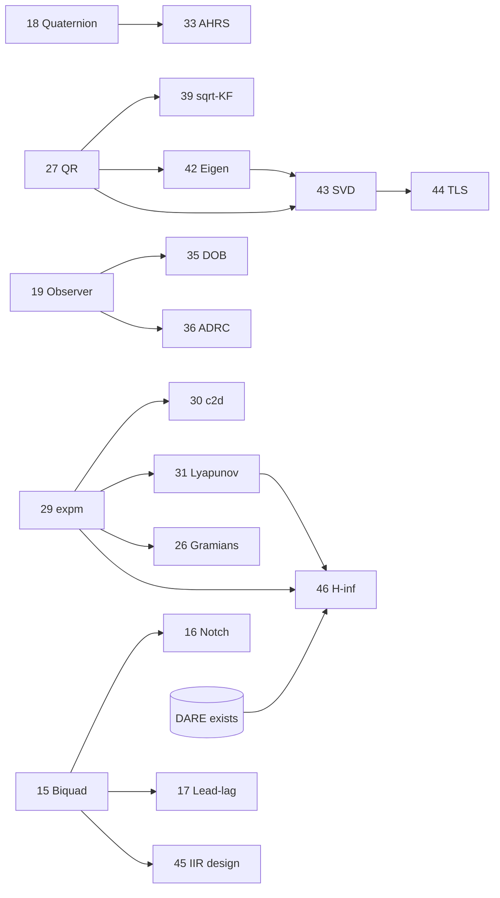
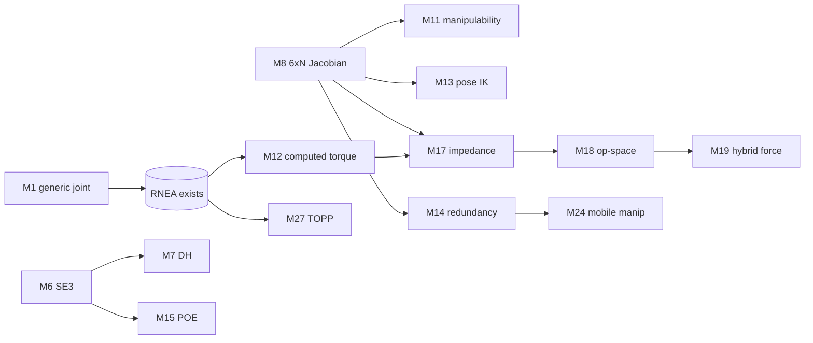

# Proposed Components Roadmap

Prioritized backlog of reusable numerical components for generic embedded applications,
ordered **easiest → hardest to implement** within the constraints of this library
(templated on `float` / `math::Q15` / `math::Q31`, no heap, bounded containers,
`#pragma GCC optimize` + `OPTIMIZE_FOR_SPEED` hot paths, typed tests, `doc/` page).

Difficulty legend:

| Stars | Meaning                                                             | Typical effort |
|-------|---------------------------------------------------------------------|----------------|
| ★☆☆☆☆ | Trivial primitive — a few methods, minimal math                     | Hours          |
| ★★☆☆☆ | Easy — well-defined recurrence, small state                         | Half day       |
| ★★★☆☆ | Moderate — real algorithm, still finite/bounded                     | 1–2 days       |
| ★★★★☆ | Advanced — non-trivial linear algebra / numerics                    | Several days   |
| ★★★★★ | Hard / research-grade — iterative eigen-numerics or adaptive theory | 1+ week        |

> **Numeric-type note.** DSP filters and fixed-gain trackers should template all three
> types (`float`, `Q15`, `Q31`). Items marked *(float-first)* involve dynamic range or
> iterative conditioning that make fixed-point impractical initially — implement and
> validate in `float`, mirroring the dynamics-module convention.

---

## Master list (by priority)

| #  | Component                                            | Target module             | Difficulty |
|----|------------------------------------------------------|---------------------------|------------|
| 13 | Goertzel algorithm                                   | `analysis`                | ★★☆☆☆      |
| 14 | CIC (Cascaded Integrator-Comb) filter                | `filters/passive`         | ★★☆☆☆      |
| 15 | Biquad / Second-Order-Section cascade                | `filters/passive`         | ★★★☆☆      |
| 16 | Notch / comb filter                                  | `filters/passive`         | ★★★☆☆      |
| 17 | Lead-lag compensator                                 | `controllers`             | ★★★☆☆      |
| 18 | Quaternion type                                      | `math`                    | ★★★☆☆      |
| 19 | Luenberger observer + pole placement (Ackermann)     | `controllers`             | ★★★☆☆      |
| 20 | Integral / servo state feedback (LQI)                | `controllers`             | ★★★☆☆      |
| 21 | LMS / NLMS adaptive filter                           | `estimators/online`       | ★★★☆☆      |
| 22 | Savitzky-Golay filter                                | `filters/passive`         | ★★★☆☆      |
| 23 | CORDIC                                               | `math`                    | ★★★☆☆      |
| 24 | Runge-Kutta ODE integrators (RK4 + Dormand-Prince)   | `solvers`                 | ★★★☆☆      |
| 25 | Real-input FFT (RFFT)                                | `analysis`                | ★★★☆☆      |
| 26 | Controllability / Observability matrices & Gramians  | `control_analysis`        | ★★★☆☆      |
| 27 | QR decomposition (Householder / Givens)              | `solvers`                 | ★★★★☆      |
| 28 | LU decomposition with partial pivoting               | `solvers`                 | ★★★★☆      |
| 29 | Matrix exponential (scaling & squaring + Padé)       | `math`                    | ★★★★☆      |
| 30 | Continuous → discrete conversion (`c2d`)             | `math`                    | ★★★★☆      |
| 31 | Lyapunov / Sylvester equation solvers                | `solvers`                 | ★★★★☆      |
| 32 | Transfer-function ↔ state-space conversion           | `control_analysis`        | ★★★★☆      |
| 33 | Madgwick / Mahony AHRS                               | `filters/active`          | ★★★★☆      |
| 34 | Sliding Mode Control (SMC)                           | `robust_control` (new)    | ★★★★☆      |
| 35 | Disturbance Observer (DOB)                           | `robust_control` (new)    | ★★★★☆      |
| 36 | Active Disturbance Rejection Control (ADRC + ESO)    | `robust_control` (new)    | ★★★★☆      |
| 37 | Hilbert transform / analytic signal / envelope       | `analysis`                | ★★★★☆      |
| 38 | Discrete Wavelet Transform (Haar / Daubechies)       | `analysis`                | ★★★★☆      |
| 39 | Square-root / Information Kalman filter              | `filters/active`          | ★★★★☆      |
| 40 | Feedback linearization                               | `nonlinear_control` (new) | ★★★★☆      |
| 41 | Backstepping controller                              | `nonlinear_control` (new) | ★★★★☆      |
| 42 | Symmetric eigenvalue solver (Jacobi)                 | `solvers`                 | ★★★★★      |
| 43 | Singular Value Decomposition (Golub-Kahan)           | `solvers`                 | ★★★★★      |
| 44 | Total Least Squares                                  | `estimators/offline`      | ★★★★★      |
| 45 | IIR filter design (Butterworth/Chebyshev + bilinear) | `filters/passive`         | ★★★★★      |
| 46 | H∞ state-feedback control                            | `robust_control` (new)    | ★★★★★      |
| 47 | Model Reference Adaptive Control (MRAC)              | `nonlinear_control` (new) | ★★★★★      |

---

## Tier 1 — Trivial primitives ★☆☆☆☆

### 1. Exponential Moving Average (one-pole / leaky integrator)
- **What:** Single-pole recursive smoother `y[n] = α·x[n] + (1−α)·y[n−1]`.
- **Embedded value:** The cheapest low-pass filter — one multiply-add, one state word. Ubiquitous for sensor smoothing and DC tracking.
- **Algorithm / paper:** S. W. Smith, *The Scientist and Engineer's Guide to DSP*, Ch. 19 (Recursive/single-pole filters).
- **Reuses:** Trivial; templated scalar state.

### 2. Moving Average (running-sum boxcar)
- **What:** Length-`N` boxcar via incremental running sum: `sum += x[n] − x[n−N]`.
- **Embedded value:** Optimal white-noise reducer per computation; O(1) per sample independent of window length.
- **Algorithm / paper:** S. W. Smith, *DSP Guide*, Ch. 15 (Moving Average Filters, recursive form).
- **Reuses:** `math::RecursiveBuffer` for the delay line.

### 3. Saturation / rate-limiter / slew-rate blocks
- **What:** Composable actuator-constraint primitives: `clamp(u, lo, hi)` and `slew = clamp(Δu, −rate·Ts, +rate·Ts)`.
- **Embedded value:** Reusable safety wrappers around any controller output; a prerequisite for correct anti-windup.
- **Algorithm / paper:** K. J. Åström, R. M. Murray, *Feedback Systems* (2008), actuator saturation & windup.
- **Reuses:** Scalar/`Vector` templates.

### 5. Peak / zero-crossing / RMS-envelope detectors
- **What:** Lightweight feature extractors: rising/falling peak hold, sign-change (zero-crossing) counter, and RMS envelope via one-pole on `x²`.
- **Embedded value:** Cheap building blocks for frequency estimation, VU metering, activity detection, and event triggers.
- **Algorithm / paper:** R. G. Lyons, *Understanding Digital Signal Processing*, 3rd ed.
- **Reuses:** Item 1 (one-pole), `math::Statistics`.

---

## Tier 2 — Easy ★★☆☆☆

### 8. Alpha-beta / alpha-beta-gamma filter
- **What:** Fixed-gain steady-state tracker for position/velocity(/acceleration) states.
- **Embedded value:** Delivers most of the benefit of a Kalman filter at a fraction of the cost — no online covariance propagation.
- **Algorithm / paper:** P. Kalata, "The tracking index: A generalized parameter for α-β and α-β-γ target trackers," *IEEE Trans. AES*, 20(2), 1984.
- **Reuses:** `math::LinearTimeInvariant`, `filters/active` patterns.

### 10. Gain-scheduled controller
- **What:** Interpolates a set of precomputed controller gains across a scheduling variable (speed, load, operating point).
- **Embedded value:** Extends linear controllers to mildly nonlinear plants without online redesign.
- **Algorithm / paper:** W. J. Rugh, J. S. Shamma, "Research on gain scheduling," *Automatica*, 36(10), 2000.
- **Reuses:** LUT + linear/bilinear interpolation; existing controllers.

### 11. Convolution & correlation utilities
- **What:** Linear/circular convolution and auto/cross-correlation over bounded vectors.
- **Embedded value:** Matched filtering, template matching, delay/lag estimation, system-response measurement.
- **Algorithm / paper:** A. V. Oppenheim, R. W. Schafer, *Discrete-Time Signal Processing*, Ch. 2 & 8.
- **Reuses:** `math::Vector`, `math::Toeplitz`, FFT for fast convolution.

### 12. Polynomial least-squares curve fitting
- **What:** Fit a degree-`d` polynomial via the Vandermonde normal equations.
- **Embedded value:** Sensor calibration curves, drift/trend modeling, lightweight interpolation tables.
- **Algorithm / paper:** Press et al., *Numerical Recipes*, Ch. 15 (Modeling of Data / general linear least squares).
- **Reuses:** `solvers::GaussianElimination` or `solvers::CholeskyDecomposition`.

### 13. Goertzel algorithm
- **What:** Single-bin DFT via a second-order recurrence — detects one target frequency without a full FFT or input buffer.
- **Embedded value:** DTMF/tone detection, notch monitoring, sync-tone recovery; O(N) with O(1) memory.
- **Algorithm / paper:** G. Goertzel, "An Algorithm for the Evaluation of Finite Trigonometric Series," *American Mathematical Monthly*, 65(1), 1958.
- **Reuses:** `math::ComplexNumber`, `TrigonometricFunctions`.

### 14. CIC (Cascaded Integrator-Comb) filter
- **What:** Multiplier-free decimator/interpolator built from integrator and comb stages.
- **Embedded value:** The canonical front-end for sigma-delta ADC/DAC rate conversion — no multipliers, integer-only.
- **Algorithm / paper:** E. B. Hogenauer, "An Economical Class of Digital Filters for Decimation and Interpolation," *IEEE Trans. ASSP*, 29(2), 1981.
- **Reuses:** Integer accumulators; `math::RecursiveBuffer`.

---

## Tier 3 — Moderate ★★★☆☆

### 15. Biquad / Second-Order-Section cascade
- **What:** High-order IIR realized as a cascade of second-order sections (Direct Form I / Transposed Direct Form II).
- **Embedded value:** **Highest-value passive-filter gap.** Direct-form high-order IIR is numerically fragile in `Q15`/`Q31`; SOS cascade is the standard robust realization. A float biquad already lives only in the [IIR simulator](simulator/filters/IirFilter/application/IirFilterSimulator.hpp); [Iir.md](doc/filters/passive/Iir.md) explicitly lists SOS as future work.
- **Algorithm / paper:** Oppenheim & Schafer, *DTSP*, Ch. 6 (cascade/parallel structures); R. Bristow-Johnson, "Cookbook formulae for audio EQ biquad filter coefficients."
- **Reuses:** [Iir.hpp](numerical/filters/passive/Iir.hpp), `math::RecursiveBuffer`.

### 16. Notch / comb filter
- **What:** Narrow-band rejection (notch biquad) and periodic comb rejection.
- **Embedded value:** Removes 50/60 Hz mains hum and harmonic interference from bio-signals and instrumentation.
- **Algorithm / paper:** Bristow-Johnson EQ cookbook (notch); Lyons, *Understanding DSP* (comb filters).
- **Reuses:** Item 15 (biquad), `math::RecursiveBuffer`.

### 17. Lead-lag compensator
- **What:** Classic frequency-domain compensator `C(s) = K·(s+z)/(s+p)` discretized (Tustin) to a first-order section.
- **Embedded value:** Phase-margin shaping and bandwidth extension where a full state-space design is overkill.
- **Algorithm / paper:** G. F. Franklin, J. D. Powell, A. Emami-Naeini, *Feedback Control of Dynamic Systems*.
- **Reuses:** Item 15 realization; `controllers`.

### 18. Quaternion type
- **What:** Unit-quaternion class: Hamilton product, conjugate/inverse, normalization, rotation of vectors, SLERP, ↔ rotation-matrix/Euler conversions.
- **Embedded value:** Singularity-free attitude representation; **prerequisite for AHRS (item 33)** and 3D robotics.
- **Algorithm / paper:** J. B. Kuipers, *Quaternions and Rotation Sequences* (1999); K. Shoemake, "Animating rotation with quaternion curves," *SIGGRAPH*, 1985 (SLERP).
- **Reuses:** [Geometry3D.hpp](numerical/math/Geometry3D.hpp) (`Vector3`, `Matrix3`, Rodrigues).

### 19. Luenberger observer + pole placement (Ackermann)
- **What:** Deterministic full/reduced-order state observer with gains placed by Ackermann's formula.
- **Embedded value:** Reconstructs unmeasured states for state-feedback control; the deterministic counterpart to the Kalman filter. Currently only referenced in [Lqg.md](doc/controllers/Lqg.md), not implemented.
- **Algorithm / paper:** D. Luenberger, "An Introduction to Observers," *IEEE Trans. Automatic Control*, 16(6), 1971; Ackermann's formula (Franklin et al.).
- **Reuses:** `math::Matrix`, `StateFeedbackController`, `math::LinearTimeInvariant`.

### 20. Integral / servo state feedback (LQI)
- **What:** Augments the plant with integral-of-error states before LQR design for zero steady-state tracking error.
- **Embedded value:** Removes steady-state offset under constant references/disturbances — the practical version of LQR.
- **Algorithm / paper:** B. D. O. Anderson, J. B. Moore, *Optimal Control: Linear Quadratic Methods* (1990).
- **Reuses:** [Lqr.hpp](numerical/controllers/implementations/Lqr.hpp), [DARE](numerical/solvers/DiscreteAlgebraicRiccatiEquation.hpp).

### 21. LMS / NLMS adaptive filter
- **What:** Least-Mean-Squares (and normalized) adaptive FIR with steepest-descent weight update.
- **Embedded value:** Adaptive noise cancellation, echo cancellation, system identification, active vibration control — a DSP staple.
- **Algorithm / paper:** B. Widrow, M. Hoff, "Adaptive switching circuits," *IRE WESCON*, 1960; S. Haykin, *Adaptive Filter Theory*.
- **Reuses:** [RecursiveLeastSquares.hpp](numerical/estimators/online/RecursiveLeastSquares.hpp) patterns, `math::Vector`.

### 22. Savitzky-Golay filter
- **What:** Convolution smoother that fits a local polynomial, preserving peak height/width and giving smoothed derivatives.
- **Embedded value:** Spectroscopy, ECG/PPG, and any signal where peaks matter and moving-average distortion is unacceptable.
- **Algorithm / paper:** A. Savitzky, M. J. E. Golay, "Smoothing and Differentiation of Data by Simplified Least Squares Procedures," *Analytical Chemistry*, 36(8), 1964.
- **Reuses:** `constexpr` coefficient tables; FIR convolution (item 11).

### 23. CORDIC
- **What:** Iterative shift-add engine for `sin`/`cos`, `atan2`, magnitude, and vector rotation — no multiplier required.
- **Embedded value:** Trig and Cartesian↔polar on FPU-less MCUs; naturally fixed-point, deterministic cycle count.
- **Algorithm / paper:** J. Volder, "The CORDIC Trigonometric Computing Technique," *IRE Trans. Electronic Computers*, EC-8(3), 1959; R. Andraka survey, 1998.
- **Reuses:** `math::QNumber`; complements `TrigonometricFunctions`.

### 24. Runge-Kutta ODE integrators (RK4 + Dormand-Prince)
- **What:** Fixed-step RK4 and adaptive embedded RK45 (Dormand-Prince) integrators for `ẋ = f(x,u,t)`.
- **Embedded value:** On-device simulation of the continuous `dynamics/` models, prediction steps, and hardware-in-the-loop testing.
- **Algorithm / paper:** J. R. Dormand, P. J. Prince, "A family of embedded Runge-Kutta formulae," *J. Comput. Appl. Math.*, 6(1), 1980; Hairer, Nørsett, Wanner, *Solving ODEs I*.
- **Reuses:** `math::Vector`, `dynamics/` right-hand sides.

### 25. Real-input FFT (RFFT)
- **What:** FFT specialized for real signals using the complex-pack (N/2-point) trick.
- **Embedded value:** ~2× throughput and half the memory versus a complex FFT on real ADC data.
- **Algorithm / paper:** H. Sorensen, D. Jones, M. Heideman, C. Burrus, "Real-valued fast Fourier transform algorithms," *IEEE Trans. ASSP*, 35(6), 1987.
- **Reuses:** [FastFourierTransform.hpp](numerical/analysis/FastFourierTransform.hpp), `math::ComplexNumber`.

### 26. Controllability / Observability matrices & Gramians
- **What:** Build controllability/observability matrices (rank test) and Gramians (via Lyapunov) for a state-space model.
- **Embedded value:** Design-time verification that a plant is controllable/observable before deploying an observer or LQR.
- **Algorithm / paper:** R. E. Kalman canonical structure (1960); P. Antsaklis, A. Michel, *A Linear Systems Primer*.
- **Reuses:** `math::LinearTimeInvariant`, `math::Matrix`; Gramians need item 31.

---

## Tier 4 — Advanced ★★★★☆

### 27. QR decomposition (Householder / Givens)  *(float-first)*
- **What:** `A = QR` via Householder reflections (or Givens rotations for sparse/streaming updates).
- **Embedded value:** Numerically robust least-squares and the workhorse behind eigen/SVD and square-root filtering.
- **Algorithm / paper:** A. Householder, "Unitary Triangularization of a Nonsymmetric Matrix," *JACM*, 5(4), 1958; Golub & Van Loan, *Matrix Computations*, Ch. 5.
- **Reuses:** `math::Matrix`; foundational for items 39, 42, 43, 44.

### 28. LU decomposition with partial pivoting  *(float-first)*
- **What:** `PA = LU` for general linear solves, determinant, and matrix inverse.
- **Embedded value:** General-purpose dense solver where Cholesky (SPD-only) does not apply.
- **Algorithm / paper:** Golub & Van Loan, *Matrix Computations*, Ch. 3 (GEPP).
- **Reuses:** [GaussianElimination.hpp](numerical/solvers/GaussianElimination.hpp) (factored form), `math::Matrix`.

### 29. Matrix exponential (scaling & squaring + Padé)  *(float-first)*
- **What:** `expm(A)` via scaling-and-squaring with a Padé approximant.
- **Embedded value:** Core building block for exact discretization, continuous Gramians, and linear-system simulation.
- **Algorithm / paper:** C. Moler, C. Van Loan, "Nineteen Dubious Ways to Compute the Exponential of a Matrix, Twenty-Five Years Later," *SIAM Review*, 45(1), 2003; N. Higham, scaling-and-squaring, 2005.
- **Reuses:** `math::Matrix`; **unblocks items 30, 31, 26.**

### 30. Continuous → discrete conversion (`c2d`)  *(float-first)*
- **What:** Convert continuous `(A,B,C,D)` to discrete via ZOH (augmented-matrix exponential), Tustin/bilinear, and forward/backward Euler.
- **Embedded value:** Design plants/controllers in continuous time, then deploy discretely into the existing `LinearTimeInvariant` model.
- **Algorithm / paper:** C. Van Loan, "Computing Integrals Involving the Matrix Exponential," *IEEE Trans. AC*, 23(3), 1978; Franklin, Powell, Workman, *Digital Control of Dynamic Systems*.
- **Reuses:** Item 29, [LinearTimeInvariant.hpp](numerical/math/LinearTimeInvariant.hpp).

### 31. Lyapunov / Sylvester equation solvers  *(float-first)*
- **What:** Solve `AX + XB = C` (Sylvester) and discrete/continuous Lyapunov equations.
- **Embedded value:** Stability certificates, controllability/observability Gramians, robust-control synthesis.
- **Algorithm / paper:** R. Bartels, G. Stewart, "Solution of the Matrix Equation AX + XB = C," *Comm. ACM*, 15(9), 1972.
- **Reuses:** `math::Matrix`, item 27 (Schur/QR building blocks).

### 32. Transfer-function ↔ state-space conversion  *(float-first)*
- **What:** Convert between transfer-function coefficients and controllable/observable canonical state-space forms.
- **Embedded value:** Bridges classical (frequency-domain) and modern (state-space) design tools within the library.
- **Algorithm / paper:** T. Kailath, *Linear Systems* (1980), canonical realizations.
- **Reuses:** `math::LinearTimeInvariant`, `control_analysis`, `math::Matrix`.

### 33. Madgwick / Mahony AHRS  *(float-first)*
- **What:** Quaternion-based orientation filter fusing gyro + accel (+ mag): Madgwick's gradient-descent correction or Mahony's passive complementary filter on SO(3).
- **Embedded value:** The de-facto attitude estimator for drones, robots, and wearables — cheaper and more robust than a full quaternion EKF.
- **Algorithm / paper:** S. Madgwick, "An efficient orientation filter for inertial and inertial/magnetic sensor arrays," 2010; R. Mahony, T. Hamel, J.-M. Pflimlin, "Nonlinear Complementary Filters on the Special Orthogonal Group," *IEEE Trans. AC*, 53(5), 2008.
- **Reuses:** **Item 18 (Quaternion)**, `math::Geometry3D`.

### 34. Sliding Mode Control (SMC)  *(float-first)*
- **What:** Variable-structure controller driving the state onto a sliding surface, with a boundary layer to tame chattering.
- **Embedded value:** Robust to matched disturbances and parameter uncertainty — popular in motor drives and power electronics.
- **Algorithm / paper:** V. Utkin, "Variable Structure Systems with Sliding Modes," *IEEE Trans. AC*, 22(2), 1977; Slotine & Li, *Applied Nonlinear Control* (1991).
- **Reuses:** `math::LinearTimeInvariant`, item 3 (saturation), new `robust_control/` module.

### 35. Disturbance Observer (DOB)  *(float-first)*
- **What:** Estimates and cancels lumped disturbance/model mismatch using the plant inverse and a Q-filter.
- **Embedded value:** Bolt-on robustness for existing loops — strong disturbance rejection without redesigning the nominal controller.
- **Algorithm / paper:** W.-H. Chen, J. Yang, L. Guo, S. Li, "Disturbance-Observer-Based Control and Related Methods—An Overview," *IEEE Trans. Ind. Electron.*, 63(2), 2016.
- **Reuses:** Item 15 (Q-filter), item 19 (observer), `math::LinearTimeInvariant`.

### 36. Active Disturbance Rejection Control (ADRC + ESO)  *(float-first)*
- **What:** Extended State Observer estimates total disturbance as an augmented state; a feedback law cancels it in real time.
- **Embedded value:** Near model-free, strongly robust motion control; increasingly standard in industrial drives.
- **Algorithm / paper:** J. Han, "From PID to Active Disturbance Rejection Control," *IEEE Trans. Ind. Electron.*, 56(3), 2009; Z. Gao, bandwidth parameterization, *ACC*, 2003.
- **Reuses:** Item 19 (observer), `math::Matrix`, new `robust_control/` module.

### 37. Hilbert transform / analytic signal / envelope  *(float-first)*
- **What:** Compute the analytic signal (via FFT or a Type-III/IV FIR) for instantaneous amplitude, phase, and frequency.
- **Embedded value:** AM demodulation, envelope detection, vibration/bearing analysis, single-sideband processing.
- **Algorithm / paper:** S. L. Marple, "Computing the Discrete-Time Analytic Signal via FFT," *IEEE Trans. Signal Processing*, 47(9), 1999.
- **Reuses:** Items 25/`FastFourierTransform`, FIR.

### 38. Discrete Wavelet Transform (Haar / Daubechies)  *(float-first)*
- **What:** Multiresolution analysis via a quadrature-mirror analysis/synthesis filter bank.
- **Embedded value:** Denoising, compression, and time-frequency features for condition monitoring and edge-ML pipelines.
- **Algorithm / paper:** S. Mallat, "A Theory for Multiresolution Signal Decomposition," *IEEE TPAMI*, 11(7), 1989; I. Daubechies, *Ten Lectures on Wavelets* (1992).
- **Reuses:** FIR filter banks, `math::RecursiveBuffer`.

### 39. Square-root / Information Kalman filter  *(float-first)*
- **What:** Propagate a Cholesky/QR factor of the covariance (square-root form) or its inverse (information form).
- **Embedded value:** Guaranteed positive-definite covariance and better conditioning — critical for reduced-precision hardware and multi-sensor fusion.
- **Algorithm / paper:** P. Kaminski, A. Bryson, S. Schmidt, "Discrete Square Root Filtering: A Survey of Current Techniques," *IEEE Trans. AC*, 16(6), 1971.
- **Reuses:** [KalmanFilterBase.hpp](numerical/filters/active/KalmanFilterBase.hpp), [Cholesky](numerical/solvers/CholeskyDecomposition.hpp), item 27.

### 40. Feedback linearization  *(float-first)*
- **What:** Cancel known nonlinear dynamics via a coordinate transform + inner control law so an outer linear controller can be applied.
- **Embedded value:** Exact control of robot manipulators and other structurally-known nonlinear plants.
- **Algorithm / paper:** A. Isidori, *Nonlinear Control Systems* (1995); Slotine & Li, *Applied Nonlinear Control*.
- **Reuses:** `dynamics/` models, `math::Matrix`, new `nonlinear_control/` module.

### 41. Backstepping controller  *(float-first)*
- **What:** Recursive Lyapunov-based design for strict-feedback systems, stabilizing one integrator stage at a time.
- **Embedded value:** Systematic, provably-stable control for cascaded nonlinear plants (electromechanical, flight).
- **Algorithm / paper:** M. Krstić, I. Kanellakopoulos, P. Kokotović, *Nonlinear and Adaptive Control Design* (1995).
- **Reuses:** `dynamics/`, `math::Matrix`, new `nonlinear_control/` module.

---

## Tier 5 — Hard / research-grade ★★★★★

### 42. Symmetric eigenvalue solver (Jacobi)  *(float-first)*
- **What:** Cyclic Jacobi rotations for the eigenvalues/vectors of a symmetric matrix.
- **Embedded value:** PCA/feature extraction, modal analysis, covariance conditioning, Gramian analysis.
- **Algorithm / paper:** Golub & Van Loan, *Matrix Computations*, Ch. 8 (symmetric eigenproblem / cyclic Jacobi).
- **Reuses:** `math::Matrix`, item 27.

### 43. Singular Value Decomposition (Golub-Kahan)  *(float-first)*
- **What:** `A = UΣVᵀ` via Golub-Kahan bidiagonalization + implicit QR sweeps.
- **Embedded value:** Pseudo-inverse, rank/condition estimation, model reduction, robust least squares — foundational.
- **Algorithm / paper:** G. Golub, W. Kahan, "Calculating the Singular Values and Pseudo-Inverse of a Matrix," *SIAM J. Numer. Anal.*, 2(2), 1965; Golub & Reinsch, 1970.
- **Reuses:** Items 27 & 42.

### 44. Total Least Squares  *(float-first)*
- **What:** Errors-in-variables fitting where both inputs and outputs are noisy (SVD-based solution).
- **Embedded value:** Accurate calibration and system identification when the regressors themselves are measured with noise.
- **Algorithm / paper:** G. Golub, C. Van Loan, "An Analysis of the Total Least Squares Problem," *SIAM J. Numer. Anal.*, 17(6), 1980.
- **Reuses:** **Item 43 (SVD)**, `estimators/offline`.

### 45. IIR filter design (Butterworth / Chebyshev + bilinear)  *(float-first)*
- **What:** Generate SOS/biquad coefficients on-device from an analog prototype via the bilinear transform.
- **Embedded value:** Runtime-reconfigurable filters (adjustable cutoff/order) without a host toolchain or hardcoded tables.
- **Algorithm / paper:** T. W. Parks, C. S. Burrus, *Digital Filter Design* (1987); bilinear transform — Oppenheim & Schafer, *DTSP*.
- **Reuses:** Item 15 (biquad target), `math::ComplexNumber`, item 23 (root placement).

### 46. H∞ state-feedback control  *(float-first)*
- **What:** Robust optimal control minimizing the worst-case disturbance-to-error gain via a Riccati/LMI solution.
- **Embedded value:** Guaranteed performance under bounded model uncertainty for safety-critical loops.
- **Algorithm / paper:** J. Doyle, K. Glover, P. Khargonekar, B. Francis, "State-Space Solutions to Standard H₂ and H∞ Control Problems," *IEEE Trans. AC*, 34(8), 1989.
- **Reuses:** [DARE](numerical/solvers/DiscreteAlgebraicRiccatiEquation.hpp), items 29 & 31, new `robust_control/` module.

### 47. Model Reference Adaptive Control (MRAC)  *(float-first)*
- **What:** Online parameter adaptation (MIT rule / Lyapunov redesign) so the plant tracks a reference model.
- **Embedded value:** Self-tuning control for plants with slowly-varying or unknown parameters.
- **Algorithm / paper:** K. J. Åström, B. Wittenmark, *Adaptive Control* (1995); K. Narendra, A. Annaswamy, *Stable Adaptive Systems* (1989).
- **Reuses:** `estimators/online` (RLS), `math::LinearTimeInvariant`, new `nonlinear_control/` module.

---

## Robot manipulators & other manipulator types

The library already has the hard parts of manipulator **modelling**: forward/inverse dynamics
([RNEA](numerical/dynamics/RecursiveNewtonEuler.hpp), [ABA](numerical/dynamics/ArticulatedBodyAlgorithm.hpp),
[Euler-Lagrange](numerical/dynamics/EulerLagrangeSolver.hpp) giving $M$, $C$, $g$) plus
damped-least-squares [IK](numerical/kinematics/InverseKinematics.hpp). What is missing is the
**control, planning, and full-pose kinematics layer** that turns those models into a usable
manipulator stack. Two current limitations gate most of the items below:

> **Position-only, revolute-only.** [ForwardKinematics.hpp](numerical/kinematics/ForwardKinematics.hpp)
> returns joint *positions* (a 3×N Jacobian lives privately inside IK), and only
> [RevoluteJointLink](numerical/dynamics/RevoluteJointLink.hpp) exists. Items **M1** (prismatic/generic
> joints) and **M8** (full 6×N spatial Jacobian) lift these limits and unblock the rest.

All manipulator items are *(float-first)* — torques, lengths, and inertias exceed the `Q15`/`Q31`
range, matching the existing `dynamics/` convention.

### Manipulator list (by priority)

| #   | Component                                               | Target module                   | Difficulty |
|-----|---------------------------------------------------------|---------------------------------|------------|
| M1  | Prismatic / generic joint link                          | `dynamics` + `kinematics`       | ★☆☆☆☆      |
| M2  | Cubic / quintic polynomial joint trajectory             | `trajectory` (new)              | ★☆☆☆☆      |
| M3  | Trapezoidal (LSPB) velocity profile                     | `trajectory` (new)              | ★☆☆☆☆      |
| M4  | Friction compensation (Coulomb + viscous + Stribeck)    | `dynamics`                      | ★☆☆☆☆      |
| M5  | PD + gravity compensation control                       | `controllers/manipulator` (new) | ★☆☆☆☆      |
| M6  | Homogeneous transform / SE(3) + adjoint (twists)        | `math`                          | ★★☆☆☆      |
| M7  | Denavit-Hartenberg parameters                           | `kinematics`                    | ★★☆☆☆      |
| M8  | Geometric / analytic Jacobian (6×N)                     | `kinematics`                    | ★★☆☆☆      |
| M9  | S-curve (jerk-limited) trajectory                       | `trajectory` (new)              | ★★☆☆☆      |
| M10 | Cartesian path + orientation (SLERP) interpolation      | `trajectory` (new)              | ★★☆☆☆      |
| M11 | Manipulability ellipsoid / Yoshikawa index              | `kinematics`                    | ★★☆☆☆      |
| M12 | Computed-torque (inverse-dynamics) control              | `controllers/manipulator` (new) | ★★★☆☆      |
| M13 | Full 6-DOF pose IK (position + orientation)             | `kinematics`                    | ★★★☆☆      |
| M14 | Redundancy resolution / null-space projection           | `kinematics`                    | ★★★☆☆      |
| M15 | Product-of-Exponentials forward kinematics              | `kinematics`                    | ★★★☆☆      |
| M16 | Momentum-based collision-detection observer             | `estimators/online`             | ★★★☆☆      |
| M17 | Impedance / admittance control                          | `controllers/manipulator` (new) | ★★★☆☆      |
| M18 | Operational-space (task-space) control                  | `controllers/manipulator` (new) | ★★★★☆      |
| M19 | Hybrid position/force control                           | `controllers/manipulator` (new) | ★★★★☆      |
| M20 | Passivity-based adaptive control (Slotine-Li)           | `controllers/manipulator` (new) | ★★★★☆      |
| M21 | Analytical IK (Pieper, wrist-partitioned 6R)            | `kinematics`                    | ★★★★☆      |
| M22 | Dynamic (base-parameter) identification                 | `estimators/offline`            | ★★★★☆      |
| M23 | Parallel-manipulator kinematics (Delta / Stewart-Gough) | `kinematics`                    | ★★★★☆      |
| M24 | Mobile-manipulator / nonholonomic-base kinematics       | `kinematics`                    | ★★★★☆      |
| M25 | Cable-driven tension distribution                       | `controllers/manipulator` (new) | ★★★★☆      |
| M26 | Continuum / soft constant-curvature kinematics          | `kinematics`                    | ★★★★☆      |
| M27 | Time-optimal path parameterization (TOPP)               | `trajectory` (new)              | ★★★★★      |

### Tier 1 — Trivial ★☆☆☆☆

**M1. Prismatic / generic joint link.** Generalize `RevoluteJointLink` to a joint type carrying an axis + type (revolute/prismatic), so FK/IK/dynamics handle sliding joints (SCARA, gantries, hydraulic actuators).
- *Algorithm / paper:* J. J. Craig, *Introduction to Robotics: Mechanics and Control*, 4th ed., Ch. 3.
- *Reuses / builds on:* [RevoluteJointLink.hpp](numerical/dynamics/RevoluteJointLink.hpp); unblocks FK, IK, RNEA for mixed chains.

**M2. Cubic / quintic polynomial joint trajectory.** Point-to-point motion with matched position/velocity(/acceleration) boundary conditions via closed-form polynomial coefficients.
- *Algorithm / paper:* Spong, Hutchinson, Vidyasagar, *Robot Modeling and Control*, Ch. 5 (polynomial trajectories).
- *Reuses / builds on:* scalar `math`; new `trajectory/` module.

**M3. Trapezoidal (LSPB) velocity profile.** Linear-segment-with-parabolic-blends profile respecting velocity/acceleration limits.
- *Algorithm / paper:* L. Biagiotti, C. Melchiorri, *Trajectory Planning for Automatic Machines and Robots* (2008), Ch. 3.
- *Reuses / builds on:* new `trajectory/` module.

**M4. Friction compensation model.** Feedforward Coulomb + viscous + Stribeck joint-friction term added to any torque controller.
- *Algorithm / paper:* B. Armstrong-Hélouvry, P. Dupont, C. Canudas de Wit, "A survey of models, analysis tools and compensation methods for the control of machines with friction," *Automatica*, 30(7), 1994.
- *Reuses / builds on:* `dynamics`; composes with M5/M12.

**M5. PD + gravity compensation control.** The simplest globally-stable set-point regulator: `τ = Kp·e − Kd·q̇ + g(q)`.
- *Algorithm / paper:* M. Takegaki, S. Arimoto, "A New Feedback Method for Dynamic Control of Manipulators," *ASME J. Dyn. Sys. Meas. Control*, 1981.
- *Reuses / builds on:* $g(q)$ from [RNEA](numerical/dynamics/RecursiveNewtonEuler.hpp) / Euler-Lagrange; new `controllers/manipulator/` module.

### Tier 2 — Easy ★★☆☆☆

**M6. Homogeneous transform / SE(3) + adjoint.** Rigid-body transforms (4×4), twists/wrenches (6-vectors), and the adjoint map — the algebra all modern manipulator code is built on.
- *Algorithm / paper:* K. Lynch, F. Park, *Modern Robotics* (2017), Ch. 3; Murray, Li, Sastry, *A Mathematical Introduction to Robotic Manipulation* (1994).
- *Reuses / builds on:* [Geometry3D.hpp](numerical/math/Geometry3D.hpp), item 18 (Quaternion).

**M7. Denavit-Hartenberg parameters.** Standard `(a, α, d, θ)` link description and per-joint transform generation.
- *Algorithm / paper:* Craig, *Introduction to Robotics*, Ch. 3 (DH convention).
- *Reuses / builds on:* M6, `math::Matrix`.

**M8. Geometric / analytic Jacobian (6×N).** Full spatial Jacobian mapping joint rates → end-effector linear + angular velocity (and its transpose for force mapping).
- *Algorithm / paper:* Lynch & Park, *Modern Robotics*, Ch. 5 (velocity kinematics).
- *Reuses / builds on:* promotes the private 3×N Jacobian in [InverseKinematics.hpp](numerical/kinematics/InverseKinematics.hpp); unblocks M11, M13, M14, M17, M18.

**M9. S-curve (jerk-limited) trajectory.** Seven-segment jerk-bounded profile for smooth, low-vibration motion.
- *Algorithm / paper:* Biagiotti & Melchiorri, *Trajectory Planning*, Ch. 3 (double-S profiles).
- *Reuses / builds on:* M3; new `trajectory/` module.

**M10. Cartesian path + orientation interpolation.** Straight-line/screw position paths with SLERP orientation blending for task-space moves.
- *Algorithm / paper:* Lynch & Park, Ch. 9; K. Shoemake, SLERP, *SIGGRAPH* 1985.
- *Reuses / builds on:* item 18 (Quaternion), M6.

**M11. Manipulability ellipsoid / Yoshikawa index.** Scalar dexterity/singularity measure `√det(J Jᵀ)` for posture optimization and singularity avoidance.
- *Algorithm / paper:* T. Yoshikawa, "Manipulability of Robotic Mechanisms," *Int. J. Robotics Research*, 4(2), 1985.
- *Reuses / builds on:* M8, item 43 (SVD) or determinant of `math::Matrix`.

### Tier 3 — Moderate ★★★☆☆

**M12. Computed-torque (inverse-dynamics) control.** Feedback-linearizing manipulator law `τ = M(q)(q̈_d + Kd·ė + Kp·e) + C(q,q̇)q̇ + g(q)` yielding decoupled error dynamics.
- *Algorithm / paper:* Spong et al., *Robot Modeling and Control*, Ch. 8; Luh, Walker, Paul (1980).
- *Reuses / builds on:* **directly leverages existing [RNEA](numerical/dynamics/RecursiveNewtonEuler.hpp) / [Euler-Lagrange](numerical/dynamics/EulerLagrangeSolver.hpp)** for $M$, $C$, $g$; item 40 (feedback linearization).

**M13. Full 6-DOF pose IK.** Extend damped-least-squares IK to a position **and** orientation target using the 6×N Jacobian and a quaternion/log orientation error.
- *Algorithm / paper:* S. R. Buss, "Introduction to Inverse Kinematics with Jacobian Transpose, Pseudoinverse and Damped Least Squares methods," 2004; Nakamura & Hanafusa (1986).
- *Reuses / builds on:* [InverseKinematics.hpp](numerical/kinematics/InverseKinematics.hpp), M8, item 18.

**M14. Redundancy resolution / null-space projection.** Exploit extra DOF (7-DOF arms) via `q̇ = J⁺ẋ + (I − J⁺J)·q̇₀` for secondary objectives (joint-limit / obstacle avoidance).
- *Algorithm / paper:* A. Liégeois, "Automatic supervisory control of the configuration and behavior of multibody mechanisms," *IEEE Trans. SMC*, 7(12), 1977.
- *Reuses / builds on:* M8, item 27 (QR) / 43 (SVD) for the pseudo-inverse.

**M15. Product-of-Exponentials forward kinematics.** Screw-theory FK (`T = e^{[S₁]θ₁}···e^{[Sₙ]θₙ}·M`), avoiding DH frame bookkeeping.
- *Algorithm / paper:* Lynch & Park, *Modern Robotics*, Ch. 4.
- *Reuses / builds on:* M6 (SE(3)/twists), item 29 (matrix exponential).

**M16. Momentum-based collision-detection observer.** Estimate external joint torques from generalized-momentum residual — no joint-torque sensors or acceleration needed.
- *Algorithm / paper:* A. De Luca, A. Albu-Schäffer, S. Haddadin, G. Hirzinger, "Collision Detection and Safe Reaction with the DLR-III Lightweight Manipulator Arm," *IROS*, 2006.
- *Reuses / builds on:* RNEA, `estimators/online`.

**M17. Impedance / admittance control.** Render a programmable mass-spring-damper at the end-effector for safe contact and compliant assembly.
- *Algorithm / paper:* N. Hogan, "Impedance Control: An Approach to Manipulation, Parts I–III," *ASME J. Dyn. Sys. Meas. Control*, 1985.
- *Reuses / builds on:* M8, M12, `dynamics`; new `controllers/manipulator/` module.

### Tier 4 — Advanced ★★★★☆

**M18. Operational-space (task-space) control.** Control directly in Cartesian space using the task-space inertia `Λ = (J M⁻¹ Jᵀ)⁻¹` and dynamically-consistent null-space projection.
- *Algorithm / paper:* O. Khatib, "A Unified Approach for Motion and Force Control of Robot Manipulators: The Operational Space Formulation," *IEEE J. Robotics and Automation*, 3(1), 1987.
- *Reuses / builds on:* M8, M12, item 28 (LU) for the $M^{-1}$ solve.

**M19. Hybrid position/force control.** Partition task directions into force-controlled and motion-controlled subspaces via a selection matrix.
- *Algorithm / paper:* M. Raibert, J. Craig, "Hybrid Position/Force Control of Manipulators," *ASME J. Dyn. Sys. Meas. Control*, 1981.
- *Reuses / builds on:* M8, M17, `controllers/manipulator/`.

**M20. Passivity-based adaptive control (Slotine-Li).** Track trajectories while online-estimating inertial parameters, exploiting linearity-in-parameters `Y(q,q̇,q̈)·a = τ`.
- *Algorithm / paper:* J.-J. Slotine, W. Li, "On the Adaptive Control of Robot Manipulators," *Int. J. Robotics Research*, 6(3), 1987.
- *Reuses / builds on:* RNEA regressor form, `estimators/online`; item 47 (MRAC) kinship.

**M21. Analytical IK (Pieper, wrist-partitioned 6R).** Closed-form inverse kinematics for the common 6R arm with a spherical wrist (all real solutions, no iteration).
- *Algorithm / paper:* D. Pieper, "The Kinematics of Manipulators Under Computer Control," PhD thesis, Stanford, 1968.
- *Reuses / builds on:* M6/M7, item 23 (CORDIC) or trig for the closed-form angles.

**M22. Dynamic (base-parameter) identification.** Least-squares estimation of link inertial parameters from excitation trajectories via the linear regressor.
- *Algorithm / paper:* C. Atkeson, C. An, J. Hollerbach, "Estimation of Inertial Parameters of Manipulator Loads and Links," *Int. J. Robotics Research*, 5(3), 1986.
- *Reuses / builds on:* RNEA regressor, item 27 (QR) / 12 (poly LS), `estimators/offline`.

**M23. Parallel-manipulator kinematics (Delta / Stewart-Gough).** Closed-form inverse kinematics and iterative forward kinematics for parallel platforms (pick-and-place Delta, 6-DOF hexapods).
- *Algorithm / paper:* J.-P. Merlet, *Parallel Robots*, 2nd ed. (2006); R. Clavel, delta robot (1990).
- *Reuses / builds on:* M6, item 28 (LU) / Newton iteration for the forward solve.

**M24. Mobile-manipulator / nonholonomic-base kinematics.** Combined base + arm Jacobian with nonholonomic (differential-drive) constraints.
- *Algorithm / paper:* Y. Yamamoto, X. Yun, "Coordinating Locomotion and Manipulation of a Mobile Manipulator," *IEEE Trans. Automatic Control*, 39(6), 1994.
- *Reuses / builds on:* M8, M14 (redundancy).

**M25. Cable-driven tension distribution.** Compute non-negative cable tensions realizing a desired wrench (cable robots, tendon-driven hands) via a bounded QP/LP.
- *Algorithm / paper:* T. Bruckmann, A. Pott (eds.), *Cable-Driven Parallel Robots* (2013); Pott tension-distribution methods.
- *Reuses / builds on:* [MPC](numerical/controllers/implementations/Mpc.hpp) QP machinery, M8.

**M26. Continuum / soft constant-curvature kinematics.** Piecewise-constant-curvature FK/IK for tendon/pneumatic continuum arms.
- *Algorithm / paper:* R. Webster, B. Jones, "Design and Kinematic Modeling of Constant Curvature Continuum Robots: A Review," *Int. J. Robotics Research*, 29(13), 2010.
- *Reuses / builds on:* M6 (SE(3)), item 18 (Quaternion).

### Tier 5 — Hard / research-grade ★★★★★

**M27. Time-optimal path parameterization (TOPP).** Minimum-time traversal of a fixed geometric path subject to joint torque/velocity limits.
- *Algorithm / paper:* J. Bobrow, S. Dubowsky, J. Gibson, "Time-Optimal Control of Robotic Manipulators Along Specified Paths," *IJRR*, 4(3), 1985; Q.-C. Pham, TOPP-RA, *IEEE T-RO*, 2014.
- *Reuses / builds on:* RNEA (torque limits along path), M10 (path), new `trajectory/` module.

---

## Dependency notes

Implement prerequisites first to avoid rework:

- **18 Quaternion** → 33 Madgwick/Mahony AHRS
- **29 Matrix exponential** → 30 `c2d`, 31 Lyapunov (continuous), 26 continuous Gramians
- **27 QR** → 39 square-root KF, 42 Jacobi eigen, 43 SVD
- **42 eigen + 27 QR** → 43 SVD → 44 Total Least Squares
- **19 Luenberger observer** → 35 DOB, 36 ADRC
- **15 Biquad** → 16 notch/comb, 17 lead-lag, 45 IIR design
- **DARE (exists) + 29 + 31** → 46 H∞

Manipulator build order:

- **M1 generic joint** → mixed revolute/prismatic FK, IK, RNEA
- **M6 SE(3)** → M7 DH, M15 POE, M10 Cartesian paths, M26 continuum
- **M8 spatial Jacobian** → M11 manipulability, M13 pose IK, M14 redundancy, M17 impedance, M18 operational-space, M19 hybrid force
- **RNEA (exists)** → M12 computed torque, M16 collision observer, M20 adaptive, M22 identification, M27 TOPP
- **M12 → M17 → M18 → M19** (increasing contact-control capability)
- **M8 + M14** → M24 mobile manipulator

Manipulator prerequisite chain:

## New modules to introduce

New top-level domains under `numerical/` are proposed to house the additions,
each mirroring the existing header-library + `test/` + `doc/` layout:

- `numerical/robust_control/` → items 34, 35, 36, 46 (namespace `robust_control`)
- `numerical/nonlinear_control/` → items 40, 41, 47 (namespace `nonlinear_control`)
- `numerical/trajectory/` → items M2, M3, M9, M10, M27 (namespace `trajectory`)
- `numerical/controllers/manipulator/` → items M5, M12, M17, M18, M19, M20, M25 (namespace `controllers`)

Existing `numerical/kinematics/` and `numerical/dynamics/` are **extended in place** for the
remaining manipulator items (generic joints, DH, spatial Jacobian, POE, parallel/mobile/continuum
kinematics) rather than adding new top-level folders.

## Per-component implementation checklist

Every new component should follow the established repository conventions:

- [ ] Header-only template supporting `float` / `math::Q15` / `math::Q31` (or *float-first* where noted)
- [ ] `#pragma GCC optimize("O3", "fast-math")` after `#pragma once`; `OPTIMIZE_FOR_SPEED` on hot paths
- [ ] No heap, no recursion, bounded containers (`infra::BoundedVector`, `std::array`)
- [ ] `static_assert` on supported types and dimensions
- [ ] Typed tests (`TYPED_TEST`) for multi-type components; `TEST_F` for single-type; `StrictMock` only
- [ ] Design-first `doc/<domain>/<Name>.md` following `doc/TEMPLATE.md`
- [ ] Explicit template instantiation `.cpp` guarded by `NUMERICAL_TOOLBOX_COVERAGE_BUILD` + `numerical_add_coverage_sources`
- [ ] `CMakeLists.txt` via `numerical_add_header_library()` / `${NUMERICAL_VISIBILITY}`
- [ ] Simulator + `.vscode/launch.json` entry where a visual demo adds value
