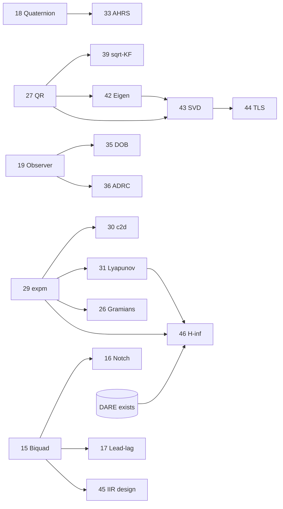

# Proposed Components Roadmap

Prioritized backlog of reusable numerical components for generic embedded applications,
ordered **easiest → hardest to implement** within the constraints of this library
(templated on `float` / `math::Q15` / `math::Q31`, no heap, bounded containers,
`#pragma GCC optimize` + `OPTIMIZE_FOR_SPEED` hot paths, typed tests, `doc/` page).

Difficulty legend:

| Stars | Meaning                                                             | Typical effort |
|-------|---------------------------------------------------------------------|----------------|
| ★☆☆☆☆ | Trivial primitive — a few methods, minimal math                     | Hours          |
| ★★☆☆☆ | Easy — well-defined recurrence, small state                         | Half day       |
| ★★★☆☆ | Moderate — real algorithm, still finite/bounded                     | 1–2 days       |
| ★★★★☆ | Advanced — non-trivial linear algebra / numerics                    | Several days   |
| ★★★★★ | Hard / research-grade — iterative eigen-numerics or adaptive theory | 1+ week        |

> **Numeric-type note.** DSP filters and fixed-gain trackers should template all three
> types (`float`, `Q15`, `Q31`). Items marked *(float-first)* involve dynamic range or
> iterative conditioning that make fixed-point impractical initially — implement and
> validate in `float`, mirroring the dynamics-module convention.

---

## Master list (by priority)

| #  | Component                                            | Target module             | Difficulty |
|----|------------------------------------------------------|---------------------------|------------|
| 47 | Model Reference Adaptive Control (MRAC)              | `nonlinear_control` (new) | ★★★★★      |

Items 48–52 are the **evaluation & metrics primitives** — reusable quantities the per-family
unit-test reference [`TESTING.md`](TESTING.md) depends on but which
the library does not yet expose. Detailed below under
[Evaluation & metrics primitives](#evaluation--metrics-primitives).

---

## Tier 1 — Trivial primitives ★☆☆☆☆

### 1. Exponential Moving Average (one-pole / leaky integrator)
- **What:** Single-pole recursive smoother `y[n] = α·x[n] + (1−α)·y[n−1]`.
- **Embedded value:** The cheapest low-pass filter — one multiply-add, one state word. Ubiquitous for sensor smoothing and DC tracking.
- **Algorithm / paper:** S. W. Smith, *The Scientist and Engineer's Guide to DSP*, Ch. 19 (Recursive/single-pole filters).
- **Reuses:** Trivial; templated scalar state.

### 2. Moving Average (running-sum boxcar)
- **What:** Length-`N` boxcar via incremental running sum: `sum += x[n] − x[n−N]`.
- **Embedded value:** Optimal white-noise reducer per computation; O(1) per sample independent of window length.
- **Algorithm / paper:** S. W. Smith, *DSP Guide*, Ch. 15 (Moving Average Filters, recursive form).
- **Reuses:** `math::RecursiveBuffer` for the delay line.

### 3. Saturation / rate-limiter / slew-rate blocks
- **What:** Composable actuator-constraint primitives: `clamp(u, lo, hi)` and `slew = clamp(Δu, −rate·Ts, +rate·Ts)`.
- **Embedded value:** Reusable safety wrappers around any controller output; a prerequisite for correct anti-windup.
- **Algorithm / paper:** K. J. Åström, R. M. Murray, *Feedback Systems* (2008), actuator saturation & windup.
- **Reuses:** Scalar/`Vector` templates.

### 5. Peak / zero-crossing / RMS-envelope detectors
- **What:** Lightweight feature extractors: rising/falling peak hold, sign-change (zero-crossing) counter, and RMS envelope via one-pole on `x²`.
- **Embedded value:** Cheap building blocks for frequency estimation, VU metering, activity detection, and event triggers.
- **Algorithm / paper:** R. G. Lyons, *Understanding Digital Signal Processing*, 3rd ed.
- **Reuses:** Item 1 (one-pole), `math::Statistics`.

---

## Tier 2 — Easy ★★☆☆☆

### 8. Alpha-beta / alpha-beta-gamma filter
- **What:** Fixed-gain steady-state tracker for position/velocity(/acceleration) states.
- **Embedded value:** Delivers most of the benefit of a Kalman filter at a fraction of the cost — no online covariance propagation.
- **Algorithm / paper:** P. Kalata, "The tracking index: A generalized parameter for α-β and α-β-γ target trackers," *IEEE Trans. AES*, 20(2), 1984.
- **Reuses:** `math::LinearTimeInvariant`, `filters/active` patterns.

### 10. Gain-scheduled controller
- **What:** Interpolates a set of precomputed controller gains across a scheduling variable (speed, load, operating point).
- **Embedded value:** Extends linear controllers to mildly nonlinear plants without online redesign.
- **Algorithm / paper:** W. J. Rugh, J. S. Shamma, "Research on gain scheduling," *Automatica*, 36(10), 2000.
- **Reuses:** LUT + linear/bilinear interpolation; existing controllers.

### 11. Convolution & correlation utilities
- **What:** Linear/circular convolution and auto/cross-correlation over bounded vectors.
- **Embedded value:** Matched filtering, template matching, delay/lag estimation, system-response measurement.
- **Algorithm / paper:** A. V. Oppenheim, R. W. Schafer, *Discrete-Time Signal Processing*, Ch. 2 & 8.
- **Reuses:** `math::Vector`, `math::Toeplitz`, FFT for fast convolution.

### 12. Polynomial least-squares curve fitting
- **What:** Fit a degree-`d` polynomial via the Vandermonde normal equations.
- **Embedded value:** Sensor calibration curves, drift/trend modeling, lightweight interpolation tables.
- **Algorithm / paper:** Press et al., *Numerical Recipes*, Ch. 15 (Modeling of Data / general linear least squares).
- **Reuses:** `solvers::GaussianElimination` or `solvers::CholeskyDecomposition`.

### 13. Goertzel algorithm
- **What:** Single-bin DFT via a second-order recurrence — detects one target frequency without a full FFT or input buffer.
- **Embedded value:** DTMF/tone detection, notch monitoring, sync-tone recovery; O(N) with O(1) memory.
- **Algorithm / paper:** G. Goertzel, "An Algorithm for the Evaluation of Finite Trigonometric Series," *American Mathematical Monthly*, 65(1), 1958.
- **Reuses:** `math::ComplexNumber`, `TrigonometricFunctions`.

### 14. CIC (Cascaded Integrator-Comb) filter
- **What:** Multiplier-free decimator/interpolator built from integrator and comb stages.
- **Embedded value:** The canonical front-end for sigma-delta ADC/DAC rate conversion — no multipliers, integer-only.
- **Algorithm / paper:** E. B. Hogenauer, "An Economical Class of Digital Filters for Decimation and Interpolation," *IEEE Trans. ASSP*, 29(2), 1981.
- **Reuses:** Integer accumulators; `math::RecursiveBuffer`.

---

## Tier 3 — Moderate ★★★☆☆

### 16. Notch / comb filter
- **What:** Narrow-band rejection (notch biquad) and periodic comb rejection.
- **Embedded value:** Removes 50/60 Hz mains hum and harmonic interference from bio-signals and instrumentation.
- **Algorithm / paper:** Bristow-Johnson EQ cookbook (notch); Lyons, *Understanding DSP* (comb filters).
- **Reuses:** Item 15 (biquad), `math::RecursiveBuffer`.

### 17. Lead-lag compensator
- **What:** Classic frequency-domain compensator `C(s) = K·(s+z)/(s+p)` discretized (Tustin) to a first-order section.
- **Embedded value:** Phase-margin shaping and bandwidth extension where a full state-space design is overkill.
- **Algorithm / paper:** G. F. Franklin, J. D. Powell, A. Emami-Naeini, *Feedback Control of Dynamic Systems*.
- **Reuses:** Item 15 realization; `controllers`.

### 18. Quaternion type
- **What:** Unit-quaternion class: Hamilton product, conjugate/inverse, normalization, rotation of vectors, SLERP, ↔ rotation-matrix/Euler conversions.
- **Embedded value:** Singularity-free attitude representation; **prerequisite for AHRS (item 33)** and 3D robotics.
- **Algorithm / paper:** J. B. Kuipers, *Quaternions and Rotation Sequences* (1999); K. Shoemake, "Animating rotation with quaternion curves," *SIGGRAPH*, 1985 (SLERP).
- **Reuses:** [Geometry3D.hpp](numerical/math/Geometry3D.hpp) (`Vector3`, `Matrix3`, Rodrigues).

### 19. Luenberger observer + pole placement (Ackermann)
- **What:** Deterministic full/reduced-order state observer with gains placed by Ackermann's formula.
- **Embedded value:** Reconstructs unmeasured states for state-feedback control; the deterministic counterpart to the Kalman filter. Currently only referenced in [Lqg.md](doc/controllers/Lqg.md), not implemented.
- **Algorithm / paper:** D. Luenberger, "An Introduction to Observers," *IEEE Trans. Automatic Control*, 16(6), 1971; Ackermann's formula (Franklin et al.).
- **Reuses:** `math::Matrix`, `StateFeedbackController`, `math::LinearTimeInvariant`.

### 20. Integral / servo state feedback (LQI)
- **What:** Augments the plant with integral-of-error states before LQR design for zero steady-state tracking error.
- **Embedded value:** Removes steady-state offset under constant references/disturbances — the practical version of LQR.
- **Algorithm / paper:** B. D. O. Anderson, J. B. Moore, *Optimal Control: Linear Quadratic Methods* (1990).
- **Reuses:** [Lqr.hpp](numerical/controllers/implementations/Lqr.hpp), [DARE](numerical/solvers/DiscreteAlgebraicRiccatiEquation.hpp).

### 22. Savitzky-Golay filter
- **What:** Convolution smoother that fits a local polynomial, preserving peak height/width and giving smoothed derivatives.
- **Embedded value:** Spectroscopy, ECG/PPG, and any signal where peaks matter and moving-average distortion is unacceptable.
- **Algorithm / paper:** A. Savitzky, M. J. E. Golay, "Smoothing and Differentiation of Data by Simplified Least Squares Procedures," *Analytical Chemistry*, 36(8), 1964.
- **Reuses:** `constexpr` coefficient tables; FIR convolution (item 11).

### 23. CORDIC
- **What:** Iterative shift-add engine for `sin`/`cos`, `atan2`, magnitude, and vector rotation — no multiplier required.
- **Embedded value:** Trig and Cartesian↔polar on FPU-less MCUs; naturally fixed-point, deterministic cycle count.
- **Algorithm / paper:** J. Volder, "The CORDIC Trigonometric Computing Technique," *IRE Trans. Electronic Computers*, EC-8(3), 1959; R. Andraka survey, 1998.
- **Reuses:** `math::QNumber`; complements `TrigonometricFunctions`.

### 25. Real-input FFT (RFFT)
- **What:** FFT specialized for real signals using the complex-pack (N/2-point) trick.
- **Embedded value:** ~2× throughput and half the memory versus a complex FFT on real ADC data.
- **Algorithm / paper:** H. Sorensen, D. Jones, M. Heideman, C. Burrus, "Real-valued fast Fourier transform algorithms," *IEEE Trans. ASSP*, 35(6), 1987.
- **Reuses:** [FastFourierTransform.hpp](numerical/analysis/FastFourierTransform.hpp), `math::ComplexNumber`.

### 26. Controllability / Observability matrices & Gramians
- **What:** Build controllability/observability matrices (rank test) and Gramians (via Lyapunov) for a state-space model.
- **Embedded value:** Design-time verification that a plant is controllable/observable before deploying an observer or LQR.
- **Algorithm / paper:** R. E. Kalman canonical structure (1960); P. Antsaklis, A. Michel, *A Linear Systems Primer*.
- **Reuses:** `math::LinearTimeInvariant`, `math::Matrix`; Gramians need item 31.

---

## Tier 4 — Advanced ★★★★☆

### 27. QR decomposition (Householder / Givens)  *(float-first)*
- **What:** `A = QR` via Householder reflections (or Givens rotations for sparse/streaming updates).
- **Embedded value:** Numerically robust least-squares and the workhorse behind eigen/SVD and square-root filtering.
- **Algorithm / paper:** A. Householder, "Unitary Triangularization of a Nonsymmetric Matrix," *JACM*, 5(4), 1958; Golub & Van Loan, *Matrix Computations*, Ch. 5.
- **Reuses:** `math::Matrix`; foundational for items 39, 42, 43, 44.

### 28. LU decomposition with partial pivoting  *(float-first)*
- **What:** `PA = LU` for general linear solves, determinant, and matrix inverse.
- **Embedded value:** General-purpose dense solver where Cholesky (SPD-only) does not apply.
- **Algorithm / paper:** Golub & Van Loan, *Matrix Computations*, Ch. 3 (GEPP).
- **Reuses:** [GaussianElimination.hpp](numerical/solvers/GaussianElimination.hpp) (factored form), `math::Matrix`.

### 29. Matrix exponential (scaling & squaring + Padé)  *(float-first)*
- **What:** `expm(A)` via scaling-and-squaring with a Padé approximant.
- **Embedded value:** Core building block for exact discretization, continuous Gramians, and linear-system simulation.
- **Algorithm / paper:** C. Moler, C. Van Loan, "Nineteen Dubious Ways to Compute the Exponential of a Matrix, Twenty-Five Years Later," *SIAM Review*, 45(1), 2003; N. Higham, scaling-and-squaring, 2005.
- **Reuses:** `math::Matrix`; **unblocks items 30, 31, 26.**

### 31. Lyapunov / Sylvester equation solvers  *(float-first)*
- **What:** Solve `AX + XB = C` (Sylvester) and discrete/continuous Lyapunov equations.
- **Embedded value:** Stability certificates, controllability/observability Gramians, robust-control synthesis.
- **Algorithm / paper:** R. Bartels, G. Stewart, "Solution of the Matrix Equation AX + XB = C," *Comm. ACM*, 15(9), 1972.
- **Reuses:** `math::Matrix`, item 27 (Schur/QR building blocks).

### 33. Madgwick / Mahony AHRS  *(float-first)*
- **What:** Quaternion-based orientation filter fusing gyro + accel (+ mag): Madgwick's gradient-descent correction or Mahony's passive complementary filter on SO(3).
- **Embedded value:** The de-facto attitude estimator for drones, robots, and wearables — cheaper and more robust than a full quaternion EKF.
- **Algorithm / paper:** S. Madgwick, "An efficient orientation filter for inertial and inertial/magnetic sensor arrays," 2010; R. Mahony, T. Hamel, J.-M. Pflimlin, "Nonlinear Complementary Filters on the Special Orthogonal Group," *IEEE Trans. AC*, 53(5), 2008.
- **Reuses:** **Item 18 (Quaternion)**, `math::Geometry3D`.

### 36. Active Disturbance Rejection Control (ADRC + ESO)  *(float-first)*
- **What:** Extended State Observer estimates total disturbance as an augmented state; a feedback law cancels it in real time.
- **Embedded value:** Near model-free, strongly robust motion control; increasingly standard in industrial drives.
- **Algorithm / paper:** J. Han, "From PID to Active Disturbance Rejection Control," *IEEE Trans. Ind. Electron.*, 56(3), 2009; Z. Gao, bandwidth parameterization, *ACC*, 2003.
- **Reuses:** Item 19 (observer), `math::Matrix`, new `robust_control/` module.

### 37. Hilbert transform / analytic signal / envelope  *(float-first)*
- **What:** Compute the analytic signal (via FFT or a Type-III/IV FIR) for instantaneous amplitude, phase, and frequency.
- **Embedded value:** AM demodulation, envelope detection, vibration/bearing analysis, single-sideband processing.
- **Algorithm / paper:** S. L. Marple, "Computing the Discrete-Time Analytic Signal via FFT," *IEEE Trans. Signal Processing*, 47(9), 1999.
- **Reuses:** Items 25/`FastFourierTransform`, FIR.

### 38. Discrete Wavelet Transform (Haar / Daubechies)  *(float-first)*
- **What:** Multiresolution analysis via a quadrature-mirror analysis/synthesis filter bank.
- **Embedded value:** Denoising, compression, and time-frequency features for condition monitoring and edge-ML pipelines.
- **Algorithm / paper:** S. Mallat, "A Theory for Multiresolution Signal Decomposition," *IEEE TPAMI*, 11(7), 1989; I. Daubechies, *Ten Lectures on Wavelets* (1992).
- **Reuses:** FIR filter banks, `math::RecursiveBuffer`.

### 39. Square-root / Information Kalman filter  *(float-first)*
- **What:** Propagate a Cholesky/QR factor of the covariance (square-root form) or its inverse (information form).
- **Embedded value:** Guaranteed positive-definite covariance and better conditioning — critical for reduced-precision hardware and multi-sensor fusion.
- **Algorithm / paper:** P. Kaminski, A. Bryson, S. Schmidt, "Discrete Square Root Filtering: A Survey of Current Techniques," *IEEE Trans. AC*, 16(6), 1971.
- **Reuses:** [KalmanFilterBase.hpp](numerical/filters/active/KalmanFilterBase.hpp), [Cholesky](numerical/solvers/CholeskyDecomposition.hpp), item 27.

---

## Tier 5 — Hard / research-grade ★★★★★

### ~~42. Symmetric eigenvalue solver (Jacobi)~~  *(float-first)* ✓ Done
- **What:** Cyclic Jacobi rotations for the eigenvalues/vectors of a symmetric matrix.
- **Embedded value:** PCA/feature extraction, modal analysis, covariance conditioning, Gramian analysis.
- **Algorithm / paper:** Golub & Van Loan, *Matrix Computations*, Ch. 8 (symmetric eigenproblem / cyclic Jacobi).
- **Reuses:** `math::Matrix`, item 27.

### 43. Singular Value Decomposition (Golub-Kahan)  *(float-first)*
- **What:** `A = UΣVᵀ` via Golub-Kahan bidiagonalization + implicit QR sweeps.
- **Embedded value:** Pseudo-inverse, rank/condition estimation, model reduction, robust least squares — foundational.
- **Algorithm / paper:** G. Golub, W. Kahan, "Calculating the Singular Values and Pseudo-Inverse of a Matrix," *SIAM J. Numer. Anal.*, 2(2), 1965; Golub & Reinsch, 1970.
- **Reuses:** Items 27 & 42.

### 44. Total Least Squares  *(float-first)*
- **What:** Errors-in-variables fitting where both inputs and outputs are noisy (SVD-based solution).
- **Embedded value:** Accurate calibration and system identification when the regressors themselves are measured with noise.
- **Algorithm / paper:** G. Golub, C. Van Loan, "An Analysis of the Total Least Squares Problem," *SIAM J. Numer. Anal.*, 17(6), 1980.
- **Reuses:** **Item 43 (SVD)**, `estimators/offline`.

### 45. IIR filter design (Butterworth / Chebyshev + bilinear)  *(float-first)*
- **What:** Generate SOS/biquad coefficients on-device from an analog prototype via the bilinear transform.
- **Embedded value:** Runtime-reconfigurable filters (adjustable cutoff/order) without a host toolchain or hardcoded tables.
- **Algorithm / paper:** T. W. Parks, C. S. Burrus, *Digital Filter Design* (1987); bilinear transform — Oppenheim & Schafer, *DTSP*.
- **Reuses:** Item 15 (biquad target), `math::ComplexNumber`, item 23 (root placement).

### ~~46. H∞ state-feedback control~~  *(float-first)* ✓ Done
- **What:** Robust optimal control minimizing the worst-case disturbance-to-error gain via a Riccati/LMI solution.
- **Embedded value:** Guaranteed performance under bounded model uncertainty for safety-critical loops.
- **Algorithm / paper:** J. Doyle, K. Glover, P. Khargonekar, B. Francis, "State-Space Solutions to Standard H₂ and H∞ Control Problems," *IEEE Trans. AC*, 34(8), 1989.
- **Reuses:** [DARE](numerical/solvers/DiscreteAlgebraicRiccatiEquation.hpp), items 29 & 31, new `robust_control/` module.

### 47. Model Reference Adaptive Control (MRAC)  *(float-first)*
- **What:** Online parameter adaptation (MIT rule / Lyapunov redesign) so the plant tracks a reference model.
- **Embedded value:** Self-tuning control for plants with slowly-varying or unknown parameters.
- **Algorithm / paper:** K. J. Åström, B. Wittenmark, *Adaptive Control* (1995); K. Narendra, A. Annaswamy, *Stable Adaptive Systems* (1989).
- **Reuses:** `estimators/online` (RLS), `math::LinearTimeInvariant`, new `nonlinear_control/` module.

---

## Dependency notes

Implement prerequisites first to avoid rework:

- **18 Quaternion** → 33 Madgwick/Mahony AHRS
- **29 Matrix exponential** → 30 `c2d`, 31 Lyapunov (continuous), 26 continuous Gramians
- **27 QR** → 39 square-root KF, 42 Jacobi eigen, 43 SVD
- **42 eigen + 27 QR** → 43 SVD → 44 Total Least Squares
- **19 Luenberger observer** → 35 DOB, 36 ADRC
- **15 Biquad** → 16 notch/comb, 17 lead-lag, 45 IIR design
- **DARE (exists) + 29 + 31** → 46 H∞

## Evaluation & metrics primitives

Reusable quantities that quantify *how well* an algorithm behaves — the properties the per-family
unit-test reference [`TESTING.md`](TESTING.md) asks tests to assert.
Today [`math/Statistics.hpp`](numerical/math/Statistics.hpp) already provides `Mean`, `Variance`,
`MeanSquaredError`, `RootMeanSquaredError`, `MeanAbsoluteError`, `RSquaredScore`, `AutoCorrelation`,
and [`control_analysis/FrequencyResponse`](numerical/control_analysis/FrequencyResponse.hpp) provides
magnitude/phase. The items below are the missing pieces. All are **float-only**, no-heap, and operate
on bounded `math::Vector`/`math::Matrix` inputs; tests are `TEST_F` on `float`.

### 51. Spectral radius / discrete stability margin ★★★☆☆ — `math`
- **What:** Dominant `|eigenvalue|` of a square (state/companion) matrix; `IsSchurStable` (all
  `|λ| < 1`) and the stability margin `1 − ρ(A)`.
- **Metric value:** M4 (stability) — the general test for discrete-time controllers, observers,
  IIR/Biquad (via the companion matrix of the denominator), and closed-loop `A − BK`.
- **Algorithm:** power iteration for the dominant eigenvalue, or characteristic-polynomial roots via
  the existing `solvers::DurandKerner` for the full spectrum.
- **Reuses:** `math::Matrix`, `solvers::DurandKerner`.

### ~~52. Estimator consistency metrics (NEES / NIS) ★★★☆☆ — `estimators`~~ ✓ Done
- **What:** Normalised Estimation Error Squared and Normalised Innovation Squared, with χ²
  confidence-gate helpers.
- **Metric value:** M8 (statistical consistency) — the only rigorous correctness test for the Kalman
  family (`filters/active/`: KF/EKF/UKF/smoother) beyond raw RMSE.
- **Algorithm:** `εᵀ·P⁻¹·ε` against χ² bounds for the state/measurement dimension.
- **Reuses:** `math::Matrix`, `solvers::GaussianElimination` (for `P⁻¹·ε`), existing
  `estimators::EstimationMetrics`.

> **Test-only helpers (not production components).** A ULP/relative-error comparator and a
> finite-difference **gradient check** (for `neural_network/` and `optimization/`) are pure test
> utilities — add them to the `numerical.math_test_helper` INTERFACE library
> ([`numerical/math/test_doubles/`](numerical/math/test_doubles/)), not to `numerical/` production code.

## New modules to introduce

New top-level domains under `numerical/` are proposed to house the additions,
each mirroring the existing header-library + `test/` + `doc/` layout:

- `numerical/robust_control/` → items 34, 35, 36, 46 (namespace `robust_control`)
- `numerical/nonlinear_control/` → items 40, 41, 47 (namespace `nonlinear_control`)

Robot-manipulator kinematics, dynamics, trajectory generation, and manipulator control now live in
[robotics-toolbox-cpp](https://github.com/embedded-pro/robotics-toolbox-cpp), which consumes this
library via `FetchContent`.

## Per-component implementation checklist

Every new component should follow the established repository conventions:

- [ ] Header-only template supporting `float` / `math::Q15` / `math::Q31` (or *float-first* where noted)
- [ ] `#pragma GCC optimize("O3", "fast-math")` after `#pragma once`; `OPTIMIZE_FOR_SPEED` on hot paths
- [ ] No heap, no recursion, bounded containers (`infra::BoundedVector`, `std::array`)
- [ ] `static_assert` on supported types and dimensions
- [ ] Typed tests (`TYPED_TEST`) for multi-type components; `TEST_F` for single-type; `StrictMock` only
- [ ] Design-first `doc/<domain>/<Name>.md` following `doc/TEMPLATE.md`; add its row to
      `doc/<domain>/README.md` and `README.md`'s Documentation table (the booklet regenerates from
      these tables in CI — no manual booklet edit)
- [ ] Explicit template instantiation `.cpp` guarded by `NUMERICAL_TOOLBOX_COVERAGE_BUILD` + `numerical_add_coverage_sources`
- [ ] `CMakeLists.txt` via `numerical_add_header_library()` / `${NUMERICAL_VISIBILITY}`
- [ ] Simulator + `.vscode/launch.json` entry where a visual demo adds value
