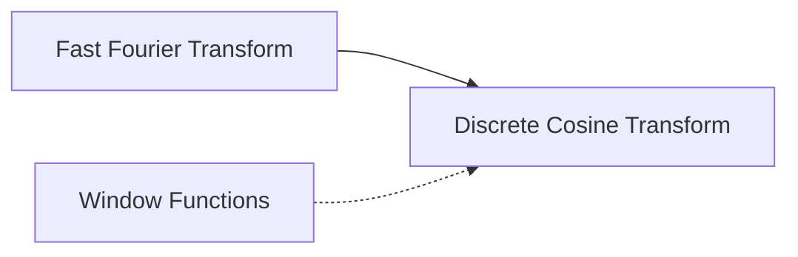

# Discrete Cosine Transform (DCT)

## Overview & Motivation

The Discrete Cosine Transform projects a real-valued signal onto a set of cosine basis functions at different frequencies. Unlike the DFT, the DCT produces **purely real coefficients** and exhibits superior **energy compaction** — most of the signal's energy concentrates in a few low-frequency coefficients. This property makes it the backbone of lossy compression standards (JPEG, MPEG, AAC).

This library implements **DCT-II** (the most common variant) by leveraging the FFT: the input is rearranged, transformed via a real-valued FFT, and post-processed with twiddle factors. This approach inherits the FFT's $O(N \log N)$ efficiency rather than requiring a dedicated $O(N^2)$ computation.

## Mathematical Theory

### DCT-II Definition

For a length-$N$ sequence $x[n]$, the DCT-II is defined as:

$$X[k] = \sum_{n=0}^{N-1} x[n] \cos\!\left(\frac{\pi}{N}\left(n + \tfrac{1}{2}\right) k\right), \quad k = 0, 1, \ldots, N-1$$

The inverse (DCT-III, also called IDCT) recovers $x[n]$:

$$x[n] = \frac{1}{N}\left[\frac{X[0]}{2} + \sum_{k=1}^{N-1} X[k] \cos\!\left(\frac{\pi}{N}\left(n + \tfrac{1}{2}\right) k\right)\right]$$

### FFT-Based Computation

The DCT can be computed via the DFT of a reordered sequence:

1. Form a new sequence $y[n]$ by interleaving even-indexed and reverse odd-indexed samples of $x$.
2. Compute the $N$-point FFT: $Y[k] = \text{FFT}\{y\}$.
3. Apply twiddle factors: $X[k] = 2 \cdot \text{Re}\!\left(W[k] \cdot Y[k]\right)$, where $W[k] = e^{-j\pi k / 2N}$.

### Why Cosine Basis?

Cosine functions are **symmetric** (even functions). The DCT implicitly mirrors the signal rather than making it periodic, avoiding the boundary discontinuities that cause spectral leakage in the DFT. This is why DCT coefficients decay faster and energy compaction is better.

## Complexity Analysis

| Case | Time          | Space  | Notes                                                            |
|------|---------------|--------|------------------------------------------------------------------|
| All  | $O(N \log N)$ | $O(N)$ | Dominated by the internal FFT; twiddle post-processing is $O(N)$ |

The reordering step and twiddle multiplication are both linear, so the overall cost is determined by the FFT.

## Step-by-Step Walkthrough

**Input:** $x = [1, 2, 3, 4]$, $N = 4$

**Step 1 — Reorder for FFT**

Even-indexed positions filled left-to-right, odd-indexed filled right-to-left:

$$y = [x[0],\; x[2],\; x[3],\; x[1]] = [1, 3, 4, 2]$$

**Step 2 — Compute FFT**

$$Y = \text{FFT}([1, 3, 4, 2]) = [10,\; -3+j,\; -2,\; -3-j]$$

**Step 3 — Apply twiddle factors** $W[k] = e^{-j\pi k/8}$

| $k$ | $W[k]$         | $W[k] \cdot Y[k]$ | $X[k] = 2 \cdot \text{Re}(\cdot)$ |
|-----|----------------|-------------------|-----------------------------------|
| 0   | 1              | 10                | 20                                |
| 1   | $e^{-j\pi/8}$  | ≈ −2.22 − 1.90j   | ≈ −4.44                           |
| 2   | $e^{-j\pi/4}$  | ≈ −1.41 + 1.41j   | ≈ −2.83                           |
| 3   | $e^{-j3\pi/8}$ | ≈ −0.24 + 3.07j   | ≈ −0.47                           |

**Output:** $X \approx [20, -4.44, -2.83, -0.47]$

Notice how most of the energy is in $X[0]$ (the DC component) — energy compaction in action.

## Pitfalls & Edge Cases

- **Power-of-2 length required** — inherited from the underlying FFT constraint.
- **Normalization convention.** Different references use different scaling (some include $\sqrt{2/N}$). Verify which convention the consumer expects.
- **Fixed-point overflow.** The reordering and FFT steps must preserve range; apply the 0.9999 scaling factor used throughout this library.
- **Inverse accuracy.** Rounding errors accumulate in the forward-then-inverse round-trip, especially for Q15 types.
- **Real input only.** Complex inputs are not supported by the reordering trick.

## Variants & Generalizations

| Variant            | Description                                                       |
|--------------------|-------------------------------------------------------------------|
| **DCT-I**          | Symmetric extension; used in some filter bank designs             |
| **DCT-III (IDCT)** | Inverse of DCT-II; used for reconstruction in JPEG decoding       |
| **DCT-IV**         | Self-inverse; basis of the MDCT used in MP3 and AAC               |
| **MDCT**           | Modified DCT with 50 % overlap; foundation of modern audio codecs |
| **2-D DCT**        | Applied row-then-column for image compression (JPEG 8×8 blocks)   |

## Applications

- **Image compression** — JPEG applies DCT to 8×8 pixel blocks; quantizing high-frequency coefficients achieves compression.
- **Audio compression** — MDCT (a DCT variant) is the core transform in MP3, AAC, and Opus codecs.
- **Feature extraction** — Mel-frequency cepstral coefficients (MFCCs) used in speech recognition are derived from a DCT.
- **Data reduction** — Truncating small DCT coefficients provides a compact signal representation for embedded storage.
- **Numerical methods** — DCT is used in fast solvers for certain partial differential equations (Poisson's equation on regular grids).

## Connections to Other Algorithms

| Algorithm                                         | Relationship                                                              |
|---------------------------------------------------|---------------------------------------------------------------------------|
| [Fast Fourier Transform](FastFourierTransform.md) | DCT is computed via FFT with input reordering and twiddle post-processing |
| [Window Functions](../windowing/window.md)        | Some DCT applications use windowing to control boundary effects           |

## References & Further Reading

- Ahmed, N., Natarajan, T. and Rao, K.R., "Discrete Cosine Transform", *IEEE Transactions on Computers*, C-23(1), 1974.
- Rao, K.R. and Yip, P., *Discrete Cosine Transform: Algorithms, Advantages, Applications*, Academic Press, 1990.
- Makhoul, J., "A fast cosine transform in one and two dimensions", *IEEE Transactions on ASSP*, 28(1), 1980.
