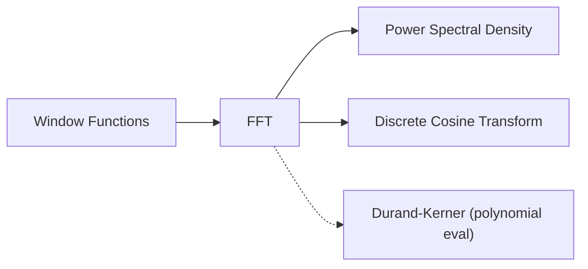

# Fast Fourier Transform (FFT)

## Overview & Motivation

Many problems in signal processing, communications, and control require knowing the frequency content of a signal. The Discrete Fourier Transform (DFT) answers this question exactly, but its direct computation costs $O(N^2)$ multiplications — prohibitive for real-time embedded systems processing thousands of samples.

The **Fast Fourier Transform** is a family of algorithms that compute the DFT in $O(N \log N)$ operations by exploiting symmetry and periodicity of the complex exponential. This library implements the **Radix-2 Cooley-Tukey** variant, which recursively splits an $N$-point DFT into two $N/2$-point DFTs, requiring $N$ to be a power of two.

The core insight is that the DFT matrix has a recursive block structure: half of its entries are shared between the even-indexed and odd-indexed sub-problems, so most of the work can be reused rather than recomputed.

## Mathematical Theory

### Prerequisites

The **Discrete Fourier Transform** of a length-$N$ sequence $x[n]$ is defined as:

$$X[k] = \sum_{n=0}^{N-1} x[n] \, e^{-j2\pi kn/N}, \quad k = 0, 1, \ldots, N-1$$

The **inverse DFT** recovers the original sequence:

$$x[n] = \frac{1}{N} \sum_{k=0}^{N-1} X[k] \, e^{j2\pi kn/N}$$

We define the **twiddle factor** $W_N = e^{-j2\pi/N}$, so $X[k] = \sum_{n} x[n] \, W_N^{kn}$.

### Cooley-Tukey Decomposition

Split the sum into even-indexed and odd-indexed terms:

$$X[k] = \underbrace{\sum_{m=0}^{N/2-1} x[2m] \, W_{N/2}^{km}}_{E[k]} \;+\; W_N^k \underbrace{\sum_{m=0}^{N/2-1} x[2m+1] \, W_{N/2}^{km}}_{O[k]}$$

Because $E[k]$ and $O[k]$ are periodic with period $N/2$:

$$X[k] = E[k] + W_N^k \, O[k]$$
$$X[k + N/2] = E[k] - W_N^k \, O[k]$$

This pair of equations is the **butterfly operation**: two outputs from two inputs and one twiddle-factor multiplication.

### Bit-Reversal Permutation

The recursive decomposition reorders input by bit-reversing the sample indices. For in-place computation the input array is pre-permuted so that butterfly stages proceed sequentially from the smallest sub-problems to the full $N$-point result.

## Complexity Analysis

| Case | Time | Space | Notes |
|------|------|-------|-------|
| All | $O(N \log_2 N)$ | $O(N)$ | $N$ must be a power of 2 |

**Why $O(N \log N)$:** There are $\log_2 N$ butterfly stages, each performing $N/2$ butterfly operations (one complex multiply + two complex adds). Total: $\frac{N}{2} \log_2 N$ complex multiplications.

Twiddle factors are **pre-computed** and stored in a lookup table of size $N/2$, so no trigonometric evaluations occur at runtime.

## Step-by-Step Walkthrough

**Input:** $x = [1, 2, 3, 4]$, $N = 4$

**Step 1 — Bit-reversal permutation**

| Index (binary) | Reversed | Value |
|----------------|----------|-------|
| 0 (00) | 0 (00) | 1 |
| 1 (01) | 2 (10) | 3 |
| 2 (10) | 1 (01) | 2 |
| 3 (11) | 3 (11) | 4 |

Reordered: $[1, 3, 2, 4]$

**Step 2 — Stage 1 (size-2 butterflies), twiddle $W_2^0 = 1$**

- Butterfly$(1, 3)$: outputs $(1+3, \; 1-3) = (4, \; -2)$
- Butterfly$(2, 4)$: outputs $(2+4, \; 2-4) = (6, \; -2)$

Result: $[4, -2, 6, -2]$

**Step 3 — Stage 2 (size-4 butterfly), twiddles $W_4^0 = 1$, $W_4^1 = -j$**

- $X[0] = 4 + 1 \cdot 6 = 10$
- $X[1] = -2 + (-j)(-2) = -2 + 2j$
- $X[2] = 4 - 1 \cdot 6 = -2$
- $X[3] = -2 - (-j)(-2) = -2 - 2j$

**Output:** $X = [10,\; -2+2j,\; -2,\; -2-2j]$

Verification: $X[0] = 1+2+3+4 = 10$ ✓

## Pitfalls & Edge Cases

- **Power-of-2 constraint.** Non-power-of-2 inputs require zero-padding, which introduces interpolation artifacts in the frequency domain.
- **Fixed-point overflow.** Each butterfly stage can double the magnitude. For Q15/Q31 types, scale the input by $1/N$ before the transform or apply per-stage scaling.
- **Spectral leakage.** A finite-length DFT implicitly applies a rectangular window. Use a [window function](../windowing/window.md) before the transform to reduce sidelobes.
- **Aliasing.** The Nyquist-Shannon theorem requires $f_s \geq 2 f_{\max}$. Violating this folds high frequencies onto low frequencies irreversibly.
- **Frequency resolution** is $\Delta f = f_s / N$. Increasing $N$ improves resolution at the cost of more memory and computation.

## Variants & Generalizations

| Variant | Key Difference |
|---------|---------------|
| **Mixed-radix FFT** | Supports arbitrary composite $N$ using radix-2, -3, -5, etc. stages |
| **Split-radix FFT** | Reduces multiplications by ~33 % compared to standard radix-2 |
| **Real-valued FFT** | Exploits conjugate symmetry of real inputs to halve work and memory |
| **Bluestein's algorithm** | Handles arbitrary $N$ by converting DFT to a circular convolution |
| **Inverse FFT** | Same structure; negate twiddle exponents and scale by $1/N$ |

## Applications

- **Spectral analysis** — Identifying frequency components, harmonics, and noise floors in sensor data.
- **Convolution and filtering** — Multiplication in the frequency domain is equivalent to time-domain convolution; enables efficient FIR filtering.
- **Power Spectral Density** — Used internally by Welch's method for spectral estimation.
- **Communication systems** — OFDM modulation/demodulation is built directly on the FFT/IFFT pair.
- **Vibration and fault diagnosis** — Examining spectral peaks to detect mechanical anomalies.
- **Data compression** — Foundation for transforms (DCT, MDCT) used in JPEG, MP3, etc.

## Connections to Other Algorithms

| Algorithm | Relationship |
|-----------|-------------|
| [Power Spectral Density](PowerDensitySpectrum.md) | Calls FFT internally on each windowed segment |
| [Discrete Cosine Transform](DiscreteCosineTransform.md) | Computed via FFT with input rearrangement and twiddle-factor post-processing |
| [Window Functions](../windowing/window.md) | Applied before FFT to reduce spectral leakage |

## References & Further Reading

- Cooley, J.W. and Tukey, J.W., "An algorithm for the machine calculation of complex Fourier series", *Mathematics of Computation*, 19(90), 1965.
- Oppenheim, A.V. and Schafer, R.W., *Discrete-Time Signal Processing*, 3rd ed., Pearson, 2009 — Chapters 8–9.
- Smith, S.W., *The Scientist and Engineer's Guide to Digital Signal Processing*, California Technical Publishing, 1997 — Chapters 8, 12.
