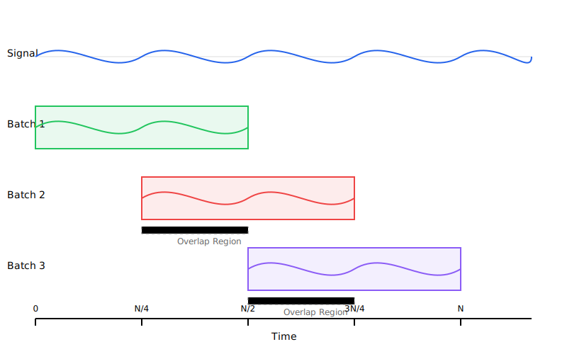

# Power Spectral Density (PSD) Implementation Guide

## Process Overview

The following diagram illustrates the key steps in the Welch's method implementation:



The diagram shows the main processing steps:
1. Input signal is received
2. Signal is divided into overlapping segments
3. Window function is applied to each segment
4. FFT is computed for each windowed segment
5. Power spectrum is calculated and averaged

## Mathematical Background

### Power Spectral Density

The Power Spectral Density (PSD) describes how the power of a signal is distributed across different frequencies. For a continuous-time signal x(t), the PSD is defined as:

```
Sxx(f) = lim[T→∞] (1/T) |X(f)|²
```

where X(f) is the Fourier transform of the signal and T is the observation time.

### Welch's Method

Our implementation uses Welch's method, which:
1. Divides the signal into overlapping segments
2. Windows each segment
3. Computes the periodogram of each segment
4. Averages the periodograms

The mathematical steps are:
```
1. Segment the signal: xi[n] = x[n + iL], i = 0,1,...,K-1
2. Apply window: wi[n] = w[n]xi[n]
3. Compute FFT: Wi[k] = FFT{wi[n]}
4. Calculate periodogram: Pi[k] = (1/N)|Wi[k]|²
5. Average periodograms: P[k] = (1/K)Σ(i=0 to K-1) Pi[k]
```

where:
- N is the segment size
- L is the step size between segments
- K is the number of segments
- w[n] is the window function

## Implementation Details

### Class Structure

```cpp
template<
    typename QNumberType,
    std::size_t SegmentSize,
    typename Fft,
    typename TwindleFactor,
    std::size_t Overlap
>
class PowerSpectralDensity {
public:
    explicit PowerSpectralDensity(
        windowing::Window<QNumberType>& window,
        QNumberType samplingTimeInSeconds);
        
    VectorReal& Calculate(const VectorReal& input);
};
```

### Key Components

1. **Segmentation**:
   - Fixed segment size (must be even)
   - Configurable overlap (0%, 25%, 50%, or 75%)
   - Step size calculated as: `step = SegmentSize - overlapSize`

2. **Windowing**:
   - User-provided window function
   - Reduces spectral leakage
   - Applied to each segment before FFT

3. **FFT Processing**:
   - Uses templated FFT implementation
   - Computes spectrum for each segment
   - Handles complex conjugate symmetry

4. **Averaging**:
   - Accumulates power from all segments
   - Applies frequency resolution scaling
   - Returns one-sided spectrum

## Usage Guide

### Basic Usage

```cpp
// Define system parameters
constexpr std::size_t N = 1024;          // Segment size
constexpr std::size_t overlap = 50;       // 50% overlap
using FloatType = float;

// Create window function
windowing::Hanning<FloatType> window;

// Create PSD analyzer
PowerSpectralDensity<
    FloatType,
    N,
    FastFourierTransformRadix2Impl<FloatType, N>,
    TwiddleFactorsImpl<FloatType, N/2>,
    overlap
> psd(window, samplingTime);

// Prepare input data
infra::BoundedVector<FloatType>::WithMaxSize<N> signal;
// ... fill signal with data ...

// Calculate PSD
auto& spectrum = psd.Calculate(signal);

// Access results
for (std::size_t i = 0; i <= N/2; ++i) {
    float frequency = i * (1.0f / samplingTime) / N;
    float power = spectrum[i];
    // Process spectrum...
}
```

### Example: Signal Analysis

```cpp
// Create analyzer with Hanning window
constexpr float samplingRate = 1000.0f;  // Hz
constexpr float samplingTime = 1.0f / samplingRate;
windowing::Hanning<float> window;

PowerSpectralDensity<float, 1024, FFT, Twiddle, 50> psd(
    window, samplingTime);

// Generate test signal
auto signal = GenerateSignal(samplingRate);

// Calculate PSD
auto& spectrum = psd.Calculate(signal);

// Convert to dB
std::vector<float> powerDb(spectrum.size());
for (std::size_t i = 0; i < spectrum.size(); ++i) {
    float power = spectrum[i];
    powerDb[i] = 10.0f * std::log10(power);
}
```

## Best Practices

1. **Segment Size**:
   - Use power of 2 for efficient FFT
   - Balance frequency resolution vs. time averaging
   - Typically 256 to 4096 points

2. **Overlap**:
   - Higher overlap increases averaging but requires more computation
   - 50% is a common choice
   - Supported values: 0%, 25%, 50%, 75%

3. **Window Selection**:
   - Hanning/Hamming for general purpose
   - Blackman for better sidelobe suppression
   - Rectangle for transient analysis

4. **Frequency Resolution**:
   - Determined by: Δf = 1/(N * samplingTime)
   - Trade-off with temporal resolution

## Common Applications

1. **Spectrum Analysis**:
   - Frequency content analysis
   - Harmonic identification
   - Noise characterization

2. **Signal Processing**:
   - Vibration analysis
   - Audio processing
   - Communication systems

3. **System Identification**:
   - Transfer function estimation
   - Coherence analysis
   - Cross-spectral density

## Performance Considerations

1. **Template Parameters**:
   - Fixed sizes enable compile-time optimizations
   - Stack allocation for small segments

2. **Memory Usage**:
   - Uses BoundedVector to prevent heap allocation
   - Reuses FFT buffers across segments

3. **Computation Efficiency**:
   - In-place FFT operations
   - Optimized window application
   - Efficient buffer management

## Limitations and Future Improvements

1. Current limitations:
   - Fixed segment size
   - Limited overlap options
   - One-sided spectrum only
   - Real-valued input only

2. Possible extensions:
   - Variable segment size
   - Arbitrary overlap percentage
   - Two-sided spectrum option
   - Complex input support
   - Cross-spectral density
   - Coherence estimation
   - Confidence interval calculation
   - Multi-channel analysis

## Error Handling

1. Static assertions verify:
   - Valid numeric types
   - Even segment size
   - Valid overlap percentage
   - FFT type compatibility

2. Runtime checks:
   - Input size adequacy
   - Window function validity
   - Numerical overflow prevention
