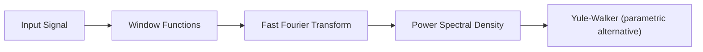

# Power Spectral Density (Welch's Method)

## Overview & Motivation

Given a noisy signal, a natural question is: *how is the signal's power distributed across frequencies?* A single FFT of the entire record gives a very noisy estimate — the variance of the periodogram does not decrease as the record grows. **Welch's method** trades frequency resolution for statistical reliability by dividing the signal into overlapping, windowed segments, computing a periodogram for each, and averaging them. The result is a smooth, consistent estimate of the Power Spectral Density (PSD).

This is the standard approach in vibration analysis, audio engineering, communication system design, and any domain where reliable spectral estimates matter more than the finest possible frequency resolution.

## Mathematical Theory

### Power Spectral Density Definition

For a wide-sense stationary process $x(t)$, the PSD is the Fourier transform of the autocorrelation function (Wiener-Khinchin theorem):

$$S_{xx}(f) = \int_{-\infty}^{\infty} R_{xx}(\tau) \, e^{-j2\pi f\tau} \, d\tau$$

In practice we estimate $S_{xx}$ from a finite record.

### The Periodogram

The periodogram of a length-$N$ segment $x[n]$ is:

$$\hat{P}(f_k) = \frac{1}{N} \left| \sum_{n=0}^{N-1} x[n] \, e^{-j2\pi kn/N} \right|^2 = \frac{1}{N} |X[k]|^2$$

This is an unbiased but **inconsistent** estimator — its variance does not shrink as $N \to \infty$.

### Welch's Method

1. **Segment** the signal of length $L$ into $K$ overlapping segments of length $N$ with step size $S = N - \text{overlap}$:

$$x_i[n] = x[n + iS], \quad i = 0, 1, \ldots, K-1$$

2. **Window** each segment:

$$w_i[n] = w[n] \cdot x_i[n]$$

3. **Compute the periodogram** of each windowed segment:

$$P_i[k] = \frac{1}{N} |W_i[k]|^2$$

4. **Average** across all segments:

$$\hat{S}_{xx}[k] = \frac{1}{K} \sum_{i=0}^{K-1} P_i[k]$$

The averaging reduces variance by a factor of approximately $K$ (slightly less due to overlap correlation).

### Frequency Resolution

$$\Delta f = \frac{f_s}{N}$$

Increasing segment size $N$ improves resolution but reduces the number of averages $K$ for a fixed-length record.

## Complexity Analysis

| Case | Time | Space | Notes |
|------|------|-------|-------|
| All | $O(K \cdot N \log N)$ | $O(N)$ | $K$ segments, each requiring one FFT |

Where $K = \lfloor (L - N) / S \rfloor + 1$ and $S = N \cdot (1 - \text{overlap fraction})$.

**Why:** Each segment requires an $O(N \log N)$ FFT, and there are $K$ segments. The averaging and magnitude-squared operations are $O(N)$ per segment.

## Step-by-Step Walkthrough

**Input:** $x = [1, 3, 5, 7, 6, 4, 2, 0]$, segment size $N=4$, 50 % overlap, rectangular window.

**Step 1 — Segmentation** (step $S = 2$):

| Segment | Indices | Values |
|---------|---------|--------|
| $x_0$ | 0–3 | $[1, 3, 5, 7]$ |
| $x_1$ | 2–5 | $[5, 7, 6, 4]$ |
| $x_2$ | 4–7 | $[6, 4, 2, 0]$ |

**Step 2 — Window** (rectangular → no change)

**Step 3 — FFT and periodogram** for $x_0 = [1, 3, 5, 7]$:

- $X_0 = [16, \; -4+4j, \; -4, \; -4-4j]$
- $P_0 = \frac{1}{4}[256, \; 32, \; 16, \; 32] = [64, \; 8, \; 4, \; 8]$

*(Repeat for $x_1$ and $x_2$.)*

**Step 4 — Average** the three periodograms element-wise.

**Output:** One-sided PSD estimate at frequencies $0, \frac{f_s}{4}, \frac{f_s}{2}$.

## Pitfalls & Edge Cases

- **Too few segments.** If the signal is short relative to the segment size, $K$ is small and the variance reduction is limited. Reduce $N$ or increase overlap.
- **Overlap > 75 %** gives diminishing returns — the segments become highly correlated and additional averages barely reduce variance.
- **Window choice** affects both the main-lobe width and sidelobe level. A Hanning window is a safe default; use Blackman for better dynamic range at the cost of resolution.
- **Segment size must be even** (and a power of 2 for the FFT). Odd or non-power-of-2 sizes are rejected at compile time.
- **DC and Nyquist bins** appear only once in the one-sided spectrum; all other bins are doubled. Omitting this correction distorts the total power.

## Variants & Generalizations

| Variant | Key Difference |
|---------|---------------|
| **Bartlett's method** | Non-overlapping segments, rectangular window (special case of Welch with 0 % overlap) |
| **Modified periodogram** | Single segment with a non-rectangular window |
| **Multitaper method** | Uses multiple orthogonal windows (tapers) per segment for lower bias |
| **Cross-spectral density** | Computes $S_{xy}$ between two signals instead of the auto-spectrum |
| **Coherence** | $|\gamma_{xy}|^2 = |S_{xy}|^2 / (S_{xx} S_{yy})$ — measures linear dependence between two signals at each frequency |

## Applications

- **Vibration analysis** — Identifying resonant frequencies and tracking their amplitude over time.
- **Noise characterization** — Determining white, pink, or brown noise profiles in electronic circuits or sensors.
- **Communication systems** — Measuring occupied bandwidth and interference levels.
- **Audio engineering** — Equalizer design, room acoustics analysis.
- **Biomedical signal processing** — EEG, EMG spectral analysis for clinical diagnostics.

## Connections to Other Algorithms

```mermaid
graph LR
    SIG["Input Signal"] --> WIN["Window Functions"]
    WIN --> FFT["Fast Fourier Transform"]
    FFT --> PSD["Power Spectral Density"]
    PSD --> YW["Yule-Walker (parametric alternative)"]
```

| Algorithm | Relationship |
|-----------|-------------|
| [Fast Fourier Transform](FastFourierTransform.md) | Core building block — each segment is transformed via FFT |
| [Window Functions](../windowing/window.md) | Applied to each segment before FFT to control leakage |
| [Yule-Walker](../estimators/YuleWalker.md) | Parametric alternative — estimates PSD from an AR model instead of averaging periodograms |

## References & Further Reading

- Welch, P.D., "The use of fast Fourier transform for the estimation of power spectra", *IEEE Transactions on Audio and Electroacoustics*, 15(2), 1967.
- Oppenheim, A.V. and Schafer, R.W., *Discrete-Time Signal Processing*, 3rd ed., Pearson, 2009 — Chapter 10.
- Stoica, P. and Moses, R.L., *Spectral Analysis of Signals*, Prentice Hall, 2005.
