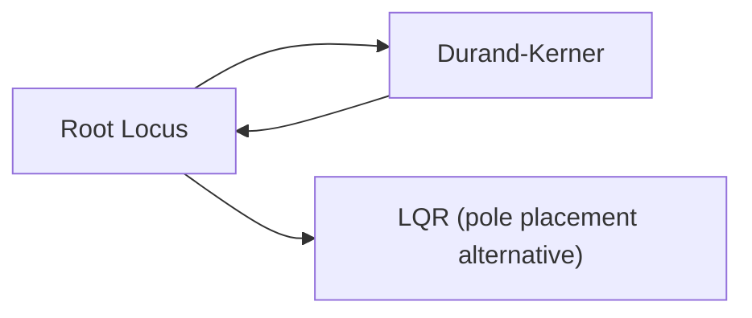

# Root Locus

## Overview & Motivation

When designing a feedback control system, a fundamental question is: *how do the closed-loop poles move as I change the loop gain?* The **root locus** answers this by plotting the trajectories of the closed-loop poles in the complex plane as a scalar gain $K$ varies from $K_{\min}$ to $K_{\max}$.

This visualization immediately reveals whether increasing gain will drive the system unstable (poles crossing into the right half-plane), where oscillatory modes appear (complex pole pairs), and which gain ranges produce acceptable damping. It is one of the oldest and most intuitive tools in classical control design.

## Mathematical Theory

### Closed-Loop Characteristic Equation

Given an open-loop transfer function:

$$G(s) = K \cdot \frac{N(s)}{D(s)}$$

the closed-loop characteristic equation (for unity feedback) is:

$$D(s) + K \cdot N(s) = 0$$

The **root locus** is the set of all roots of this equation as $K$ varies over $[K_{\min}, K_{\max}]$.

### Key Properties

- **Starting points** ($K \to 0$): Roots begin at the open-loop poles (roots of $D(s)$).
- **Ending points** ($K \to \infty$): Roots converge to the open-loop zeros (roots of $N(s)$) or diverge to infinity along asymptotes.
- **Number of branches:** Equal to the order of $D(s)$.
- **Symmetry:** For real-coefficient polynomials, complex roots always appear in conjugate pairs.

### Gain Sweep

The gain is swept logarithmically to provide uniform resolution across decades:

$$K_i = 10^{\,\log_{10}(K_{\min}) \;+\; \frac{i}{N-1}\left(\log_{10}(K_{\max}) - \log_{10}(K_{\min})\right)}$$

where $N$ is the number of gain steps and $i \in [0, N-1]$.

At each gain step, the roots of $D(s) + K_i \cdot N(s) = 0$ are found using the [Durand-Kerner](../solvers/DurandKerner.md) polynomial root-finder.

## Complexity Analysis

| Case | Time | Space | Notes |
|------|------|-------|-------|
| All | $O(N_g \cdot n^2 \cdot k)$ | $O(N_g \cdot n)$ | $N_g$ = gain steps, $n$ = polynomial order, $k$ = Durand-Kerner iterations per step |

**Why:** At each of the $N_g$ gain steps, a degree-$n$ polynomial is solved via Durand-Kerner, which performs $k$ iterations each costing $O(n^2)$ (evaluating the polynomial and computing the denominator product for all $n$ roots).

## Step-by-Step Walkthrough

**System:** $G(s) = K \cdot \frac{s + 1}{s(s + 2)}$, sweep $K$ from 0.01 to 10.

**Step 1 — Identify poles and zeros**

- Open-loop poles: $s = 0$, $s = -2$ (roots of $D(s) = s^2 + 2s$)
- Open-loop zero: $s = -1$ (root of $N(s) = s + 1$)

**Step 2 — Form characteristic polynomial at $K = 1$**

$$D(s) + K \cdot N(s) = s^2 + 2s + 1 \cdot (s + 1) = s^2 + 3s + 1$$

**Step 3 — Solve** using Durand-Kerner:

$$s = \frac{-3 \pm \sqrt{9 - 4}}{2} = \frac{-3 \pm \sqrt{5}}{2} \approx -0.382,\; -2.618$$

Both poles are real and negative → system is stable at $K = 1$.

**Step 4 — Repeat** for each gain step and plot all root positions in the complex plane.

```
Im(s)
  |
  |     × zero (-1)
--●-----×------●--> Re(s)
  0    -1     -2
 pole         pole
```

As $K$ increases: the two poles approach each other on the real axis, meet between 0 and −2, then split into a complex conjugate pair. One branch eventually converges to the zero at $s = -1$; the other diverges to $-\infty$.

## Pitfalls & Edge Cases

- **Strictly positive gains required** — the logarithmic sweep cannot handle $K \leq 0$. For negative feedback analysis, negate the numerator.
- **Proper transfer function assumed** — $\deg(D) \geq \deg(N)$. Improper transfer functions (more zeros than poles) are not supported.
- **Branch tracking ambiguity** — Durand-Kerner returns roots sorted by real part, not by branch identity. For smooth visualization, apply nearest-neighbor matching between consecutive gain steps.
- **Clustered or repeated roots** cause slower convergence in Durand-Kerner; increase the maximum iteration count if the locus appears jagged.

## Variants & Generalizations

| Variant | Key Difference |
|---------|---------------|
| **Complementary root locus** | Traces roots for $K < 0$ (positive feedback) |
| **Root contour** | Varies two or more parameters simultaneously |
| **Discrete root locus** | Same concept applied to $z$-domain polynomials for digital control |
| **Evans rules** | Analytical rules for sketching the root locus by hand (angle/magnitude criteria) |

## Applications

- **Gain selection** — Choosing the operating gain that meets damping and bandwidth specifications.
- **Compensator design** — Adding poles/zeros (lead/lag networks) and observing how the locus reshapes.
- **Stability analysis** — Determining the gain margin (gain at which the locus crosses the imaginary axis).
- **Educational tool** — Developing intuition about how feedback affects system dynamics.

## Connections to Other Algorithms



| Algorithm | Relationship |
|-----------|-------------|
| [Durand-Kerner](../solvers/DurandKerner.md) | Used at each gain step to find the roots of the characteristic polynomial |
| [LQR](../controllers/Lqr.md) | Alternative approach to pole placement — LQR optimizes a cost rather than manually selecting gain via root locus |

## References & Further Reading

- Evans, W.R., "Graphical Analysis of Control Systems", *Transactions of the AIEE*, 67(1), 1948.
- Franklin, G.F., Powell, J.D. and Emami-Naeini, A., *Feedback Control of Dynamic Systems*, 8th ed., Pearson, 2019 — Chapter 5.
- Ogata, K., *Modern Control Engineering*, 5th ed., Prentice Hall, 2010 — Chapter 6.
