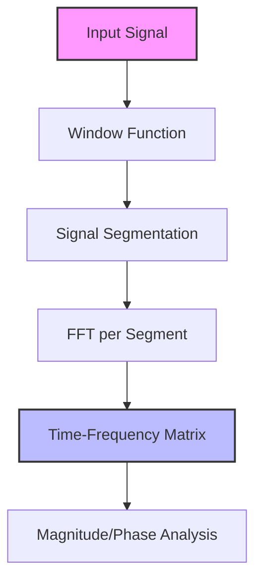

# Short Time Fourier Transform (STFT) Implementation Guide

## Process Overview

The following diagram illustrates the key steps in the STFT implementation:



The diagram shows the main processing steps:
1. Input signal is received
2. Window function is selected and applied
3. Signal is divided into overlapping segments
4. FFT is computed for each windowed segment
5. Results are organized in a time-frequency matrix
6. Magnitude and phase information can be extracted

## Mathematical Background

### Short Time Fourier Transform

The STFT extends the Fourier transform by analyzing how frequency content changes over time. For a discrete signal x[n], the STFT is defined as:

```
STFT{x[n]}(m,ω) = Σ[n=-∞ to ∞] x[n]w[n-m]e^(-jωn)
```

where:
- w[n] is the window function
- m is the time shift
- ω is the angular frequency

### Key Concepts

1. **Time-Frequency Resolution**:
   - Governed by the Uncertainty Principle
   - Δt * Δf ≥ 1/(4π)
   - Trade-off between time and frequency resolution

2. **Window Function**:
   - Localizes the analysis in time
   - Affects spectral leakage
   - Common choices: Hanning, Hamming, Blackman

3. **Overlap**:
   - Typically 50% or 75%
   - Improves time resolution
   - Reduces artifacts at window boundaries

## Implementation Details

### Class Structure

```cpp
template<
    typename QNumberType,
    std::size_t WindowSize,
    std::size_t MaxSignalSize,
    std::size_t HopSize,
    typename Fft,
    typename TwiddleFactor
>
class ShortTimeFourierTransform {
public:
    explicit ShortTimeFourierTransform(
        windowing::Window<QNumberType>& window);
        
    FreqTimeMatrix& Forward(const VectorReal& input);
    VectorReal& Inverse(const FreqTimeMatrix& input);
};
```

### Key Components

1. **Window Processing**:
   - Fixed window size (must be even)
   - Configurable hop size
   - Various window functions supported

2. **FFT Processing**:
   - Uses templated FFT implementation
   - Processes each windowed segment
   - Maintains phase information

3. **Matrix Organization**:
   - Time-frequency representation
   - Complex values (magnitude/phase)
   - Efficient storage layout

## Usage Guide

### Basic Usage

```cpp
// Define system parameters
constexpr std::size_t WindowSize = 1024;    // Window size
constexpr std::size_t HopSize = 512;        // 50% overlap
constexpr std::size_t MaxSignalSize = 8192; // Maximum signal length
using FloatType = float;

// Create window function
windowing::Hanning<FloatType> window;

// Create STFT analyzer
ShortTimeFourierTransform<
    FloatType,
    WindowSize,
    MaxSignalSize,
    HopSize,
    FastFourierTransformRadix2Impl<FloatType, WindowSize>,
    TwiddleFactorsImpl<FloatType, WindowSize/2>
> stft(window);

// Process signal
auto& timeFreqMatrix = stft.Forward(signal);

// Inverse transform
auto& reconstructedSignal = stft.Inverse(timeFreqMatrix);
```

### Example: Audio Analysis

```cpp
// Create analyzer with Hanning window
windowing::Hanning<float> window;

ShortTimeFourierTransform<float, 1024, 44100, 512, FFT, Twiddle> stft(
    window);

// Process audio frame
auto& spectrum = stft.Forward(audioFrame);

// Extract magnitude
for (std::size_t t = 0; t < spectrum.Columns(); ++t) {
    for (std::size_t f = 0; f < spectrum.Rows(); ++f) {
        float magnitude = std::abs(spectrum(f, t));
        float phase = std::arg(spectrum(f, t));
        // Process magnitude/phase...
    }
}
```

## Applications

1. **Audio Processing**:
   - Spectral effects (filtering, pitch shifting)
   - Speech analysis
   - Music transcription
   - Source separation

2. **Signal Analysis**:
   - Time-varying frequency content
   - Transient detection
   - Pattern recognition
   - Feature extraction

3. **Communications**:
   - Channel analysis
   - Modulation/demodulation
   - Interference detection

## Best Practices

1. **Window Selection**:
   - Hanning/Hamming for general purpose
   - Gaussian for minimum time-bandwidth product
   - Rectangle for pure tones or transients

2. **Parameter Selection**:
   - Window size: Powers of 2 for FFT efficiency
   - Overlap: 50-75% typical
   - Consider application requirements

3. **Performance Optimization**:
   - Pre-calculate window functions
   - Reuse FFT buffers
   - Use SIMD instructions where possible

## Limitations and Considerations

1. **Resolution Trade-offs**:
   - Time vs. frequency resolution
   - Window size affects both
   - Cannot simultaneously achieve arbitrary precision in both domains

2. **Edge Effects**:
   - Signal boundaries require attention
   - Zero-padding or extension methods
   - Window tapering importance

3. **Computational Complexity**:
   - O(N log N) per segment
   - Memory requirements for matrix storage
   - Real-time constraints consideration

## Future Improvements

1. Possible extensions:
   - Variable window size support
   - Multi-resolution analysis
   - Adaptive windowing
   - GPU acceleration
   - Wavelet transform integration

2. Optimizations:
   - Vectorized processing
   - Memory layout optimization
   - Real-time processing support
   - Parallel computation

## Error Handling

1. Static assertions verify:
   - Valid numeric types
   - Even window size
   - Valid hop size
   - FFT compatibility

2. Runtime checks:
   - Input signal validity
   - Buffer overflow prevention
   - Numerical stability
   - Memory constraints
