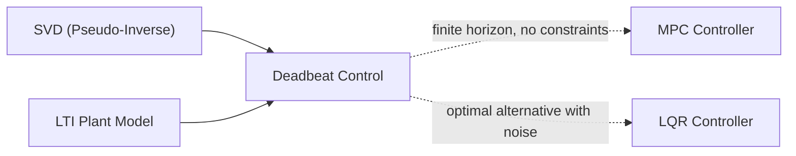

# Deadbeat Control

## Overview & Motivation

In discrete-time control, most feedback laws drive the plant asymptotically toward a target — the state error decays exponentially but never reaches zero in finite time. **Deadbeat control** takes the opposite approach: given a linear, time-invariant plant and a desired terminal state, it computes a sequence of inputs that drives the state to the target *exactly* in a fixed, finite number of samples.

This property is valuable whenever settling time is a hard constraint. A motor current-loop running at 10 kHz, a grid-tied inverter that must complete a transient in two PWM cycles, or a precision positioning stage that cannot overshoot — all benefit from the guarantee that the error is identically zero after $N$ steps, rather than merely small.

The runtime cost of a deadbeat controller is identical to LQR: a single matrix-vector multiply per sample. The extra cost (gain computation via the reachability matrix and pseudo-inverse) is paid once at initialization.

## Mathematical Theory

### Discrete-Time State-Space System

$$x[k+1] = Ax[k] + Bu[k]$$

where $x \in \mathbb{R}^n$ is the state, $u \in \mathbb{R}^m$ is the control input, $A \in \mathbb{R}^{n \times n}$ is the state-transition matrix, and $B \in \mathbb{R}^{n \times m}$ is the input matrix.

### N-Step Reachability

After $N$ steps, applying inputs $u[0], u[1], \ldots, u[N-1]$ from initial state $x[0]$, the state satisfies:

$$x[N] = A^N x[0] + \Gamma_N \begin{bmatrix} u[0] \\ u[1] \\ \vdots \\ u[N-1] \end{bmatrix}$$

where the **reachability matrix** is:

$$\Gamma_N = \begin{bmatrix} A^{N-1}B & A^{N-2}B & \cdots & AB & B \end{bmatrix} \in \mathbb{R}^{n \times Nm}$$

The system is **N-step reachable** to target $r$ from $x[0]$ if and only if:

$$r - A^N x[0] \in \text{range}(\Gamma_N)$$

### Minimum-Norm Input Sequence

When $\Gamma_N$ has full row rank (i.e., $n \leq Nm$ and the plant is completely reachable in $N$ steps), the minimum-Euclidean-norm input sequence that achieves $x[N] = r$ is:

$$\mathbf{u}^* = \Gamma_N^+ \left( r - A^N x[0] \right)$$

where $\Gamma_N^+ = \Gamma_N^T (\Gamma_N \Gamma_N^T)^{-1}$ is the Moore-Penrose pseudo-inverse, computed here via Singular Value Decomposition for numerical robustness.

### Precomputed Gain Matrices

Only the **first** $m$ elements of $\mathbf{u}^*$ are applied at each sample (the remaining elements are recomputed at the next step). Let $\Pi_0$ denote the operator that extracts the first $m$ rows of a matrix. Define:

$$K_r = \Pi_0 \left(\Gamma_N^+\right) \in \mathbb{R}^{m \times n}$$

$$K_x = K_r \cdot A^N \in \mathbb{R}^{m \times n}$$

The resulting **deadbeat control law** is:

$$u[k] = K_r \, r - K_x \, x[k]$$

This is a constant-gain affine state-feedback law that can be evaluated with two matrix-vector multiplies per sample, identical in cost to LQR.

### Convergence Guarantee

Under this law, the state satisfies $x[k+N] = r$ exactly (in exact arithmetic) for any initial condition $x[k]$ reachable to $r$ in $N$ steps. The closed-loop poles are all placed at the origin — the system has a finite settling time of exactly $N$ samples.

## Complexity Analysis

| Phase                    | Time                | Space               | Notes                                                             |
|--------------------------|---------------------|---------------------|-------------------------------------------------------------------|
| Build $\Gamma_N$ (init)  | $O(N \cdot n^2 m)$  | $O(n \cdot Nm)$     | $N$ matrix-matrix multiplies of size $n \times n$ by $n \times m$ |
| SVD of $\Gamma_N$ (init) | $O(n^2 \cdot Nm)$   | $O(n \cdot Nm)$     | Golub-Kahan bidiagonalization + diagonalization                   |
| Compute $A^N$ (init)     | $O(N \cdot n^3)$    | $O(n^2)$            | $N$ matrix-matrix multiplies                                      |
| Control step (online)    | $O(n \cdot m)$      | $O(n \cdot m)$      | Two matrix-vector multiplies                                      |

The initialization cost is negligible for the embedded use case: it is incurred once, and the gains are stored as constant matrices on the stack.

## Step-by-Step Walkthrough

**System:** Double integrator — position and velocity driven by acceleration input, discretized at $\Delta t = 0.1\,\text{s}$:

$$A = \begin{bmatrix} 1 & 0.1 \\ 0 & 1 \end{bmatrix}, \quad B = \begin{bmatrix} 0.005 \\ 0.1 \end{bmatrix}$$

**Goal:** Drive $x[2] = [5, 0]^T$ from $x[0] = [0, 0]^T$ in $N = 2$ steps.

**Step 1 — Build $\Gamma_2$:**

$$\Gamma_2 = \begin{bmatrix} AB & B \end{bmatrix} = \begin{bmatrix} 0.015 & 0.005 \\ 0.1 & 0.1 \end{bmatrix}$$

**Step 2 — Compute $\Gamma_2^{-1}$** (square and invertible here):

$$\det(\Gamma_2) = 0.015 \times 0.1 - 0.005 \times 0.1 = 0.001$$

$$\Gamma_2^{-1} = \begin{bmatrix} 100 & -5 \\ -100 & 15 \end{bmatrix}$$

**Step 3 — Extract $K_r$** (first row of $\Gamma_2^{-1}$):

$$K_r = \begin{bmatrix} 100 & -5 \end{bmatrix}$$

**Step 4 — Compute $A^2$:**

$$A^2 = \begin{bmatrix} 1 & 0.2 \\ 0 & 1 \end{bmatrix}$$

**Step 5 — Compute $K_x = K_r A^2$:**

$$K_x = \begin{bmatrix} 100 & -5 \end{bmatrix} \begin{bmatrix} 1 & 0.2 \\ 0 & 1 \end{bmatrix} = \begin{bmatrix} 100 & 15 \end{bmatrix}$$

**Step 6 — Apply control law** ($r = [5, 0]^T$, $x[0] = [0, 0]^T$):

$$u[0] = K_r r - K_x x[0] = 500 - 0 = 500$$

$$x[1] = Ax[0] + Bu[0] = [2.5,\; 50]^T$$

$$u[1] = 500 - K_x [2.5, 50]^T = 500 - (250 + 750) = -500$$

$$x[2] = Ax[1] + Bu[1] = [2.5 + 5,\; 50] + [-2.5,\; -50] = [5,\; 0]^T \checkmark$$

## Pitfalls & Edge Cases

- **Non-controllable plants.** If $\Gamma_N$ does not have full row rank, exact deadbeat behavior is impossible for all initial conditions. The SVD-based rank check at initialization detects this; an assertion fires rather than silently producing a wrong gain.
- **Noise amplification.** Deadbeat control inverts the reachability matrix, which can have a large condition number. For plants with near-singular $\Gamma_N$, the gains become very large, amplifying sensor noise and causing saturation in practice. A larger $N$ or a minimum-energy variant (LQR) is preferable in noisy environments.
- **Actuator saturation.** The computed input $u[k]$ can be large, particularly for large initial errors or ill-conditioned plants. Saturation breaks the exact-convergence guarantee; rate limiting or constraint handling (as in MPC) is needed.
- **Stability after convergence.** Once $x[k] = r$, the deadbeat law produces $u = 0$ (for regulators) or a constant value (for trackers). If the plant is open-loop unstable, any small perturbation will cause the state to diverge. An outer loop or hybrid strategy (switch to LQR after convergence) is required for robustly unstable plants.
- **Choice of $N$.** Selecting $N < $ the controllability index of $(A, B)$ makes exact deadbeat impossible. Selecting $N$ much larger than necessary increases computational cost at initialization without improving the online cost.

## Variants & Generalizations

| Variant                         | Key Difference                                                                                          |
|---------------------------------|---------------------------------------------------------------------------------------------------------|
| **1-step deadbeat ($N = 1$)**   | Requires $B$ to be square and invertible; gain is simply $B^{-1}$ and $B^{-1}A$                        |
| **N-step deadbeat ($N > 1$)**   | Handles systems where $m < n$; uses the reachability matrix pseudo-inverse                              |
| **Receding-horizon deadbeat**   | Recomputes the full $N$-step sequence at every sample (equivalent to unconstrained MPC with finite horizon) |
| **Robust deadbeat**             | Adds structured uncertainty to $A$, $B$ and minimizes worst-case settling time                          |
| **Output deadbeat**             | Drives the output $y = Cx$ to target rather than the full state; requires an observer                   |

## Applications

- **Current-loop control in motor drives** — Deadbeat current control in a synchronous machine sets the phase current to its reference value within one or two PWM periods, maximizing dynamic torque response.
- **Voltage-mode DC-DC converters** — Finite-time output-voltage regulation avoids the underdamped transients typical of linear compensators.
- **Grid-tied inverter synchronization** — Forcing the output current waveform to track the grid reference within a fixed number of samples, critical for power quality compliance.
- **Precision positioning stages** — In lithography or atomic-force microscopy, exact settling in $N$ steps avoids time wasted waiting for an exponential tail.
- **Repetitive control** — Deadbeat strategies inside a repetitive loop cancel periodic disturbances in exactly one period.

## Connections to Other Algorithms

| Algorithm                                                            | Relationship                                                                                   |
|----------------------------------------------------------------------|------------------------------------------------------------------------------------------------|
| [SVD Solver](../solvers/SingularValueDecomposition.md)               | Used to compute the pseudo-inverse of $\Gamma_N$ during gain initialization                    |
| [LQR Controller](Lqr.md)                                             | LQR is the optimal alternative when measurement noise is present; places poles away from origin |
| [MPC Controller](Mpc.md)                                             | Deadbeat is MPC with a finite horizon equal to $N$ and no inequality constraints               |
| [LTI Plant Model](LinearTimeInvariant.md)                            | Provides $(A, B)$ matrices used to build $\Gamma_N$ and compute $A^N$                         |

## References & Further Reading

- Åström, K.J. and Wittenmark, B., *Computer Controlled Systems: Theory and Design*, 3rd ed., Prentice Hall, 1997 — Chapter 4 (Deadbeat Design).
- Franklin, G.F., Powell, J.D. and Emami-Naeini, A., *Feedback Control of Dynamic Systems*, 8th ed., Pearson, 2019 — Chapter 8.
- Goodwin, G.C., Graebe, S.F. and Salgado, M.E., *Control System Design*, Prentice Hall, 2001 — Chapter 17.
- Kazmierkowski, M.P., Krishnan, R. and Blaabjerg, F., *Control in Power Electronics: Selected Problems*, Academic Press, 2002 — Section on deadbeat current control.
