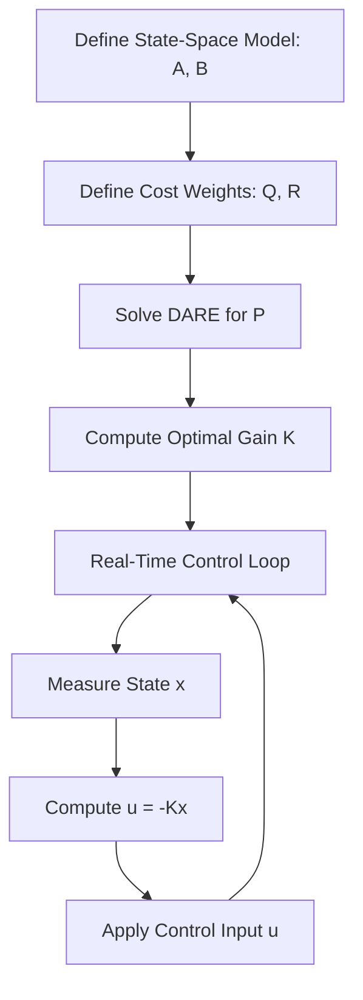

# LQR Controller Implementation Guide

## Process Overview



## Mathematical Background

### The Linear Quadratic Regulator

The Linear Quadratic Regulator (LQR) is an optimal state-feedback controller for linear systems. It minimizes a quadratic cost function that balances state regulation against control effort.

Given a discrete-time linear system:

```
x[k+1] = A * x[k] + B * u[k]
```

where:
- `x[k]` is the state vector (n × 1)
- `u[k]` is the control input vector (m × 1)
- `A` is the state transition matrix (n × n)
- `B` is the input matrix (n × m)

The LQR minimizes the infinite-horizon cost function:

```
J = Σ (x[k]' Q x[k] + u[k]' R u[k])   for k = 0 to ∞
```

where:
- `Q` is the state weighting matrix (n × n, positive semi-definite)
- `R` is the input weighting matrix (m × m, positive definite)

### Discrete Algebraic Riccati Equation (DARE)

The optimal gain is derived from the solution P of the DARE:

```
P = A' P A - A' P B (R + B' P B)^(-1) B' P A + Q
```

The optimal state-feedback gain K is:

```
K = (R + B' P B)^(-1) B' P A
```

The optimal control law is then:

```
u[k] = -K * x[k]
```

This controller is guaranteed to stabilize the system when (A, B) is stabilizable and (A, C) is detectable (where Q = C'C).

### DARE Iterative Solution

The DARE is solved iteratively starting from P₀ = Q:

1. Compute S = R + B'PB
2. Solve S * K_part = B'PA for K_part (via Gaussian elimination)
3. Update P = A'PA - A'PB * K_part + Q
4. Check convergence: ||P_new - P_old|| < tolerance
5. Repeat until converged or max iterations reached

## Usage Guide

### Basic Usage

```cpp
#include "numerical/controllers/implementations/Lqr.hpp"

constexpr float dt = 0.01f;

math::SquareMatrix<float, 2> A{
    { 1.0f, dt },
    { 0.0f, 1.0f }
};

math::Matrix<float, 2, 1> B{
    { 0.5f * dt * dt },
    { dt }
};

math::SquareMatrix<float, 2> Q{
    { 100.0f, 0.0f },
    { 0.0f, 1.0f }
};

math::SquareMatrix<float, 1> R{ { 1.0f } };

controllers::Lqr<float, 2, 1> lqr(A, B, Q, R);

math::Vector<float, 2> state{ { currentPosition }, { currentVelocity } };
auto u = lqr.ComputeControl(state);
applyForce(u.at(0, 0));
```

### Pre-computed Gain (Embedded Targets)

For resource-constrained microcontrollers, compute K offline (e.g., in MATLAB with `dlqr`) and use the pre-computed gain constructor:

```cpp
math::Matrix<float, 1, 2> K{
    { 10.378f, 4.063f }
};

controllers::Lqr<float, 2, 1> lqr(K);

auto u = lqr.ComputeControl(state);
```

This avoids the DARE solve entirely on the target, reducing flash and RAM usage.

### Q/R Tuning Guidelines

**Bryson's Rule** provides a starting point for weight selection:

```
Q[i][i] = 1 / (maximum acceptable value of state i)²
R[j][j] = 1 / (maximum acceptable value of input j)²
```

**Tuning Heuristics:**
- Increase `Q[i][i]` to reduce steady-state error of state i (more aggressive)
- Increase `R[j][j]` to reduce control effort on input j (more conservative)
- The ratio Q/R matters more than absolute values
- Start with Q = I, R = I and adjust from there
