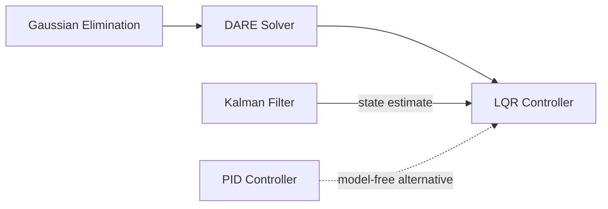

# LQR Controller (Linear Quadratic Regulator)

## Overview & Motivation

When a state-space model of the plant is available, the **Linear Quadratic Regulator** provides the mathematically *optimal* state-feedback gain. Instead of manually tuning three knobs (as with PID), LQR asks a more principled question: *given how much I care about state deviation versus control effort, what is the cheapest way to drive the state to zero?*

The answer is a constant gain matrix $K$ such that the control law $u[k] = -Kx[k]$ minimizes an infinite-horizon quadratic cost. The elegance of LQR is that this problem has a **closed-form solution** through the Discrete Algebraic Riccati Equation (DARE).

For embedded systems, the gain $K$ can be computed offline and stored as a constant — the runtime cost is then a single matrix-vector multiplication per control step.

## Mathematical Theory

### Discrete-Time State-Space System

$$x[k+1] = Ax[k] + Bu[k]$$

where $x \in \mathbb{R}^n$ is the state, $u \in \mathbb{R}^m$ is the control input, $A$ is the state transition matrix, and $B$ is the input matrix.

### Cost Function

The LQR minimizes the infinite-horizon quadratic cost:

$$J = \sum_{k=0}^{\infty} \left( x[k]^T Q \, x[k] + u[k]^T R \, u[k] \right)$$

where:
- $Q \succeq 0$ (positive semi-definite) penalizes state deviation.
- $R \succ 0$ (positive definite) penalizes control effort.

### Optimal Gain via DARE

The solution requires finding the matrix $P$ that satisfies the **Discrete Algebraic Riccati Equation**:

$$P = A^T P A - A^T P B \left(R + B^T P B\right)^{-1} B^T P A + Q$$

The optimal gain is then:

$$K = \left(R + B^T P B\right)^{-1} B^T P A$$

and the optimal control law is $u[k] = -Kx[k]$.

### Existence and Uniqueness

A unique stabilizing solution $P$ exists when:
1. $(A, B)$ is **stabilizable** (all unstable modes are controllable).
2. $(A, C)$ is **detectable** (where $Q = C^T C$).

### Bryson's Rule (Initial Weight Selection)

$$Q_{ii} = \frac{1}{(\text{max acceptable } x_i)^2}, \qquad R_{jj} = \frac{1}{(\text{max acceptable } u_j)^2}$$

## Complexity Analysis

| Phase                 | Time             | Space          | Notes                                                         |
|-----------------------|------------------|----------------|---------------------------------------------------------------|
| DARE solve (offline)  | $O(I \cdot n^3)$ | $O(n^2)$       | $I$ iterations, each involving $n \times n$ matrix operations |
| Control step (online) | $O(n \cdot m)$   | $O(n \cdot m)$ | Single matrix-vector multiply $u = -Kx$                       |

The DARE iteration is the expensive part, but it is done **once** (offline or at initialization). The per-sample cost is just a matrix-vector product.

## Step-by-Step Walkthrough

**System:** Double integrator with $\Delta t = 0.01$

$$A = \begin{bmatrix} 1 & 0.01 \\ 0 & 1 \end{bmatrix}, \quad B = \begin{bmatrix} 0.00005 \\ 0.01 \end{bmatrix}$$

$$Q = \begin{bmatrix} 100 & 0 \\ 0 & 1 \end{bmatrix}, \quad R = [1]$$

**Step 1 — Initialize** $P_0 = Q$

**Step 2 — DARE iteration** (showing first iteration):

1. $S = R + B^T P_0 B = 1 + [0.00005\; 0.01] \begin{bmatrix}100 & 0\\0 & 1\end{bmatrix} \begin{bmatrix}0.00005\\0.01\end{bmatrix} = 1.0001$
2. Solve $S \cdot K_{\text{part}} = B^T P_0 A$ via Gaussian elimination
3. Update $P_1 = A^T P_0 A - A^T P_0 B \cdot K_{\text{part}} + Q$
4. Check convergence: $\|P_1 - P_0\|$

**Step 3 — Repeat** until $\|P_{k+1} - P_k\| < \varepsilon$ (typically 10–30 iterations).

**Step 4 — Extract gain** $K = (R + B^T P B)^{-1} B^T P A$

**Runtime:** $u[k] = -K x[k]$ — a $1 \times 2$ times $2 \times 1$ multiply per sample.

## Pitfalls & Edge Cases

- **Uncontrollable modes.** If $(A, B)$ is not stabilizable, the DARE has no stabilizing solution. Verify controllability before calling the solver.
- **Ill-conditioned $R$.** If $R$ is near-singular, the inversion in $K$ becomes numerically unstable. Ensure $R$ is strictly positive definite.
- **Q/R scaling.** Only the *ratio* of $Q$ to $R$ matters. Scaling both by the same factor does not change $K$.
- **Full state required.** LQR assumes all states are measured. If only partial measurements are available, combine LQR with a [Kalman Filter](../filters/active/KalmanFilter.md) to form an LQG controller.
- **Fixed-point limitations.** The DARE involves matrix inversions and multiplications that can overflow Q15/Q31 ranges. Prefer floating-point for the offline solve; use the pre-computed $K$ constructor for fixed-point runtime.

## Variants & Generalizations

| Variant                             | Key Difference                                                                            |
|-------------------------------------|-------------------------------------------------------------------------------------------|
| **Continuous-time LQR**             | Solves the Continuous ARE instead of DARE; used for continuous-time plant models          |
| **LQG (Linear Quadratic Gaussian)** | Combines LQR with Kalman filter for systems with noisy, partial observations              |
| **LQR with integral action**        | Augments the state with integral of tracking error to eliminate steady-state offset       |
| **Finite-horizon LQR**              | Time-varying gain $K[k]$ for finite-duration tasks                                        |
| **Robust LQR (H∞)**                 | Accounts for model uncertainty by optimizing the worst-case cost                          |
| **Pre-computed gain**               | $K$ is computed offline (e.g., in MATLAB with `dlqr`) and hard-coded for embedded targets |

## Applications

- **Cart-pole balancing** — Classic underactuated system; LQR linearized around the upright equilibrium.
- **Quadrotor attitude control** — Regulating roll, pitch, yaw with motor thrust as input.
- **Satellite station-keeping** — Maintaining orbital position with minimal thruster fuel.
- **Industrial process control** — Multi-input multi-output (MIMO) systems where PID struggles.
- **Autonomous vehicles** — Lateral and longitudinal control using a linearized vehicle model.

## Connections to Other Algorithms

| Algorithm                                                     | Relationship                                                                  |
|---------------------------------------------------------------|-------------------------------------------------------------------------------|
| [DARE Solver](../solvers/DiscreteAlgebraicRiccatiEquation.md) | Computes the cost-to-go matrix $P$ from which $K$ is derived                  |
| [Gaussian Elimination](../solvers/GaussianElimination.md)     | Used inside DARE iteration to solve linear sub-systems                        |
| [Kalman Filter](../filters/active/KalmanFilter.md)            | Provides state estimates when direct measurement is unavailable (forming LQG) |
| [PID Controller](Pid.md)                                      | Model-free alternative; simpler to deploy but not optimal                     |

## References & Further Reading

- Anderson, B.D.O. and Moore, J.B., *Optimal Control: Linear Quadratic Methods*, Prentice Hall, 1990.
- Franklin, G.F., Powell, J.D. and Emami-Naeini, A., *Feedback Control of Dynamic Systems*, 8th ed., Pearson, 2019 — Chapter 9.
- Bryson, A.E. and Ho, Y.-C., *Applied Optimal Control*, Hemisphere, 1975.
