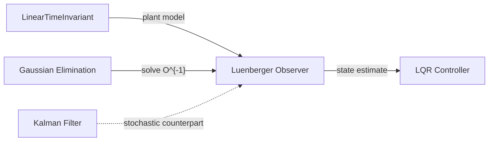

# Luenberger Observer

## Overview & Motivation

State-feedback controllers require the complete state vector, but physical systems typically expose only a few measured outputs. The **Luenberger observer** reconstructs unmeasured states from input and output measurements using a copy of the plant model continuously corrected by the difference between predicted and actual outputs.

Unlike the Kalman filter, the Luenberger observer is deterministic — it requires no noise statistics and no covariance propagation. For embedded systems with well-characterized models and deterministic environments, it offers the same state reconstruction at a fraction of the computational cost.

## Mathematical Theory

### Discrete-Time State-Space System

$$x[k+1] = A x[k] + B u[k]$$
$$y[k] = C x[k] + D u[k]$$

### Observer Update Law

The observer maintains a state estimate $\hat{x}[k]$ updated by:

$$\hat{y}[k] = C \hat{x}[k] + D u[k]$$
$$\hat{x}[k+1] = A \hat{x}[k] + B u[k] + L (y[k] - \hat{y}[k])$$

The term $y[k] - \hat{y}[k]$ is the **innovation** (output prediction error). The gain matrix $L \in \mathbb{R}^{n \times p}$ scales how aggressively the estimate is corrected.

### Error Dynamics

Defining the estimation error $e[k] = x[k] - \hat{x}[k]$:

$$e[k+1] = (A - LC)\, e[k]$$

The error decays to zero if and only if all eigenvalues of $(A - LC)$ lie strictly inside the unit circle. Choosing $L$ to place those eigenvalues at desired locations is the **pole placement** problem for observers.

### Ackermann's Formula (SISO Output)

For single-output systems ($p = 1$), the observer gain that places eigenvalues of $(A - LC)$ at $\{\mu_1, \dots, \mu_n\}$ is:

$$L = \varphi_d(A)\, \mathcal{O}^{-1}\, e_n$$

where:
- $\varphi_d(z) = \prod_{i=1}^n (z - \mu_i)$ is the desired characteristic polynomial, evaluated at $A$
- $\mathcal{O} = \begin{bmatrix} C \\ CA \\ \vdots \\ CA^{n-1} \end{bmatrix}$ is the observability matrix
- $e_n = [0, \dots, 0, 1]^T$ is the last standard basis vector

This is the dual of Ackermann's controller placement formula.

### Observability Condition

Ackermann's formula requires $\mathcal{O}$ to be invertible, which holds if and only if the pair $(A, C)$ is **observable**: every state affects the output through some combination of shifts. An unobservable pair makes the formula degenerate — the gain cannot force arbitrary error convergence.

## Complexity Analysis

| Phase              | Time           | Space     | Notes                                               |
|--------------------|----------------|-----------|-----------------------------------------------------|
| Design (Ackermann) | $O(n^3)$       | $O(n^2)$  | Observability matrix build + linear solve           |
| Update (per step)  | $O(n^2 + np)$  | $O(n^2)$  | Matrix-vector products; dominant cost is $A\hat{x}$ |

The design phase is offline. The real-time cost per sample is dominated by the $n \times n$ state-transition multiply.

## Step-by-Step Walkthrough

**System:** Double integrator, $n=2$, $p=1$, desired observer poles $\{\mu_1, \mu_2\} = \{0.2,\, 0.3\}$

$$A = \begin{bmatrix}1 & 1\\0 & 1\end{bmatrix}, \quad B = \begin{bmatrix}0\\1\end{bmatrix}, \quad C = \begin{bmatrix}1 & 0\end{bmatrix}$$

**Step 1 — Build observability matrix:**

$$\mathcal{O} = \begin{bmatrix}C\\CA\end{bmatrix} = \begin{bmatrix}1 & 0\\1 & 1\end{bmatrix}$$

**Step 2 — Evaluate desired polynomial at $A$:**

$$\varphi_d(z) = (z - 0.2)(z - 0.3) = z^2 - 0.5z + 0.06$$

$$\varphi_d(A) = A^2 - 0.5A + 0.06I = \begin{bmatrix}0.56 & 1.5\\0 & 0.56\end{bmatrix}$$

**Step 3 — Solve for gain:**

$$\mathcal{O}^{-1} = \begin{bmatrix}1 & 0\\-1 & 1\end{bmatrix}, \quad \mathcal{O}^{-1} e_2 = \begin{bmatrix}0\\1\end{bmatrix}$$

$$L = \varphi_d(A) \cdot \begin{bmatrix}0\\1\end{bmatrix} = \begin{bmatrix}1.5\\0.56\end{bmatrix}$$

**Verification:** eigenvalues of $A - LC = \begin{bmatrix}-0.5 & 1\\-0.56 & 1\end{bmatrix}$ are $\{0.2, 0.3\}$. ✓

## Pitfalls & Edge Cases

- **Unobservable pair.** If $\mathcal{O}$ is rank-deficient, the linear solve in Ackermann's formula fails. Verify observability with a rank test before design.
- **Pole placement too aggressive.** Observer poles much faster than the controller poles amplify measurement noise, since every output error is fed back through $L$. Typical practice: observer poles 2–5× faster than controller poles.
- **Deadbeat design** (all poles at zero) converges in exactly $n$ steps but maximizes noise sensitivity and requires large $L$ entries, risking numerical overflow in fixed-point.
- **MIMO output limitation.** Ackermann's formula applies to SISO output ($p=1$). Multi-output systems require alternative pole-placement methods (e.g., Brogan's formula or numerical optimization).
- **Model mismatch.** If the observer plant differs from the true plant, the error dynamics no longer satisfy $e[k+1] = (A-LC)e[k]$ exactly; a bounded steady-state error results rather than zero convergence.

## Variants & Generalizations

| Variant                         | Key Difference                                                                                 |
|---------------------------------|-----------------------------------------------------------------------------------------------|
| **Kalman Filter**               | Stochastic design — minimizes covariance rather than placing poles; handles noise statistics  |
| **Extended Luenberger Observer**| Linearizes a nonlinear plant around the estimate for quasi-linear operation                   |
| **Unknown-Input Observer**      | Estimates states in the presence of unmeasured disturbances                                   |
| **Reduced-Order Observer**      | Estimates only the unmeasured states, using measured outputs directly                         |
| **Continuous-time observer**    | Uses $\dot{\hat{x}} = A\hat{x} + Bu + L(y - C\hat{x})$; same structure, continuous pole placement |

## Applications

- **Motor control** — estimating velocity and back-EMF from position and current sensors.
- **Automotive suspension** — reconstructing unsprung mass velocity from chassis accelerometers.
- **Satellite attitude estimation** — inferring angular rates from gyros and star trackers.
- **Observer-based compensator** — pairing with LQR to form the deterministic equivalent of LQG when noise statistics are unavailable.

## Connections to Other Algorithms

| Algorithm                                                      | Relationship                                                              |
|----------------------------------------------------------------|---------------------------------------------------------------------------|
| [Linear Time-Invariant Model](LinearTimeInvariant.md)          | Supplies the $(A, B, C, D)$ matrices used in both design and update steps |
| [Gaussian Elimination](../solvers/GaussianElimination.md)      | Solves $\mathcal{O} x = e_n$ inside Ackermann's formula                   |
| [LQR Controller](Lqr.md)                                       | Primary consumer of the observer's state estimate                         |
| [Kalman Filter](../filters/active/KalmanFilter.md)             | Stochastic counterpart; adds noise covariance propagation                 |

## References & Further Reading

- Luenberger, D.G., "An Introduction to Observers," *IEEE Transactions on Automatic Control*, 16(6), 1971.
- Franklin, G.F., Powell, J.D. and Emami-Naeini, A., *Feedback Control of Dynamic Systems*, 8th ed., Pearson, 2019 — Chapter 7.
- Chen, C.-T., *Linear System Theory and Design*, 4th ed., Oxford University Press, 2013 — Chapter 8.
