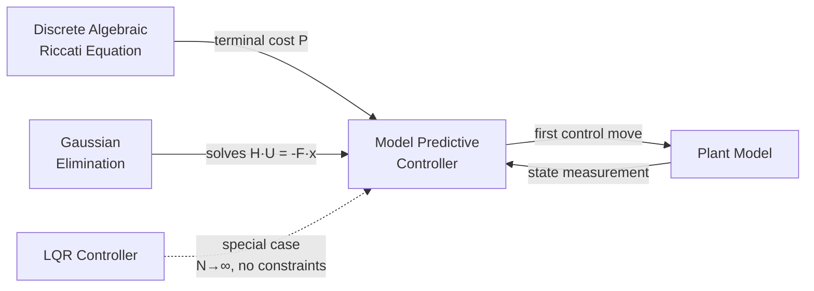

# Model Predictive Controller (MPC)

## Overview & Motivation

Model Predictive Control (MPC) is a receding-horizon optimal control strategy that computes control inputs by solving a finite-horizon optimization problem at each time step. Unlike LQR, which applies a fixed gain computed offline, MPC re-solves the optimization online, enabling it to handle constraints on control inputs directly.

At each sample instant, MPC predicts the future system trajectory over a prediction horizon $N_p$, optimizes a sequence of control moves over a control horizon $N_c \leq N_p$, applies only the first control move, and repeats at the next step. This receding-horizon approach provides feedback and robustness to disturbances.

**Key advantages over LQR:**
- Explicit handling of input constraints (actuator limits)
- Preview and anticipation of future reference changes
- Tunable trade-off between horizon length and computational cost

**When to use MPC:**
- Systems with actuator saturation or operational limits
- Multi-input multi-output (MIMO) systems requiring coordinated control
- Applications where the computational budget allows online optimization (typically $N_c \cdot m \leq 20$)

## Mathematical Theory

### Prerequisites

- Discrete-time linear state-space model: $x_{k+1} = Ax_k + Bu_k$
- Quadratic cost weighting matrices $Q \succeq 0$ (state), $R \succ 0$ (control)
- Optional terminal cost matrix $P \succeq 0$ (typically from DARE)

### Core Definitions

**Cost function** over prediction horizon $N_p$ with control horizon $N_c$:

$$J = \sum_{k=0}^{N_p-1} x_k^T Q\, x_k + \sum_{k=0}^{N_c-1} u_k^T R\, u_k + x_{N_p}^T P\, x_{N_p}$$

For $k \geq N_c$, the control input is held at $u_{N_c-1}$ or zero (our implementation sets it to zero beyond $N_c$).

### Prediction Matrices

The future state trajectory can be expressed as:

$$\mathbf{X} = \Psi\, x_0 + \Theta\, \mathbf{U}$$

where $\mathbf{X} = [x_1^T, x_2^T, \ldots, x_{N_p}^T]^T$ and $\mathbf{U} = [u_0^T, u_1^T, \ldots, u_{N_c-1}^T]^T$.

**State propagation matrix** $\Psi$ ($N_p n \times n$):

$$\Psi = \begin{bmatrix} A \\ A^2 \\ \vdots \\ A^{N_p} \end{bmatrix}$$

**Control-to-state matrix** $\Theta$ ($N_p n \times N_c m$):

$$\Theta = \begin{bmatrix} B & 0 & \cdots & 0 \\ AB & B & \cdots & 0 \\ A^2B & AB & \cdots & 0 \\ \vdots & \vdots & \ddots & \vdots \\ A^{N_p-1}B & A^{N_p-2}B & \cdots & A^{N_p-N_c}B \end{bmatrix}$$

### QP Formulation

Substituting predictions into the cost yields a quadratic program in $\mathbf{U}$:

$$J = \mathbf{U}^T H\, \mathbf{U} + 2\, x_0^T F^T \mathbf{U} + \text{const}$$

where:

$$H = \Theta^T \bar{Q}\, \Theta + \bar{R}$$
$$F = \Theta^T \bar{Q}\, \Psi$$

$\bar{Q}$ is block-diagonal with $Q$ on the first $N_p - 1$ blocks and $P$ on the last block. $\bar{R}$ is block-diagonal with $R$ repeated $N_c$ times.

### Unconstrained Solution

Setting $\nabla_{\mathbf{U}} J = 0$:

$$\mathbf{U}^* = -H^{-1} F\, x_0$$

Solved via Gaussian elimination ($H\, \mathbf{U}^* = -F\, x_0$) rather than explicit matrix inversion.

### Box Constraints

For control input constraints $u_{\min} \leq u_k \leq u_{\max}$, a simple projected approach clamps each element of the unconstrained solution. This is a first-order approximation; for tight constraints or state constraints, a full QP solver would be required.

## Complexity Analysis

| Phase    | Time                 | Space                              | Notes                                              |
|----------|----------------------|------------------------------------|----------------------------------------------------|
| Offline  | $O(N_p^2 \cdot n^3)$ | $O((N_c m)^2 + N_p n \cdot N_c m)$ | Prediction matrices, Hessian, gradient precomputed |
| Online   | $O((N_c m)^3)$       | $O((N_c m)^2)$                     | Gaussian elimination to solve $H\mathbf{U}=-Fx$    |
| Per step | $O(N_c m \cdot n)$   | $O(N_c m)$                         | Matrix-vector product $Fx$ + constraint clamping   |

For typical embedded use ($n=2, m=1, N_c=10$): the online solve is a $10 \times 10$ linear system, well within real-time budgets.

## Step-by-Step Walkthrough

**System:** Double integrator with $dt = 0.1$ s

$$A = \begin{bmatrix} 1 & 0.1 \\ 0 & 1 \end{bmatrix}, \quad B = \begin{bmatrix} 0.005 \\ 0.1 \end{bmatrix}$$

$$Q = \begin{bmatrix} 10 & 0 \\ 0 & 1 \end{bmatrix}, \quad R = [0.1], \quad N_p = N_c = 3$$

**Step 1 — Build $\Psi$:**

$$\Psi = \begin{bmatrix} A \\ A^2 \\ A^3 \end{bmatrix} = \begin{bmatrix} 1 & 0.1 \\ 0 & 1 \\ 1 & 0.2 \\ 0 & 1 \\ 1 & 0.3 \\ 0 & 1 \end{bmatrix}$$

**Step 2 — Build $\Theta$:**

$$\Theta = \begin{bmatrix} 0.005 & 0 & 0 \\ 0.1 & 0 & 0 \\ 0.015 & 0.005 & 0 \\ 0.2 & 0.1 & 0 \\ 0.03 & 0.015 & 0.005 \\ 0.3 & 0.2 & 0.1 \end{bmatrix}$$

**Step 3 — Compute $H$ and $F$:**

$H = \Theta^T \bar{Q} \Theta + \bar{R}$ produces a $3 \times 3$ positive definite matrix.

$F = \Theta^T \bar{Q} \Psi$ produces a $3 \times 2$ matrix.

**Step 4 — Online solve for $x_0 = [1, 0]^T$:**

Solve $H\, \mathbf{U}^* = -F \cdot [1, 0]^T$ via Gaussian elimination.

Apply first element $u_0^*$ to the plant.

## Pitfalls & Edge Cases

- **Horizon too short:** If $N_p$ is too small, the controller is myopic and may produce oscillatory or unstable behavior. Use DARE terminal cost $P$ to mitigate.
- **Ill-conditioned Hessian:** Very large $Q/R$ ratios create poorly conditioned $H$. Keep $Q$ and $R$ within 3–4 orders of magnitude of each other.
- **Constraint infeasibility:** Box constraints that are too tight for the required control effort will clamp every step, degrading performance. Monitor constraint activity.
- **Fixed-point overflow:** For Q15/Q31 types, the Hessian elements grow with horizon length. Keep $N_c \cdot m$ small and scale weights carefully.
- **Stack usage:** All matrices are stack-allocated. A system with $n=3, m=2, N_c=10$ creates a $20 \times 20$ Hessian (1600 bytes for float). Monitor stack budget.
- **Terminal cost omission:** Without terminal cost $P$, the controller ignores cost-to-go beyond the horizon, leading to suboptimal or unstable behavior for short horizons.

## Variants & Generalizations

| Variant              | Key Difference                                              | Use Case                          |
|----------------------|-------------------------------------------------------------|-----------------------------------|
| Nonlinear MPC (NMPC) | Nonlinear prediction model, requires iterative optimization | Nonlinear plants, high-accuracy   |
| Explicit MPC         | Precomputes control law as piecewise affine function        | Very fast online evaluation       |
| Move-Blocking MPC    | Constrains control moves to change only at specific steps   | Reduces QP size                   |
| Adaptive MPC         | Updates plant model online                                  | Time-varying or uncertain systems |
| Distributed MPC      | Decomposes problem across subsystems                        | Large-scale multi-agent systems   |
| Robust MPC           | Accounts for bounded disturbances in constraints            | Safety-critical applications      |

## Applications

- **Autonomous vehicles:** Path tracking with steering and acceleration limits
- **Process control:** Chemical reactor temperature/pressure regulation with valve constraints
- **Robotics:** Joint torque-constrained trajectory tracking
- **Power electronics:** Voltage/current regulation in converters with switching constraints
- **HVAC systems:** Energy-efficient building climate control with comfort bounds
- **Quadrotor control:** Attitude and position control with thrust limits

## Connections to Other Algorithms

- **LQR** is the infinite-horizon, unconstrained special case of MPC. As $N_p \to \infty$ with DARE terminal cost, the MPC gain converges to the LQR gain.
- **DARE** computes the terminal cost matrix $P$, ensuring the finite-horizon problem approximates the infinite-horizon solution.
- **Gaussian Elimination** solves the dense linear system $H\mathbf{U} = -Fx$ at each step. For constrained problems, iterative QP solvers could replace this.
- **Kalman Filter** provides state estimates when full state measurement is unavailable (MPC + KF = output-feedback MPC).

## References & Further Reading

- Maciejowski, J.M., *Predictive Control with Constraints*, Prentice Hall, 2002.
- Rawlings, J.B. and Mayne, D.Q., *Model Predictive Control: Theory and Design*, Nob Hill Publishing, 2009.
- Camacho, E.F. and Bordons, C., *Model Predictive Control*, 2nd ed., Springer, 2007.
- Borrelli, F., Bemporad, A., and Morari, M., *Predictive Control for Linear and Hybrid Systems*, Cambridge University Press, 2017.
- Wang, L., *Model Predictive Control System Design and Implementation Using MATLAB*, Springer, 2009.
