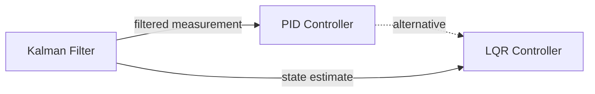

# PID Controller

## Overview & Motivation

The **Proportional-Integral-Derivative (PID) controller** is the workhorse of industrial feedback control. It continuously computes an error $e(t)$ — the difference between a desired setpoint and a measured process variable — and applies a correction based on three terms: one proportional to the current error, one to its accumulated history, and one to its rate of change.

Despite its simplicity, PID handles a remarkably wide range of plants — from temperature regulation to motor speed control — because each term addresses a different aspect of the transient response:

- **P** reacts immediately to the current error.
- **I** eliminates steady-state offset by integrating past errors.
- **D** anticipates future error by acting on the rate of change.

This library implements a **discrete recursive form** suitable for fixed-sample-rate embedded loops, where the output is computed incrementally rather than from scratch at every step.

## Mathematical Theory

### Continuous-Time PID

$$u(t) = K_p \, e(t) + K_i \int_0^t e(\tau)\,d\tau + K_d \frac{de(t)}{dt}$$

### Discrete Recursive Form

Discretizing with sampling period $T_s$ and applying the difference approximation:

$$u[n] = u[n-1] + a_0 \, e[n] + a_1 \, e[n-1] + a_2 \, e[n-2]$$

where:

$$a_0 = K_p + K_i + K_d$$
$$a_1 = -(K_p + 2K_d)$$
$$a_2 = K_d$$

This incremental (velocity) form has two key advantages:

1. **No integral accumulator** — the integral action is implicit in the recursion, reducing overflow risk.
2. **Bumpless mode switching** — toggling between auto/manual mode does not cause output jumps because the output is updated incrementally.

### Output Saturation

The output is clamped to $[u_{\min}, u_{\max}]$ after each computation, which also provides implicit **anti-windup**: the integral term cannot drive the output beyond the saturation limits.

## Complexity Analysis

| Case | Time | Space | Notes |
|------|------|-------|-------|
| Per sample | $O(1)$ | $O(1)$ | 3 multiplications, 3 additions, 1 clamp |

The algorithm uses a fixed-size recursive buffer storing $e[n-1]$, $e[n-2]$, and $u[n-1]$. No loops, no dynamic allocation, fully deterministic execution time.

## Step-by-Step Walkthrough

**Parameters:** $K_p = 2$, $K_i = 0.5$, $K_d = 0.1$, limits $[-10, 10]$, setpoint $= 5$.

**Coefficients:**
- $a_0 = 2 + 0.5 + 0.1 = 2.6$
- $a_1 = -(2 + 0.2) = -2.2$
- $a_2 = 0.1$

| Step | Measured | $e[n]$ | $e[n-1]$ | $e[n-2]$ | $\Delta u$ | $u[n]$ (clamped) |
|------|----------|--------|-----------|-----------|------------|-------------------|
| 0 | 0.0 | 5.0 | 0 | 0 | $2.6 \times 5 = 13$ | **10.0** (clamped) |
| 1 | 2.0 | 3.0 | 5.0 | 0 | $2.6(3) - 2.2(5) + 0.1(0) = -3.2$ | **6.8** |
| 2 | 4.0 | 1.0 | 3.0 | 5.0 | $2.6(1) - 2.2(3) + 0.1(5) = -3.5$ | **3.3** |
| 3 | 4.8 | 0.2 | 1.0 | 3.0 | $2.6(0.2) - 2.2(1) + 0.1(3) = -1.38$ | **1.92** |

The output converges toward the steady-state value needed to maintain the setpoint.

## Pitfalls & Edge Cases

- **Derivative kick.** A sudden change in setpoint causes a spike in $e[n] - e[n-1]$. Mitigate by differentiating the process variable instead of the error, or by filtering the derivative term.
- **Integral windup.** Although the recursive form provides implicit anti-windup through output clamping, very aggressive $K_i$ values can still cause sluggish recovery from saturation. Monitor the output rail time.
- **Sample rate dependency.** The gains $K_i$ and $K_d$ are implicitly scaled by $T_s$. Changing the control loop rate without retuning will alter the effective integral and derivative contributions.
- **Fixed-point saturation.** For Q15/Q31 types, the intermediate products $a_0 \cdot e[n]$ etc. can overflow. Ensure gains and error ranges are scaled to stay within the representable range.
- **Setpoint jumps.** Call `Reset()` after large setpoint changes to clear stale error history.

## Variants & Generalizations

| Variant | Key Difference |
|---------|---------------|
| **Standard (positional) PID** | Computes $u[n]$ from scratch each step using an explicit integral accumulator |
| **PI controller** | $K_d = 0$; simpler, no derivative noise issues |
| **PD controller** | $K_i = 0$; no steady-state error correction, used when offset is acceptable |
| **PID with derivative filter** | Low-passes the derivative term to reject high-frequency noise |
| **Gain-scheduled PID** | Tuning parameters vary as a function of operating point |
| **Cascade PID** | Inner and outer loops, each with its own PID — common in motor control |

## Applications

- **Temperature control** — Maintaining oven, room, or process temperatures via heater/cooler actuation.
- **Motor speed/position control** — Servo drives, robotics joints, CNC machines.
- **Flow and pressure regulation** — Industrial process control (chemical plants, water treatment).
- **Voltage/current regulation** — Power supply output regulation, battery charging.
- **Attitude control** — Drone stabilization, satellite pointing.

## Connections to Other Algorithms

| Algorithm | Relationship |
|-----------|-------------|
| [LQR Controller](Lqr.md) | Optimal alternative when a state-space model is available; PID is model-free. |
| [Kalman Filter](../filters/active/KalmanFilter.md) | Can provide filtered state estimates as input to either PID or LQR |

## References & Further Reading

- Åström, K.J. and Murray, R.M., *Feedback Systems: An Introduction for Scientists and Engineers*, Princeton University Press, 2008 — Chapter 10.
- Åström, K.J. and Hägglund, T., *Advanced PID Control*, ISA, 2006.
- Ziegler, J.G. and Nichols, N.B., "Optimum settings for automatic controllers", *Transactions of the ASME*, 64, 1942.
