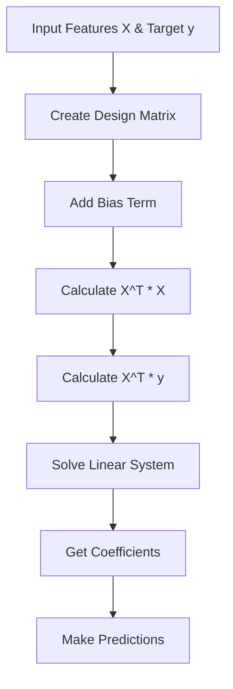

# Linear Regression Implementation Guide

## Process Overview

The following diagram illustrates the key steps in the Linear Regression implementation:



## Mathematical Background

### Linear Regression Model

Linear regression models the relationship between a dependent variable y and one or more independent variables X by fitting a linear equation:

```
y = β₀ + β₁x₁ + β₂x₂ + ... + βₙxₙ + ε
```

where:
- y is the target variable
- β₀ is the bias term (intercept)
- βᵢ are the coefficients
- xᵢ are the features
- ε is the error term

### Normal Equation

Our implementation uses the normal equation method to find the optimal coefficients:

```
β = (X^T * X)^(-1) * X^T * y
```

where:
- X is the design matrix (with added bias column)
- y is the target vector
- β is the coefficient vector
- X^T is the transpose of X

## Implementation Details

### Class Structure

```cpp
template<typename T, std::size_t Samples, std::size_t Features>
class LinearRegression : public Estimator<T, Samples, Features> {
public:
    using CoefficientsMatrix = typename Estimator<T, Samples, Features>::CoefficientsMatrix;
    using DesignMatrix = typename Estimator<T, Samples, Features>::DesignMatrix;
    using InputMatrix = typename Estimator<T, Samples, Features>::InputMatrix;

    void Fit(const Matrix<T, Samples, Features>& X, const Matrix<T, Samples, 1>& y);
    T Predict(const InputMatrix& X) const;
    const CoefficientsMatrix& Coefficients() const;
};
```

### Key Components

1. **Design Matrix Creation**:
   - Adds bias term (1.0) as first column
   - Incorporates feature matrix X
   - Results in augmented matrix [1|X]

2. **Matrix Operations**:
   - Computes X^T * X
   - Computes X^T * y
   - Solves system using Gaussian elimination

3. **Coefficient Storage**:
   - Stores β₀ (bias) and feature coefficients
   - Accessible via Coefficients() method

4. **Prediction**:
   - Implements y = Xβ for new data
   - Includes bias term automatically

## Usage Guide

### Basic Usage

```cpp
// Define system parameters
constexpr std::size_t samples = 100;    // Number of training samples
constexpr std::size_t features = 2;     // Number of features
using FloatType = float;                // Numeric type

// Create regressor
LinearRegression<FloatType, samples, features> regressor;

// Prepare training data
Matrix<FloatType, samples, features> X;  // Feature matrix
Matrix<FloatType, samples, 1> y;         // Target vector
// ... fill X and y with data ...

// Train the model
regressor.Fit(X, y);

// Make predictions
Matrix<FloatType, features, 1> new_data;
// ... fill new_data ...
FloatType prediction = regressor.Predict(new_data);
```

### Example: House Price Prediction

```cpp
// Create regressor for house price prediction
constexpr std::size_t samples = 1000;
constexpr std::size_t features = 3;  // size, bedrooms, age
LinearRegression<float, samples, features> house_price_model;

// Prepare training data
Matrix<float, samples, features> houses;
Matrix<float, samples, 1> prices;
// ... load house data ...

// Train model
house_price_model.Fit(houses, prices);

// Predict new house price
Matrix<float, features, 1> new_house;
new_house.at(0, 0) = 2000.0f;  // size in sq ft
new_house.at(1, 0) = 3.0f;     // bedrooms
new_house.at(2, 0) = 5.0f;     // age in years
float predicted_price = house_price_model.Predict(new_house);
```

## Best Practices

1. **Data Preparation**:
   - Scale features to similar ranges
   - Remove or handle missing values
   - Check for multicollinearity

2. **Model Validation**:
   - Split data into train/test sets
   - Use cross-validation when possible
   - Check residuals distribution

3. **Numerical Stability**:
   - Use appropriate numeric types
   - Consider conditioning of X^T * X
   - Monitor for overflow/underflow

4. **Feature Selection**:
   - Choose relevant features
   - Avoid redundant features
   - Consider feature interactions

## Common Applications

1. **Prediction Tasks**:
   - Price estimation
   - Demand forecasting
   - Performance prediction

2. **Analysis**:
   - Feature importance
   - Trend analysis
   - System modeling

3. **Control Systems**:
   - System identification
   - Parameter estimation
   - Process control

## Performance Considerations

1. **Template Parameters**:
   - Fixed sizes enable compile-time optimizations
   - Stack allocation for small matrices
   - Type flexibility (float/double)

2. **Memory Usage**:
   - Efficient matrix operations
   - No dynamic allocation
   - Reuse of temporary matrices

3. **Computation Efficiency**:
   - In-place operations where possible
   - Optimized matrix multiplication
   - Efficient system solver

## Limitations and Future Improvements

1. Current limitations:
   - Fixed sample/feature size
   - Basic Gaussian elimination solver
   - No regularization support
   - Limited to linear relationships

2. Possible extensions:
   - Dynamic sizing
   - Ridge/Lasso regularization
   - QR decomposition solver
   - Polynomial features
   - Online learning support
   - Standard error estimation
   - Feature importance scores
   - Cross-validation utilities

## Error Handling

1. Static assertions verify:
   - Valid numeric types
   - Sufficient sample size
   - Matrix dimension compatibility

2. Runtime checks:
   - Matrix singularity
   - Numerical stability
   - Solution convergence

## Performance Metrics

To evaluate the model's performance, consider implementing:

1. **Regression Metrics**:
   - Mean Squared Error (MSE)
   - R-squared (R²)
   - Mean Absolute Error (MAE)
   - Root Mean Squared Error (RMSE)

2. **Diagnostic Tools**:
   - Residual plots
   - Q-Q plots
   - Leverage statistics
   - Cook's distance

## Mathematical Details

### Gaussian Elimination

The implementation uses Gaussian elimination with partial pivoting to solve the normal equations:

1. Forward elimination:
   ```
   for i = 1 to n
       pivot = max_element(i to n)
       swap_rows(i, pivot)
       for j = i+1 to n
           eliminate(row[j], row[i])
   ```

2. Back substitution:
   ```
   for i = n to 1
       x[i] = (b[i] - Σ(j=i+1 to n) a[i,j]x[j]) / a[i,i]
   ```

This provides a stable solution for well-conditioned problems.
