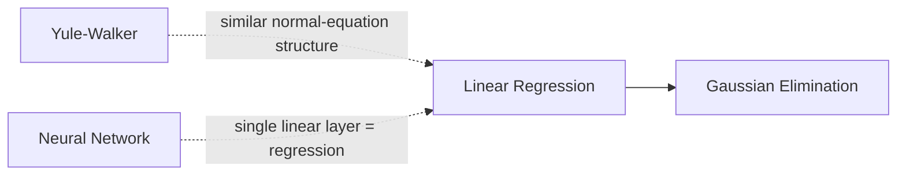

# Linear Regression

## Overview & Motivation

Given a set of observations $\{(x_i, y_i)\}$, we often want to find the *best-fit* linear relationship between features $x$ and target $y$. **Linear regression** does this by finding the coefficients $\beta$ that minimize the sum of squared residuals — the gap between predicted and observed values.

The approach is fundamental because:
- It has a **closed-form solution** (the normal equation), so no iterative optimization is needed.
- It provides a **baseline model** against which more complex methods are measured.
- The solution is the **maximum likelihood estimator** under Gaussian noise assumptions.

This library solves the normal equation directly using Gaussian elimination, making it suitable for small-to-moderate feature counts typical in embedded estimation tasks.

## Mathematical Theory

### The Model

$$y = \beta_0 + \beta_1 x_1 + \beta_2 x_2 + \cdots + \beta_p x_p + \varepsilon$$

In matrix form, augmenting $X$ with a column of ones for the intercept:

$$\mathbf{y} = \mathbf{X}\boldsymbol{\beta} + \boldsymbol{\varepsilon}$$

where $\mathbf{X} \in \mathbb{R}^{n \times (p+1)}$, $\boldsymbol{\beta} \in \mathbb{R}^{p+1}$, $\mathbf{y} \in \mathbb{R}^n$.

### Normal Equation

Minimizing $\|\mathbf{y} - \mathbf{X}\boldsymbol{\beta}\|^2$ with respect to $\boldsymbol{\beta}$ yields:

$$\boldsymbol{\beta} = (\mathbf{X}^T \mathbf{X})^{-1} \mathbf{X}^T \mathbf{y}$$

This is solved in practice by forming $\mathbf{X}^T\mathbf{X}$ and $\mathbf{X}^T\mathbf{y}$, then using Gaussian elimination to solve the $(p+1) \times (p+1)$ system.

### Geometric Interpretation

The prediction $\hat{\mathbf{y}} = \mathbf{X}\boldsymbol{\beta}$ is the **orthogonal projection** of $\mathbf{y}$ onto the column space of $\mathbf{X}$. The residual $\mathbf{y} - \hat{\mathbf{y}}$ is perpendicular to every column of $\mathbf{X}$.

## Complexity Analysis

| Phase | Time | Space | Notes |
|-------|------|-------|-------|
| $\mathbf{X}^T\mathbf{X}$ | $O(n p^2)$ | $O(p^2)$ | Dominated by matrix multiply |
| $\mathbf{X}^T\mathbf{y}$ | $O(np)$ | $O(p)$ | Matrix-vector multiply |
| Solve | $O(p^3)$ | $O(p^2)$ | Gaussian elimination |
| Predict | $O(p)$ | $O(1)$ | Dot product |

For embedded use with small $p$ (say $\leq 10$), the entire fit completes in microseconds.

## Step-by-Step Walkthrough

**Data:** 3 samples, 1 feature.

| $x$ | $y$ |
|-----|-----|
| 1 | 2 |
| 2 | 4 |
| 3 | 5 |

**Step 1 — Design matrix** (with bias column):

$$\mathbf{X} = \begin{bmatrix} 1 & 1 \\ 1 & 2 \\ 1 & 3 \end{bmatrix}$$

**Step 2 — Compute $\mathbf{X}^T\mathbf{X}$ and $\mathbf{X}^T\mathbf{y}$:**

$$\mathbf{X}^T\mathbf{X} = \begin{bmatrix} 3 & 6 \\ 6 & 14 \end{bmatrix}, \quad \mathbf{X}^T\mathbf{y} = \begin{bmatrix} 11 \\ 23 \end{bmatrix}$$

**Step 3 — Solve** $\begin{bmatrix} 3 & 6 \\ 6 & 14 \end{bmatrix} \boldsymbol{\beta} = \begin{bmatrix} 11 \\ 23 \end{bmatrix}$:

Forward elimination → back-substitution: $\beta_1 = 1.5$, $\beta_0 = 2/3 \approx 0.667$

**Result:** $\hat{y} = 0.667 + 1.5x$

**Prediction at $x = 4$:** $\hat{y} = 0.667 + 6.0 = 6.667$

## Pitfalls & Edge Cases

- **Multicollinearity.** If features are nearly linearly dependent, $\mathbf{X}^T\mathbf{X}$ is ill-conditioned and the solution is unstable. Consider regularization (Ridge/Lasso) or removing redundant features.
- **Fewer samples than features** ($n < p+1$). The system is underdetermined and $\mathbf{X}^T\mathbf{X}$ is singular. At a minimum, $n \geq p+1$.
- **Outliers** have outsized influence because the squared loss amplifies large residuals. Robust alternatives (Huber loss, RANSAC) exist outside this library.
- **Extrapolation danger.** The linear model has no mechanism to detect when it is being queried far from the training data range.
- **Fixed-point precision.** For Q15/Q31 types, features should be scaled to $[-1, 1)$ to avoid overflow in $\mathbf{X}^T\mathbf{X}$.

## Variants & Generalizations

| Variant | Key Difference |
|---------|---------------|
| **Ridge regression (L2)** | Adds $\lambda\|\boldsymbol{\beta}\|^2$ to the cost; solves $(\mathbf{X}^T\mathbf{X} + \lambda I)\boldsymbol{\beta} = \mathbf{X}^T\mathbf{y}$ |
| **Lasso regression (L1)** | Adds $\lambda\|\boldsymbol{\beta}\|_1$; promotes sparsity but requires iterative optimization |
| **Polynomial regression** | Adds powers of $x$ as new features; still linear in parameters |
| **Weighted least squares** | Weights each sample differently; solves $(\mathbf{X}^T W \mathbf{X})\boldsymbol{\beta} = \mathbf{X}^T W \mathbf{y}$ |
| **Recursive least squares** | Updates $\boldsymbol{\beta}$ incrementally as new data arrives; suited for online estimation |

## Applications

- **Sensor calibration** — Fitting a linear transfer function between raw ADC counts and physical units.
- **Trend estimation** — Extracting linear trends from noisy time series (temperature, voltage drift).
- **System identification** — Estimating static gain or simple dynamic relationships.
- **Feature importance** — The magnitude of $\beta_i$ indicates the influence of feature $i$ (after feature scaling).
- **Predictive maintenance** — Modeling degradation rate from operating-condition features.

## Connections to Other Algorithms

```mermaid
graph LR
    LR["Linear Regression"]
    GE["Gaussian Elimination"]
    YW["Yule-Walker"]
    NN["Neural Network"]
    LR --> GE
    YW -.->|"similar normal-equation structure"| LR
    NN -.->|"single linear layer = regression"| LR
```

| Algorithm | Relationship |
|-----------|-------------|
| [Gaussian Elimination](../solvers/GaussianElimination.md) | Used to solve the normal equation system |
| [Yule-Walker](YuleWalker.md) | Structurally similar — also solves a linear system derived from correlations |
| [Neural Network](../neural_network/NeuralNetwork.md) | A single-layer neural network with no activation and MSE loss reduces to linear regression |

## References & Further Reading

- Hastie, T., Tibshirani, R. and Friedman, J., *The Elements of Statistical Learning*, 2nd ed., Springer, 2009 — Chapter 3.
- Bishop, C.M., *Pattern Recognition and Machine Learning*, Springer, 2006 — Chapter 3.
- Strang, G., *Linear Algebra and Its Applications*, 4th ed., Thomson, 2006 — Section 4.3.
