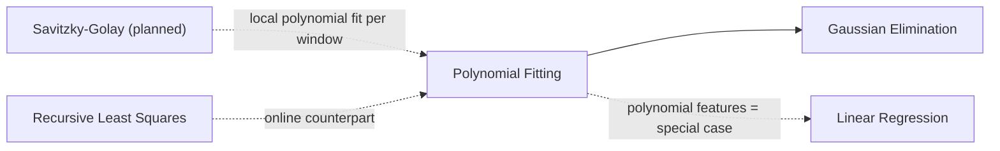

# Polynomial Least-Squares Fitting

## Overview & Motivation

Sensor calibration curves, ADC linearization, thermistor transfer functions, and drift trends
all require fitting a smooth curve to a discrete set of measured points. A degree-$d$ polynomial
captures these behaviors with only $d+1$ coefficients, making evaluation at runtime a handful of
multiply-adds rather than a table lookup or expensive transcendental.

The least-squares formulation finds the polynomial that minimizes the sum of squared residuals
across all measurement samples. Unlike exact interpolation, it is robust to measurement noise:
extra samples average out errors rather than being forced to pass through noisy points.

## Mathematical Theory

### The Model

Given $n$ scalar observations $\{(x_i, y_i)\}_{i=0}^{n-1}$, the degree-$d$ polynomial model is

$$p(x) = c_0 + c_1 x + c_2 x^2 + \cdots + c_d x^d$$

The goal is to find the coefficient vector $\mathbf{c} \in \mathbb{R}^{d+1}$ that minimizes

$$\min_{\mathbf{c}} \sum_{i=0}^{n-1} \bigl(y_i - p(x_i)\bigr)^2$$

### Vandermonde Design Matrix

Stacking the model evaluations at all sample abscissae gives the Vandermonde matrix

$$\mathbf{V} \in \mathbb{R}^{n \times (d+1)}, \quad V_{i,j} = x_i^j$$

The least-squares problem then becomes $\min_{\mathbf{c}} \|\mathbf{V}\mathbf{c} - \mathbf{y}\|^2$.

### Normal Equations

Setting the gradient of the squared residual with respect to $\mathbf{c}$ to zero yields

$$(\mathbf{V}^\top \mathbf{V})\,\mathbf{c} = \mathbf{V}^\top \mathbf{y}$$

The $(d+1)\times(d+1)$ matrix $\mathbf{V}^\top\mathbf{V}$ is symmetric and, when the abscissae are
distinct and $n \geq d+1$, positive-definite. Its small size allows direct solution by Gaussian
elimination or Cholesky factorization in bounded time on embedded hardware.

### Horner Evaluation

Once $\mathbf{c}$ is known, evaluating $p(x)$ at a new point uses Horner's method

$$p(x) = c_0 + x\bigl(c_1 + x\bigl(c_2 + \cdots + x\,c_d\bigr)\cdots\bigr)$$

This requires exactly $d$ multiplications and $d$ additions — optimal for a degree-$d$ polynomial.

## Complexity Analysis

| Phase                            | Time        | Space     | Notes                             |
|----------------------------------|-------------|-----------|-----------------------------------|
| Build $\mathbf{V}$               | $O(n\,d)$   | $O(n\,d)$ | Incremental powers, no `pow()`    |
| Form $\mathbf{V}^\top\mathbf{V}$ | $O(n\,d^2)$ | $O(d^2)$  | Symmetric, only upper half needed |
| Form $\mathbf{V}^\top\mathbf{y}$ | $O(n\,d)$   | $O(d)$    | Matrix-vector product             |
| Solve $(d+1)\times(d+1)$ system  | $O(d^3)$    | $O(d^2)$  | Gaussian elimination              |
| Predict (Horner)                 | $O(d)$      | $O(1)$    | One MAC per coefficient           |

All dimensions are compile-time constants; no heap allocation is required.

## Step-by-Step Walkthrough

**Data:** $n = 4$ samples, $d = 2$ (quadratic fit).

| $x_i$ | $y_i$ |
|-------|-------|
| 0     | 1     |
| 1     | 0.75  |
| 2     | 1     |
| 3     | 1.75  |

**Step 1 — Build $\mathbf{V}$:**

$$\mathbf{V} = \begin{bmatrix} 1 & 0 & 0 \\ 1 & 1 & 1 \\ 1 & 2 & 4 \\ 1 & 3 & 9 \end{bmatrix}$$

**Step 2 — Normal equations:**

$$\mathbf{V}^\top\mathbf{V} = \begin{bmatrix} 4 & 6 & 14 \\ 6 & 14 & 36 \\ 14 & 36 & 98 \end{bmatrix}, \qquad \mathbf{V}^\top\mathbf{y} = \begin{bmatrix} 4.5 \\ 7.25 \\ 19.75 \end{bmatrix}$$

**Step 3 — Solve:** Gaussian elimination → $\mathbf{c} \approx [1,\,-0.5,\,0.25]^\top$.

**Result:** $p(x) = 1 - 0.5\,x + 0.25\,x^2$.

**Prediction at $x = 1.5$:**

$$p(1.5) = 0.25\cdot1.5^2 - 0.5\cdot1.5 + 1 = 0.5625 - 0.75 + 1 = 0.8125$$

## Pitfalls & Edge Cases

- **Ill-conditioning of the Vandermonde system.** The condition number of $\mathbf{V}^\top\mathbf{V}$
  grows exponentially with $d$ and with the spread of abscissae. Center and scale the abscissa
  $x \leftarrow (x - \bar{x})/\sigma_x$ before fitting to reduce condition numbers by orders of
  magnitude. Recommended for $d \geq 3$ or when abscissae are far from the origin.

- **Degree selection.** Over-fitting occurs when $d$ is too large relative to $n$ or to the
  signal-to-noise ratio. Keep $d \leq 4$ for typical embedded calibration tasks.

- **Exactly $n = d+1$ points.** The normal equation system has a unique solution equal to the
  interpolating polynomial; the residual is zero. The system is well-posed only if all abscissae
  are distinct.

- **Repeated or nearly-coincident abscissae.** $\mathbf{V}^\top\mathbf{V}$ becomes singular or
  nearly so. Partial-pivoting in the Gaussian solver will flag this via `really_assert`; avoid
  duplicate $x$ values in practice.

- **Large degree with `float` arithmetic.** Powers $x^d$ for $|x| \gg 1$ can exceed the `float`
  dynamic range. Centering/scaling eliminates this risk.

## Variants & Generalizations

| Variant                     | Key Difference                                                               |
|-----------------------------|------------------------------------------------------------------------------|
| Orthogonal polynomial basis | Uses Legendre/Chebyshev basis instead of monomials; much better conditioning |
| Weighted least squares      | Each sample weighted differently (e.g., by measurement precision)            |
| Regularized (Ridge) fitting | Adds $\lambda\|\mathbf{c}\|^2$ to damp large coefficients                    |
| Constrained fitting         | Enforces derivative constraints at endpoints                                 |
| Savitzky-Golay smoothing    | Sliding-window polynomial fit for real-time derivative estimation            |

## Applications

- **Sensor linearization** — converting thermistor resistance or pressure-sensor ADC counts to
  engineering units via a quadratic or cubic polynomial.
- **Drift and aging compensation** — fitting a polynomial to sampled drift data and subtracting
  the trend from future measurements.
- **Compact lookup-table replacement** — replacing a 256-entry table with a degree-3 polynomial
  evaluated in four MACs.
- **Calibration curve storage** — a handful of coefficients in flash replace a bulky lookup table.

## Connections to Other Algorithms

| Algorithm                                                 | Relationship                                                     |
|-----------------------------------------------------------|------------------------------------------------------------------|
| [Gaussian Elimination](../solvers/GaussianElimination.md) | Solves the normal equations                                      |
| [Linear Regression](LinearRegression.md)                  | Polynomial fitting is linear regression with polynomial features |
| [Recursive Least Squares](RecursiveLeastSquares.md)       | Online / streaming counterpart for time-varying models           |

## References & Further Reading

- Press, W. H., Teukolsky, S. A., Vetterling, W. T. and Flannery, B. P., *Numerical Recipes in C*, 3rd ed., Cambridge University Press, 2007 — Chapter 15 (Modeling of Data).
- Golub, G. H. and Van Loan, C. F., *Matrix Computations*, 4th ed., Johns Hopkins University Press, 2013 — Chapter 5 (orthogonal factorizations and least squares).
- Hildebrand, F. B., *Introduction to Numerical Analysis*, 2nd ed., Dover, 1987 — Chapter 7 (least-squares approximation).
