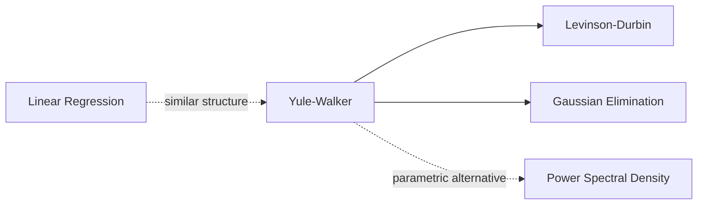

# Yule-Walker Estimation

## Overview & Motivation

Many signals — vibration data, speech waveforms, financial time series — exhibit short-term correlations. An **autoregressive (AR) model** captures these correlations by expressing the current sample as a linear combination of the previous $p$ samples plus white noise. The **Yule-Walker method** estimates the AR coefficients directly from the signal's autocovariance structure.

The appeal is threefold:
1. The resulting system of equations has **Toeplitz structure**, enabling efficient $O(p^2)$ solvers.
2. The method is guaranteed to produce a **stable model** (all poles inside the unit circle) when the autocovariance matrix is positive definite.
3. It provides a **parametric spectral estimate** — the PSD is a smooth rational function rather than a noisy periodogram.

## Mathematical Theory

### Autoregressive Model

An AR($p$) process:

$$x[t] = \varphi_1 x[t-1] + \varphi_2 x[t-2] + \cdots + \varphi_p x[t-p] + \varepsilon[t]$$

where $\varepsilon[t]$ is white noise with variance $\sigma^2$.

### Yule-Walker Equations

Multiplying both sides by $x[t-k]$ and taking expectations:

$$R[k] = \varphi_1 R[k-1] + \varphi_2 R[k-2] + \cdots + \varphi_p R[k-p], \quad k = 1, \ldots, p$$

where $R[k] = E[x[t] \cdot x[t-k]]$ is the autocovariance at lag $k$. In matrix form:

$$\underbrace{\begin{bmatrix} R[0] & R[1] & \cdots & R[p-1] \\ R[1] & R[0] & \cdots & R[p-2] \\ \vdots & & \ddots & \vdots \\ R[p-1] & R[p-2] & \cdots & R[0] \end{bmatrix}}_{\mathbf{R} \text{ (Toeplitz)}} \begin{bmatrix} \varphi_1 \\ \varphi_2 \\ \vdots \\ \varphi_p \end{bmatrix} = \begin{bmatrix} R[1] \\ R[2] \\ \vdots \\ R[p] \end{bmatrix}$$

### Autocovariance Estimation

The biased estimator is used:

$$\hat{R}[k] = \frac{1}{N} \sum_{t=k}^{N-1} x[t] \cdot x[t-k]$$

after centering the series by subtracting its mean. The biased estimator (dividing by $N$ instead of $N-k$) guarantees the Toeplitz matrix is positive semi-definite.

### Spectral Interpretation

The PSD of the estimated AR model is:

$$S(f) = \frac{\sigma^2}{\left|1 - \sum_{i=1}^{p} \varphi_i \, e^{-j2\pi fi}\right|^2}$$

This gives a smooth, parametric spectral estimate.

## Complexity Analysis

| Phase                   | Time     | Space    | Notes                           |
|-------------------------|----------|----------|---------------------------------|
| Autocovariance          | $O(Np)$  | $O(p)$   | One pass per lag, $p+1$ lags    |
| Build Toeplitz matrix   | $O(p^2)$ | $O(p^2)$ | Fill from autocovariance vector |
| Solve (Levinson-Durbin) | $O(p^2)$ | $O(p)$   | Exploits Toeplitz structure     |
| Solve (Gaussian elim.)  | $O(p^3)$ | $O(p^2)$ | General-purpose fallback        |
| Predict                 | $O(p)$   | $O(1)$   | Dot product with past samples   |

## Step-by-Step Walkthrough

**Input:** $x = [2, 4, 6, 5, 3, 1]$, AR order $p = 2$.

**Step 1 — Compute mean and center:**

$\bar{x} = 3.5$, centered: $x' = [-1.5, 0.5, 2.5, 1.5, -0.5, -2.5]$

**Step 2 — Autocovariances** (biased, divide by $N = 6$):

- $R[0] = \frac{(-1.5)^2 + 0.5^2 + 2.5^2 + 1.5^2 + (-0.5)^2 + (-2.5)^2}{6} = \frac{2.25 + 0.25 + 6.25 + 2.25 + 0.25 + 6.25}{6} = 2.917$
- $R[1] = \frac{(-1.5)(0.5) + (0.5)(2.5) + (2.5)(1.5) + (1.5)(-0.5) + (-0.5)(-2.5)}{6} = \frac{-0.75 + 1.25 + 3.75 - 0.75 + 1.25}{6} = 0.792$
- $R[2] = \frac{(-1.5)(2.5) + (0.5)(1.5) + (2.5)(-0.5) + (1.5)(-2.5)}{6} = \frac{-3.75 + 0.75 - 1.25 - 3.75}{6} = -1.333$

**Step 3 — Build Toeplitz system:**

$$\begin{bmatrix} 2.917 & 0.792 \\ 0.792 & 2.917 \end{bmatrix} \begin{bmatrix} \varphi_1 \\ \varphi_2 \end{bmatrix} = \begin{bmatrix} 0.792 \\ -1.333 \end{bmatrix}$$

**Step 4 — Solve** (e.g., via Levinson-Durbin or Gaussian elimination):

$\varphi_1 \approx 0.478$, $\varphi_2 \approx -0.587$

**Prediction:** $\hat{x}[6] = \bar{x} + \varphi_1 (x[5] - \bar{x}) + \varphi_2 (x[4] - \bar{x})$

## Pitfalls & Edge Cases

- **Non-stationary data.** The Yule-Walker method assumes wide-sense stationarity. Trends, seasonal components, or varying variance must be removed first.
- **Model order selection.** Choosing $p$ too small misses important dynamics; too large overfits noise. Use AIC or BIC criteria.
- **Near-singular autocovariance matrix.** Happens when $p$ is too large relative to $N$, or the signal contains very little variation. The solver may fail or produce unreliable coefficients.
- **Fixed-point range.** Autocovariance values can be large (proportional to signal variance squared). Scale the input signal to prevent overflow.
- **Biased vs. unbiased estimator.** The biased estimator (dividing by $N$) is deliberately chosen to guarantee positive semi-definiteness; the unbiased estimator (dividing by $N-k$) does not.

## Variants & Generalizations

| Variant                         | Key Difference                                                                                             |
|---------------------------------|------------------------------------------------------------------------------------------------------------|
| **Burg's method**               | Estimates AR coefficients from forward + backward prediction errors; often more accurate for short records |
| **Covariance method**           | Uses the unbiased autocovariance; does not guarantee stability                                             |
| **ARMA models**                 | Extends AR to include moving-average terms; more flexible but requires iterative estimation                |
| **Vector autoregression (VAR)** | Multivariate extension for jointly modeling multiple time series                                           |
| **Recursive estimation**        | Updates AR coefficients online as new data arrives                                                         |

## Applications

- **Speech analysis** — AR models underlie linear predictive coding (LPC), the foundation of speech codecs.
- **Spectral estimation** — Parametric PSD estimation via the AR model gives smoother spectra than periodograms, especially for short records.
- **System identification** — Estimating transfer function poles from input-output data.
- **Time series forecasting** — Predicting next values in economic, meteorological, or sensor data.
- **Vibration analysis** — Extracting resonant frequencies from structural vibration measurements.

## Connections to Other Algorithms

```mermaid
graph LR
    YW["Yule-Walker"]
    LD["Levinson-Durbin"]
    GE["Gaussian Elimination"]
    PSD["Power Spectral Density"]
    LR["Linear Regression"]
    YW --> LD
    YW --> GE
    YW -.->|"parametric alternative"| PSD
    LR -.->|"similar structure"| YW
```

| Algorithm                                                     | Relationship                                                                          |
|---------------------------------------------------------------|---------------------------------------------------------------------------------------|
| [Levinson-Durbin](../solvers/LevinsonDurbin.md)               | Efficient $O(p^2)$ solver exploiting the Toeplitz structure of the Yule-Walker matrix |
| [Gaussian Elimination](../solvers/GaussianElimination.md)     | General-purpose $O(p^3)$ solver used as a fallback                                    |
| [Power Spectral Density](../analysis/PowerDensitySpectrum.md) | Non-parametric alternative; the AR model provides a parametric PSD estimate           |
| [Linear Regression](LinearRegression.md)                      | Structurally similar — both solve a linear system derived from data correlations      |

## References & Further Reading

- Kay, S.M., *Modern Spectral Estimation: Theory and Application*, Prentice Hall, 1988 — Chapter 7.
- Stoica, P. and Moses, R.L., *Spectral Analysis of Signals*, Prentice Hall, 2005 — Chapter 3.
- Box, G.E.P., Jenkins, G.M. and Reinsel, G.C., *Time Series Analysis: Forecasting and Control*, 5th ed., Wiley, 2015.
