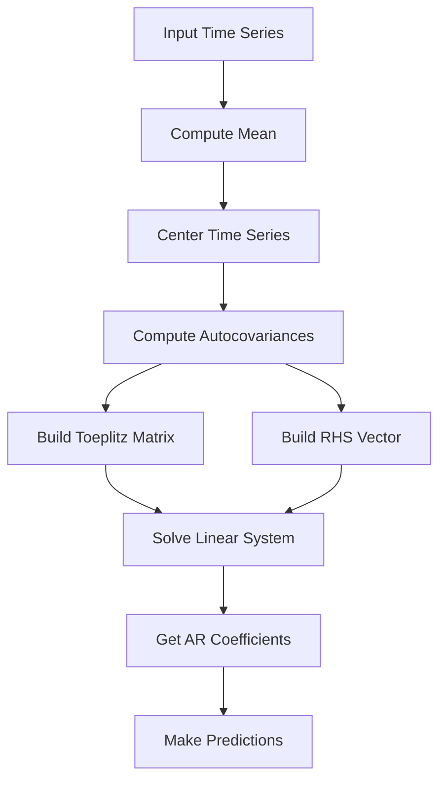

# Yule-Walker Implementation Guide

## Process Overview

The following diagram illustrates the key steps in the Yule-Walker method implementation:



## Mathematical Background

### Autoregressive Model

The Yule-Walker method estimates the parameters of an autoregressive (AR) model of order p:

```
x[t] = c + φ₁x[t-1] + φ₂x[t-2] + ... + φₚx[t-p] + ε[t]
```

where:
- x[t] is the time series value at time t
- c is a constant (related to the mean)
- φᵢ are the AR coefficients
- p is the order of the model
- ε[t] is white noise

### Yule-Walker Equations

The method solves the following system of equations:

```
R[k] = φ₁R[k-1] + φ₂R[k-2] + ... + φₚR[k-p]  for k = 1,2,...,p
```

where R[k] is the autocovariance function at lag k. This can be written in matrix form:

```
[R[0]    R[1]    ... R[p-1]] [φ₁]   [R[1]]
[R[1]    R[0]    ... R[p-2]] [φ₂]   [R[2]]
[  ⋮       ⋮     ⋱    ⋮   ] [ ⋮ ] = [ ⋮ ]
[R[p-1]  R[p-2]  ... R[0] ] [φₚ]   [R[p]]
```

## Implementation Details

### Class Structure

```cpp
template<typename T, std::size_t Samples, std::size_t Order>
class YuleWalker {
public:
    using CoefficientsMatrix = typename math::Matrix<T, Order, 1>;
    using DesignMatrix = math::Matrix<T, Order, Order>;
    using InputMatrix = math::Matrix<T, Order, 1>;
    using TimeSeriesVector = math::Matrix<T, Samples, 1>;

    explicit YuleWalker(solvers::Solver<T, Order>& solver);
    void Fit(const Matrix<T, Samples, Order>& X, const Matrix<T, Samples, 1>& y);
    T Predict(const InputMatrix& X) const;
    const CoefficientsMatrix& Coefficients() const;
};
```

### Key Components

1. **Mean Computation and Centering**:
   - Calculates series mean
   - Centers time series by subtracting mean
   - Improves numerical stability

2. **Autocovariance Calculation**:
   - Computes autocovariances for lags 0 to p
   - Uses biased estimator (divided by N)
   - Implements two-pass algorithm for stability

3. **Toeplitz Matrix Formation**:
   - Creates symmetric Toeplitz matrix from autocovariances
   - Ensures matrix properties for solver

4. **System Solution**:
   - Uses provided solver for linear system
   - Returns AR coefficients
   - Handles prediction with mean adjustment

## Usage Guide

### Basic Usage

```cpp
// Define system parameters
constexpr std::size_t samples = 1000;  // Length of time series
constexpr std::size_t order = 3;       // AR model order
using FloatType = float;               // Numeric type

// Create solver (e.g., Levinson recursion)
solvers::LevinsonSolver<FloatType, order> solver;

// Create Yule-Walker estimator
YuleWalker<FloatType, samples, order> yw(solver);

// Prepare training data
Matrix<FloatType, samples, order> X;    // Lagged values
Matrix<FloatType, samples, 1> y;        // Target values
// ... fill X and y with time series data ...

// Estimate AR coefficients
yw.Fit(X, y);

// Make predictions
Matrix<FloatType, order, 1> new_data;
// ... fill new_data with latest values ...
FloatType prediction = yw.Predict(new_data);
```

### Example: Temperature Forecasting

```cpp
// Create AR model for temperature forecasting
constexpr std::size_t samples = 8760;  // Hourly data for one year
constexpr std::size_t order = 24;      // 24-hour seasonality

// Create solver
solvers::LevinsonSolver<float, order> solver;
YuleWalker<float, samples, order> temperature_model(solver);

// Prepare training data
Matrix<float, samples, order> temp_history;
Matrix<float, samples, 1> temp_target;
// ... load temperature data ...

// Train model
temperature_model.Fit(temp_history, temp_target);

// Predict next temperature
Matrix<float, order, 1> recent_temps;
// ... fill with last 24 hours ...
float next_temp = temperature_model.Predict(recent_temps);
```

## Best Practices

1. **Model Order Selection**:
   - Use AIC/BIC criteria
   - Consider domain knowledge
   - Balance complexity vs. fit

2. **Data Preparation**:
   - Remove trends if present
   - Handle seasonality
   - Check for stationarity

3. **Numerical Considerations**:
   - Use appropriate solver
   - Monitor condition number
   - Check for stability

4. **Validation**:
   - Use hold-out data
   - Check residuals
   - Validate predictions

## Common Applications

1. **Time Series Analysis**:
   - Economic forecasting
   - Signal processing
   - Weather prediction

2. **Signal Processing**:
   - Speech analysis
   - Spectral estimation
   - System identification

3. **Control Systems**:
   - Process control
   - System modeling
   - Feedback systems

## Performance Considerations

1. **Template Parameters**:
   - Compile-time optimization
   - Static memory allocation
   - Type flexibility

2. **Computation Efficiency**:
   - Efficient autocovariance calculation
   - Toeplitz matrix structure
   - Solver selection

3. **Memory Usage**:
   - Fixed-size matrices
   - No dynamic allocation
   - Buffer reuse

## Limitations and Future Improvements

1. Current limitations:
   - Fixed sample size
   - Fixed model order
   - Basic AR model only
   - Single variable

2. Possible extensions:
   - Dynamic sizing
   - ARMA models
   - Multivariate support
   - Online estimation
   - Confidence intervals
   - Model diagnostics
   - Seasonal components
   - Non-stationary support

## Error Handling

1. Static assertions verify:
   - Valid numeric types
   - Sufficient sample size
   - Order constraints

2. Runtime checks:
   - Data validity
   - Numerical stability
   - Solution convergence

## Advanced Topics

### Stability Analysis

The AR model is stable if all roots of the characteristic polynomial lie outside the unit circle:

```
1 - φ₁z⁻¹ - φ₂z⁻² - ... - φₚz⁻ᵖ = 0
```

### Spectral Properties

The power spectral density of an AR(p) process is:

```
S(f) = σ²/|1 - Σφᵢe⁻²ᵖⁱᶠᵗ|²
```

where σ² is the innovation variance.

### Confidence Intervals

Asymptotic standard errors for the AR coefficients can be computed using:

```
SE(φᵢ) = √((1-R²)/N) * √(C[i,i])
```

where C is the covariance matrix of the estimates.

## Implementation Notes

### Autocovariance Computation

The implementation uses a numerically stable two-pass algorithm:

```cpp
T ComputeAutocovariance(const TimeSeriesVector& timeSeries, size_t lag) const {
    T covariance{};
    size_t n = 0;
    
    for (size_t i = lag; i < Samples; ++i) {
        covariance += timeSeries.at(i, 0) * timeSeries.at(i - lag, 0);
        n++;
    }
    
    return covariance / T(Samples);
}
```

This approach:
- Maintains numerical precision
- Handles large datasets efficiently
- Provides biased estimates for better stability
