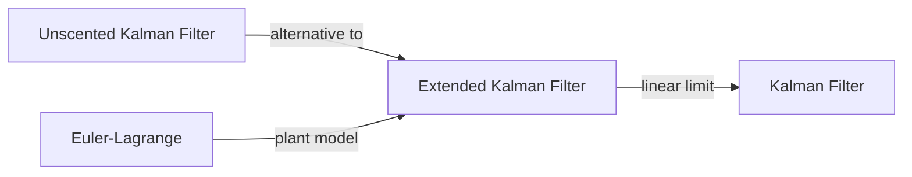

# Extended Kalman Filter

## Overview & Motivation

Many real-world systems are **nonlinear**: a pendulum's restoring force is $-\sin\theta$, not $-\theta$; a radar measured range depends on $\sqrt{x^2 + y^2}$, not a linear combination of states. The standard Kalman filter assumes linear dynamics $(x_k = Fx_{k-1})$ and cannot handle this directly.

The **Extended Kalman Filter (EKF)** extends the Kalman framework to nonlinear systems by **linearizing** the state transition and measurement functions around the current estimate at each step. It uses the same predict–update structure, but replaces the constant system matrices with **Jacobians** evaluated at the current operating point.

This makes the EKF the simplest and most widely-used nonlinear state estimator — at the cost of requiring the user to supply Jacobian functions and the assumption that linearization remains accurate within the filter's uncertainty.

## Mathematical Theory

### Nonlinear State-Space Model

$$x_k = f(x_{k-1}, u_{k-1}) + w_{k-1}, \quad w \sim \mathcal{N}(0, Q)$$
$$z_k = h(x_k) + v_k, \quad v \sim \mathcal{N}(0, R)$$

where $f(\cdot)$ and $h(\cdot)$ are arbitrary (differentiable) nonlinear functions.

### Predict Step

1. Compute the **Jacobian** of $f$ at the current estimate:

$$F_k = \left.\frac{\partial f}{\partial x}\right|_{\hat{x}_{k-1}}$$

2. Nonlinear state prediction:

$$\hat{x}_k^- = f(\hat{x}_{k-1}, u_{k-1})$$

3. Covariance prediction (using the linearized model):

$$P_k^- = F_k P_{k-1} F_k^T + Q_{k-1}$$

### Update Step

1. Compute the **Jacobian** of $h$ at the predicted state:

$$H_k = \left.\frac{\partial h}{\partial x}\right|_{\hat{x}_k^-}$$

2. Nonlinear innovation:

$$y_k = z_k - h(\hat{x}_k^-)$$

3. Innovation covariance, Kalman gain, state and covariance updates follow the standard Kalman filter equations using the Jacobian $H_k$:

$$S_k = H_k P_k^- H_k^T + R_k$$
$$K_k = P_k^- H_k^T S_k^{-1}$$
$$\hat{x}_k = \hat{x}_k^- + K_k y_k$$
$$P_k = (I - K_k H_k) P_k^-$$

## Complexity Analysis

| Operation      | Time                   | Space         | Notes                                                            |
|----------------|------------------------|---------------|------------------------------------------------------------------|
| Jacobian eval  | $O(n^2)$ (user-defined)| $O(n^2)$      | Depends on the specific nonlinear functions                      |
| Predict        | $O(n^2)$               | $O(n^2)$      | Matrix multiply $F P F^T$ plus nonlinear state propagation       |
| Update         | $O(n^2 m + m^3)$       | $O(nm)$       | Same as standard Kalman — the linearized equations are identical |
| Total per step | $O(n^2 m + m^3)$       | $O(n^2 + nm)$ | Dominated by Jacobian evaluation for complex models              |

## Step-by-Step Walkthrough

**System:** Estimating angle and angular velocity of a simple pendulum from noisy angle measurements.

State: $x = \begin{bmatrix} \theta \\ \dot\theta \end{bmatrix}$, $\Delta t = 0.1$ s.

Nonlinear dynamics:
$$f(x) = \begin{bmatrix} \theta + \dot\theta \Delta t \\ \dot\theta - \sin(\theta) \Delta t \end{bmatrix}$$

Jacobian:
$$F = \begin{bmatrix} 1 & \Delta t \\ -\cos(\theta) \Delta t & 1 \end{bmatrix}$$

Linear measurement: $h(x) = \theta$, $H = [1 \; 0]$.

At $\hat{x}_0 = [0.3, 0]^T$:
- **Predict:** $\hat{x}_1^- = [0.3, -0.0296]^T$ (velocity decreases due to restoring force $-\sin 0.3$)
- **Update with $z_1 = 0.28$:** The Kalman gain weights the measurement against the prediction, pulling $\theta$ toward 0.28.

After 50 iterations the EKF tracks the true pendulum oscillation closely, despite the nonlinear dynamics.

## Pitfalls & Edge Cases

- **Linearization error.** The EKF assumes the nonlinearity is approximately linear within the filter's uncertainty. Large initial errors or highly nonlinear systems can cause divergence.
- **Jacobian correctness.** Incorrect Jacobians silently produce wrong estimates. Always validate Jacobians numerically (e.g., finite-difference check) before deploying.
- **Non-observable modes.** If $H$ does not observe all states, convergence of unobserved states depends entirely on the model $f$.
- **Large time steps.** For stiff or fast dynamics, large $\Delta t$ amplifies linearization errors. Reduce the step size or use a higher-order integration scheme.
- **Covariance symmetry.** Numerical drift can break symmetry of $P$; the Joseph form of the covariance update is more robust for long runs.

## Variants & Generalizations

- **Iterated EKF (IEKF).** Re-linearizes the measurement function at the updated state estimate and repeats the update step until convergence. Reduces linearization error in the measurement model at the cost of multiple Jacobian evaluations per time step.
- **Second-Order EKF.** Includes second-order terms of the Taylor expansion in the prediction and update equations. Improves accuracy for moderately nonlinear systems but requires Hessians of $f$ and $h$.
- **Error-State EKF.** Tracks a small error state $\delta x$ rather than the full state. Popular in inertial navigation where the nominal trajectory is integrated separately and the filter corrects deviations.
- **EKF with Joseph Form.** Replaces the standard covariance update $P = (I - KH)P^-$ with the symmetric Joseph form $P = (I - KH)P^-(I - KH)^T + KRK^T$ to guarantee positive-definiteness under finite-precision arithmetic.
- **EKF with Control Input.** When the control $u$ is present, the state transition becomes $f(x, u)$ and the Jacobian is $\partial f / \partial x$ evaluated at $(\hat{x}, u)$. This variant is supported directly in the implementation via the `ControlSize` template parameter.

## Comparison with Other Filters

| Filter        | Jacobian Required? | Accuracy for Nonlinear Systems | Computational Cost |
|---------------|-------------------|-------------------------------|-------------------|
| Kalman Filter | No (linear only)  | Exact for linear              | Lowest            |
| **EKF**       | Yes               | First-order approximation     | Low               |
| UKF           | No                | Second-order approximation    | Moderate          |
| Particle      | No                | Arbitrary (Monte Carlo)       | High              |

## Applications

- **Attitude estimation** — Fusing gyroscope and accelerometer for orientation (nonlinear quaternion kinematics).
- **Robot localization** — SLAM (Simultaneous Localization and Mapping) with range-bearing measurements.
- **Pendulum control** — Estimating angle and angular velocity for swing-up or balancing.
- **Battery management** — Nonlinear electrochemical models for state-of-charge estimation.
- **Spacecraft navigation** — Orbit determination from range and range-rate measurements.

## Connections to Other Algorithms

| Algorithm                                                     | Relationship                                                           |
|---------------------------------------------------------------|------------------------------------------------------------------------|
| [Kalman Filter](KalmanFilter.md)                              | The EKF reduces to the standard KF when $f$ and $h$ are linear        |
| [Unscented Kalman Filter](UnscentedKalmanFilter.md)           | Avoids Jacobians using sigma points; better for highly nonlinear cases |
| [Euler-Lagrange](../../dynamics/EulerLagrange.md)             | Provides the nonlinear dynamics model $f(x)$ for mechanical systems   |

## References & Further Reading

- Simon, D., *Optimal State Estimation: Kalman, H∞, and Nonlinear Approaches*, Wiley, 2006 — Chapters 13–14.
- Bar-Shalom, Y., Li, X.R. and Kirubarajan, T., *Estimation with Applications to Tracking and Navigation*, Wiley, 2001.
- Julier, S.J. and Uhlmann, J.K., "Unscented Filtering and Nonlinear Estimation", *Proceedings of the IEEE*, 92(3), 2004 — Motivation for UKF as EKF alternative.
