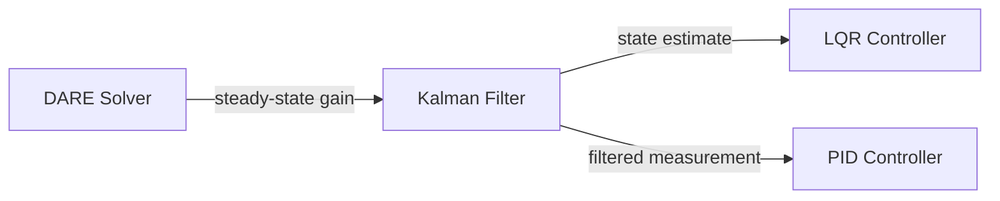

# Kalman Filter

## Overview & Motivation

In any real system, sensors are noisy and models are imperfect. The **Kalman filter** answers a deceptively simple question: *given a noisy measurement and an imperfect prediction, what is the best estimate of the true state?*

The answer is an optimal, recursive, minimum-variance estimator for linear systems with Gaussian noise. At each time step it performs two operations:

1. **Predict** — propagate the state and covariance forward using the system model.
2. **Update** — correct the prediction using the new measurement, weighted by the *Kalman gain*, which automatically balances trust in the model vs. trust in the sensor.

The filter is computationally lightweight (matrix operations on small state vectors), requires no storage of past measurements, and adapts its confidence in real time via the covariance matrix.

## Mathematical Theory

### State-Space Model

Discrete-time linear system with process noise $w$ and measurement noise $v$:

$$x_k = F_{k-1} x_{k-1} + B_{k-1} u_{k-1} + w_{k-1}, \quad w \sim \mathcal{N}(0, Q)$$
$$z_k = H_k x_k + v_k, \quad v \sim \mathcal{N}(0, R)$$

where:
- $x_k \in \mathbb{R}^n$ — state vector
- $z_k \in \mathbb{R}^m$ — measurement vector
- $F$ — state transition matrix ($n \times n$)
- $B$ — control input matrix ($n \times l$)
- $H$ — measurement matrix ($m \times n$)
- $Q$ — process noise covariance ($n \times n$)
- $R$ — measurement noise covariance ($m \times m$)

### Predict Step

$$\hat{x}_k^- = F_{k-1} \hat{x}_{k-1}$$
$$P_k^- = F_{k-1} P_{k-1} F_{k-1}^T + Q_{k-1}$$

### Update Step

$$y_k = z_k - H_k \hat{x}_k^- \qquad \text{(innovation)}$$
$$S_k = H_k P_k^- H_k^T + R_k \qquad \text{(innovation covariance)}$$
$$K_k = P_k^- H_k^T S_k^{-1} \qquad \text{(Kalman gain)}$$
$$\hat{x}_k = \hat{x}_k^- + K_k y_k \qquad \text{(state update)}$$
$$P_k = (I - K_k H_k) P_k^- \qquad \text{(covariance update)}$$

### Optimality

The Kalman filter is the **minimum mean-square error (MMSE)** estimator among all linear estimators. Under the assumption that $w$ and $v$ are Gaussian, it is also the MMSE among *all* estimators (linear or not).

## Complexity Analysis

| Operation | Time | Space | Notes |
|-----------|------|-------|-------|
| Predict | $O(n^2)$ | $O(n^2)$ | Matrix multiply $F P F^T$ |
| Update | $O(n^2 m + m^3)$ | $O(nm)$ | Dominated by $S^{-1}$ ($m \times m$ inversion) and gain computation |
| Total per step | $O(n^2 m + m^3)$ | $O(n^2 + nm)$ | For $m \ll n$, approximately $O(n^2)$ |

For typical embedded use with $n \leq 10$ and $m \leq 5$, each step completes in microseconds.

## Step-by-Step Walkthrough

**System:** Estimating position and velocity from noisy position measurements.

State: $x = \begin{bmatrix} \text{position} \\ \text{velocity} \end{bmatrix}$, $\Delta t = 1$ s.

$$F = \begin{bmatrix} 1 & 1 \\ 0 & 1 \end{bmatrix}, \quad H = \begin{bmatrix} 1 & 0 \end{bmatrix}, \quad Q = \begin{bmatrix} 0.1 & 0 \\ 0 & 0.1 \end{bmatrix}, \quad R = [1]$$

**Initial:** $\hat{x}_0 = [0, 0]^T$, $P_0 = \begin{bmatrix} 10 & 0 \\ 0 & 10 \end{bmatrix}$

**Measurement:** $z_1 = 1.2$ (true position = 1.0)

**Predict:**

$$\hat{x}_1^- = \begin{bmatrix} 1 & 1 \\ 0 & 1 \end{bmatrix} \begin{bmatrix} 0 \\ 0 \end{bmatrix} = \begin{bmatrix} 0 \\ 0 \end{bmatrix}$$

$$P_1^- = F P_0 F^T + Q = \begin{bmatrix} 20.1 & 10 \\ 10 & 10.1 \end{bmatrix}$$

**Update:**

$$y_1 = 1.2 - [1\; 0] \begin{bmatrix} 0 \\ 0 \end{bmatrix} = 1.2$$

$$S_1 = H P_1^- H^T + R = 20.1 + 1 = 21.1$$

$$K_1 = P_1^- H^T / S_1 = \begin{bmatrix} 20.1 \\ 10 \end{bmatrix} / 21.1 = \begin{bmatrix} 0.953 \\ 0.474 \end{bmatrix}$$

$$\hat{x}_1 = \begin{bmatrix} 0 \\ 0 \end{bmatrix} + \begin{bmatrix} 0.953 \\ 0.474 \end{bmatrix} \cdot 1.2 = \begin{bmatrix} 1.143 \\ 0.569 \end{bmatrix}$$

The filter quickly moves toward the measurement because the initial covariance $P_0$ is large (low confidence). Over subsequent steps, $P$ shrinks and the gain decreases — the filter becomes more reliant on the model.

## Pitfalls & Edge Cases

- **Model mismatch.** If the true system is nonlinear or the noise is non-Gaussian, the Kalman filter is suboptimal. Consider the Extended Kalman Filter (EKF) or Unscented Kalman Filter (UKF) for moderate nonlinearities.
- **Covariance divergence.** Numerical errors can cause $P$ to lose positive-definiteness over time. Symmetrize $P$ after each update; consider a square-root or UD factorization form for long-running filters.
- **Tuning $Q$ and $R$.** These are rarely known exactly. Increasing $Q$ makes the filter more responsive (trusts model less); increasing $R$ makes it smoother (trusts measurements less). Tune empirically or use adaptive methods.
- **Innovation covariance singularity.** If $S_k$ is singular, the measurement does not provide new information in some direction. Regularize $R$ or reduce the measurement model.
- **Missing measurements.** If no measurement is available, skip the update step entirely and only predict. The covariance will grow, correctly reflecting increasing uncertainty.
- **Fixed-point caution.** Matrix inversions and multiplications in the update step can overflow Q15/Q31 ranges. Use floating-point or carefully scale all matrices.

## Variants & Generalizations

| Variant | Key Difference |
|---------|---------------|
| **Extended Kalman Filter (EKF)** | Linearizes nonlinear $f(x)$ and $h(x)$ around the current estimate |
| **Unscented Kalman Filter (UKF)** | Propagates sigma points through nonlinearities; avoids explicit Jacobians |
| **Square-root Kalman Filter** | Maintains $\sqrt{P}$ instead of $P$ for improved numerical stability |
| **Information Filter** | Works with the inverse covariance (information matrix); better for multi-sensor fusion |
| **Kalman Smoother** | Uses future measurements to refine past estimates (offline, non-causal) |
| **Adaptive Kalman Filter** | Estimates $Q$ and $R$ online from innovation statistics |

## Applications

- **GPS/INS navigation** — Fusing inertial measurements (high rate, drifty) with GPS (low rate, noisy).
- **Object tracking** — Radar, lidar, or camera-based tracking of moving targets.
- **Sensor fusion** — Combining accelerometer, gyroscope, and magnetometer for attitude estimation.
- **Process control** — State estimation for model-based controllers (LQG = [LQR](../controllers/Lqr.md) + Kalman).
- **Battery state-of-charge estimation** — Estimating internal states from voltage and current measurements.
- **Econometrics** — Estimating latent economic variables from noisy indicators.

## Connections to Other Algorithms

| Algorithm | Relationship |
|-----------|-------------|
| [LQR Controller](../controllers/Lqr.md) | The Kalman filter + LQR = LQG (Linear Quadratic Gaussian), the separation principle |
| [DARE Solver](../solvers/DiscreteAlgebraicRiccatiEquation.md) | The steady-state Kalman gain can be found by solving a DARE (dual of the LQR DARE) |
| [PID Controller](../controllers/Pid.md) | Kalman-filtered measurements can serve as the PID's process variable input |

## References & Further Reading

- Kalman, R.E., "A New Approach to Linear Filtering and Prediction Problems", *Journal of Basic Engineering*, 82(1), 1960.
- Simon, D., *Optimal State Estimation: Kalman, H∞, and Nonlinear Approaches*, Wiley, 2006.
- Bar-Shalom, Y., Li, X.R. and Kirubarajan, T., *Estimation with Applications to Tracking and Navigation*, Wiley, 2001.
