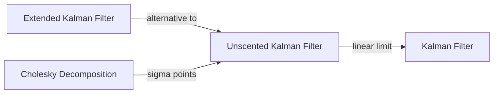

# Unscented Kalman Filter

## Overview & Motivation

The Extended Kalman Filter (EKF) linearizes nonlinearities using Jacobians. This works well for mild nonlinearities, but the first-order approximation can introduce significant errors when:

- The nonlinear functions are highly curved (large second derivatives).
- The state uncertainty is large (the linearization point is far from the true state).
- Jacobians are difficult or expensive to derive analytically.

The **Unscented Kalman Filter (UKF)** addresses all three problems by replacing linearization with a **deterministic sampling** approach. Instead of approximating the nonlinear function, it approximates the *probability distribution* by choosing a small set of carefully weighted sample points — called **sigma points** — and propagating them through the true nonlinear function. The statistics (mean and covariance) are then reconstructed from the transformed points.

This captures the true mean and covariance to **second-order accuracy** for any nonlinearity, without computing a single Jacobian.

## Mathematical Theory

### Sigma Point Generation

Given state estimate $\hat{x} \in \mathbb{R}^n$ and covariance $P$, generate $2n+1$ sigma points:

$$\sigma_0 = \hat{x}$$
$$\sigma_i = \hat{x} + \left(\sqrt{(n + \lambda) P}\right)_i, \quad i = 1, \ldots, n$$
$$\sigma_{i+n} = \hat{x} - \left(\sqrt{(n + \lambda) P}\right)_i, \quad i = 1, \ldots, n$$

where $\left(\sqrt{M}\right)_i$ denotes the $i$-th column of the matrix square root (Cholesky decomposition $M = LL^T$, using columns of $L$), and:

$$\lambda = \alpha^2 (n + \kappa) - n$$

### Weights

$$w_0^{(m)} = \frac{\lambda}{n + \lambda}, \quad w_0^{(c)} = \frac{\lambda}{n + \lambda} + (1 - \alpha^2 + \beta)$$
$$w_i^{(m)} = w_i^{(c)} = \frac{1}{2(n + \lambda)}, \quad i = 1, \ldots, 2n$$

Parameters:
- $\alpha$: Controls spread of sigma points ($10^{-4} \leq \alpha \leq 1$). Smaller values keep points closer to the mean.
- $\beta$: Incorporates prior knowledge about the distribution ($\beta = 2$ is optimal for Gaussian).
- $\kappa$: Secondary scaling parameter (typically $\kappa = 0$ or $\kappa = 3 - n$).

### Predict Step

1. Propagate sigma points through the nonlinear state transition:

$$\sigma_i^* = f(\sigma_i, u)$$

2. Reconstruct predicted state and covariance:

$$\hat{x}_k^- = \sum_{i=0}^{2n} w_i^{(m)} \sigma_i^*$$
$$P_k^- = \sum_{i=0}^{2n} w_i^{(c)} (\sigma_i^* - \hat{x}_k^-)(\sigma_i^* - \hat{x}_k^-)^T + Q$$

### Update Step

1. Generate new sigma points from the predicted state $\hat{x}_k^-$ and $P_k^-$.

2. Transform sigma points through the measurement function:

$$z_i = h(\sigma_i)$$

3. Predicted measurement and covariances:

$$\hat{z}_k = \sum_{i=0}^{2n} w_i^{(m)} z_i$$
$$S_k = \sum_{i=0}^{2n} w_i^{(c)} (z_i - \hat{z}_k)(z_i - \hat{z}_k)^T + R$$
$$P_{xz} = \sum_{i=0}^{2n} w_i^{(c)} (\sigma_i - \hat{x}_k^-)(z_i - \hat{z}_k)^T$$

4. Kalman gain and state update:

$$K_k = P_{xz} S_k^{-1}$$
$$\hat{x}_k = \hat{x}_k^- + K_k (z_k - \hat{z}_k)$$
$$P_k = P_k^- - K_k S_k K_k^T$$

## Complexity Analysis

| Operation            | Time                  | Space         | Notes                                            |
|----------------------|-----------------------|---------------|--------------------------------------------------|
| Sigma point gen      | $O(n^3)$              | $O(n^2)$      | Dominated by Cholesky decomposition              |
| State propagation    | $O((2n+1) \cdot c_f)$ | $O(n^2)$      | $c_f$ = cost of evaluating $f(x)$                |
| Mean/cov reconstruct | $O(n^2 \cdot (2n+1))$ | $O(n^2)$      | Weighted outer products                          |
| Update               | $O(n^2 m + m^3)$      | $O(nm)$       | Same as standard Kalman for the gain computation |
| Total per step       | $O(n^3 + n^2 m)$      | $O(n^2 + nm)$ | Cholesky and sigma point propagation dominate    |

For $n \leq 10$, the additional cost over EKF is small — and the elimination of Jacobian derivation is a significant engineering benefit.

## Step-by-Step Walkthrough

**System:** Same pendulum as the EKF example, $x = [\theta, \dot\theta]^T$, $n = 2$, $\Delta t = 0.1$ s.

**Parameters:** $\alpha = 0.1$, $\beta = 2$, $\kappa = 0$ → $\lambda = -1.98$.

**Initial:** $\hat{x}_0 = [0.3, 0]^T$, $P_0 = \text{diag}(0.5, 0.5)$.

1. **Generate 5 sigma points** from $\hat{x}_0$ and $P_0$ using Cholesky of $P_0$.
2. **Propagate** each sigma point through $f(x)$ (pendulum dynamics).
3. **Reconstruct** $\hat{x}_1^-$ and $P_1^-$ from the weighted transformed points.
4. **Generate new sigma points** from $\hat{x}_1^-$ and $P_1^-$.
5. **Transform** through $h(x) = \theta$ for the measurement update.
6. **Compute** $S$, $P_{xz}$, $K$ and update state and covariance.

The UKF naturally captures the curvature of $-\sin\theta$ without computing $\cos\theta$ — the sigma points "feel" the nonlinearity directly.

## Pitfalls & Edge Cases

- **Covariance non-positive-definiteness.** Numerical errors or extreme sigma point spread can make $P$ lose positive-definiteness, causing the Cholesky decomposition to fail. Use a small regularization term or the square-root UKF variant.
- **Alpha tuning.** Very small $\alpha$ (e.g., $10^{-4}$) can cause the zeroth weight $w_0^{(c)}$ to be negative, leading to negative covariance contributions. Larger $\alpha$ (e.g., $0.1$) is safer for low-dimensional systems.
- **Sigma point overflow.** For fixed-point types, the scaled columns $\sqrt{(n+\lambda)P}$ may exceed the representable range. Use float for the UKF or carefully bound the covariance.
- **Non-Gaussian distributions.** The UKF assumes a Gaussian approximation. For multi-modal or heavily skewed distributions, consider particle filters.
- **Computational cost.** For large state dimensions ($n > 20$), the $2n+1$ sigma points and $O(n^3)$ Cholesky become significant. Consider sparsification or reduced-rank approximations.

## Variants & Generalizations

- **Square-Root UKF (SR-UKF).** Propagates the Cholesky factor $S$ (where $P = SS^T$) instead of $P$ directly, using QR decompositions and rank-1 Cholesky updates. Guarantees positive-definiteness and improves numerical stability.
- **Augmented UKF.** Augments the state vector with the process and measurement noise vectors, generating sigma points in the joint space. Captures correlations between state and noise at the cost of more sigma points ($2(n + n_w + n_v) + 1$).
- **Reduced Sigma Point Filters.** Use fewer than $2n + 1$ sigma points (e.g., the Spherical Simplex UKF uses $n + 2$ points) to reduce computation for large state dimensions.
- **UKF with Control Input.** The state transition becomes $f(x, u)$ and each sigma point is propagated as $f(\sigma_i, u)$. Supported in the implementation via the `ControlSize` template parameter.
- **Cubature Kalman Filter (CKF).** A special case of the UKF with $\alpha = 1$, $\beta = 0$, $\kappa = 0$, using third-degree spherical-radial cubature rules. Simpler weight computation with no negative weights.

## Comparison with Other Filters

| Filter        | Jacobian Required? | Accuracy Order | Handles High Nonlinearity? | Computational Cost |
|---------------|--------------------|----------------|----------------------------|--------------------|
| Kalman Filter | No (linear only)   | Exact (linear) | No                         | Lowest             |
| EKF           | Yes                | 1st order      | Moderate                   | Low                |
| **UKF**       | No                 | 2nd order      | Good                       | Moderate           |
| Particle      | No                 | Arbitrary      | Excellent                  | High               |

## Applications

- **Attitude estimation** — Quaternion-based orientation estimation (avoiding gimbal lock and Jacobian complexity).
- **Target tracking** — Radar/lidar tracking with range-bearing measurements (highly nonlinear in Cartesian coordinates).
- **Robotics** — State estimation for mobile robots and manipulators with nonlinear kinematics.
- **Chemical processes** — Concentration estimation in nonlinear reaction kinetics.
- **Power systems** — Dynamic state estimation in electrical grids with nonlinear power flow equations.

## Connections to Other Algorithms

| Algorithm                                                        | Relationship                                                                          |
|------------------------------------------------------------------|---------------------------------------------------------------------------------------|
| [Kalman Filter](KalmanFilter.md)                                 | The UKF reduces to the standard KF when $f$ and $h$ are linear                        |
| [Extended Kalman Filter](ExtendedKalmanFilter.md)                | Uses Jacobians instead of sigma points; simpler but less accurate for nonlinear cases |
| [Cholesky Decomposition](../../solvers/CholeskyDecomposition.md) | Used internally to generate sigma points from the covariance matrix                   |

## References & Further Reading

- Julier, S.J. and Uhlmann, J.K., "A New Extension of the Kalman Filter to Nonlinear Systems", in *Proc. AeroSense*, 1997.
- Julier, S.J. and Uhlmann, J.K., "Unscented Filtering and Nonlinear Estimation", *Proceedings of the IEEE*, 92(3), 2004.
- Wan, E.A. and van der Merwe, R., "The Unscented Kalman Filter for Nonlinear Estimation", in *Proc. IEEE Adaptive Systems for Signal Processing*, 2000.
- Simon, D., *Optimal State Estimation: Kalman, H∞, and Nonlinear Approaches*, Wiley, 2006 — Chapter 14.
