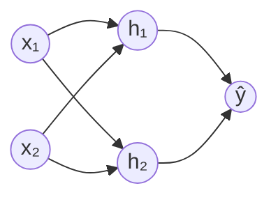
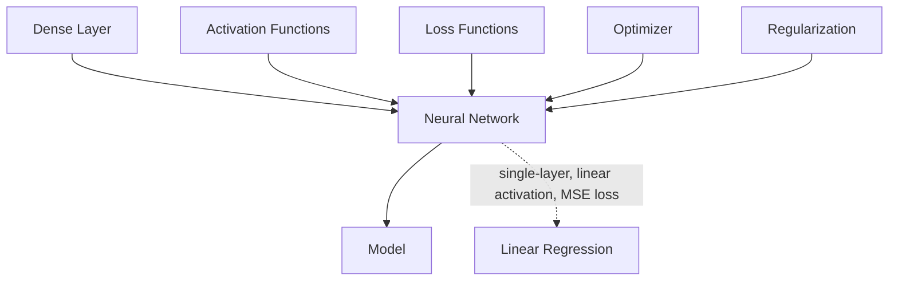

# Neural Networks

## Overview & Motivation

A neural network is a parameterized function $f_\theta: \mathbb{R}^n \to \mathbb{R}^m$ built by composing simple, differentiable transformations called **layers**. Each layer applies an affine map followed by a non-linear activation, and the whole composition is trained end-to-end by gradient-based optimization.

Neural networks are powerful because of the **universal approximation theorem**: a single hidden layer with enough neurons can approximate any continuous function on a compact set to arbitrary accuracy. In practice, *depth* (many layers) is more parameter-efficient than width for learning hierarchical features.

This library provides a minimal, statically-sized neural network framework designed for **embedded inference and on-device training** — no heap allocation, no dynamic shapes, full compile-time dimension checking.

## Mathematical Theory

### Forward Propagation

Given $L$ layers, the network computes:

$$a_0 = x$$
$$z_\ell = W_\ell \, a_{\ell-1} + b_\ell, \quad \ell = 1, \ldots, L$$
$$a_\ell = f_\ell(z_\ell)$$
$$\hat{y} = a_L$$

where $W_\ell \in \mathbb{R}^{n_\ell \times n_{\ell-1}}$ are weights, $b_\ell \in \mathbb{R}^{n_\ell}$ are biases, and $f_\ell$ is the activation function for layer $\ell$.

### Loss Function

Training minimizes a scalar loss $\mathcal{L}(\hat{y}, y)$ that measures how far the prediction $\hat{y}$ is from the target $y$. Common choices:

| Loss | Formula | Use Case |
|------|---------|----------|
| MSE | $\frac{1}{m}\sum(\hat{y}_i - y_i)^2$ | Regression |
| BCE | $-\sum[y_i \log \hat{y}_i + (1-y_i)\log(1-\hat{y}_i)]$ | Binary classification |
| CCE | $-\sum y_i \log \hat{y}_i$ | Multi-class classification |

### Backpropagation

Backpropagation efficiently computes $\nabla_\theta \mathcal{L}$ via the chain rule, working from the output layer backward:

$$\delta_L = \nabla_{a_L}\mathcal{L} \odot f_L'(z_L)$$
$$\delta_\ell = (W_{\ell+1}^T \delta_{\ell+1}) \odot f_\ell'(z_\ell)$$

The gradients with respect to parameters are:

$$\frac{\partial \mathcal{L}}{\partial W_\ell} = \delta_\ell \, a_{\ell-1}^T, \qquad \frac{\partial \mathcal{L}}{\partial b_\ell} = \delta_\ell$$

### Parameter Update

An optimizer uses the gradients to update the parameter vector $\theta$:

$$\theta_{t+1} = \theta_t - \eta \, \nabla_\theta \mathcal{L}$$

where $\eta$ is the learning rate. More sophisticated optimizers (momentum, Adam) modify this basic rule.

## Complexity Analysis

| Phase | Time | Space |
|-------|------|-------|
| Forward pass | $O\!\left(\sum_{\ell=1}^L n_\ell \cdot n_{\ell-1}\right)$ | $O\!\left(\sum n_\ell\right)$ activations |
| Backward pass | Same as forward | Same + gradient storage |
| Parameter update | $O(P)$ | $O(P)$ optimizer state |

where $P = \sum_\ell (n_\ell \cdot n_{\ell-1} + n_\ell)$ is the total parameter count. For small embedded networks ($P < 10{,}000$), both passes complete in microseconds.

## Step-by-Step Walkthrough

**Network:** 2 inputs → 2 hidden (ReLU) → 1 output (Sigmoid). Learning XOR.

**Architecture:**

**Epoch 0 — Forward pass** with input $x = [1, 0]^T$, target $y = 1$:

| Step | Computation | Result |
|------|-------------|--------|
| Hidden pre-activation | $z_1 = W_1 x + b_1$ | $[0.3, -0.1]^T$ |
| Hidden activation | $a_1 = \text{ReLU}(z_1)$ | $[0.3, 0.0]^T$ |
| Output pre-activation | $z_2 = W_2 a_1 + b_2$ | $[0.15]$ |
| Output activation | $\hat{y} = \sigma(z_2)$ | $[0.537]$ |
| Loss | $\mathcal{L} = -(y\log\hat{y} + (1-y)\log(1-\hat{y}))$ | $0.621$ |

**Epoch 0 — Backward pass:**

| Step | Computation | Result |
|------|-------------|--------|
| Output gradient | $\delta_2 = \hat{y} - y$ | $[-0.463]$ |
| $\nabla W_2$ | $\delta_2 \cdot a_1^T$ | $[-0.139, 0]$ |
| Hidden gradient | $\delta_1 = W_2^T \delta_2 \odot \text{ReLU}'(z_1)$ | $[-0.231, 0]^T$ |
| $\nabla W_1$ | $\delta_1 \cdot x^T$ | $[[-0.231, 0], [0, 0]]$ |

**Update:** $W \leftarrow W - 0.1 \cdot \nabla W$. After ~500 epochs, the network correctly classifies all four XOR inputs.

## Pitfalls & Edge Cases

- **Vanishing gradients.** Deep networks with Sigmoid or Tanh activations suffer exponential gradient decay. Prefer ReLU-family activations in hidden layers.
- **Exploding gradients.** Large weights amplify gradients exponentially. Use proper weight initialization (Xavier/He) and gradient clipping.
- **Dead neurons.** ReLU neurons that receive only negative inputs output zero forever. LeakyReLU mitigates this.
- **Fixed-point saturation.** In Q15/Q31, activations and gradients must stay within $[-1, 1)$. Scale inputs and learning rates accordingly.
- **Learning rate sensitivity.** Too high → divergence; too low → no progress. Start with $\eta = 0.01$ and adjust.
- **Overfitting.** Small embedded datasets are easily memorized. Apply [regularization](regularization/Regularization.md) (L2 weight decay).

## Variants & Generalizations

| Variant | Key Difference |
|---------|---------------|
| **Convolutional Neural Network (CNN)** | Layers share weights spatially; efficient for image/signal data |
| **Recurrent Neural Network (RNN)** | Layers share weights across time steps; models sequences |
| **Residual Network (ResNet)** | Skip connections mitigate vanishing gradients in very deep networks |
| **Transformer** | Attention-based; no recurrence; state-of-the-art for sequences |
| **Quantized Neural Network** | Weights and activations in low-bit integers; optimal for MCU deployment |

## Applications

- **Function approximation** — Learning arbitrary input-output mappings from data.
- **Classification** — Mapping inputs to discrete categories (fault detection, gesture recognition).
- **Regression** — Predicting continuous values (sensor calibration, system identification).
- **Control** — Neural network policies for model-free or model-predictive control on embedded targets.
- **Signal processing** — Learned filters replacing hand-designed FIR/IIR chains.

## Connections to Other Algorithms

| Component | Relationship |
|-----------|-------------|
| [Dense Layer](layer/Layer.md) | The fundamental building block; computes affine transformations |
| [Activation Functions](activation/Activation.md) | Introduce non-linearity after each layer |
| [Loss Functions](losses/Loss.md) | Define the training objective |
| [Optimizer](optimizer/Optimizer.md) | Drives parameter updates via gradient descent |
| [Regularization](regularization/Regularization.md) | Penalizes complexity to prevent overfitting |
| [Model](model/Model.md) | Composes layers into a trainable pipeline |
| [Linear Regression](../estimators/LinearRegression.md) | Special case: single layer, identity activation, MSE loss |

## References & Further Reading

- Goodfellow, I., Bengio, Y., and Courville, A., *Deep Learning*, MIT Press, 2016 — Chapters 6–8.
- He, K. et al., "Delving deep into rectifiers: Surpassing human-level performance on ImageNet classification", *ICCV*, 2015 — He initialization.
- Rumelhart, D.E., Hinton, G.E., and Williams, R.J., "Learning representations by back-propagating errors", *Nature*, 323, 1986.
