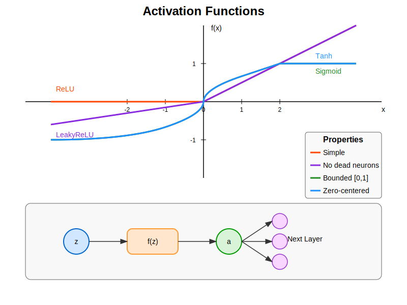

# Activation Functions Implementation Guide

## Process Overview

The following diagram illustrates the role of activation functions in a neural network:



The diagram shows how activation functions:
1. Transform linear outputs into non-linear representations
2. Enable the network to learn complex patterns
3. Control signal flow and introduce non-linearity
4. Have unique characteristics that affect gradient flow

## Mathematical Background

### Activation Function Role

Activation functions introduce non-linearity into neural networks. Without them, a neural network would be equivalent to a single linear transformation, regardless of its depth. For a neuron with weighted input z, the activation function f transforms this input:

$$a = f(z) = f(w \cdot x + b)$$

where:
- z is the weighted input (w · x + b)
- f is the activation function
- a is the neuron's output

### Derivatives for Backpropagation

During backpropagation, the derivative of the activation function is crucial for computing gradients. If we denote the loss as L, then:

$$\frac{\partial L}{\partial z} = \frac{\partial L}{\partial a} \cdot \frac{\partial a}{\partial z} = \frac{\partial L}{\partial a} \cdot f'(z)$$

This is why each activation function provides both `Forward` and `Backward` methods in the implementation.

## Implementation Details

### Class Structure

```cpp
template<typename QNumberType>
class ActivationFunction
{
    static_assert(math::is_qnumber<QNumberType>::value || std::is_floating_point<QNumberType>::value,
        "ActivationFunction can only be instantiated with math::QNumber types.");

public:
    virtual QNumberType Forward(QNumberType x) const = 0;
    virtual QNumberType Backward(QNumberType x) const = 0;
};
```

### Key Implementations

1. **ReLU (Rectified Linear Unit)**:
   - Simple, efficient activation function
   - Mitigates vanishing gradient problem
   - May cause "dying neurons" with zero gradients
   
   ```cpp
   template<typename QNumberType>
   class ReLU : public ActivationFunction<QNumberType>
   {
   public:
       QNumberType Forward(QNumberType x) const override
       {
           return x > QNumberType(0.0f) ? x : QNumberType(0.0f);
       }
       
       QNumberType Backward(QNumberType x) const override
       {
           return x > QNumberType(0.0f) ? QNumberType(0.9999f) : QNumberType(0.0f);
       }
   };
   ```

2. **LeakyReLU**:
   - Addresses the "dying neuron" problem of ReLU
   - Small positive slope for negative inputs
   - Parameterized by alpha (leak coefficient)
   
   ```cpp
   template<typename QNumberType>
   class LeakyReLU : public ActivationFunction<QNumberType>
   {
   public:
       explicit LeakyReLU(QNumberType alpha = QNumberType(0.01f))
           : alpha(alpha)
       {}
       
       QNumberType Forward(QNumberType x) const override
       {
           return x > QNumberType(0.0f) ? x : alpha * x;
       }
       
       QNumberType Backward(QNumberType x) const override
       {
           return x > QNumberType(0.0f) ? QNumberType(0.9999f) : alpha;
       }
       
   private:
       QNumberType alpha;
   };
   ```

3. **Sigmoid**:
   - Squashes inputs to range (0, 1)
   - Historically common but prone to vanishing gradients
   - Useful for binary classification output nodes
   
   ```cpp
   template<typename QNumberType>
   class Sigmoid : public ActivationFunction<QNumberType>
   {
   public:
       QNumberType Forward(QNumberType x) const override
       {
           return QNumberType(1.0f / (1.0f + std::exp(-math::ToFloat(x))));
       }
       
       QNumberType Backward(QNumberType x) const override
       {
           QNumberType y = Forward(x);
           return y * (QNumberType(0.9999f) - y);
       }
   };
   ```

4. **Tanh (Hyperbolic Tangent)**:
   - Squashes inputs to range (-1, 1)
   - Zero-centered output, unlike Sigmoid
   - Still vulnerable to vanishing gradients at extremes
   
   ```cpp
   template<typename QNumberType>
   class Tanh : public ActivationFunction<QNumberType>
   {
   public:
       QNumberType Forward(QNumberType x) const override
       {
           return QNumberType(std::tanh(math::ToFloat(x)));
       }
       
       QNumberType Backward(QNumberType x) const override
       {
           QNumberType y = Forward(x);
           return QNumberType(0.9999f) - y * y;
       }
   };
   ```

5. **Softmax**:
   - Converts vector of real numbers to probability distribution
   - Typically used for multi-class classification output
   - Note: Current implementation is per-element; in practice, should be applied to vectors
   
   ```cpp
   template<typename QNumberType>
   class Softmax : public ActivationFunction<QNumberType>
   {
   public:
       QNumberType Forward(QNumberType x) const override
       {
           return QNumberType(std::exp(math::ToFloat(x)));
       }
       
       QNumberType Backward(QNumberType x) const override
       {
           QNumberType y = Forward(x);
           return y * (QNumberType(0.9999f) - y);
       }
   };
   ```

## Usage Guide

### Basic Usage

```cpp
// Create activation functions
ReLU<float> relu;
LeakyReLU<float> leakyRelu(0.1f);
Sigmoid<float> sigmoid;
Tanh<float> tanh;
Softmax<float> softmax;

// Apply to a single value
float x = -1.5f;
float activated_relu = relu.Forward(x);       // 0.0
float activated_leaky = leakyRelu.Forward(x); // -0.15
float activated_sig = sigmoid.Forward(x);     // 0.182
float activated_tanh = tanh.Forward(x);       // -0.905
float activated_soft = softmax.Forward(x);    // 0.223

// For backpropagation
float grad_relu = relu.Backward(x);           // 0.0
float grad_leaky = leakyRelu.Backward(x);     // 0.1
float grad_sig = sigmoid.Backward(x);         // 0.149
float grad_tanh = tanh.Backward(x);           // 0.181
float grad_soft = softmax.Backward(x);        // 0.174
```

## Best Practices

1. **Activation Function Selection**:
   - Use ReLU as a default for hidden layers (fast, efficient)
   - Consider LeakyReLU for deep networks (prevents dying neurons)
   - Use Sigmoid for binary classification output layer
   - Use Softmax for multi-class classification output layer
   - Use Tanh when zero-centered outputs are beneficial

2. **Implementation Considerations**:
   - Ensure numerical stability with capping/checks
   - Note that current Backward implementation uses x not y in most cases
   - Consider performance vs. accuracy trade-offs

3. **Potential Issues**:
   - Vanishing gradients with Sigmoid/Tanh in deep networks
   - Dead neurons with ReLU (no gradient for negative inputs)
   - Softmax implementation requires vector-level operation in practice

## Common Activation Functions Comparison

| Function   | Range       | Advantages                       | Disadvantages                    |
|------------|-------------|----------------------------------|----------------------------------|
| ReLU       | [0, ∞)      | Fast, reduces vanishing gradient | Dead neurons                     |
| LeakyReLU  | (-∞, ∞)     | Prevents dead neurons            | Additional hyperparameter        |
| Sigmoid    | (0, 1)      | Smooth, bounded output           | Vanishing gradient, not centered |
| Tanh       | (-1, 1)     | Zero-centered                    | Vanishing gradient at extremes   |
| Softmax    | (0, 1)      | Probability distribution         | Computationally expensive        |

## Performance Considerations

1. **Computation Efficiency**:
   - ReLU and LeakyReLU are fastest (simple comparisons)
   - Sigmoid, Tanh, and Softmax use expensive exponential operations
   - Consider lookup tables for fixed-point implementations

2. **Numeric Stability**:
   - Prevent overflow in exponential functions
   - Note the 0.9999f cap in gradient calculations
   - Consider range limitations for activation functions

3. **Memory Usage**:
   - Most activation functions are stateless (except LeakyReLU's alpha)
   - Minimal memory footprint

## Limitations and Future Improvements

1. Current limitations:
   - Element-wise application (especially for Softmax)
   - Fixed implementation of derivatives
   - Limited to scalar operations

2. Possible extensions:
   - Vector-level activation functions
   - Additional functions (PReLU, ELU, GELU, Swish)
   - Optimized implementations for specific hardware
   - Adjustable parameters during training
   - Self-normalizing activation functions
   - Activation functions with memory (e.g., for recurrent networks)

## Error Handling

1. Static assertions verify:
   - Valid numeric types
   - Appropriate floating-point conversions

2. Implementation considerations:
   - Clamping gradients to prevent explosion
   - Ensuring numerical stability in exponential functions
   - Special handling for extreme input values
