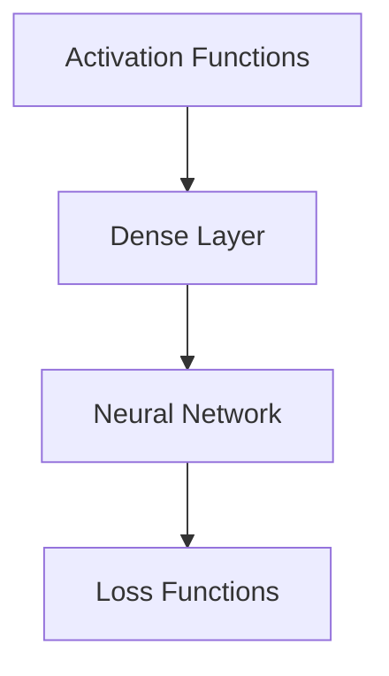

# Activation Functions

## Overview & Motivation

An activation function $f$ is a non-linear, element-wise transformation applied after the affine map in each neural network layer:

$$a = f(z) = f(W x + b)$$

Without activation functions, stacking layers would collapse into a single affine transformation — the network could only represent linear mappings regardless of depth. Activation functions are what give neural networks their expressive power.

The choice of activation function controls **gradient flow** during back-propagation, **output range**, and **computational cost** — all critical on resource-constrained embedded targets.

## Mathematical Theory

### Forward and Backward

Every activation function exposes two operations:

| Operation    | Definition | Purpose                                           |
|--------------|------------|---------------------------------------------------|
| **Forward**  | $a = f(z)$ | Transform the pre-activation                      |
| **Backward** | $f'(z)$    | Provide the local derivative for back-propagation |

The chain rule connects them during training:

$$\frac{\partial \mathcal{L}}{\partial z} = \frac{\partial \mathcal{L}}{\partial a} \cdot f'(z)$$

### Catalogue

#### ReLU (Rectified Linear Unit)

$$f(z) = \max(0, z), \qquad f'(z) = \begin{cases} 1 & z > 0 \\ 0 & z \le 0 \end{cases}$$

- Computationally cheapest (single comparison).
- Sparse activations accelerate training.
- **Risk:** neurons with $z \le 0$ for all inputs are permanently dead.

#### Leaky ReLU

$$f(z) = \begin{cases} z & z > 0 \\ \alpha z & z \le 0 \end{cases}, \qquad f'(z) = \begin{cases} 1 & z > 0 \\ \alpha & z \le 0 \end{cases}$$

where $\alpha$ is a small positive constant (typically $0.01$). Prevents dead neurons by allowing a small gradient for $z < 0$.

#### Sigmoid

$$f(z) = \frac{1}{1 + e^{-z}}, \qquad f'(z) = f(z)(1 - f(z))$$

- Output range $(0, 1)$ — natural for probabilities.
- **Risk:** saturates for $|z| \gg 0$, causing vanishing gradients.

#### Tanh (Hyperbolic Tangent)

$$f(z) = \tanh(z) = \frac{e^z - e^{-z}}{e^z + e^{-z}}, \qquad f'(z) = 1 - f(z)^2$$

- Output range $(-1, 1)$ — zero-centered, unlike Sigmoid.
- Same saturation problem as Sigmoid at extremes.

#### Softmax

For a vector $\mathbf{z} \in \mathbb{R}^k$:

$$f(z_i) = \frac{e^{z_i}}{\sum_{j=1}^{k} e^{z_j}}$$

- Outputs form a probability distribution ($\sum f(z_i) = 1$).
- Used exclusively at the output layer for multi-class classification.
- The Jacobian is a full $k \times k$ matrix — more expensive than element-wise activations.

## Complexity Analysis

| Activation | Forward (per element)          | Backward (per element)        | Notes                        |
|------------|--------------------------------|-------------------------------|------------------------------|
| ReLU       | $O(1)$ — comparison            | $O(1)$ — comparison           | Fastest                      |
| Leaky ReLU | $O(1)$ — comparison + multiply | $O(1)$                        | Negligible overhead vs ReLU  |
| Sigmoid    | $O(1)$ — exp + divide          | $O(1)$ — reuse forward result | Requires `exp()`             |
| Tanh       | $O(1)$ — exp (twice)           | $O(1)$ — reuse forward result | Requires `exp()`             |
| Softmax    | $O(k)$ — vector exp + sum      | $O(k^2)$ — full Jacobian      | Significantly more expensive |

## Step-by-Step Walkthrough

**Scenario:** Forward and backward pass through a 3-neuron hidden layer with ReLU, given pre-activations $z = [-0.5, \; 1.2, \; 0.0]$.

**Forward:**

| Neuron | $z$    | $\text{ReLU}(z)$ |
|--------|--------|------------------|
| 1      | $-0.5$ | $0.0$            |
| 2      | $1.2$  | $1.2$            |
| 3      | $0.0$  | $0.0$            |

**Backward** with incoming gradient $\frac{\partial \mathcal{L}}{\partial a} = [0.3, \; -0.7, \; 0.1]$:

| Neuron | $f'(z)$           | $\frac{\partial \mathcal{L}}{\partial z}$ |
|--------|-------------------|-------------------------------------------|
| 1      | $0$ (dead)        | $0.3 \times 0 = 0$                        |
| 2      | $1$               | $-0.7 \times 1 = -0.7$                    |
| 3      | $0$ (at boundary) | $0.1 \times 0 = 0$                        |

Neuron 1 is *dead* — its gradient is zero and its weights will not update. If this persists across all training samples, the neuron is permanently inactive.

## Pitfalls & Edge Cases

- **Vanishing gradients with Sigmoid/Tanh.** For deep networks, gradients shrink exponentially through saturated activations. Use ReLU or Leaky ReLU in hidden layers.
- **Dead ReLU neurons.** If a neuron's bias drifts negative enough that no input ever produces $z > 0$, it stops learning. Leaky ReLU or careful initialization (He init) prevents this.
- **Softmax numerical instability.** Computing $e^{z_i}$ directly overflows for large $z_i$. Subtract $\max(\mathbf{z})$ before exponentiation: $f(z_i) = e^{z_i - z_{\max}} / \sum e^{z_j - z_{\max}}$.
- **Fixed-point range.** Sigmoid outputs $(0, 1)$ and Tanh outputs $(-1, 1)$ both fit in Q15/Q31, but the exponential intermediate values do not. Compute in floating-point and convert.
- **Non-differentiable points.** ReLU is technically non-differentiable at $z = 0$. In practice, assigning $f'(0) = 0$ works fine.

## Variants & Generalizations

| Variant                      | Key Difference                                          |
|------------------------------|---------------------------------------------------------|
| **PReLU (Parametric ReLU)**  | $\alpha$ is a learnable parameter per channel           |
| **ELU (Exponential LU)**     | $\alpha(e^z - 1)$ for $z < 0$; smooth and zero-centered |
| **GELU (Gaussian Error LU)** | $z \cdot \Phi(z)$; used in Transformers                 |
| **Swish / SiLU**             | $z \cdot \sigma(z)$; smooth, non-monotonic              |
| **Hard Sigmoid / Hard Tanh** | Piece-wise linear approximations; no transcendentals    |

## Applications

- **Hidden layers** — ReLU (or Leaky ReLU) is the default choice for feed-forward and convolutional hidden layers.
- **Binary classification output** — Sigmoid maps the output to a probability.
- **Multi-class classification output** — Softmax produces a probability distribution.
- **Recurrent networks** — Tanh is traditionally used in LSTM/GRU gates.
- **Embedded inference** — Hard Sigmoid/Tanh avoid expensive `exp()` calls on MCUs without FPU.

## Connections to Other Algorithms

```mermaid
graph TD
    Act["Activation Functions"]
    Layer["Dense Layer"]
    NN["Neural Network"]
    Loss["Loss Functions"]
    Act --> Layer
    Layer --> NN
    NN --> Loss
```

| Component                             | Relationship                                                                             |
|---------------------------------------|------------------------------------------------------------------------------------------|
| [Dense Layer](../layer/Layer.md)      | Applies the activation function after the affine transformation                          |
| [Neural Network](../NeuralNetwork.md) | Activations enable the non-linear function approximation that makes deep networks useful |
| [Loss Functions](../losses/Loss.md)   | The output activation must match the loss: Sigmoid + BCE, Softmax + CCE                  |

## References & Further Reading

- Nair, V. and Hinton, G.E., "Rectified linear units improve restricted Boltzmann machines", *ICML*, 2010.
- Glorot, X., Bordes, A., and Bengio, Y., "Deep sparse rectifier neural networks", *AISTATS*, 2011.
- Clevert, D.-A., Unterthiner, T., and Hochreiter, S., "Fast and accurate deep network learning by exponential linear units (ELUs)", *ICLR*, 2016.
