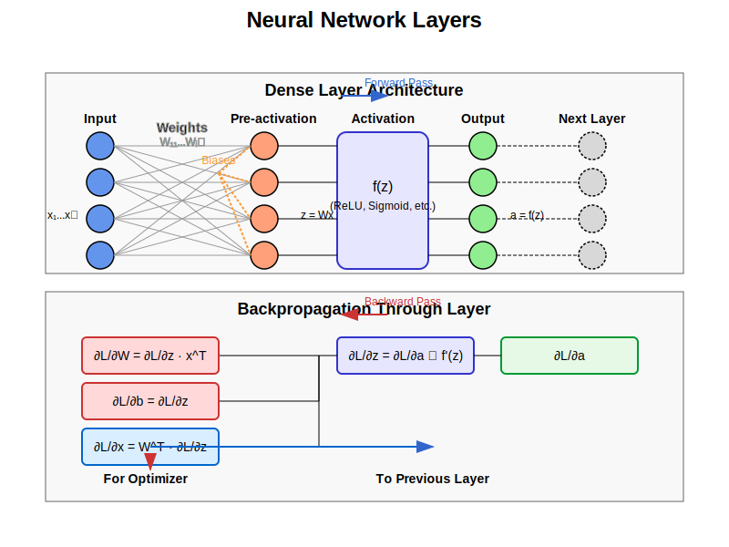

# Layer Implementation Guide

## Process Overview

The following diagram illustrates the structure and data flow of neural network layers:



The diagram shows how layers:
1. Transform input data through linear and non-linear operations
2. Process signals during forward and backward passes
3. Store and update parameters (weights and biases)
4. Connect to form the complete neural network architecture

## Mathematical Background

### Layer Operations

Each layer in a neural network applies a transformation to its input. For a fully connected (dense) layer with input vector x, the output vector y is computed as:

$$\mathbf{y} = f(\mathbf{W}\mathbf{x} + \mathbf{b})$$

where:
- W is the weight matrix
- b is the bias vector
- f is the activation function

### Backpropagation Through Layers

During backpropagation, each layer computes:
1. Gradient with respect to its input (for previous layer)
2. Gradients with respect to its parameters (for optimization)

For a dense layer, these are:

$$\frac{\partial L}{\partial \mathbf{x}} = \mathbf{W}^T \frac{\partial L}{\partial \mathbf{z}}$$

$$\frac{\partial L}{\partial \mathbf{W}} = \frac{\partial L}{\partial \mathbf{z}} \mathbf{x}^T$$

$$\frac{\partial L}{\partial \mathbf{b}} = \frac{\partial L}{\partial \mathbf{z}}$$

where:
- L is the loss function
- z = Wx + b is the pre-activation output
- ∂L/∂z is the gradient of the loss with respect to the pre-activation output

## Implementation Details

### Class Structure

```cpp
template<typename QNumberType, std::size_t InputSize_, std::size_t OutputSize_, std::size_t ParameterSize_>
class Layer
{
public:
    using InputVector = math::Matrix<QNumberType, InputSize_, 1>;
    using OutputVector = math::Matrix<QNumberType, OutputSize_, 1>;
    using ParameterVector = math::Matrix<QNumberType, ParameterSize_, 1>;

    static constexpr std::size_t InputSize = InputSize_;
    static constexpr std::size_t OutputSize = OutputSize_;
    static constexpr std::size_t ParameterSize = ParameterSize_;

    virtual void Forward(const InputVector& input) = 0;
    virtual InputVector& Backward(const OutputVector& output_gradient) = 0;
    virtual ParameterVector& Parameters() const = 0;
    virtual void SetParameters(const ParameterVector& parameters) = 0;
};
```

### Key Implementations

1. **Dense Layer**:
   - Fully connected layer with weights, biases, and activation function
   - Linear transformation followed by non-linear activation
   - Parameters include weights and biases
   **Mathematical Forward Pass:**
   $$\mathbf{z} = \mathbf{W}\mathbf{x} + \mathbf{b}$$
   $$\mathbf{a} = f(\mathbf{z})$$
   **Mathematical Backward Pass:**
   $$\frac{\partial L}{\partial \mathbf{z}} = \frac{\partial L}{\partial \mathbf{a}} \odot f'(\mathbf{z})$$
   $$\frac{\partial L}{\partial \mathbf{W}_{i,j}} = \frac{\partial L}{\partial \mathbf{z}_i} \cdot \mathbf{x}_j$$
   $$\frac{\partial L}{\partial \mathbf{b}_i} = \frac{\partial L}{\partial \mathbf{z}_i}$$
   $$\frac{\partial L}{\partial \mathbf{x}_j} = \sum_{i} \mathbf{W}_{i,j} \cdot \frac{\partial L}{\partial \mathbf{z}_i}$$
   ```cpp
   template<typename QNumberType, std::size_t InputSize, std::size_t OutputSize>
   class Dense : public Layer<QNumberType, InputSize, OutputSize, (InputSize * OutputSize) + OutputSize>
   {
   public:
       Dense(const math::Matrix<QNumberType, OutputSize, InputSize>& initialWeights, 
             ActivationFunction<QNumberType>& activation);
       
       void Forward(const InputVector& input) override
       {
           this->input = input;
           
           for (std::size_t i = 0; i < OutputSize; ++i)
           {
               preActivation[i] = biases[i];
               for (std::size_t j = 0; j < InputSize; ++j)
                   preActivation[i] += weights.at(i, j) * input[j];
                   
               output[i] = activation.Forward(preActivation[i]);
           }
       }
       
       InputVector& Backward(const OutputVector& output_gradient) override
       {
           OutputVector preActivationGradient;
           
           // Compute gradient with respect to pre-activation
           for (std::size_t i = 0; i < OutputSize; ++i)
               preActivationGradient[i] = activation.Backward(output_gradient[i]);
           
           // Compute gradient with respect to input (for previous layer)
           for (std::size_t j = 0; j < InputSize; ++j)
           {
               inputGradient[j] = QNumberType(0.0f);
               for (std::size_t i = 0; i < OutputSize; ++i)
                   inputGradient[j] += weights.at(i, j) * preActivationGradient[i];
           }
           
           // Compute gradients with respect to weights and biases
           for (std::size_t i = 0; i < OutputSize; ++i)
           {
               for (std::size_t j = 0; j < InputSize; ++j)
                   weightGradients.at(i, j) = preActivationGradient[i] * input[j];
                   
               biasGradients[i] = preActivationGradient[i];
           }
           
           return inputGradient;
       }
       
       ParameterVector& Parameters() const override
       {
           std::size_t idx = 0;
           
           // Flatten weights into parameter vector
           for (std::size_t i = 0; i < OutputSize; ++i)
               for (std::size_t j = 0; j < InputSize; ++j)
                   parameters[idx++] = weights.at(i, j);
           
           // Add biases to parameter vector
           for (std::size_t i = 0; i < OutputSize; ++i)
               parameters[idx++] = biases[i];
               
           return parameters;
       }
       
       void SetParameters(const ParameterVector& parameters) override
       {
           std::size_t idx = 0;
           
           // Extract weights from parameter vector
           for (std::size_t i = 0; i < OutputSize; ++i)
               for (std::size_t j = 0; j < InputSize; ++j)
                   weights.at(i, j) = parameters[idx++];
           
           // Extract biases from parameter vector
           for (std::size_t i = 0; i < OutputSize; ++i)
               biases[i] = parameters[idx++];
       }
       
   private:
       ActivationFunction<QNumberType>& activation;
       math::Matrix<QNumberType, OutputSize, InputSize> weights;
       math::Vector<QNumberType, OutputSize> biases;
       
       InputVector input;
       OutputVector preActivation;
       OutputVector output;
       
       math::Matrix<QNumberType, OutputSize, InputSize> weightGradients;
       math::Vector<QNumberType, OutputSize> biasGradients;
       
       mutable ParameterVector parameters;
       InputVector inputGradient;
   };
   ```

## Usage Guide

### Basic Usage

```cpp
// Define layer dimensions
constexpr std::size_t inputSize = 784;    // MNIST input
constexpr std::size_t hiddenSize = 128;   // Hidden layer size
using FloatType = float;

// Create activation function
ReLU<FloatType> relu;

// Initialize weights
math::Matrix<FloatType, hiddenSize, inputSize> weights;
// Fill weights with random values...

// Create dense layer
Dense<FloatType, inputSize, hiddenSize> layer(weights, relu);

// Create input vector
math::Vector<FloatType, inputSize> input;
// Fill input with data...

// Forward pass
layer.Forward(input);

// Backward pass with output gradient
math::Vector<FloatType, hiddenSize> outputGradient;
// Fill output gradient...
auto& inputGradient = layer.Backward(outputGradient);

// Get layer parameters
auto& parameters = layer.Parameters();

// Set layer parameters
layer.SetParameters(newParameters);
```

### Integration with Model

```cpp
// Create activation functions
ReLU<FloatType> relu;
Softmax<FloatType> softmax;

// Initialize random weights
math::Matrix<FloatType, hiddenSize, inputSize> weights1;
math::Matrix<FloatType, outputSize, hiddenSize> weights2;
// Fill weights with random values...

// Create layer factory functions
auto layer1 = make_layer<Dense<FloatType, inputSize, hiddenSize>>(weights1, relu);
auto layer2 = make_layer<Dense<FloatType, hiddenSize, outputSize>>(weights2, softmax);

// Create model with layers
Model<FloatType, inputSize, outputSize, 
    Dense<FloatType, inputSize, hiddenSize>,
    Dense<FloatType, hiddenSize, outputSize>
> model(layer1, layer2);
```

### Parameter Management

```cpp
// Get total parameter count
constexpr std::size_t totalParams = Dense<FloatType, inputSize, hiddenSize>::ParameterSize;
// = (inputSize * hiddenSize) + hiddenSize

// Access parameters from layer
auto layerParams = layer.Parameters();

// Update parameters after optimization
Vector<FloatType, totalParams> optimizedParams;
// Fill optimizedParams...
layer.SetParameters(optimizedParams);
```

## Layer Types

1. **Dense (Fully Connected)**:
   - Connects every input neuron to every output neuron
   - Parameters: weights (input × output) + biases (output)
   - Computation complexity: O(input × output)

2. **Other Common Layer Types** (not implemented in provided code):
   - **Convolutional**: Applies filters to detect spatial patterns
   - **Pooling**: Reduces spatial dimensions through downsampling
   - **Recurrent**: Processes sequential data with memory
   - **Normalization**: Stabilizes and accelerates training
   - **Dropout**: Randomly deactivates neurons during training for regularization

## Best Practices

1. **Initialization**:
   - Use proper weight initialization based on layer size and activation
   - Xavier/Glorot for tanh/sigmoid: variance ~ 1/n
   - He initialization for ReLU: variance ~ 2/n
   - Small random values for biases (often initialized to zero)

2. **Architecture Design**:
   - Layer sizes should gradually decrease for classification
   - Common patterns: [n → n/2 → n/4 → ... → output_classes]
   - Maintain sufficient capacity for the problem complexity

3. **Training Considerations**:
   - Different layers may require different learning rates
   - Deeper layers tend to need smaller updates
   - Monitor activations and gradients for proper signal flow

## Performance Considerations

1. **Computation Efficiency**:
   - Dense layers are matrix-vector multiplications
   - Consider vectorized operations for better performance
   - Parameter count scales with input × output

2. **Memory Usage**:
   - Each layer stores weights, biases, and intermediate activations
   - Total memory: O(input × output) for weights + O(output) for activations
   - Consider storage for gradients during backpropagation

3. **Numeric Stability**:
   - Watch for exploding/vanishing gradients in deep networks
   - Consider normalization between layers for stability
   - Use stable activation functions for deeper networks

## Parameter Sizing

Dense layer parameter count calculation:
- Weights: InputSize × OutputSize
- Biases: OutputSize
- Total: (InputSize × OutputSize) + OutputSize

Example parameter counts:
- Dense(784 → 128): (784 × 128) + 128 = 100,480 parameters
- Dense(128 → 64): (128 × 64) + 64 = 8,256 parameters
- Dense(64 → 10): (64 × 10) + 10 = 650 parameters

## Limitations and Future Improvements

1. Current limitations:
   - Only Dense layer implemented
   - Fixed-size matrices and vectors
   - Manual parameter packing/unpacking
   - Element-wise operations (not vectorized)
   - Limited to compile-time dimensions

2. Possible extensions:
   - Additional layer types (Convolutional, Pooling, Recurrent)
   - Runtime-configurable dimensions
   - Parameter initialization methods
   - Weight constraints and regularization
   - Batch processing
   - Vectorized operations
   - Better memory management

## Error Handling

1. Static assertions verify:
   - Valid numeric types
   - Proper template parameter sizes
   - Compatible layer dimensions

2. Implementation considerations:
   - Parameter size validation
   - Input/output dimension checking
   - Gradient storage and propagation
   - Numeric stability in operations
