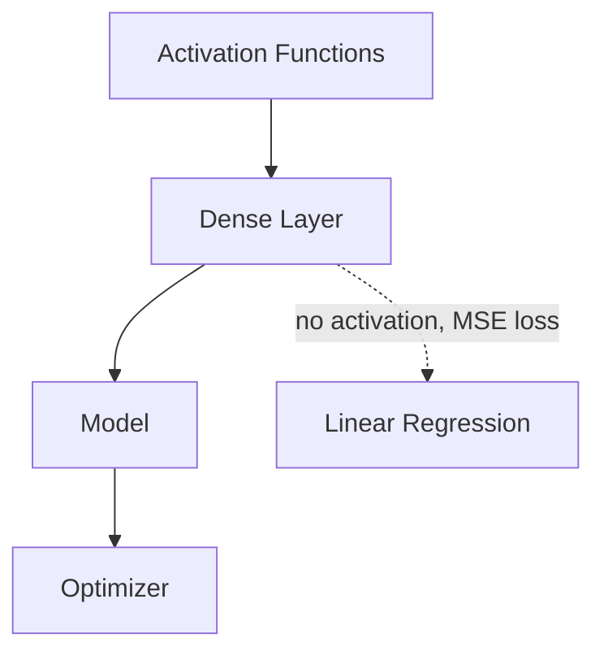

# Dense Layer

## Overview & Motivation

A **dense** (fully-connected) layer is the most fundamental building block of a neural network. It maps an input vector $a_{\text{in}} \in \mathbb{R}^n$ to an output vector $a_{\text{out}} \in \mathbb{R}^m$ through a learnable affine transformation followed by a non-linear activation:

$$a_{\text{out}} = f(W \, a_{\text{in}} + b)$$

Every input neuron is connected to every output neuron — hence "fully connected." The layer's **parameters** are the weight matrix $W$ and bias vector $b$; training adjusts these to minimize the loss.

In this library, input size, output size, and parameter count are all **compile-time constants**, enabling stack allocation and dimension checking with zero runtime overhead.

## Mathematical Theory

### Forward Pass

$$z = W \, a_{\text{in}} + b, \qquad a_{\text{out}} = f(z)$$

where $W \in \mathbb{R}^{m \times n}$, $b \in \mathbb{R}^m$, and $f$ is the [activation function](../activation/Activation.md).

### Backward Pass

Given the gradient of the loss with respect to the output $\frac{\partial \mathcal{L}}{\partial a_{\text{out}}}$:

1. **Pre-activation gradient:**
$$\delta = \frac{\partial \mathcal{L}}{\partial a_{\text{out}}} \odot f'(z)$$

2. **Weight gradient:**
$$\frac{\partial \mathcal{L}}{\partial W} = \delta \, a_{\text{in}}^T$$

3. **Bias gradient:**
$$\frac{\partial \mathcal{L}}{\partial b} = \delta$$

4. **Input gradient** (propagated to the previous layer):
$$\frac{\partial \mathcal{L}}{\partial a_{\text{in}}} = W^T \delta$$

### Parameter Count

$$P = m \times n + m = m(n + 1)$$

For a layer with 128 inputs and 64 outputs: $P = 64 \times 129 = 8{,}256$ parameters.

## Complexity Analysis

| Operation                                   | Time           | Space                             |
|---------------------------------------------|----------------|-----------------------------------|
| Forward ($W a + b$)                         | $O(m \cdot n)$ | $O(m)$ output + $O(m)$ cached $z$ |
| Backward ($\delta$, $\nabla W$, $\nabla b$) | $O(m \cdot n)$ | $O(m \cdot n)$ weight gradient    |
| Total parameters                            | —              | $O(m \cdot n + m)$                |

The matrix-vector product dominates both passes. For embedded networks (e.g. $n = 32, m = 16$), a single forward pass takes ~512 multiply-accumulate operations.

## Step-by-Step Walkthrough

**Layer:** 3 inputs → 2 outputs, ReLU activation.

$$W = \begin{bmatrix} 0.5 & -0.3 & 0.8 \\ 0.1 & 0.7 & -0.2 \end{bmatrix}, \quad b = \begin{bmatrix} 0.1 \\ -0.1 \end{bmatrix}, \quad a_{\text{in}} = \begin{bmatrix} 1.0 \\ 0.5 \\ -1.0 \end{bmatrix}$$

**Forward:**

| Step                              | Computation                                          | Result              |
|-----------------------------------|------------------------------------------------------|---------------------|
| $z = W a_{\text{in}} + b$         | $[0.5 - 0.15 - 0.8 + 0.1,\; 0.1 + 0.35 + 0.2 - 0.1]$ | $[-0.35,\; 0.55]^T$ |
| $a_{\text{out}} = \text{ReLU}(z)$ | $[\max(0, -0.35),\; \max(0, 0.55)]$                  | $[0.0,\; 0.55]^T$   |

**Backward** with $\frac{\partial \mathcal{L}}{\partial a_{\text{out}}} = [0.2,\; -0.4]^T$:

| Step                                                   | Computation                                         | Result                                                     |
|--------------------------------------------------------|-----------------------------------------------------|------------------------------------------------------------|
| $\delta = \nabla a_{\text{out}} \odot \text{ReLU}'(z)$ | $[0.2 \cdot 0,\; -0.4 \cdot 1]$                     | $[0,\; -0.4]^T$                                            |
| $\nabla W = \delta \, a_{\text{in}}^T$                 | row 1: all zeros; row 2: $-0.4 \times [1, 0.5, -1]$ | $\begin{bmatrix}0 & 0 & 0\\-0.4 & -0.2 & 0.4\end{bmatrix}$ |
| $\nabla b = \delta$                                    | —                                                   | $[0,\; -0.4]^T$                                            |
| $\nabla a_{\text{in}} = W^T \delta$                    | $W^T [0, -0.4]^T$                                   | $[-0.04,\; -0.28,\; 0.08]^T$                               |

## Pitfalls & Edge Cases

- **Dimension mismatch.** In a multi-layer network, the output size of layer $\ell$ must equal the input size of layer $\ell+1$. This library enforces this at compile time.
- **Weight initialization.** Zero-initialized weights cause all neurons to compute the same thing (symmetry problem). Use He initialization for ReLU: $W_{ij} \sim \mathcal{N}(0, \sqrt{2/n})$.
- **Gradient accumulation.** When processing mini-batches, accumulate $\nabla W$ across samples before updating — do not update per-sample.
- **Fixed-point overflow in $W a$.** The dot product of $n$ terms can exceed Q15/Q31 range. Use a wider accumulator (Q31 for Q15 data) or scale weights.
- **Large layers exhaust stack.** A 256×256 weight matrix of `float` consumes 256 KB. Size layers to fit the target's stack budget.

## Variants & Generalizations

| Variant                       | Key Difference                                                                                            |
|-------------------------------|-----------------------------------------------------------------------------------------------------------|
| **Convolutional layer**       | Weight sharing across spatial positions; $O(k^2 \cdot c)$ parameters per filter instead of $O(n \cdot m)$ |
| **Recurrent layer**           | Shares weights across time steps; adds a hidden state feedback connection                                 |
| **Batch normalization layer** | Normalizes activations to zero mean and unit variance; accelerates training                               |
| **Dropout layer**             | Randomly zeros activations during training; regularization effect                                         |
| **Sparse layer**              | Only a subset of connections exist; reduces parameter count and computation                               |

## Applications

- **Hidden layers** — One or more dense layers form the core of feed-forward networks for regression and classification.
- **Output layer** — A final dense layer maps to the target dimensionality (1 for regression, $k$ for $k$-class classification).
- **Embedding projection** — Dense layers project high-dimensional sparse inputs to low-dimensional dense representations.
- **Controller networks** — In neural network-based control, small dense layers map state vectors to actuator commands.

## Connections to Other Algorithms

```mermaid
graph TD
    Layer["Dense Layer"]
    Act["Activation Functions"]
    Model["Model"]
    Opt["Optimizer"]
    LR["Linear Regression"]

    Act --> Layer
    Layer --> Model
    Model --> Opt
    Layer -.->|"no activation, MSE loss"| LR
```

| Component                                                 | Relationship                                                                           |
|-----------------------------------------------------------|----------------------------------------------------------------------------------------|
| [Activation Functions](../activation/Activation.md)       | Applied element-wise after the affine transformation                                   |
| [Model](../model/Model.md)                                | Chains multiple dense layers into a network                                            |
| [Optimizer](../optimizer/Optimizer.md)                    | Updates $W$ and $b$ using the computed gradients                                       |
| [Linear Regression](../../estimators/LinearRegression.md) | A dense layer with identity activation and MSE loss is equivalent to linear regression |

## References & Further Reading

- Goodfellow, I., Bengio, Y., and Courville, A., *Deep Learning*, MIT Press, 2016 — Chapter 6.
- He, K. et al., "Delving deep into rectifiers", *ICCV*, 2015 — He weight initialization.
- Glorot, X. and Bengio, Y., "Understanding the difficulty of training deep feedforward neural networks", *AISTATS*, 2010 — Xavier initialization.
