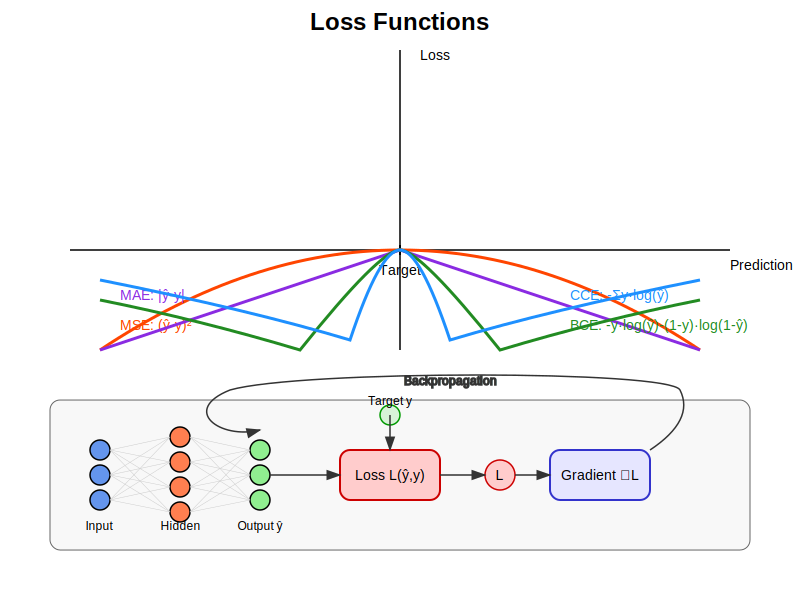

# Loss Functions Implementation Guide

## Process Overview

The following diagram illustrates the role of loss functions in a neural network:



The diagram shows how loss functions:
1. Measure the discrepancy between predictions and target values
2. Guide the optimization process during training
3. Generate gradients for backpropagation
4. Vary based on different problem types (regression, classification)

## Mathematical Background

### Loss Function Role

Loss functions quantify how well a model's predictions match the expected targets. For a model with parameters θ, input x, and expected output y, the loss function L defines the error:

$$L(θ) = f(y, \hat{y})$$

where:
- θ represents all model parameters
- y is the target output
- ŷ (y-hat) is the model's prediction

### Gradient for Optimization

During training, the gradient of the loss with respect to model parameters is needed:

$$\nabla_θ L(θ) = \frac{\partial L}{\partial θ}$$

This gradient tells the optimization algorithm which direction to adjust parameters to minimize the loss.

## Implementation Details

### Class Structure

```cpp
template<typename QNumberType, std::size_t NumberOfFeatures>
class Loss
{
    static_assert(math::is_qnumber<QNumberType>::value || std::is_floating_point<QNumberType>::value,
        "Loss can only be instantiated with math::QNumber types.");

public:
    using Vector = math::Vector<QNumberType, NumberOfFeatures>;

    virtual QNumberType Cost(const Vector& parameters) = 0;
    virtual Vector Gradient(const Vector& parameters) = 0;
};
```

### Key Implementations

1. **Mean Squared Error (MSE)**:
   - Standard loss function for regression problems
   - Penalizes larger errors more heavily (squared difference)
   - Well-behaved gradients for optimization
   
   **Mathematical Definition:**
   $L_{MSE}(y, \hat{y}) = \frac{1}{2n} \sum_{i=1}^{n} (y_i - \hat{y}_i)^2$
   
   **Gradient with respect to predictions:**
   $\frac{\partial L_{MSE}}{\partial \hat{y}_i} = \hat{y}_i - y_i$
   
   ```cpp
   template<typename QNumberType, std::size_t NumberOfFeatures>
   class MeanSquaredError : public Loss<QNumberType, NumberOfFeatures>
   {
   public:
       MeanSquaredError(const Vector& target);
       
       QNumberType Cost(const Vector& parameters) override
       {
           QNumberType cost = QNumberType(0.0f);
           
           for (std::size_t i = 0; i < NumberOfFeatures; ++i)
           {
               QNumberType diff = parameters[i] - target[i];
               cost += diff * diff;
           }
           
           return QNumberType(math::ToFloat(cost) / 2.0f);
       }
       
       Vector Gradient(const Vector& parameters) override
       {
           Vector gradient;
           
           for (std::size_t i = 0; i < NumberOfFeatures; ++i)
               gradient[i] = parameters[i] - target[i];
           
           return gradient;
       }
       
   private:
       Vector target;
   };
   ```

2. **Mean Absolute Error (MAE)**:
   - Less sensitive to outliers than MSE
   - Absolute difference between prediction and target
   - Constant gradients (except at zero)
   
   **Mathematical Definition:**
   $L_{MAE}(y, \hat{y}) = \frac{1}{n} \sum_{i=1}^{n} |y_i - \hat{y}_i|$
   
   **Gradient with respect to predictions:**
   $\frac{\partial L_{MAE}}{\partial \hat{y}_i} = 
   \begin{cases} 
   1 & \text{if } \hat{y}_i > y_i \\
   -1 & \text{if } \hat{y}_i < y_i \\
   0 & \text{if } \hat{y}_i = y_i
   \end{cases}$
   
   ```cpp
   template<typename QNumberType, std::size_t NumberOfFeatures>
   class MeanAbsoluteError : public Loss<QNumberType, NumberOfFeatures>
   {
   public:
       MeanAbsoluteError(const Vector& target);
       
       QNumberType Cost(const Vector& parameters) override
       {
           QNumberType cost = QNumberType(0.0f);
           
           for (std::size_t i = 0; i < NumberOfFeatures; ++i)
           {
               auto diff = parameters[i] - target[i];
               cost += diff < QNumberType(0.0f) ? -diff : diff;
           }
           
           return cost;
       }
       
       Vector Gradient(const Vector& parameters) override
       {
           Vector gradient;
           
           for (std::size_t i = 0; i < NumberOfFeatures; ++i)
           {
               auto diff = parameters[i] - target[i];
               gradient[i] = diff > QNumberType(0.0f) ? 
                             QNumberType(0.9999f) : QNumberType(-0.9999f);
           }
           
           return gradient;
       }
       
   private:
       Vector target;
   };
   ```

3. **Binary Cross Entropy**:
   - Used for binary classification problems
   - Measures probability distribution divergence
   - Expects outputs in range (0,1)
   
   **Mathematical Definition:**
   $L_{BCE}(y, \hat{y}) = -\frac{1}{n} \sum_{i=1}^{n} [y_i \log(\hat{y}_i) + (1 - y_i) \log(1 - \hat{y}_i)]$
   
   **Gradient with respect to predictions:**
   $\frac{\partial L_{BCE}}{\partial \hat{y}_i} = \frac{\hat{y}_i - y_i}{\hat{y}_i(1 - \hat{y}_i)}$
   
   ```cpp
   template<typename QNumberType, std::size_t NumberOfFeatures>
   class BinaryCrossEntropy : public Loss<QNumberType, NumberOfFeatures>
   {
   public:
       BinaryCrossEntropy(const Vector& target);
       
       QNumberType Cost(const Vector& parameters) override
       {
           QNumberType cost = QNumberType(0.0f);
           
           for (std::size_t i = 0; i < NumberOfFeatures; ++i)
           {
               QNumberType pred = std::max(std::min(parameters[i], 
                                                  QNumberType(0.9999f)), 
                                         QNumberType(0.0001f));
               
               cost += -(target[i] * std::log(math::ToFloat(pred)) +
                        (QNumberType(0.9999f) - target[i]) * 
                         std::log(math::ToFloat(QNumberType(0.9999f) - pred)));
           }
           
           return cost;
       }
       
       Vector Gradient(const Vector& parameters) override
       {
           Vector gradient;
           
           for (std::size_t i = 0; i < NumberOfFeatures; ++i)
           {
               QNumberType pred = std::max(std::min(parameters[i], 
                                                  QNumberType(0.9999f)), 
                                         QNumberType(0.0001f));
               
               gradient[i] = (pred - target[i]) / 
                            (pred * (QNumberType(0.9999f) - pred));
           }
           
           return gradient;
       }
       
   private:
       Vector target;
   };
   ```

4. **Categorical Cross Entropy**:
   - Used for multi-class classification problems
   - Works with one-hot encoded targets
   - Typically preceded by Softmax activation
   
   **Mathematical Definition:**
   $L_{CCE}(y, \hat{y}) = -\sum_{i=1}^{n} \sum_{j=1}^{m} y_{i,j} \log(\hat{y}_{i,j})$
   
   Where m is the number of classes and n is the number of samples.
   
   **Gradient with respect to Softmax inputs:**
   $\frac{\partial L_{CCE}}{\partial \hat{y}_i} = \hat{y}_i - y_i$
   
   When used with Softmax activation, this simplifies to the difference between predicted and actual probabilities.
   
   ```cpp
   template<typename QNumberType, std::size_t NumberOfFeatures>
   class CategoricalCrossEntropy : public Loss<QNumberType, NumberOfFeatures>
   {
   public:
       CategoricalCrossEntropy(const Vector& target);
       
       QNumberType Cost(const Vector& parameters) override
       {
           Vector probabilities = ComputeSoftmaxProbabilities(parameters);
           QNumberType cost = QNumberType(0.0f);
           
           for (std::size_t i = 0; i < NumberOfFeatures; ++i)
               cost += -target[i] * std::log(math::ToFloat(probabilities[i]));
           
           return cost;
       }
       
       Vector Gradient(const Vector& parameters) override
       {
           Vector probabilities = ComputeSoftmaxProbabilities(parameters);
           Vector gradient;
           
           for (std::size_t i = 0; i < NumberOfFeatures; ++i)
               gradient[i] = probabilities[i] - target[i];
           
           return gradient;
       }
       
   private:
       Vector target;
       Softmax<QNumberType> softmax;
       
       Vector ComputeSoftmaxProbabilities(const Vector& x) const
       {
           Vector output;
           QNumberType sum = QNumberType(0.0f);
           
           // Apply softmax function
           for (std::size_t i = 0; i < NumberOfFeatures; ++i)
           {
               output[i] = softmax.Forward(x[i]);
               sum += output[i];
           }
           
           // Normalize to get probabilities
           for (std::size_t i = 0; i < NumberOfFeatures; ++i)
           {
               output[i] = output[i] / sum;
               // Numerical stability
               output[i] = std::max(std::min(output[i], 
                                           QNumberType(0.9999f)), 
                                    QNumberType(0.0001f));
           }
           
           return output;
       }
   };
   ```

## Usage Guide

### Basic Usage

```cpp
// Define problem parameters
constexpr std::size_t parameterSize = 10;
using FloatType = float;

// Create target vector
math::Vector<FloatType, parameterSize> target;
// Fill target with expected values...

// Create loss functions for different problem types
MeanSquaredError<FloatType, parameterSize> mseLoss(target);
MeanAbsoluteError<FloatType, parameterSize> maeLoss(target);
BinaryCrossEntropy<FloatType, parameterSize> bceLoss(target);
CategoricalCrossEntropy<FloatType, parameterSize> cceLoss(target);

// Create parameter vector (model output)
math::Vector<FloatType, parameterSize> parameters;
// Fill parameters with model predictions...

// Compute loss values
FloatType mseValue = mseLoss.Cost(parameters);
FloatType maeValue = maeLoss.Cost(parameters);
FloatType bceValue = bceLoss.Cost(parameters);
FloatType cceValue = cceLoss.Cost(parameters);

// Compute gradients for backpropagation
auto mseGradient = mseLoss.Gradient(parameters);
auto maeGradient = maeLoss.Gradient(parameters);
auto bceGradient = bceLoss.Gradient(parameters);
auto cceGradient = cceLoss.Gradient(parameters);
```

### Integration with Model Training

```cpp
// Create model, parameters, and optimizer
Model<FloatType, inputSize, outputSize, ...> model;
auto initialParameters = model.GetParameters();
GradientDescent<FloatType, model.TotalParameters> optimizer;

// Create loss function with targets
auto target = ComputeTargetVector();
MeanSquaredError<FloatType, model.TotalParameters> loss(target);

// Train model
model.Train(optimizer, loss, initialParameters);
```

## Best Practices

1. **Loss Function Selection**:
   - Regression problems: MSE (standard), MAE (robust to outliers)
   - Binary classification: Binary Cross-Entropy
   - Multi-class classification: Categorical Cross-Entropy
   - Probability distribution matching: KL-Divergence

2. **Implementation Considerations**:
   - Ensure numerical stability (clamping to avoid log(0))
   - Consider computation efficiency 
   - Use appropriate gradients for optimization

3. **Regularization**:
   - Always include regularization to prevent overfitting
   - Adjust regularization strength as a hyperparameter
   - Different regularization techniques for different problems

## Common Loss Functions Comparison

| Function                  | Use Case                   | Advantages                      | Disadvantages                 |
|---------------------------|----------------------------|----------------------------------|-------------------------------|
| Mean Squared Error        | Regression                 | Smooth gradients, penalizes outliers | Sensitive to outliers        |
| Mean Absolute Error       | Robust regression          | Less sensitive to outliers          | Non-differentiable at zero   |
| Binary Cross-Entropy      | Binary classification      | Probabilistic interpretation        | Numerical instability at extremes |
| Categorical Cross-Entropy | Multi-class classification | Measures probability divergence     | Requires normalized outputs   |

## Performance Considerations

1. **Computation Efficiency**:
   - MSE and MAE are computationally lighter than cross-entropy
   - Softmax computation in CCE can be expensive
   - Consider vectorized operations for better performance

2. **Numeric Stability**:
   - Prevent under/overflow in exponential operations
   - Clamp probabilities away from 0 and 1
   - Use stable implementations of mathematical functions

3. **Gradient Behavior**:
   - MSE gradients scale with error magnitude
   - MAE gradients have constant magnitude
   - Cross-entropy gradients adaptively scale

## Regularization Integration

While regularization is typically used with loss functions to prevent overfitting, this implementation focuses on the core loss computation. Regularization can be implemented separately and combined with the loss during the optimization process:

```cpp
// Compute total loss
QNumberType totalLoss = lossFunction.Cost(parameters) + lambda * regularization.Calculate(parameters);

// Combine gradients
Vector totalGradient = lossFunction.Gradient(parameters) + lambda * regularizationGradient;
```

Common regularization techniques include:
- L1 regularization (Lasso): Encourages sparse models by driving some weights to zero
- L2 regularization (Ridge): Prevents large weights by penalizing their squared magnitude

## Limitations and Future Improvements

1. Current limitations:
   - Fixed-size vectors for parameters and targets
   - Limited regularization options
   - Categorical Cross-Entropy requires pre-applied Softmax
   - Element-wise operations (not vectorized)

2. Possible extensions:
   - Additional loss functions (Huber, Hinge, KL-Divergence)
   - Custom loss combinations
   - Support for sparse targets
   - Weighted losses for imbalanced data
   - Focal loss for hard examples
   - Adversarial training losses
   - Vector-level operations for performance

## Error Handling

1. Static assertions verify:
   - Valid numeric types
   - Appropriate parameter sizes

2. Implementation considerations:
   - Clamping probability values to avoid log(0)
   - Defensive division to prevent divide-by-zero errors
   - Careful numerical handling of extremes
