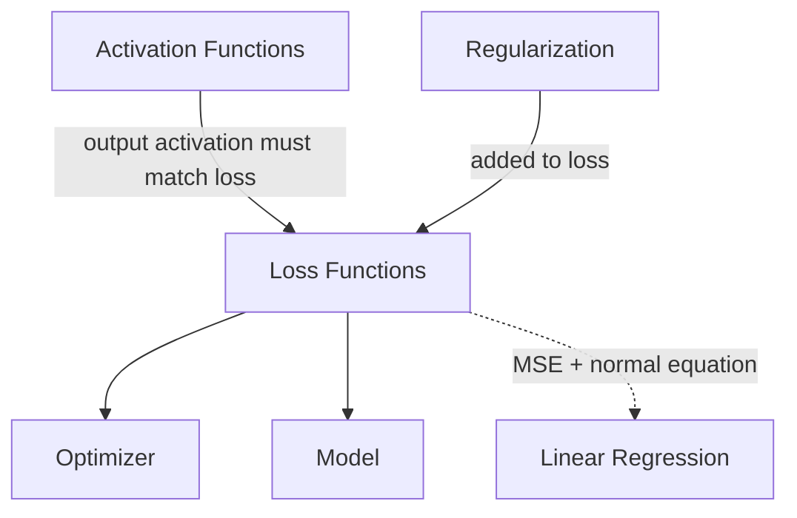

# Loss Functions

## Overview & Motivation

A loss function $\mathcal{L}(\hat{y}, y)$ quantifies how far a model's prediction $\hat{y}$ is from the true target $y$. Training a neural network means finding parameters $\theta$ that minimize the expected loss over the training data:

$$\theta^* = \arg\min_\theta \; \mathbb{E}[\mathcal{L}(f_\theta(x), y)]$$

The loss function defines the **entire learning objective** — different losses lead to different optimal models even on the same data. It must also provide a **gradient** $\nabla_{\hat{y}} \mathcal{L}$ for back-propagation.

## Mathematical Theory

### Mean Squared Error (MSE)

$$\mathcal{L}_{\text{MSE}} = \frac{1}{m} \sum_{i=1}^{m} (\hat{y}_i - y_i)^2$$

$$\frac{\partial \mathcal{L}}{\partial \hat{y}_i} = \frac{2}{m}(\hat{y}_i - y_i)$$

- Penalizes large errors quadratically → sensitive to outliers.
- Natural choice for **regression** tasks.
- Optimal when the error distribution is Gaussian.

### Mean Absolute Error (MAE)

$$\mathcal{L}_{\text{MAE}} = \frac{1}{m} \sum_{i=1}^{m} |\hat{y}_i - y_i|$$

$$\frac{\partial \mathcal{L}}{\partial \hat{y}_i} = \frac{1}{m} \operatorname{sign}(\hat{y}_i - y_i)$$

- Linear penalty → robust to outliers.
- Non-differentiable at $\hat{y}_i = y_i$ (use sub-gradient in practice).

### Binary Cross-Entropy (BCE)

$$\mathcal{L}_{\text{BCE}} = -\frac{1}{m}\sum_{i=1}^{m} \left[ y_i \log \hat{y}_i + (1 - y_i) \log(1 - \hat{y}_i) \right]$$

$$\frac{\partial \mathcal{L}}{\partial \hat{y}_i} = -\frac{1}{m}\left(\frac{y_i}{\hat{y}_i} - \frac{1 - y_i}{1 - \hat{y}_i}\right)$$

- Assumes $\hat{y}_i \in (0, 1)$ — pair with **Sigmoid** output activation.
- Maximum likelihood estimator for Bernoulli-distributed targets.

### Categorical Cross-Entropy (CCE)

$$\mathcal{L}_{\text{CCE}} = -\sum_{i=1}^{k} y_i \log \hat{y}_i$$

$$\frac{\partial \mathcal{L}}{\partial \hat{y}_i} = -\frac{y_i}{\hat{y}_i}$$

- Assumes $\hat{y}$ is a probability distribution ($\sum \hat{y}_i = 1$) — pair with **Softmax** output activation.
- Standard loss for **multi-class classification**.

## Complexity Analysis

| Loss | Forward | Backward | Notes                        |
|------|---------|----------|------------------------------|
| MSE  | $O(m)$  | $O(m)$   | Cheapest; no transcendentals |
| MAE  | $O(m)$  | $O(m)$   | Requires `sign()`            |
| BCE  | $O(m)$  | $O(m)$   | Requires `log()`             |
| CCE  | $O(k)$  | $O(k)$   | Requires `log()`             |

All losses are $O(m)$ where $m$ is the output dimension. The computational cost is negligible compared to the dense layer matrix products.

## Step-by-Step Walkthrough

**Scenario:** 3-class classification. Target $y = [0, 1, 0]$ (class 2). Softmax output $\hat{y} = [0.1, 0.7, 0.2]$.

**CCE Forward:**

$$\mathcal{L} = -(0 \cdot \log 0.1 + 1 \cdot \log 0.7 + 0 \cdot \log 0.2) = -\log(0.7) \approx 0.357$$

**CCE Backward:**

| $i$ | $y_i$ | $\hat{y}_i$ | $\partial \mathcal{L}/\partial \hat{y}_i = -y_i / \hat{y}_i$ |
|-----|-------|-------------|--------------------------------------------------------------|
| 1   | 0     | 0.1         | $0$                                                          |
| 2   | 1     | 0.7         | $-1.429$                                                     |
| 3   | 0     | 0.2         | $0$                                                          |

The gradient is non-zero only for the true class, and its magnitude $1/\hat{y}_2$ grows as the prediction *worsens* — providing a strong corrective signal.

**For comparison — MSE on the same example:**

$$\mathcal{L}_{\text{MSE}} = \frac{1}{3}[(0.1)^2 + (0.7-1)^2 + (0.2)^2] = \frac{1}{3}[0.01 + 0.09 + 0.04] = 0.047$$

MSE gives a much weaker signal and does not account for the probabilistic nature of the output.

## Pitfalls & Edge Cases

- **$\log(0)$ is $-\infty$.** Clamp predictions to $[\varepsilon, 1 - \varepsilon]$ before computing BCE or CCE. A typical $\varepsilon = 10^{-7}$.
- **Mismatched activation and loss.** Sigmoid + CCE or Softmax + BCE produce incorrect gradients. Always pair: Sigmoid ↔ BCE, Softmax ↔ CCE.
- **MSE for classification.** MSE can train a classifier but converges slower than cross-entropy because its gradient does not account for the log-likelihood structure.
- **Label encoding.** CCE expects one-hot encoded targets. Integer labels must be converted first.
- **Fixed-point log.** The `log()` function needed for cross-entropy is expensive and ill-conditioned near zero in fixed-point. Evaluate in floating-point.

## Variants & Generalizations

| Variant              | Key Difference                                                             |
|----------------------|----------------------------------------------------------------------------|
| **Huber loss**       | Quadratic for small errors, linear for large; robust regression            |
| **Focal loss**       | Down-weights well-classified examples; addresses class imbalance           |
| **KL divergence**    | Measures distance between two distributions; used in variational inference |
| **Hinge loss**       | Margin-based; used in SVMs and some neural classifiers                     |
| **Contrastive loss** | Learns similarity metrics; used in Siamese networks                        |

## Applications

- **Regression** — MSE for Gaussian noise, MAE for Laplacian noise or when outlier robustness is needed.
- **Binary classification** — BCE for yes/no decisions (fault detection, anomaly flagging).
- **Multi-class classification** — CCE for mutually exclusive categories (gesture recognition, signal type identification).
- **Probabilistic output** — Cross-entropy losses calibrate prediction confidence, not just accuracy.

## Connections to Other Algorithms

```mermaid
graph TD
    Loss["Loss Functions"]
    Act["Activation Functions"]
    Opt["Optimizer"]
    Reg["Regularization"]
    Model["Model"]
    LR["Linear Regression"]

    Act -->|"output activation must match loss"| Loss
    Loss --> Opt
    Reg -->|"added to loss"| Loss
    Loss --> Model
    Loss -.->|"MSE + normal equation"| LR
```

| Component                                                 | Relationship                                                                                         |
|-----------------------------------------------------------|------------------------------------------------------------------------------------------------------|
| [Activation Functions](../activation/Activation.md)       | Output activation must match: Sigmoid ↔ BCE, Softmax ↔ CCE, identity ↔ MSE                           |
| [Optimizer](../optimizer/Optimizer.md)                    | Uses $\nabla \mathcal{L}$ to update parameters                                                       |
| [Regularization](../regularization/Regularization.md)     | Adds a penalty term to the loss: $\mathcal{L}_{\text{total}} = \mathcal{L} + \lambda \Omega(\theta)$ |
| [Linear Regression](../../estimators/LinearRegression.md) | Solved analytically when the loss is MSE and the model is linear                                     |

## References & Further Reading

- Goodfellow, I., Bengio, Y., and Courville, A., *Deep Learning*, MIT Press, 2016 — Chapter 6.2 (cost functions).
- Bishop, C.M., *Pattern Recognition and Machine Learning*, Springer, 2006 — Chapter 4.3 (cross-entropy).
- Lin, T.-Y. et al., "Focal loss for dense object detection", *ICCV*, 2017.
