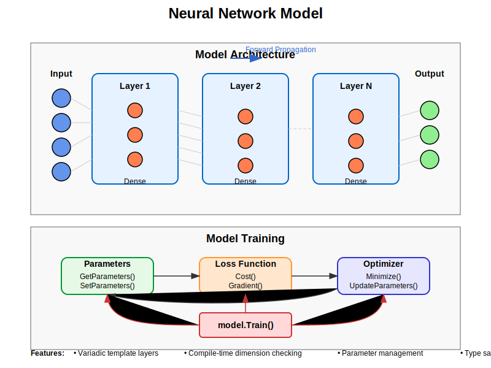

# Model Implementation Guide

## Process Overview

The following diagram illustrates the structure and functionality of the neural network model:



The diagram shows how the model:
1. Organizes multiple layers into a coherent architecture
2. Manages the flow of data through the network
3. Handles parameter management and training
4. Connects with optimizers and loss functions

## Mathematical Background

### Model Architecture

A neural network model consists of a sequence of layers, transforming an input vector through multiple transformations:

$$\mathbf{y} = f_n(f_{n-1}(...f_1(\mathbf{x})...))$$

where:
- x is the input vector
- y is the output vector
- f₁, f₂, ..., fₙ are the layer transformations

### Training Process

The model's training process involves:
1. Forward propagation to compute predictions
2. Loss calculation to measure error
3. Backward propagation to compute gradients
4. Parameter updates using an optimizer

During training, parameters θ are updated to minimize a loss function L:

$$\theta_{t+1} = \theta_t - \eta \nabla_\theta L(\theta_t)$$

## Implementation Details

### Class Structure

```cpp
template<typename QNumberType, std::size_t InputSize, std::size_t OutputSize, typename... Layers>
class Model
{
    // Static assertions to verify types and dimensions
    static_assert(math::is_qnumber<QNumberType>::value || std::is_floating_point<QNumberType>::value,
        "Model can only be instantiated with math::QNumber types or floating point types.");
    static_assert(detail::all_are_layers<QNumberType, Layers...>::value,
        "All types in Layers must derive from Layer");
    static_assert(sizeof...(Layers) > 0, "Model must have at least one layer");
    static_assert(detail::verify_layer_sizes<InputSize, Layers...>::value &&
                  std::tuple_element_t<sizeof...(Layers) - 1,
                      std::tuple<Layers...>>::OutputSize == OutputSize,
        "Layer sizes do not match");

public:
    using InputVector = math::Matrix<QNumberType, InputSize, 1>;
    using OutputVector = math::Matrix<QNumberType, OutputSize, 1>;
    static constexpr std::size_t TotalParameters = detail::calculate_total_parameters<QNumberType, Layers...>();

    Model();
    template<typename... FactoryFuncs>
    Model(FactoryFuncs&&... factories);
    
    OutputVector Forward(const InputVector& input);
    InputVector Backward(const OutputVector& output_gradient);
    void Train(Optimizer<QNumberType, TotalParameters>& optimizer, 
               Loss<QNumberType, TotalParameters>& loss, 
               const math::Vector<QNumberType, TotalParameters>& initialParameters);
    void SetParameters(const math::Vector<QNumberType, TotalParameters>& parameters);
    math::Vector<QNumberType, TotalParameters> GetParameters() const;

private:
    // Implementation details
    std::tuple<Layers...> layers;
    InputVector currentInput;
};
```

### Key Components

1. **Layer Management**:
   - Stores layers in a std::tuple
   - Verifies layer compatibility at compile time
   - Manages data flow between layers
   
2. **Parameter Handling**:
   - Collects parameters from all layers
   - Distributes updated parameters to layers
   - Manages parameter vector with correct dimensions
   
3. **Forward and Backward Pass**:
   - Chains layer operations for forward propagation
   - Implements backpropagation for gradient computation
   - Maintains intermediate values for backpropagation
   
4. **Training Process**:
   - Connects model with optimizer and loss function
   - Handles parameter updates during training
   - Manages the training workflow

### Layer Factory Helper

```cpp
template<typename Layer, typename... Args>
auto make_layer(Args&&... args)
{
    return [args = std::make_tuple(std::forward<Args>(args)...)]() mutable
    {
        return std::apply([](auto&&... params)
            {
                return Layer(std::forward<decltype(params)>(params)...);
            },
            std::move(args));
    };
}
```

This helper function creates a factory lambda that constructs a layer with given arguments, enabling deferred layer construction during model initialization.

### Compile-Time Verification

Several static assertions and template metaprogramming constructs ensure layers are compatible:

```cpp
// Check if a type is a layer
template<typename QNumberType, typename T>
struct is_layer
{
    static constexpr bool value = std::is_base_of_v<
        Layer<QNumberType,
            T::InputSize,
            T::OutputSize,
            T::ParameterSize>,
        T>;
};

// Verify all types are layers
template<typename QNumberType, typename... Layers>
struct all_are_layers;

// Verify layer dimensions match
template<std::size_t InputSize, typename... Layers>
struct verify_layer_sizes;

// Calculate total parameters
template<typename QNumberType, typename... Layers>
constexpr std::size_t calculate_total_parameters()
{
    return (... + Layers::ParameterSize);
}
```

## Usage Guide

### Creating a Model

```cpp
// Define dimensions
constexpr std::size_t inputSize = 784;    // MNIST input
constexpr std::size_t hiddenSize = 128;   // Hidden layer size
constexpr std::size_t outputSize = 10;    // 10 digits
using FloatType = float;

// Create activation functions
ReLU<FloatType> relu;
Softmax<FloatType> softmax;

// Initialize weights
math::Matrix<FloatType, hiddenSize, inputSize> weights1;
math::Matrix<FloatType, outputSize, hiddenSize> weights2;
// Fill weights with random values...

// Create layer factory functions
auto layer1 = make_layer<Dense<FloatType, inputSize, hiddenSize>>(weights1, relu);
auto layer2 = make_layer<Dense<FloatType, hiddenSize, outputSize>>(weights2, softmax);

// Create model
Model<FloatType, inputSize, outputSize, 
    Dense<FloatType, inputSize, hiddenSize>,
    Dense<FloatType, hiddenSize, outputSize>
> model(layer1, layer2);
```

### Forward and Backward Passes

```cpp
// Forward pass
auto input = math::Vector<FloatType, inputSize>{/* input data */};
auto prediction = model.Forward(input);

// Backward pass
auto outputGradient = math::Vector<FloatType, outputSize>{/* gradient */};
auto inputGradient = model.Backward(outputGradient);
```

### Training the Model

```cpp
// Create optimizer
GradientDescent<FloatType, model.TotalParameters>::Parameters gdParams;
gdParams.learningRate = 0.01f;
gdParams.maxIterations = 1000;
GradientDescent<FloatType, model.TotalParameters> optimizer(gdParams);

// Create loss function
auto target = math::Vector<FloatType, outputSize>{/* target data */};
MeanSquaredError<FloatType, model.TotalParameters> loss(target);

// Get initial parameters
auto initialParameters = model.GetParameters();

// Train model
model.Train(optimizer, loss, initialParameters);
```

### Parameter Management

```cpp
// Get current parameters
auto parameters = model.GetParameters();

// Modify parameters if needed
// ...

// Set updated parameters
model.SetParameters(parameters);
```

## Best Practices

1. **Architecture Design**:
   - Match layer dimensions carefully
   - Start with simple architectures and add complexity
   - Consider the problem structure when designing

2. **Model Initialization**:
   - Use appropriate weight initialization for each layer
   - Consider layer-specific initialization requirements
   - Ensure bias terms are properly initialized

3. **Training Strategies**:
   - Select appropriate optimizers for the problem
   - Monitor training progress and adjust hyperparameters
   - Consider regularization to prevent overfitting

4. **Parameter Management**:
   - Maintain proper parameter ordering across layers
   - Understand parameter dimensionality requirements
   - Consider parameter constraints if necessary

## Variadic Templates and Type Safety

The Model implementation makes heavy use of variadic templates and compile-time verification:

1. **Variadic Layer Types**:
   - Allows for arbitrary number of layers
   - Each layer can have different dimensions
   - Compile-time dimension checking

2. **Type Safety**:
   - Static assertions verify layer compatibility
   - Type traits ensure proper parameter types
   - Dimensional validation prevents mismatched layers

3. **SFINAE Techniques**:
   - Enable/disable template specializations based on constraints
   - Provide better error messages for misuse
   - Ensure type correctness at compile time

## Performance Considerations

1. **Computation Efficiency**:
   - Parameter management done at compile time when possible
   - Layer-specific optimizations possible through template specialization
   - Intermediate value storage minimizes recomputation

2. **Memory Usage**:
   - Fixed-size vectors and matrices reduce dynamic allocations
   - Parameter packing/unpacking done efficiently
   - Tuple-based storage for heterogeneous layer types

3. **Compile-Time Optimizations**:
   - Template metaprogramming enables compile-time computations
   - Static assertions catch errors at compile time rather than runtime
   - Inline expansion potential for small layer operations

## Forward and Backward Implementation

The model uses recursive template expansion to implement forward and backward passes:

```cpp
template<std::size_t... Is>
OutputVector ForwardImpl(const InputVector& input, std::index_sequence<Is...>)
{
    // Implementation handles chaining of layer operations
    // using parameter pack expansion
}

template<std::size_t... Is>
InputVector BackwardImpl(const OutputVector& output_gradient, std::index_sequence<Is...>)
{
    // Implementation handles reverse chaining of gradient flow
    // using parameter pack expansion
}
```

## Parameter Distribution

Parameters are managed through careful packing and unpacking:

```cpp
template<std::size_t... Is>
void SetParametersImpl(
    const math::Vector<QNumberType, TotalParameters>& parameters,
    std::index_sequence<Is...>)
{
    std::size_t offset = 0;
    (SetLayerParameters(std::get<Is>(layers), parameters, offset), ...);
}

template<typename Layer>
void SetLayerParameters(
    Layer& layer,
    const math::Vector<QNumberType, TotalParameters>& parameters,
    std::size_t& offset)
{
    const std::size_t layerParameterSize = Layer::ParameterSize;
    math::Vector<QNumberType, layerParameterSize> layerParameters;

    for (std::size_t i = 0; i < layerParameterSize; ++i)
        layerParameters[i] = parameters[offset + i];

    layer.SetParameters(layerParameters);
    offset += layerParameterSize;
}
```

## Limitations and Future Improvements

1. Current limitations:
   - Fixed-size architecture at compile time
   - Limited to feed-forward architectures
   - No built-in serialization/deserialization
   - Missing implementation for ForwardImpl and BackwardImpl

2. Possible extensions:
   - Dynamic layer addition/removal
   - Runtime-configurable dimensions
   - Support for recurrent architectures
   - Built-in training loops with callbacks
   - Integration with data loaders
   - Batch processing support
   - Model serialization for persistence
   - Checkpointing during training

## Error Handling

1. Static assertions verify:
   - Valid numeric types
   - Layer-derived types in parameter pack
   - At least one layer present
   - Matching layer dimensions

2. Implementation considerations:
   - Parameter validation during training
   - Gradient checking capabilities
   - Vector size validation for inputs/outputs
