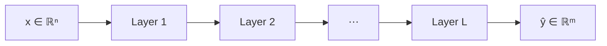
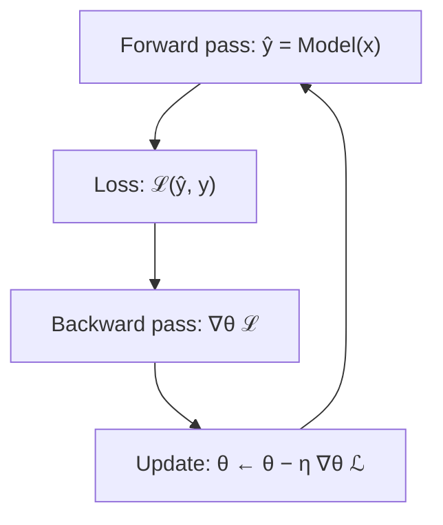
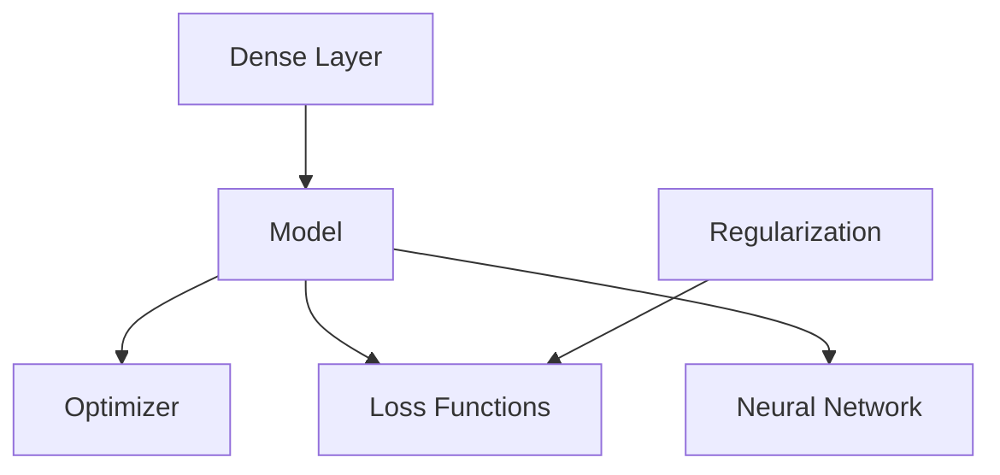

# Model (Neural Network Composition)

## Overview & Motivation

A **Model** composes a sequence of [dense layers](../layer/Layer.md) into a single trainable function $f: \mathbb{R}^n \to \mathbb{R}^m$. It is the orchestrator that:

1. Chains layers so the output of each feeds into the next (**forward pass**).
2. Propagates gradients backward through the chain (**backward pass**).
3. Flattens all layer parameters into a single vector for the [optimizer](../optimizer/Optimizer.md).
4. Verifies dimensional compatibility **at compile time** using variadic templates.

In this library, the Model is fully statically typed — layer dimensions, parameter counts, and memory footprints are all known at compile time, enabling zero-overhead abstraction on embedded targets.

## Mathematical Theory

### Composition

For $L$ layers with transformations $f_1, f_2, \ldots, f_L$:

$$\hat{y} = (f_L \circ f_{L-1} \circ \cdots \circ f_1)(x) = f_L(f_{L-1}(\ldots f_1(x) \ldots))$$

Each $f_\ell$ is a dense layer: $f_\ell(a) = \sigma_\ell(W_\ell a + b_\ell)$.

### Parameter Vector

All weights and biases are concatenated into a single vector:

$$\theta = [\text{vec}(W_1), b_1, \text{vec}(W_2), b_2, \ldots, \text{vec}(W_L), b_L] \in \mathbb{R}^P$$

where $P = \sum_{\ell=1}^L m_\ell(n_\ell + 1)$.

### Forward Pass (Chained Evaluation)

```mermaid
graph LR
    X["x ∈ ℝⁿ"] --> L1["Layer 1"] --> L2["Layer 2"] --> Ldots["⋯"] --> LL["Layer L"] --> Y["ŷ ∈ ℝᵐ"]
```

### Backward Pass (Reverse Chain Rule)

$$\frac{\partial \mathcal{L}}{\partial \theta_\ell} = \frac{\partial \mathcal{L}}{\partial a_L} \cdot \frac{\partial a_L}{\partial a_{L-1}} \cdots \frac{\partial a_{\ell+1}}{\partial a_\ell} \cdot \frac{\partial a_\ell}{\partial \theta_\ell}$$

Each layer stores its input $a_{\ell-1}$ during the forward pass so it can compute $\nabla W_\ell$ and $\nabla b_\ell$ during the backward pass.

### Training Loop

```mermaid
graph TD
    FP["Forward pass: ŷ = Model(x)"]
    LC["Loss: ℒ(ŷ, y)"]
    BP["Backward pass: ∇θ ℒ"]
    UP["Update: θ ← θ − η ∇θ ℒ"]
    FP --> LC --> BP --> UP --> FP
```

## Complexity Analysis

| Operation | Time | Space |
|-----------|------|-------|
| Forward pass | $O(P)$ | $O(\sum n_\ell)$ cached activations |
| Backward pass | $O(P)$ | $O(P)$ gradients |
| `GetParameters()` | $O(P)$ | $O(P)$ flat vector |
| `SetParameters()` | $O(P)$ | — |

All operations scale linearly with the total parameter count $P$.

## Step-by-Step Walkthrough

**Model:** 2 → 3 → 1 (two layers).

**Compile-time verification chain:**

| Check | Condition | Status |
|-------|-----------|--------|
| Layer 1 input size = Model input size | $2 = 2$ | ✓ |
| Layer 1 output size = Layer 2 input size | $3 = 3$ | ✓ |
| Layer 2 output size = Model output size | $1 = 1$ | ✓ |
| All types derive from `Layer` | type trait check | ✓ |

**Parameter layout** ($P = 3 \times 3 + 3 + 1 \times 4 + 1 = 16$):

| Index | Parameter |
|-------|-----------|
| 0–5 | $W_1$ (3×2 = 6 elements) |
| 6–8 | $b_1$ (3 elements) |
| 9–11 | $W_2$ (1×3 = 3 elements) |
| 12 | $b_2$ (1 element) |

**Forward pass** with $x = [1.0, 0.5]^T$:

1. Layer 1: $a_1 = \text{ReLU}(W_1 x + b_1) = [0.0, 0.8, 0.3]^T$
2. Layer 2: $\hat{y} = \sigma(W_2 a_1 + b_2) = [0.62]$

**Backward pass** with loss gradient $\delta_{\text{out}} = [0.12]$:

1. Layer 2 backward → produces $\nabla W_2$, $\nabla b_2$, and $\delta_1 = W_2^T \delta_2 \odot \text{ReLU}'(z_1)$
2. Layer 1 backward → produces $\nabla W_1$, $\nabla b_1$

**Optimizer** receives the full $\nabla \theta \in \mathbb{R}^{16}$ and updates $\theta$.

## Pitfalls & Edge Cases

- **Dimension mismatch caught at compile time.** If layer $\ell$ outputs $m$ but layer $\ell+1$ expects $n \ne m$, a `static_assert` fires during compilation.
- **Empty model.** The variadic template requires at least one layer. `static_assert(sizeof...(Layers) > 0)`.
- **Parameter ordering.** `GetParameters()` and `SetParameters()` must use the same concatenation order. The implementation iterates layers via `std::index_sequence` to guarantee consistency.
- **Training with wrong optimizer size.** The optimizer's parameter count template argument must equal `Model::TotalParameters`. A mismatch is also caught at compile time.
- **Large parameter vectors.** All parameters live on the stack. A model with $P > 10{,}000$ floats consumes 40 KB — verify this fits the target's stack.

## Variants & Generalizations

| Variant | Key Difference |
|---------|---------------|
| **Sequential model (dynamic)** | Layers stored in a container; dimension checked at runtime instead of compile time |
| **Functional API** | Supports branching and merging (DAG topology instead of linear chain) |
| **Residual model** | Adds skip connections: $a_{\ell+2} = f_{\ell+1}(a_\ell) + a_\ell$ |
| **Recurrent model** | Unrolls the same layer across time steps |

## Applications

- **Embedded inference** — A pre-trained model's parameters are loaded via `SetParameters()` and only `Forward()` is called at runtime.
- **On-device training** — The full forward → loss → backward → update loop runs on the MCU for online learning/adaptation.
- **System identification** — A small model (2–3 layers) learns the plant dynamics from input-output data.
- **Sensor fusion** — Multiple sensor inputs are mapped to a unified state estimate through a trained model.

## Connections to Other Algorithms

```mermaid
graph TD
    Model["Model"]
    Layer["Dense Layer"]
    Loss["Loss Functions"]
    Opt["Optimizer"]
    Reg["Regularization"]
    NN["Neural Network"]

    Layer --> Model
    Model --> Opt
    Model --> Loss
    Reg --> Loss
    Model --> NN
```

| Component | Relationship |
|-----------|-------------|
| [Dense Layer](../layer/Layer.md) | The Model is a sequence of layers stored in a `std::tuple` |
| [Loss Functions](../losses/Loss.md) | Measures prediction error; the Model delegates loss computation to a Loss object |
| [Optimizer](../optimizer/Optimizer.md) | Receives the flat parameter/gradient vectors from the Model and returns updated parameters |
| [Regularization](../regularization/Regularization.md) | Added to the loss before optimization |

## References & Further Reading

- Goodfellow, I., Bengio, Y., and Courville, A., *Deep Learning*, MIT Press, 2016 — Chapter 6 (deep feedforward networks).
- Paszke, A. et al., "PyTorch: An imperative style, high-performance deep learning library", *NeurIPS*, 2019 — inspiration for the sequential/functional model API.
- Abadi, M. et al., "TensorFlow: A system for large-scale machine learning", *OSDI*, 2016.
