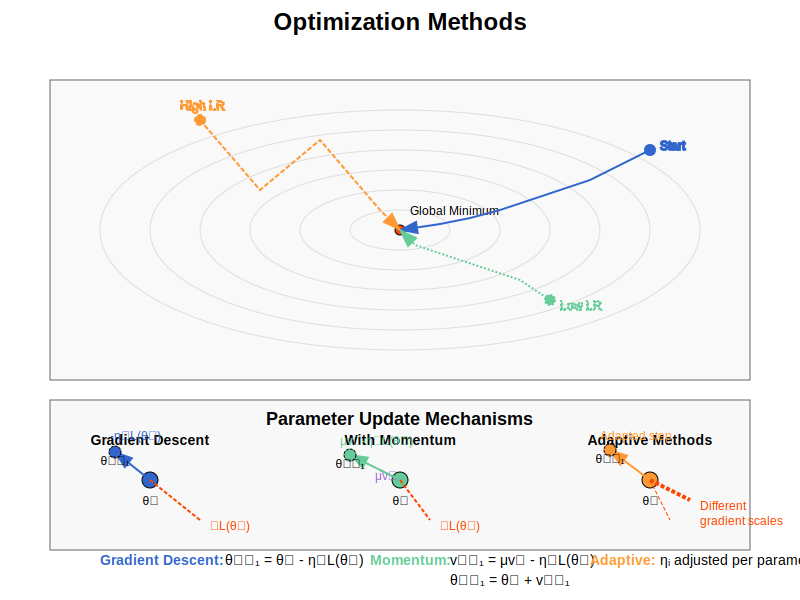

# Optimizer Implementation Guide

## Process Overview

The following diagram illustrates the optimization process in neural networks:



The diagram shows how optimizers:
1. Navigate the loss landscape to find parameter values that minimize the loss
2. Use different strategies to approach the minimum efficiently
3. Adjust parameters based on gradient information
4. Influence convergence speed and stability during training

## Mathematical Background

### Optimization Purpose

Neural network training is fundamentally an optimization problem. For a model with parameters θ and loss function L(θ), we aim to find:

$$\theta^* = \arg\min_{\theta} L(\theta)$$

Most optimization algorithms for neural networks use gradient information to iteratively update parameters:

$$\theta_{t+1} = \theta_t + \Delta\theta_t$$

where Δθ₍ₜ₎ is the parameter update at step t.

### Gradient Descent

Gradient Descent is the fundamental optimization algorithm that updates parameters in the direction of steepest descent:

$$\theta_{t+1} = \theta_t - \eta \nabla L(\theta_t)$$

where:
- η (eta) is the learning rate
- ∇L(θₜ) is the gradient of the loss function with respect to parameters

## Implementation Details

### Class Structure

```cpp
template<typename QNumberType, std::size_t NumberOfFeatures>
class Optimizer
{
    static_assert(math::is_qnumber<QNumberType>::value || std::is_floating_point<QNumberType>::value,
        "Optimizer can only be instantiated with math::QNumber types.");

public:
    using Vector = typename Loss<QNumberType, NumberOfFeatures>::Vector;

    struct Result
    {
        Result(Vector parameters, QNumberType finalCost, size_t iterations)
            : parameters(parameters)
            , finalCost(finalCost)
            , iterations(iterations)
        {}

        Vector parameters;
        QNumberType finalCost;
        std::size_t iterations;
    };

    virtual const Result& Minimize(const Vector& initialGuess, Loss<QNumberType, NumberOfFeatures>& loss) = 0;
};
```

### Key Implementations

1. **Gradient Descent**:
   - Simplest optimization algorithm
   - Updates parameters directly proportional to negative gradient
   - Controlled by learning rate parameter
   
   **Mathematical Update Rule:**
   $$\theta_{t+1} = \theta_t - \eta \nabla L(\theta_t)$$
   
   where:
   - θₜ are the parameters at step t
   - η is the learning rate
   - ∇L(θₜ) is the gradient at step t
   
   ```cpp
   template<typename QNumberType, size_t NumberOfFeatures>
   class GradientDescent : public Optimizer<QNumberType, NumberOfFeatures>
   {
   public:
       using Result = typename Optimizer<QNumberType, NumberOfFeatures>::Result;
       using Vector = typename Loss<QNumberType, NumberOfFeatures>::Vector;

       struct Parameters
       {
           QNumberType learningRate;
           size_t maxIterations;
       };

       explicit GradientDescent(const Parameters& params);
       
       const Result& Minimize(const Vector& initialGuess, 
                            Loss<QNumberType, NumberOfFeatures>& loss) override
       {
           auto currentParams = initialGuess;
           auto currentCost = loss.Cost(currentParams);
           Vector previousParams;
           size_t iteration = 0;

           while (iteration < parameters.maxIterations)
           {
               previousParams = currentParams;

               // Compute gradient and update parameters
               auto gradient = loss.Gradient(currentParams);
               currentParams = currentParams - (gradient * parameters.learningRate);

               currentCost = loss.Cost(currentParams);
               ++iteration;
           }

           result.emplace(currentParams, currentCost, iteration);
           return *result;
       }

   private:
       Parameters parameters;
       std::optional<Result> result;
   };
   ```

## Usage Guide

### Basic Usage

```cpp
// Define optimization parameters
constexpr std::size_t parameterSize = 100;
using FloatType = float;

// Configure gradient descent
GradientDescent<FloatType, parameterSize>::Parameters gdParams;
gdParams.learningRate = 0.01f;
gdParams.maxIterations = 1000;

// Create optimizer
GradientDescent<FloatType, parameterSize> optimizer(gdParams);

// Create initial parameter vector
math::Vector<FloatType, parameterSize> initialParameters;
// Initialize parameters...

// Create loss function
MeanSquaredError<FloatType, parameterSize> lossFunction(target);

// Run optimization
const auto& result = optimizer.Minimize(initialParameters, lossFunction);

// Access optimization results
auto optimizedParameters = result.parameters;
auto finalLoss = result.finalCost;
auto iterationsUsed = result.iterations;
```

### Integration with Neural Network Model

```cpp
// Create model
Model<FloatType, inputSize, outputSize, ...> model;

// Configure gradient descent
GradientDescent<FloatType, model.TotalParameters>::Parameters gdParams;
gdParams.learningRate = 0.01f;
gdParams.maxIterations = 1000;

// Create optimizer and loss function
GradientDescent<FloatType, model.TotalParameters> optimizer(gdParams);
MeanSquaredError<FloatType, model.TotalParameters> loss(target);

// Get initial parameters from model
auto initialParameters = model.GetParameters();

// Train model
model.Train(optimizer, loss, initialParameters);
```

### Learning Rate Selection

```cpp
// Low learning rate (slow but stable convergence)
GradientDescent<FloatType, parameterSize>::Parameters slowParams;
slowParams.learningRate = 0.001f;
slowParams.maxIterations = 5000;

// Medium learning rate (balanced convergence)
GradientDescent<FloatType, parameterSize>::Parameters mediumParams;
mediumParams.learningRate = 0.01f;
mediumParams.maxIterations = 1000;

// High learning rate (fast but potentially unstable convergence)
GradientDescent<FloatType, parameterSize>::Parameters fastParams;
fastParams.learningRate = 0.1f;
fastParams.maxIterations = 500;
```

## Best Practices

1. **Learning Rate Selection**:
   - Too small: slow convergence
   - Too large: unstable or divergent behavior
   - Start with 0.01 and adjust based on loss behavior
   - Consider learning rate schedules for better convergence

2. **Initialization Considerations**:
   - Parameter initialization affects optimization path
   - Multiple random initializations can help avoid local minima
   - Consider scaling based on network architecture

3. **Convergence Monitoring**:
   - Track loss over iterations to assess convergence
   - Implement early stopping if loss plateaus
   - Monitor for oscillations or divergence

## Advanced Optimization Techniques

While the current implementation includes basic Gradient Descent, several advanced optimization algorithms are common in neural network training:

1. **Stochastic Gradient Descent (SGD)**:
   - Uses subsets of data (mini-batches) for each update
   - Adds noise to escape local minima
   - Often faster convergence than batch gradient descent

2. **SGD with Momentum**:
   - Accumulates a velocity vector to smooth updates
   - Helps navigate narrow ravines in the loss landscape
   - Update rule: v₊₁ = μv - η∇L(θ), θ₊₁ = θ + v₊₁

3. **Adaptive Methods**:
   - AdaGrad: Adapts learning rates per-parameter based on historical gradients
   - RMSProp: Uses exponentially weighted moving average of squared gradients
   - Adam: Combines momentum and RMSProp with bias correction

## Performance Considerations

1. **Computation Efficiency**:
   - Gradient computation is typically the bottleneck
   - Consider vectorized operations for parameter updates
   - Mini-batch processing can improve performance

2. **Numeric Stability**:
   - Check for NaN or Infinity in parameters and gradients
   - Clip gradients to prevent explosion
   - Use stable parameter update implementations

3. **Memory Usage**:
   - Basic gradient descent has minimal memory overhead
   - Advanced optimizers require additional state variables
   - Consider memory implications for very large models

## Convergence Properties

1. **Convergence Rate**:
   - Linear convergence for well-conditioned problems
   - Slower convergence for ill-conditioned loss landscapes
   - Affected by learning rate and problem structure

2. **Local vs. Global Minima**:
   - Basic gradient descent may get trapped in local minima
   - No guarantee of finding global optimum for non-convex problems
   - Multiple runs with different initializations can help

3. **Oscillations and Overshooting**:
   - Can occur with high learning rates
   - May require learning rate adjustment or momentum
   - Monitor loss trajectory for stability

## Limitations and Future Improvements

1. Current limitations:
   - Only basic gradient descent implemented
   - Fixed learning rate throughout training
   - No convergence criteria beyond max iterations
   - Fixed-size parameter vectors

2. Possible extensions:
   - Momentum-based gradient descent
   - Adaptive optimizers (Adam, RMSProp, AdaGrad)
   - Learning rate schedules
   - Convergence-based stopping criteria
   - Mini-batch processing support
   - Line search for optimal step size
   - Second-order methods (L-BFGS, Newton's method)
   - Distributed optimization for large models

## Error Handling

1. Static assertions verify:
   - Valid numeric types
   - Appropriate parameter sizes

2. Runtime checks:
   - Positive learning rate
   - Reasonable maximum iterations
   - Parameter initialization validity
   - Gradient validity during updates

3. Considerations:
   - Implement gradient clipping to prevent exploding gradients
   - Add checks for NaN and infinity values
   - Monitor loss for unexpected increases
