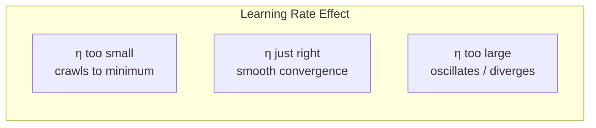
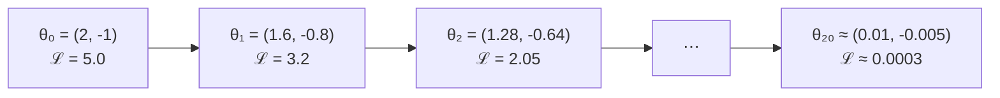
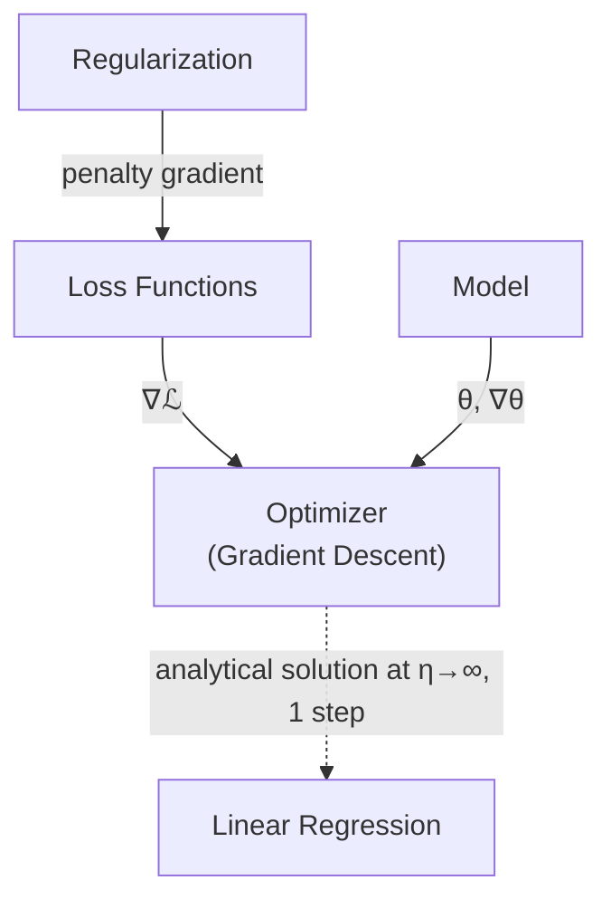

# Gradient Descent Optimizer

## Overview & Motivation

An **optimizer** adjusts a model's parameter vector $\theta \in \mathbb{R}^P$ to minimize a [loss function](../losses/Loss.md) $\mathcal{L}(\theta)$. The simplest and most fundamental strategy is **gradient descent**: repeatedly step in the direction of steepest descent:

$$\theta_{t+1} = \theta_t - \eta \, \nabla_\theta \mathcal{L}(\theta_t)$$

where $\eta$ is the **learning rate** — the single most important hyper-parameter in neural network training.

This library provides a batch gradient descent optimizer with a fixed learning rate and maximum iteration count, suitable for small embedded models where training data fits in memory and simplicity is paramount.

## Mathematical Theory

### The Gradient

The gradient $\nabla_\theta \mathcal{L}$ is obtained via [back-propagation](../NeuralNetwork.md). Each component $\frac{\partial \mathcal{L}}{\partial \theta_i}$ tells how much the loss changes when $\theta_i$ is perturbed by a small amount. The gradient points **uphill**; subtracting it moves **downhill**.

### Convergence Conditions

For a convex loss with Lipschitz-continuous gradient ($L$-smooth):

$$\mathcal{L}(\theta_T) - \mathcal{L}(\theta^*) \le \frac{\|\theta_0 - \theta^*\|^2}{2 \eta T}$$

provided $\eta < \frac{1}{L}$. This gives a convergence rate of $O(1/T)$.

For non-convex losses (typical in neural networks), gradient descent converges to a **stationary point** ($\|\nabla \mathcal{L}\| \approx 0$) which may be a local minimum or saddle point — not necessarily the global minimum.

### Learning Rate Sensitivity

| $\eta$                       | Behavior                                 |
|------------------------------|------------------------------------------|
| Too small ($\eta \ll 1/L$)   | Slow convergence, many iterations wasted |
| Optimal ($\eta \approx 1/L$) | Fastest reliable convergence             |
| Too large ($\eta > 2/L$)     | Oscillation and divergence               |

```mermaid
graph LR
    subgraph "Learning Rate Effect"
        A["η too small<br/>crawls to minimum"] 
        B["η just right<br/>smooth convergence"]
        C["η too large<br/>oscillates / diverges"]
    end
```

## Complexity Analysis

| Operation                     | Time                 | Space                  |
|-------------------------------|----------------------|------------------------|
| One gradient evaluation       | $O(P)$ per parameter | $O(P)$ gradient vector |
| One parameter update          | $O(P)$               | In-place               |
| Total training (T iterations) | $O(T \cdot P)$       | $O(P)$ working memory  |

Memory overhead is minimal: only the current parameter vector, the gradient vector, and the optimizer result. No momentum buffers or second-moment estimates.

## Step-by-Step Walkthrough

**Setup:** 2 parameters, $\theta_0 = [2.0, -1.0]^T$, $\eta = 0.1$, loss $\mathcal{L}(\theta) = \theta_1^2 + \theta_2^2$ (quadratic bowl).

**Iteration 1:**

| Step     | Computation                                         | Result        |
|----------|-----------------------------------------------------|---------------|
| Gradient | $\nabla \mathcal{L} = [2\theta_1, 2\theta_2]$       | $[4.0, -2.0]$ |
| Update   | $\theta_1 = \theta_0 - 0.1 \cdot \nabla\mathcal{L}$ | $[1.6, -0.8]$ |
| Loss     | $\mathcal{L}(\theta_1) = 1.6^2 + 0.8^2$             | $3.20$        |

**Iteration 2:**

| Step     | Computation     | Result |
|----------|-----------------|--------|
| Gradient | $[3.2, -1.6]$   |        |
| Update   | $[1.28, -0.64]$ |        |
| Loss     | $2.048$         |        |

**Pattern:** Each iteration multiplies the loss by $(1 - 2\eta)^2 = 0.64$. After 20 iterations, $\mathcal{L} \approx 0.0003$.

**Convergence trace:**

```mermaid
graph LR
    I0["θ₀ = (2, -1)<br/>ℒ = 5.0"] --> I1["θ₁ = (1.6, -0.8)<br/>ℒ = 3.2"]
    I1 --> I2["θ₂ = (1.28, -0.64)<br/>ℒ = 2.05"]
    I2 --> Idots["⋯"]
    Idots --> I20["θ₂₀ ≈ (0.01, -0.005)<br/>ℒ ≈ 0.0003"]
```

## Pitfalls & Edge Cases

- **Learning rate too high.** The loss oscillates or increases. Start with $\eta = 0.01$ and decrease if unstable.
- **Flat regions / saddle points.** Gradient descent stalls when $\|\nabla \mathcal{L}\| \approx 0$ at non-optimal points. Momentum-based methods escape saddle points faster.
- **Ill-conditioned loss landscape.** When eigenvalues of the Hessian span many orders of magnitude, gradient descent oscillates along steep directions while barely progressing along flat ones. Adaptive methods (Adam) handle this better.
- **Max iterations reached.** The optimizer returns whatever parameters it has at `maxIterations` — always check `result.finalCost` to assess convergence quality.
- **Fixed-point gradients.** In Q15/Q31, multiply-accumulate in the gradient can overflow. Scale the learning rate to keep weight updates within representable range.

## Variants & Generalizations

| Variant                               | Key Difference                                                                                 |
|---------------------------------------|------------------------------------------------------------------------------------------------|
| **SGD (Stochastic Gradient Descent)** | Uses a random mini-batch per iteration; noise helps escape local minima                        |
| **SGD with Momentum**                 | Accumulates a velocity: $v_{t+1} = \mu v_t - \eta \nabla\mathcal{L}$; smooths out oscillations |
| **Nesterov Momentum**                 | Evaluates gradient at the *lookahead* position $\theta + \mu v$; faster convergence            |
| **AdaGrad**                           | Per-parameter adaptive learning rate based on accumulated squared gradients                    |
| **RMSProp**                           | Exponentially decaying average of squared gradients; handles non-stationary objectives         |
| **Adam**                              | Combines momentum and RMSProp with bias correction; most popular adaptive method               |

## Applications

- **On-device neural network training** — Gradient descent trains small models directly on the microcontroller.
- **Online adaptation** — Updating model parameters in real-time as new sensor data arrives.
- **Calibration** — Minimizing calibration error for sensor linearization.
- **System identification** — Fitting model parameters to measured input-output data.

## Connections to Other Algorithms

```mermaid
graph TD
    Opt["Optimizer<br/>(Gradient Descent)"]
    Loss["Loss Functions"]
    Model["Model"]
    Reg["Regularization"]
    LR["Linear Regression"]

    Loss -->|"∇ℒ"| Opt
    Model -->|"θ, ∇θ"| Opt
    Reg -->|"penalty gradient"| Loss
    Opt -.->|"analytical solution at η→∞, 1 step"| LR
```

| Component                                                 | Relationship                                                                                      |
|-----------------------------------------------------------|---------------------------------------------------------------------------------------------------|
| [Loss Functions](../losses/Loss.md)                       | Provides the `Cost()` and `Gradient()` the optimizer calls each iteration                         |
| [Model](../model/Model.md)                                | Passes initial parameters to the optimizer and receives optimized parameters back                 |
| [Regularization](../regularization/Regularization.md)     | Adds a penalty gradient to $\nabla\mathcal{L}$, biasing the optimizer toward simpler models       |
| [Linear Regression](../../estimators/LinearRegression.md) | For MSE on a linear model, gradient descent converges to the same solution as the normal equation |

## References & Further Reading

- Ruder, S., "An overview of gradient descent optimization algorithms", *arXiv:1609.04747*, 2016.
- Bottou, L., Curtis, F.E., and Nocedal, J., "Optimization methods for large-scale machine learning", *SIAM Review*, 60(2), 2018.
- Kingma, D.P. and Ba, J., "Adam: A method for stochastic optimization", *ICLR*, 2015.
