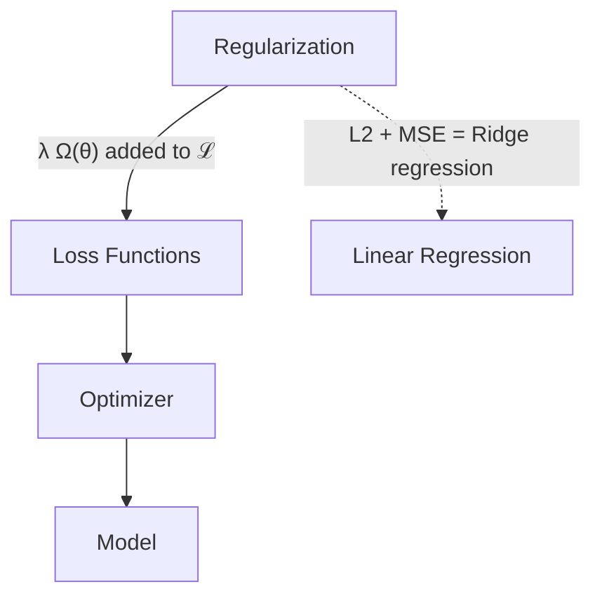

# Regularization

## Overview & Motivation

**Regularization** adds a penalty term $\Omega(\theta)$ to the loss function that discourages overly complex models:

$$\mathcal{L}_{\text{total}} = \mathcal{L}(\hat{y}, y) + \lambda \, \Omega(\theta)$$

where $\lambda > 0$ controls the strength of the penalty. Without regularization, a neural network with enough parameters can memorize the training data perfectly yet generalize poorly to new inputs — a phenomenon called **overfitting**. Regularization biases the optimizer toward simpler solutions that tend to generalize better.

## Mathematical Theory

### L2 Regularization (Ridge / Weight Decay)

$$\Omega_{L2}(\theta) = \frac{1}{2}\sum_{i=1}^{P} \theta_i^2 = \frac{1}{2}\|\theta\|_2^2$$

$$\frac{\partial \Omega_{L2}}{\partial \theta_i} = \theta_i$$

**Effect on update rule:**

$$\theta_{t+1} = \theta_t - \eta(\nabla_\theta \mathcal{L} + \lambda \theta_t) = (1 - \eta\lambda)\theta_t - \eta \nabla_\theta \mathcal{L}$$

The factor $(1 - \eta\lambda)$ shrinks weights toward zero each step — hence the name **weight decay**. Large weights are penalized quadratically, keeping the model smooth.

### L1 Regularization (Lasso)

$$\Omega_{L1}(\theta) = \sum_{i=1}^{P} |\theta_i| = \|\theta\|_1$$

$$\frac{\partial \Omega_{L1}}{\partial \theta_i} = \operatorname{sign}(\theta_i)$$

**Effect:** L1 drives small weights exactly to zero, producing a **sparse** model. This is useful for feature selection — irrelevant connections are pruned automatically.

### Comparison

| Property                   | L1                               | L2                                        |
|----------------------------|----------------------------------|-------------------------------------------|
| Penalty shape              | Diamond (corners at axes)        | Sphere                                    |
| Sparsity                   | Promotes exact zeros             | Shrinks toward zero but rarely reaches it |
| Gradient at $\theta_i = 0$ | Undefined (sub-gradient)         | Zero                                      |
| Best for                   | Feature selection, sparse models | General-purpose weight control            |

### Geometric Interpretation

The regularized loss can be viewed as constrained optimization:

$$\min_\theta \mathcal{L}(\theta) \quad \text{subject to} \quad \Omega(\theta) \le c$$

where $c$ is determined by $\lambda$. L1 constrains $\theta$ to a diamond, so the optimal point tends to lie at a corner (sparse). L2 constrains to a sphere, so the optimal point balances all dimensions.

## Complexity Analysis

| Operation             | Time   | Space  |
|-----------------------|--------|--------|
| $\Omega_{L2}(\theta)$ | $O(P)$ | $O(1)$ |
| $\nabla \Omega_{L2}$  | $O(P)$ | $O(P)$ |
| $\Omega_{L1}(\theta)$ | $O(P)$ | $O(1)$ |
| $\nabla \Omega_{L1}$  | $O(P)$ | $O(P)$ |

Regularization adds negligible computational cost — one pass over the parameter vector per training iteration.

## Step-by-Step Walkthrough

**Scenario:** 3 parameters, $\theta = [0.8, -0.3, 0.5]$, $\lambda = 0.1$.

**L2 Regularization:**

| Step                 | Computation                              | Result                       |
|----------------------|------------------------------------------|------------------------------|
| Penalty              | $\frac{1}{2}(0.64 + 0.09 + 0.25) = 0.49$ | $\Omega_{L2} = 0.49$         |
| Gradient             | $[0.8, -0.3, 0.5]$                       | Added to $\nabla\mathcal{L}$ |
| Contribution to loss | $0.1 \times 0.49 = 0.049$                |                              |

**L1 Regularization:**

| Step                 | Computation             | Result                       |
|----------------------|-------------------------|------------------------------|
| Penalty              | $0.8 + 0.3 + 0.5 = 1.6$ | $\Omega_{L1} = 1.6$          |
| Gradient             | $[1, -1, 1]$            | Added to $\nabla\mathcal{L}$ |
| Contribution to loss | $0.1 \times 1.6 = 0.16$ |                              |

**After several L1 updates** ($\eta = 0.1$, $\lambda = 0.1$): the $\theta_2 = -0.3$ component, already small, is driven to exactly zero. The model effectively prunes that connection.

## Pitfalls & Edge Cases

- **$\lambda$ too large.** The model underfits — weights are driven so close to zero that the network cannot represent the function. Cross-validate $\lambda$.
- **$\lambda$ too small.** Negligible effect; overfitting persists.
- **L1 non-differentiability.** At $\theta_i = 0$, the L1 gradient is undefined. Use sub-gradient $\operatorname{sign}(0) = 0$ or proximal operators for exact handling.
- **Regularizing biases.** Conventionally, bias parameters are excluded from regularization because they do not contribute to model complexity. This library regularizes all parameters in the flat vector — be aware of this if bias control matters.
- **Fixed-point precision.** The regularization term can be much smaller than the main loss when $\lambda$ is small. In low-precision fixed-point, it may round to zero. Scale $\lambda$ or use a wider accumulator.

## Variants & Generalizations

| Variant                    | Key Difference                                                                                     |
|----------------------------|----------------------------------------------------------------------------------------------------|
| **Elastic Net**            | $\Omega = \alpha \|\theta\|_1 + (1-\alpha)\|\theta\|_2^2$; combines L1 sparsity with L2 smoothness |
| **Dropout**                | Randomly zeroes activations during training; implicit ensemble regularization                      |
| **Early stopping**         | Halts training before overfitting; regularization without modifying the loss                       |
| **Data augmentation**      | Expands the training set with transformed copies; reduces overfitting by increasing data diversity |
| **Spectral normalization** | Constrains the spectral norm of weight matrices; stabilizes GAN training                           |
| **Weight clipping** | Hard constraint: $|\theta_i| \le c$; used in Wasserstein GANs |

## Applications

- **Preventing overfitting** — The primary use case for any neural network trained on limited data (common in embedded scenarios).
- **Feature selection** — L1 regularization identifies and prunes irrelevant input connections.
- **Model compression** — Sparse models (via L1) require less storage and computation for deployment on MCUs.
- **Transfer learning** — L2 regularization keeps fine-tuned weights close to pre-trained values.

## Connections to Other Algorithms

| Component                                                 | Relationship                                                                                                |
|-----------------------------------------------------------|-------------------------------------------------------------------------------------------------------------|
| [Loss Functions](../losses/Loss.md)                       | Regularization is a penalty *added to* the loss: $\mathcal{L}_{\text{total}} = \mathcal{L} + \lambda\Omega$ |
| [Optimizer](../optimizer/Optimizer.md)                    | Receives the combined gradient $\nabla\mathcal{L} + \lambda\nabla\Omega$                                    |
| [Linear Regression](../../estimators/LinearRegression.md) | L2-regularized MSE with a linear model is **Ridge regression**; L1 is **Lasso**                             |

## References & Further Reading

- Goodfellow, I., Bengio, Y., and Courville, A., *Deep Learning*, MIT Press, 2016 — Chapter 7 (regularization).
- Tibshirani, R., "Regression shrinkage and selection via the lasso", *JRSS-B*, 58(1), 1996.
- Krogh, A. and Hertz, J.A., "A simple weight decay can improve generalization", *NeurIPS*, 1991.
