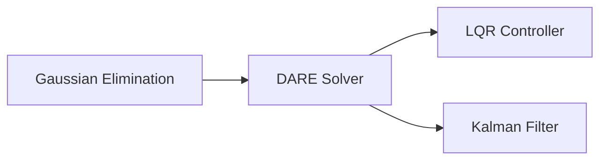

# Discrete Algebraic Riccati Equation (DARE)

## Overview & Motivation

The Discrete Algebraic Riccati Equation arises whenever you need to find an optimal trade-off between state regulation and control effort in a discrete-time linear system. It is the mathematical core of two fundamental algorithms:

1. **LQR control** — computing the optimal state-feedback gain.
2. **Steady-state Kalman filtering** — computing the optimal estimator gain.

The DARE finds a symmetric positive semi-definite matrix $P$ that encodes the *cost-to-go* from any state. Once $P$ is known, the optimal gain is a simple closed-form expression. This library solves the DARE via **fixed-point iteration** — simple to implement, numerically transparent, and well-suited to the small state dimensions typical in embedded control.

## Mathematical Theory

### The Equation

$$P = A^T P A - A^T P B \left(R + B^T P B\right)^{-1} B^T P A + Q$$

where:
- $A \in \mathbb{R}^{n \times n}$ — state transition matrix
- $B \in \mathbb{R}^{n \times m}$ — input matrix
- $Q \in \mathbb{R}^{n \times n}$ — state weighting matrix ($Q \succeq 0$)
- $R \in \mathbb{R}^{m \times m}$ — input weighting matrix ($R \succ 0$)
- $P \in \mathbb{R}^{n \times n}$ — the unknown ($P \succeq 0$)

### Iterative Solution

Starting from $P_0 = Q$:

1. $S = R + B^T P_k B$
2. Solve $S \cdot K_{\text{part}} = B^T P_k A$ (via [Gaussian Elimination](GaussianElimination.md))
3. $P_{k+1} = A^T P_k A - A^T P_k B \cdot K_{\text{part}} + Q$
4. If $\|P_{k+1} - P_k\| < \varepsilon$, converged.

### Existence and Convergence

A unique stabilizing solution exists when:
- $(A, B)$ is **stabilizable** (unstable modes are controllable).
- $(A, C)$ is **detectable** (where $Q = C^T C$).

Under these conditions, the iteration converges monotonically: $P_0 \preceq P_1 \preceq \cdots \preceq P^*$.

### Optimal Gain

$$K = \left(R + B^T P B\right)^{-1} B^T P A$$

## Complexity Analysis

| Phase         | Time                   | Space    | Notes                                                  |
|---------------|------------------------|----------|--------------------------------------------------------|
| Per iteration | $O(n^3 + n^2 m + m^3)$ | $O(n^2)$ | Matrix multiplications + one $m \times m$ linear solve |
| Total solver  | $O(I(n^3 + m^3))$      | $O(n^2)$ | $I$ iterations (typically 10–30)                       |

**Why $O(n^3)$:** Each iteration involves $n \times n$ matrix products ($A^T P A$) and an $m \times m$ linear solve (for $S^{-1}$). When $m \ll n$, the matrix products dominate.

## Step-by-Step Walkthrough

**System:** $n=2$, $m=1$, $A = \begin{bmatrix}1 & 0.1\\0 & 1\end{bmatrix}$, $B = \begin{bmatrix}0.005\\0.1\end{bmatrix}$, $Q = I_2$, $R = [1]$.

**Iteration 0:** $P_0 = Q = I_2$

1. $S = R + B^T P_0 B = 1 + [0.005\; 0.1]\begin{bmatrix}0.005\\0.1\end{bmatrix} = 1.010025$
2. $B^T P_0 A = [0.005\; 0.1]\begin{bmatrix}1 & 0.1\\0 & 1\end{bmatrix} = [0.005,\; 0.1005]$
3. $K_{\text{part}} = [0.005,\; 0.1005] / 1.010025 = [0.00495,\; 0.0995]$
4. $A^T P_0 A = \begin{bmatrix}1 & 0\\0.1 & 1\end{bmatrix}\begin{bmatrix}1 & 0.1\\0 & 1\end{bmatrix} = \begin{bmatrix}1 & 0.1\\0.1 & 1.01\end{bmatrix}$
5. Correction term $\approx \begin{bmatrix}0.0000248 & 0.000498\\0.000498 & 0.00999\end{bmatrix}$
6. $P_1 \approx \begin{bmatrix}2.0 & 0.0995\\0.0995 & 2.000\end{bmatrix}$

**Iterations 1–20:** $P$ grows monotonically until convergence. For this $Q/R$ ratio, $P^*$ stabilizes in ~15 iterations.

## Pitfalls & Edge Cases

- **Non-stabilizable system.** The iteration diverges if $(A, B)$ is not stabilizable. Check the controllability matrix rank before calling the solver.
- **$R$ must be positive definite.** The linear solve $S \cdot K_{\text{part}} = \ldots$ fails if $S$ is singular, which happens when $R$ has zero eigenvalues.
- **Slow convergence.** Systems with eigenvalues near the unit circle converge slowly. Increase the maximum iteration bound if needed.
- **Fixed-point overflow.** The matrix products can easily exceed Q15/Q31 ranges. Use floating-point for the solve; deploy the resulting $K$ as a fixed-point constant.
- **Tolerance type-awareness.** The convergence test uses `math::Tolerance<T>()`, which adapts to both `float` and fixed-point types.

## Variants & Generalizations

| Variant                      | Key Difference                                                                                        |
|------------------------------|-------------------------------------------------------------------------------------------------------|
| **Continuous ARE (CARE)**    | For continuous-time systems; different matrix equation                                                |
| **Newton's method for DARE** | Quadratic convergence but requires solving a Sylvester equation per iteration                         |
| **Schur method**             | Eigendecomposition-based; finds the solution in one pass but requires $O(n^3)$ eigenvalue computation |
| **Doubling algorithm**       | $O(\log I)$ convergence via matrix sign function; useful for large systems                            |

## Applications

- **LQR control** — The [LQR controller](../controllers/Lqr.md) derives its gain from the DARE solution.
- **Kalman filter steady-state gain** — The dual DARE (swapping $A \to A^T$, $B \to H^T$, $Q \to Q_{\text{process}}$, $R \to R_{\text{measurement}}$) gives the steady-state Kalman gain.
- **$H_\infty$ control** — Robust controller design involves coupled Riccati equations.
- **Model predictive control** — The terminal cost matrix in MPC is often the DARE solution.

## Connections to Other Algorithms

| Algorithm                                          | Relationship                                                                  |
|----------------------------------------------------|-------------------------------------------------------------------------------|
| [Gaussian Elimination](GaussianElimination.md)     | Used at each iteration to solve the $m \times m$ linear sub-system            |
| [LQR Controller](../controllers/Lqr.md)            | Direct consumer — extracts optimal gain $K$ from the DARE solution matrix $P$ |
| [Kalman Filter](../filters/active/KalmanFilter.md) | Dual problem — the steady-state Kalman gain is computed by a transposed DARE  |

## References & Further Reading

- Lancaster, P. and Rodman, L., *Algebraic Riccati Equations*, Oxford University Press, 1995.
- Anderson, B.D.O. and Moore, J.B., *Optimal Control: Linear Quadratic Methods*, Prentice Hall, 1990 — Chapter 4.
- Laub, A.J., "A Schur method for solving algebraic Riccati equations", *IEEE Transactions on Automatic Control*, 24(6), 1979.
