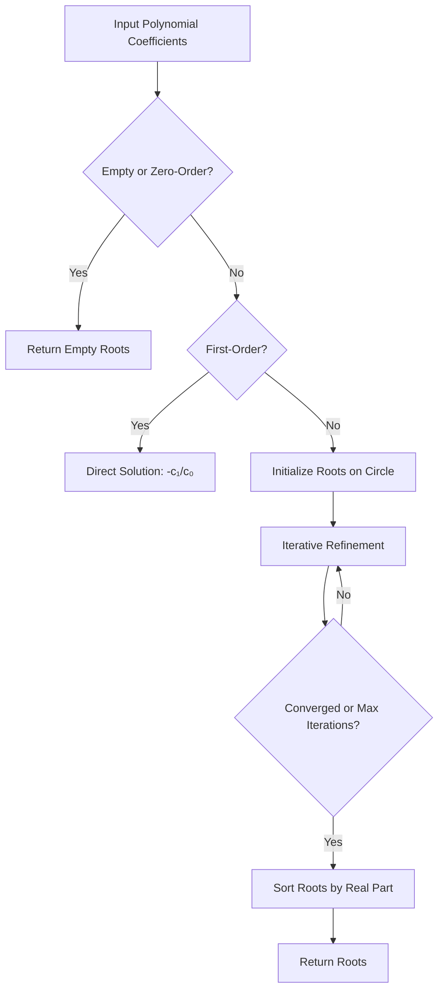

# Durand-Kerner Polynomial Root Finder

## Process Overview



## Mathematical Background

### Polynomial Representation

The polynomial is represented in descending power order:

$$P(z) = c_0 z^n + c_1 z^{n-1} + \cdots + c_{n-1} z + c_n$$

where the coefficients array is `[c₀, c₁, ..., cₙ]` with `c₀ ≠ 0` (leading coefficient).

### Durand-Kerner Method

The Durand-Kerner method (also known as Weierstrass iteration) simultaneously refines all roots of a polynomial. Given current root estimates $z_0, z_1, \ldots, z_{n-1}$, each root is updated:

$$z_r^{(k+1)} = z_r^{(k)} - \frac{P(z_r^{(k)})}{\prod_{j \neq r} (z_r^{(k)} - z_j^{(k)})}$$

This is equivalent to applying Newton's method but using the other root estimates to factor out known roots from the denominator, avoiding explicit polynomial deflation.

### Initial Root Placement

Roots are initialized uniformly on a circle of radius:

$$R = \left| \frac{c_n}{c_0} \right|^{1/n}$$

with an angular offset of 0.4 radians to break symmetry. If $R < 0.1$, it defaults to 1.0.

### Convergence

- **Quadratic convergence** when roots are well-separated
- **Linear convergence** near repeated roots
- Terminates when all corrections $|z_r^{(k+1)} - z_r^{(k)}| < \epsilon$ (default $\epsilon = 10^{-6}$)
- Maximum iteration limit (default 200) prevents infinite loops

## API

```cpp
#include "numerical/solvers/DurandKerner.hpp"

solvers::DurandKerner<float, 10> solver;

// Coefficients for z^3 - 6z^2 + 11z - 6 = (z-1)(z-2)(z-3)
std::array<float, 4> coeffs = { 1.0f, -6.0f, 11.0f, -6.0f };
auto roots = solver.Solve(infra::MakeRange(coeffs));
// roots ≈ {1+0j, 2+0j, 3+0j}
```

### Template Parameters

| Parameter | Description |
|-----------|-------------|
| `T` | Floating-point type (`float` or `double`) |
| `MaxOrder` | Maximum polynomial degree supported |

### Solve Parameters

| Parameter | Default | Description |
|-----------|---------|-------------|
| `coefficients` | — | Polynomial coefficients in descending power order |
| `maxIterations` | 200 | Maximum number of Durand-Kerner iterations |
| `tolerance` | 1e-6 | Convergence threshold for root corrections |

### Preconditions

- `coefficients` must not be empty
- Leading coefficient `coefficients[0]` must be non-zero
- Polynomial order must not exceed `MaxOrder`

### Complexity

- **Time**: $O(n^2 \cdot k)$ where $n$ is polynomial order and $k$ is iteration count
- **Space**: $O(n)$ — roots stored in `BoundedVector`

## Numerical Considerations

- **Near-degenerate denominators**: When two root estimates are very close ($|z_r - z_j| < 10^{-15}$), the difference is excluded from the denominator product to avoid division by near-zero
- **Root sorting**: Results are sorted by real part (ascending), with imaginary part as tiebreaker
- **Fixed-point**: Only floating-point types (`float`, `double`) are supported due to the complex arithmetic requirements
- **Ill-conditioned polynomials**: Polynomials with clustered or repeated roots may converge slowly; increase `maxIterations` if needed
