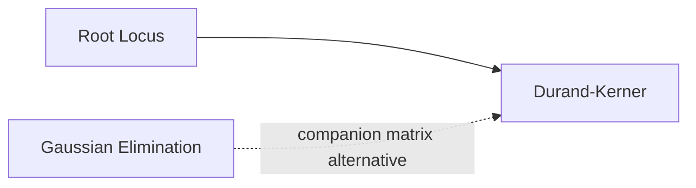

# Durand-Kerner Polynomial Root Finder

## Overview & Motivation

Given a polynomial $P(z) = c_0 z^n + c_1 z^{n-1} + \cdots + c_n$, finding all roots (real and complex) is a fundamental problem in control theory, signal processing, and numerical analysis. Analytical formulas exist only for degree $\leq 4$; beyond that, iterative methods are required.

The **Durand-Kerner method** (also known as the Weierstrass iteration) simultaneously refines approximations to *all* roots at once. Each root estimate is updated using Newton's method, but instead of computing the derivative of $P$, the other root estimates are used to factor out known roots. This avoids **polynomial deflation** — a process that accumulates errors as roots are extracted sequentially.

The method is elegant, easy to implement, and works for polynomials with complex coefficients and complex roots.

## Mathematical Theory

### Update Rule

Given current root estimates $z_0, z_1, \ldots, z_{n-1}$, each is updated simultaneously:

$$z_r^{(k+1)} = z_r^{(k)} - \frac{P(z_r^{(k)})}{\displaystyle\prod_{j \neq r} \left(z_r^{(k)} - z_j^{(k)}\right)}$$

### Relationship to Newton's Method

For a polynomial $P(z) = c_0 \prod_{j=0}^{n-1}(z - z_j)$, the derivative is:

$$P'(z_r) = c_0 \prod_{j \neq r}(z_r - z_j)$$

So the Durand-Kerner update is exactly Newton's: $z_r - P(z_r)/P'(z_r)$, but with $P'$ approximated using the current root estimates rather than computed from coefficients.

### Initial Root Placement

Roots are initialized on a circle of radius:

$$R = \left|\frac{c_n}{c_0}\right|^{1/n}$$

with angular positions offset by 0.4 radians to break symmetry. If $R < 0.1$, it defaults to 1.0.

### Convergence

- **Quadratic convergence** when roots are well-separated.
- **Linear convergence** near repeated (multiple) roots.
- Terminates when all corrections satisfy $|z_r^{(k+1)} - z_r^{(k)}| < \varepsilon$.

## Complexity Analysis

| Case          | Time       | Space  | Notes                                                        |
|---------------|------------|--------|--------------------------------------------------------------|
| Per iteration | $O(n^2)$   | $O(n)$ | Evaluating $P$ and the denominator product for all $n$ roots |
| Total         | $O(n^2 k)$ | $O(n)$ | $k$ iterations until convergence (typically $k \ll n$)       |

**Why $O(n^2)$:** For each of the $n$ roots, computing the denominator product requires multiplying $n-1$ terms.

## Step-by-Step Walkthrough

**Polynomial:** $P(z) = z^3 - 6z^2 + 11z - 6 = (z-1)(z-2)(z-3)$

**Step 1 — Initialize** on radius $R = |{-6}/{1}|^{1/3} = 6^{1/3} \approx 1.817$:

- $z_0 = 1.817 \, e^{j \cdot 0.4} \approx 1.670 + 0.708j$
- $z_1 = 1.817 \, e^{j \cdot 2.494} \approx -1.458 + 1.082j$
- $z_2 = 1.817 \, e^{j \cdot 4.589} \approx -0.212 - 1.805j$

**Step 2 — Iteration 1 (for $z_0$):**

1. Evaluate $P(z_0) = z_0^3 - 6z_0^2 + 11z_0 - 6$
2. Compute denominator: $(z_0 - z_1)(z_0 - z_2)$
3. Update: $z_0 \leftarrow z_0 - P(z_0) / \text{denom}$

**Step 3 — Repeat** for $z_1$ and $z_2$ (using the latest values).

**Step 4 — Iterate** until $\max_r |z_r^{(k+1)} - z_r^{(k)}| < 10^{-6}$.

After ~15–20 iterations the roots converge to $z \approx \{1, 2, 3\}$ (imaginary parts $< 10^{-6}$).

## Pitfalls & Edge Cases

- **Repeated roots.** Convergence degrades from quadratic to linear. Higher tolerance or more iterations may be needed.
- **Near-degenerate denominators.** When two root estimates are very close ($|z_r - z_j| < 10^{-15}$), the denominator product approaches zero. The implementation excludes such terms to avoid division by near-zero.
- **Leading coefficient must be non-zero.** The polynomial degree is determined by the first coefficient.
- **Complex arithmetic required.** This algorithm operates entirely in $\mathbb{C}$, so it is limited to floating-point types (`float`, `double`). Fixed-point types are not supported.
- **No convergence guarantee for all polynomials.** Wilkinson's polynomial and other pathological cases may require higher precision or alternative methods.
- **Root ordering.** Results are sorted by real part (ascending), which may not correspond to meaningful branch ordering in applications like [Root Locus](../analysis/RootLocus.md).

## Variants & Generalizations

| Variant                            | Key Difference                                                                                                                 |
|------------------------------------|--------------------------------------------------------------------------------------------------------------------------------|
| **Aberth-Ehrlich method**          | Similar simultaneous iteration but includes a correction term that improves convergence for clustered roots                    |
| **Jenkins-Traub**                  | Sequential algorithm (one root at a time) with superior convergence for difficult polynomials; standard in numerical libraries |
| **Companion matrix + eigenvalues** | Converts to an eigenvalue problem; robust but $O(n^3)$                                                                         |
| **Laguerre's method**              | Converges cubically for simple roots; sequential (extracts one root at a time, then deflates)                                  |
| **Muller's method**                | Uses quadratic interpolation; works for non-polynomial equations too                                                           |

## Applications

- **Root locus analysis** — The [Root Locus](../analysis/RootLocus.md) algorithm calls Durand-Kerner at each gain step to find the closed-loop poles.
- **Stability analysis** — Determining whether all roots of a characteristic polynomial lie inside the unit circle (discrete) or left half-plane (continuous).
- **Filter design** — Finding pole and zero locations of transfer functions.
- **Control system design** — Evaluating characteristic equations to check stability margins.

## Connections to Other Algorithms

| Algorithm                                      | Relationship                                                                                          |
|------------------------------------------------|-------------------------------------------------------------------------------------------------------|
| [Root Locus](../analysis/RootLocus.md)         | Primary consumer — calls Durand-Kerner to find characteristic polynomial roots at each gain step      |
| [Gaussian Elimination](GaussianElimination.md) | Alternative approach: form the companion matrix and compute eigenvalues (requires a different solver) |

## References & Further Reading

- Durand, E., *Solutions numériques des équations algébriques*, Masson, 1960.
- Kerner, I.O., "Ein Gesamtschrittverfahren zur Berechnung der Nullstellen von Polynomen", *Numerische Mathematik*, 8, 1966.
- Aberth, O., "Iteration methods for finding all zeros of a polynomial simultaneously", *Mathematics of Computation*, 27(122), 1973.
- Press, W.H. et al., *Numerical Recipes*, 3rd ed., Cambridge University Press, 2007 — Section 9.5.
