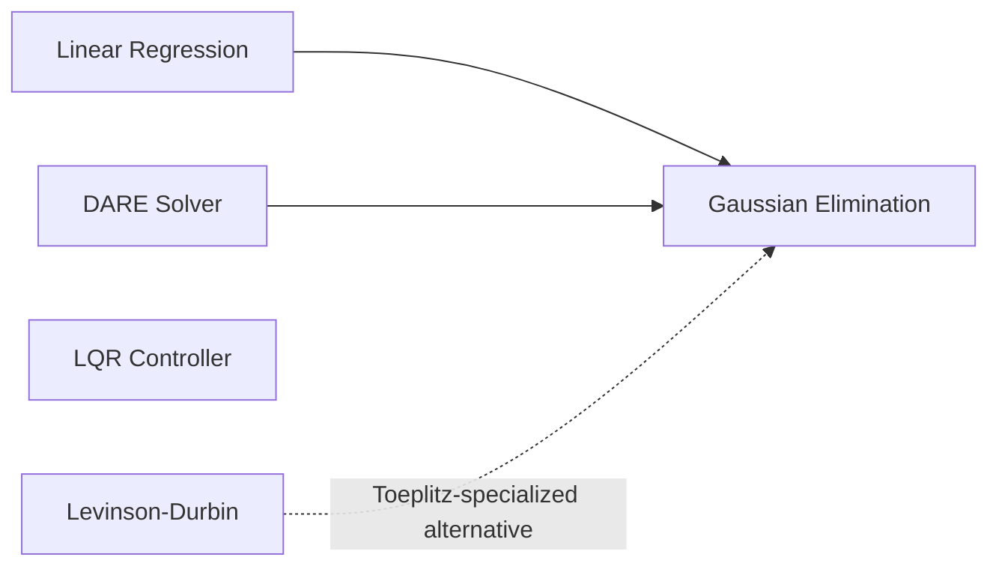

# Gaussian Elimination

## Overview & Motivation

**Gaussian elimination** is the standard direct method for solving a system of linear equations $Ax = b$. It transforms the coefficient matrix into upper-triangular form through systematic row operations, then solves via back-substitution.

It serves as the foundational linear solver in this library — used inside the normal equation solver for [Linear Regression](../estimators/LinearRegression.md), inside the [DARE](DiscreteAlgebraicRiccatiEquation.md) iteration for [LQR](../controllers/Lqr.md), and anywhere else a small dense linear system arises at runtime.

The implementation uses **partial pivoting** (selecting the largest-magnitude entry in each column as pivot) to improve numerical stability.

## Mathematical Theory

### Problem Statement

Solve $Ax = b$ where $A \in \mathbb{R}^{n \times n}$ is non-singular, $b \in \mathbb{R}^n$.

### Forward Elimination with Partial Pivoting

For each column $k = 0, \ldots, n-1$:

1. **Pivot selection:** Find $p = \arg\max_{i \geq k} |A_{ik}|$ and swap rows $k$ and $p$.
2. **Elimination:** For each row $i > k$:

$$\ell_{ik} = \frac{A_{ik}}{A_{kk}}$$
$$A_{ij} \leftarrow A_{ij} - \ell_{ik} \cdot A_{kj}, \quad j = k, \ldots, n-1$$
$$b_i \leftarrow b_i - \ell_{ik} \cdot b_k$$

After all columns are processed, $A$ is upper-triangular: $Ux = b'$.

### Back-Substitution

$$x_i = \frac{b'_i - \sum_{j=i+1}^{n-1} U_{ij} \, x_j}{U_{ii}}, \quad i = n-1, \ldots, 0$$

### Multi-Column Extension

For $AX = B$ where $B$ has $m$ columns, each column is solved independently.

## Complexity Analysis

| Phase               | Time             | Space    | Notes                             |
|---------------------|------------------|----------|-----------------------------------|
| Forward elimination | $O(n^3)$         | $O(n^2)$ | In-place on copies of $A$ and $b$ |
| Back-substitution   | $O(n^2)$         | $O(n)$   |                                   |
| Multi-column solve  | $O(n^3 + n^2 m)$ | $O(n^2)$ | $m$ back-substitutions            |

**Why $O(n^3)$:** The elimination has $n$ stages; stage $k$ performs $(n-k)^2$ multiplications. Summing: $\sum_{k=1}^{n} k^2 \approx n^3/3$.

## Step-by-Step Walkthrough

**System:**

$$\begin{bmatrix} 2 & 1 & -1 \\ -3 & -1 & 2 \\ -2 & 1 & 2 \end{bmatrix} \begin{bmatrix} x_1 \\ x_2 \\ x_3 \end{bmatrix} = \begin{bmatrix} 8 \\ -11 \\ -3 \end{bmatrix}$$

**Step 1 — Column 0: pivot selection**

$|A_{00}| = 2$, $|A_{10}| = 3$ (largest), $|A_{20}| = 2$. Swap rows 0 and 1:

$$\begin{bmatrix} -3 & -1 & 2 \\ 2 & 1 & -1 \\ -2 & 1 & 2 \end{bmatrix}, \quad b = \begin{bmatrix} -11 \\ 8 \\ -3 \end{bmatrix}$$

**Step 2 — Eliminate below pivot**

- Row 1: $\ell = 2/(-3) = -2/3$. Row 1 += $(2/3)$ × Row 0 → $[0,\; 1/3,\; 1/3 \mid 2/3]$
- Row 2: $\ell = -2/(-3) = 2/3$. Row 2 -= $(2/3)$ × Row 0 → $[0,\; 5/3,\; 2/3 \mid 13/3]$

**Step 3 — Column 1: pivot selection**

$|1/3| < |5/3|$. Swap rows 1 and 2.

**Step 4 — Eliminate below:**

$\ell = (1/3)/(5/3) = 1/5$. Row 2 -= $(1/5)$ × Row 1 → $[0,\; 0,\; 1/5 \mid -1/5]$. Upper-triangular form reached.

**Step 5 — Back-substitution:**

$$x_3 = \frac{-1/5}{1/5} = -1, \qquad x_2 = \frac{13/3 - (2/3)(-1)}{5/3} = 3, \qquad x_1 = \frac{-11 - (-1)(3) - 2(-1)}{-3} = 2$$

**Verification:** $2(2) + 1(3) + (-1)(-1) = 8$ ✓, $\;-3(2) - 1(3) + 2(-1) = -11$ ✓, $\;-2(2) + 1(3) + 2(-1) = -3$ ✓.

## Pitfalls & Edge Cases

- **Singular matrices.** If a zero pivot is encountered after pivoting, the matrix is singular (or near-singular). The solver asserts non-zero pivots in debug builds.
- **Ill-conditioning.** Even with pivoting, matrices with condition number $\kappa(A) \gg 1$ yield inaccurate solutions. Monitor $\kappa(A)$ or use iterative refinement.
- **Fixed-point overflow.** The multiplier $\ell_{ik}$ and the elimination update involve divisions and multiply-accumulate operations that can overflow Q15/Q31 ranges. Scale the system if necessary.
- **Near-zero pivots without pivoting.** Without partial pivoting, small pivots amplify round-off errors. Always use pivoting.
- **Symmetric positive-definite systems.** Gaussian elimination works but is not optimal — Cholesky factorization is twice as fast and maintains symmetry.

## Variants & Generalizations

| Variant                      | Key Difference                                                                         |
|------------------------------|----------------------------------------------------------------------------------------|
| **Full pivoting**            | Pivots on both rows and columns; more stable but rarely needed in practice             |
| **LU factorization**         | Stores the $L$ and $U$ factors for reuse; solves multiple right-hand sides efficiently |
| **Cholesky factorization**   | Specialized for symmetric positive-definite matrices; $O(n^3/6)$ instead of $O(n^3/3)$ |
| **Gauss-Jordan elimination** | Reduces to reduced row echelon form (identity matrix); used for matrix inversion       |
| **Iterative refinement**     | Solves once, then iteratively corrects the residual to improve accuracy                |

## Applications

- **Normal equation solver** — Used by [Linear Regression](../estimators/LinearRegression.md) to solve $(\mathbf{X}^T\mathbf{X})\boldsymbol{\beta} = \mathbf{X}^T\mathbf{y}$.
- **DARE sub-problem** — Each iteration of the [DARE solver](DiscreteAlgebraicRiccatiEquation.md) requires solving a linear system.
- **LQR gain computation** — The optimal gain $K = (R + B^T P B)^{-1} B^T P A$ involves a linear solve.
- **Filter design** — Solving Vandermonde or interpolation systems for filter coefficient calculation.

## Connections to Other Algorithms

| Algorithm                                              | Relationship                                                                                    |
|--------------------------------------------------------|-------------------------------------------------------------------------------------------------|
| [Linear Regression](../estimators/LinearRegression.md) | Uses Gaussian elimination to solve the normal equation                                          |
| [DARE Solver](DiscreteAlgebraicRiccatiEquation.md)     | Calls Gaussian elimination at each Riccati iteration                                            |
| [Levinson-Durbin](LevinsonDurbin.md)                   | Specialized $O(n^2)$ solver for Toeplitz systems; Gaussian elimination is the $O(n^3)$ fallback |

## References & Further Reading

- Golub, G.H. and Van Loan, C.F., *Matrix Computations*, 4th ed., Johns Hopkins University Press, 2013 — Chapter 3.
- Trefethen, L.N. and Bau, D., *Numerical Linear Algebra*, SIAM, 1997 — Lectures 20–23.
- Higham, N.J., *Accuracy and Stability of Numerical Algorithms*, 2nd ed., SIAM, 2002.
