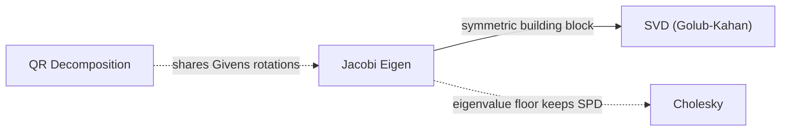

# Jacobi Eigenvalue Solver

## Overview & Motivation

Many embedded estimation and analysis tasks reduce to the **symmetric eigenvalue problem**: given a real symmetric matrix $A$, find scalars $\lambda_k$ and orthonormal vectors $v_k$ such that $A v_k = \lambda_k v_k$. Covariance matrices, Gramians, inertia tensors, and modal-analysis stiffness matrices are all symmetric, and their eigen-decomposition exposes principal directions (PCA), energy distribution, conditioning, and vibration modes.

The **cyclic Jacobi method** is the oldest and one of the most robust ways to solve this problem. It repeatedly applies planar rotations that annihilate one off-diagonal entry at a time, gradually driving $A$ toward a diagonal matrix whose entries are the eigenvalues. Its appeal for resource-constrained systems is threefold: it needs only a fixed-size working copy of the matrix (no heap), it produces the full set of eigenvalues **and** a fully orthonormal eigenvector basis, and it is exceptionally accurate for symmetric matrices — including the small relative eigenvalues that QR-based methods can lose.

## Mathematical Theory

### Jacobi Rotations

A Jacobi rotation $G(p, q, \theta)$ is an orthogonal matrix equal to the identity except in the $2\times 2$ block on rows/columns $p$ and $q$:

$$
\begin{bmatrix} c & s \\ -s & c \end{bmatrix}, \qquad c = \cos\theta, \; s = \sin\theta .
$$

Applying the similarity transform $A' = G^\top A G$ leaves the spectrum unchanged (orthogonal similarity) but modifies only rows/columns $p$ and $q$.

### Annihilating the Pivot

The angle is chosen so that the off-diagonal entry $a_{pq}$ becomes zero. Requiring $a'_{pq} = 0$ gives

$$
(c^2 - s^2)\,a_{pq} + c\,s\,(a_{pp} - a_{qq}) = 0 .
$$

Defining

$$
\theta = \frac{a_{qq} - a_{pp}}{2\,a_{pq}}, \qquad
t = \frac{\operatorname{sign}(\theta)}{|\theta| + \sqrt{\theta^2 + 1}}, \qquad
c = \frac{1}{\sqrt{t^2 + 1}}, \qquad s = t\,c ,
$$

selects the **smaller root** $t = \tan\theta$. Choosing the smaller rotation angle keeps the transformation close to the identity, which is what guarantees numerical stability and monotone convergence.

### Convergence Measure

Let $\operatorname{off}(A) = \sqrt{\sum_{i \neq j} a_{ij}^2}$ be the Frobenius norm of the off-diagonal part. Each rotation that zeroes $a_{pq}$ reduces $\operatorname{off}(A)^2$ by exactly $2\,a_{pq}^2$, since orthogonal similarity preserves the total Frobenius norm and the diagonal absorbs the removed mass. Thus $\operatorname{off}(A)$ decreases monotonically toward zero.

### Cyclic Sweeps

Rather than searching for the largest off-diagonal entry each step (classical Jacobi, $O(n^2)$ search per rotation), the **cyclic** variant sweeps every pair $(p, q)$ with $p < q$ in fixed row-major order. A full sweep touches all $n(n-1)/2$ pairs. Near convergence the method is **quadratically convergent**: the off-diagonal norm is roughly squared each sweep, so a handful of sweeps suffices even for ill-conditioned inputs.

### Eigenvectors

Accumulating the rotations $V \leftarrow V\,G$ starting from $V = I$ yields the orthogonal matrix whose columns are the eigenvectors. On termination $A$ is (numerically) diagonal with $\lambda_k = a_{kk}$, and $A \approx V \operatorname{diag}(\lambda) V^\top$.

## Complexity Analysis

| Case    | Time        | Space    | Notes                                                          |
|---------|-------------|----------|----------------------------------------------------------------|
| Best    | $O(n^3)$    | $O(n^2)$ | Already near-diagonal; one sweep to confirm convergence        |
| Average | $O(n^3)$    | $O(n^2)$ | Typically 6–10 sweeps; each sweep costs $O(n^3)$               |
| Worst   | $O(S n^3)$  | $O(n^2)$ | $S$ sweeps capped by a fixed maximum; each rotation is $O(n)$   |

**Why $O(n^3)$ per sweep:** a sweep performs $n(n-1)/2 = O(n^2)$ rotations, and each rotation updates two rows and two columns at $O(n)$ cost. Space is a single $n\times n$ working copy plus the $n\times n$ eigenvector accumulator — both stack/static, no dynamic allocation.

## Step-by-Step Walkthrough

**Input:**

$$
A = \begin{bmatrix} 2 & 1 \\ 1 & 2 \end{bmatrix}
$$

**Step 1 — Pick pivot** $(p, q) = (0, 1)$, $a_{pq} = 1$.

**Step 2 — Compute angle.** $\theta = (a_{qq} - a_{pp}) / (2 a_{pq}) = (2 - 2)/2 = 0$, so $t = 1$, $c = s = 1/\sqrt{2} \approx 0.7071$ (a $45^\circ$ rotation).

**Step 3 — Rotate.** The updated diagonal is

$$
a'_{pp} = c^2 a_{pp} - 2 s c\, a_{pq} + s^2 a_{qq} = 1, \qquad
a'_{qq} = s^2 a_{pp} + 2 s c\, a_{pq} + c^2 a_{qq} = 3,
$$

and $a'_{pq} = 0$. The matrix is now diagonal.

**Step 4 — Read results.** Eigenvalues $\{1, 3\}$; eigenvectors (columns of the accumulated rotation) $\tfrac{1}{\sqrt 2}(1, -1)^\top$ and $\tfrac{1}{\sqrt 2}(1, 1)^\top$. After sorting ascending, $\lambda = (1, 3)$.

## Pitfalls & Edge Cases

- **Symmetry is assumed.** Only the symmetric part is meaningful; a non-symmetric input silently has its lower triangle mirrored by the rotations. Callers must pass a genuinely symmetric matrix.
- **Zero pivot skip.** When $a_{pq}$ is already zero the rotation is skipped, avoiding a division by zero in the $\theta$ formula.
- **Degenerate / repeated eigenvalues.** Convergence is unaffected, but the eigenvectors within a degenerate subspace are only determined up to rotation — any orthonormal basis of that subspace is valid.
- **Termination threshold.** Convergence is declared when the off-diagonal norm falls below a small multiple of the matrix scale (its Frobenius/diagonal magnitude). A fixed maximum sweep count bounds worst-case runtime; failure to converge within it is reported to the caller rather than looping forever.
- **Float precision.** In single precision the achievable off-diagonal residual is limited by machine epsilon times the largest eigenvalue; tolerances on reconstruction should be set accordingly.

## Variants & Generalizations

| Variant                        | Key Difference                                                                                   |
|--------------------------------|--------------------------------------------------------------------------------------------------|
| **Classical Jacobi**           | Zeroes the *largest* off-diagonal entry each step; fewer rotations but an $O(n^2)$ search each time |
| **Threshold Jacobi**           | Skips pivots below a per-sweep threshold, cheaper early sweeps on sparse-ish matrices             |
| **One-sided Jacobi**           | Applies rotations to a factor only; the basis of Jacobi SVD for tall matrices                     |
| **QR / tridiagonal method**    | Reduces to tridiagonal form then iterates — faster asymptotically but less accurate on tiny eigenvalues |

## Applications

- **Principal Component Analysis** — eigen-decompose a covariance matrix to obtain principal directions and variances.
- **Modal analysis** — natural frequencies and mode shapes from mass/stiffness matrices.
- **Covariance conditioning** — inspect or floor eigenvalues to keep estimator covariances positive-definite.
- **Inertia and orientation** — principal axes of an inertia tensor from its eigenvectors.
- **Gramian analysis** — controllability/observability energy directions in control systems.

## Connections to Other Algorithms

| Algorithm                                    | Relationship                                                                                   |
|----------------------------------------------|------------------------------------------------------------------------------------------------|
| [QR Decomposition](QrDecomposition.md)       | Both are built from orthogonal (Givens/Householder) transforms; QR underlies the alternative tridiagonal eigen-method |
| [Cholesky Decomposition](CholeskyDecomposition.md) | Requires symmetric positive-definite input; Jacobi eigenvalues certify or restore definiteness |
| [Spectral Radius](SpectralRadius.md)         | Returns only the dominant eigenvalue magnitude; Jacobi returns the full spectrum and vectors    |

## References & Further Reading

- Jacobi, C.G.J., "Über ein leichtes Verfahren, die in der Theorie der Säcularstörungen vorkommenden Gleichungen numerisch aufzulösen", *Crelle's Journal*, 30, 1846.
- Golub, G.H. & Van Loan, C.F., *Matrix Computations*, 4th ed., Johns Hopkins University Press, 2013 — Chapter 8 (symmetric eigenproblem, cyclic Jacobi).
- Press, W.H. et al., *Numerical Recipes*, 3rd ed., Cambridge University Press, 2007 — Section 11.1 (Jacobi transformations of a symmetric matrix).
- Demmel, J. & Veselić, K., "Jacobi's method is more accurate than QR", *SIAM J. Matrix Anal. Appl.*, 13(4), 1992.
