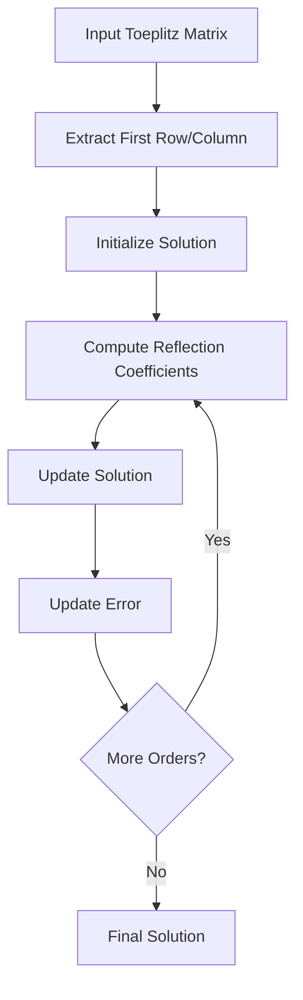

# Levinson-Durbin Implementation Guide

## Process Overview

The following diagram illustrates the key steps in the Levinson-Durbin algorithm:



## Mathematical Background

### Toeplitz Systems

A Toeplitz matrix is a special matrix where each diagonal is constant:

```
[r₀    r₁    r₂    ... rₙ₋₁]
[r₋₁   r₀    r₁    ... rₙ₋₂]
[r₋₂   r₋₁   r₀    ... rₙ₋₃]
[  ⋮     ⋮     ⋮    ⋱   ⋮  ]
[r₋ₙ₊₁ r₋ₙ₊₂ r₋ₙ₊₃ ... r₀  ]
```

### Algorithm Overview

The Levinson-Durbin algorithm solves the system Ax = b in O(n²) operations instead of O(n³) for general matrices by exploiting the Toeplitz structure. The algorithm:

1. Solves increasingly larger systems
2. Uses reflection coefficients
3. Updates solutions recursively

The main recursion is:

```
xₖ = xₖ₋₁ + μₖyₖ₋₁
```

where:
- xₖ is the solution at order k
- μₖ is the reflection coefficient
- yₖ₋₁ is the reversed solution at order k-1

## Implementation Details

### Class Structure

```cpp
template<typename T, std::size_t N>
class LevinsonDurbin : public Solver<T, N> {
public:
    using typename Solver<T, N>::SolutionVector;
    using typename Solver<T, N>::InputMatrix;
    using typename Solver<T, N>::InputVector;

    LevinsonDurbin() = default;
    SolutionVector Solve(const InputMatrix& A, const InputVector& b) override;
};
```

### Key Components

1. **Toeplitz Verification**:
   - Checks matrix structure
   - Ensures algorithm applicability
   - Validates input format

2. **Vector Extraction**:
   - Gets first row and column
   - Creates Toeplitz representation
   - Optimizes memory usage

3. **Recursive Solution**:
   - Computes reflection coefficients
   - Updates solution vectors
   - Tracks prediction error

4. **Error Handling**:
   - Validates matrix properties
   - Checks numerical stability
   - Ensures proper dimensions

## Usage Guide

### Basic Usage

```cpp
// Define system size
constexpr std::size_t N = 4;
using FloatType = float;

// Create solver
LevinsonDurbin<FloatType, N> solver;

// Prepare Toeplitz system
Matrix<FloatType, N, N> A;  // Toeplitz matrix
Vector<FloatType, N> b;     // Right-hand side
// ... fill A and b ...

// Solve system
auto x = solver.Solve(A, b);
```

### Example: Autocorrelation Solution

```cpp
// Create solver for autocorrelation matrix
constexpr std::size_t order = 10;
LevinsonDurbin<float, order> solver;

// Create autocorrelation matrix
ToeplitzMatrix<float, order> R;
Vector<float, order> r;
// ... fill with autocorrelation values ...

// Solve Yule-Walker equations
auto ar_coefficients = solver.Solve(R.ToFullMatrix(), r);
```

## Best Practices

1. **Input Validation**:
   - Verify Toeplitz structure
   - Check matrix conditioning
   - Validate symmetry

2. **Numerical Stability**:
   - Monitor error propagation
   - Check reflection coefficients
   - Track prediction error

3. **Performance Optimization**:
   - Use appropriate types
   - Leverage compile-time sizes
   - Minimize memory allocation

4. **Algorithm Selection**:
   - Consider matrix size
   - Check matrix properties
   - Compare with alternatives

## Common Applications

1. **Signal Processing**:
   - Linear prediction
   - Filter design
   - Spectral estimation

2. **Time Series Analysis**:
   - AR model fitting
   - System identification
   - Prediction

3. **Numerical Computing**:
   - Fast matrix inversion
   - System solving
   - Correlation analysis

## Performance Considerations

1. **Computational Complexity**:
   - O(n²) operations
   - Efficient for small systems
   - Better than general solvers

2. **Memory Usage**:
   - Fixed-size allocations
   - Minimal temporary storage
   - Cache-friendly access

3. **Numerical Properties**:
   - Stable for positive definite
   - Sensitive to ill-conditioning
   - Error propagation control

## Limitations and Future Improvements

1. Current limitations:
   - Fixed system size
   - Real-valued only
   - Basic implementation
   - Single precision

2. Possible extensions:
   - Complex numbers
   - Split-Levinson
   - Block algorithms
   - Parallel version
   - Adaptive solution
   - Error estimates
   - Stability checks
   - Generalized algorithm

## Error Handling

1. Input validation:
   - Toeplitz structure
   - Matrix symmetry
   - Positive definiteness

2. Runtime checks:
   - Numerical stability
   - Convergence
   - Error bounds

## Advanced Topics

### Reflection Coefficients

The reflection coefficients (k) are computed as:

```
kₙ = (b[n] - Σφₙ₋₁[j]r[n-j]) / eₙ₋₁
```

where:
- eₙ₋₁ is the previous error
- r[n] are the Toeplitz elements
- φₙ₋₁ are the previous coefficients

### Error Propagation

The prediction error is updated as:

```
eₙ = eₙ₋₁(1 - kₙ²)
```

This provides a measure of solution quality.

### Stability Analysis

The algorithm is stable when:
- |kₙ| < 1 for all n
- Matrix is positive definite
- System is well-conditioned

## Implementation Notes

### Core Algorithm Steps

```cpp
T prev_error = first_row.at(0, 0);
k.at(0, 0) = b.at(0, 0) / prev_error;
phi.at(0, 0) = k.at(0, 0);

for (size_t n = 1; n < N; ++n) {
    // Compute reflection coefficient
    T alpha = b.at(n, 0);
    for (size_t j = 0; j < n; ++j)
        alpha -= phi.at(j, 0) * first_row.at(n - j, 0);
    k.at(n, 0) = alpha / prev_error;

    // Update solution
    for (size_t j = 0; j < n; ++j)
        prev_phi.at(j, 0) = phi.at(j, 0);
    
    for (size_t j = 0; j <= n; ++j)
        if (j < n)
            phi.at(j, 0) = prev_phi.at(j, 0) + 
                          k.at(n, 0) * prev_phi.at(n - 1 - j, 0);
        else
            phi.at(n, 0) = k.at(n, 0);

    // Update error
    prev_error *= (T(1.0f) - k.at(n, 0) * k.at(n, 0));
}
```

Key features:
- In-place updates
- Minimal storage
- Efficient computation
- Clear structure

### Optimization Notes

1. Memory layout:
   - Contiguous storage
   - Cache-friendly access
   - Minimal copying

2. Computation order:
   - Minimize divisions
   - Reuse computations
   - Avoid redundancy

3. Stability checks:
   - Monitor coefficients
   - Track error growth
   - Validate results
