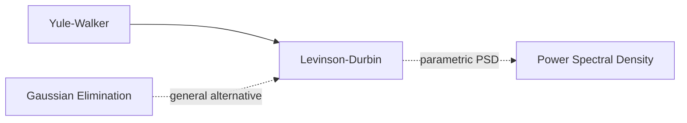

# Levinson-Durbin Algorithm

## Overview & Motivation

Many problems in signal processing produce linear systems with **Toeplitz structure** — each descending diagonal contains the same value. Autocorrelation matrices, for example, are always Toeplitz and symmetric. General solvers like [Gaussian elimination](GaussianElimination.md) ignore this structure and cost $O(n^3)$.

The **Levinson-Durbin algorithm** exploits the Toeplitz structure to solve such systems in $O(n^2)$ time and $O(n)$ auxiliary space. It works by solving an order-1 system first, then *growing* the solution to order 2, 3, ..., up to $n$, reusing previous solutions at each step via a recursion involving **reflection coefficients**.

This algorithm is central to AR model estimation ([Yule-Walker](../estimators/YuleWalker.md)) and linear prediction in speech processing.

## Mathematical Theory

### Toeplitz System

A symmetric Toeplitz matrix and the system to solve:

$$\begin{bmatrix} r_0 & r_1 & r_2 & \cdots & r_{n-1} \\ r_1 & r_0 & r_1 & \cdots & r_{n-2} \\ r_2 & r_1 & r_0 & \cdots & r_{n-3} \\ \vdots & & & \ddots & \vdots \\ r_{n-1} & r_{n-2} & r_{n-3} & \cdots & r_0 \end{bmatrix} \begin{bmatrix} x_1 \\ x_2 \\ \vdots \\ x_n \end{bmatrix} = \begin{bmatrix} b_1 \\ b_2 \\ \vdots \\ b_n \end{bmatrix}$$

### Recursive Solution

Define $\varphi^{(k)}$ as the solution of the order-$k$ system. The algorithm computes:

**Reflection coefficient** at order $k$:

$$\mu_k = \frac{b_k - \sum_{j=0}^{k-1} \varphi_j^{(k-1)} \, r_{k-j}}{e_{k-1}}$$

**Solution update:**

$$\varphi_j^{(k)} = \varphi_j^{(k-1)} + \mu_k \, \varphi_{k-1-j}^{(k-1)}, \quad 0 \leq j < k$$
$$\varphi_k^{(k)} = \mu_k$$

**Prediction error update:**

$$e_k = e_{k-1}(1 - \mu_k^2)$$

Starting from $e_0 = r_0$ and $\varphi_0^{(0)} = b_0 / r_0$.

### Stability Criterion

If $|\mu_k| < 1$ for all $k$, the corresponding AR model is stable (all poles inside the unit circle) and the Toeplitz matrix is positive definite.

## Complexity Analysis

| Case | Time     | Space  | Notes                               |
|------|----------|--------|-------------------------------------|
| All  | $O(n^2)$ | $O(n)$ | Versus $O(n^3)$ for general solvers |

**Why $O(n^2)$:** At order $k$, computing $\mu_k$ costs $O(k)$ and updating the solution costs $O(k)$. Summing over $k = 1, \ldots, n$: $\sum k = n(n+1)/2 = O(n^2)$.

## Step-by-Step Walkthrough

**System:** $R x = b$ where $r = [4, 2, 1]$, $b = [2, 1, 0.5]$, $n = 3$.

$$\begin{bmatrix} 4 & 2 & 1 \\ 2 & 4 & 2 \\ 1 & 2 & 4 \end{bmatrix} x = \begin{bmatrix} 2 \\ 1 \\ 0.5 \end{bmatrix}$$

**Step 0 — Initialize:**

$e_0 = r_0 = 4$, $\varphi_0^{(0)} = b_0 / r_0 = 2/4 = 0.5$

**Step 1 — Order 2:**

$\mu_1 = \frac{b_1 - \varphi_0^{(0)} \cdot r_1}{e_0} = \frac{1 - 0.5 \cdot 2}{4} = \frac{0}{4} = 0$

$\varphi_0^{(1)} = \varphi_0^{(0)} + 0 \cdot \varphi_0^{(0)} = 0.5$, $\varphi_1^{(1)} = 0$

$e_1 = 4(1 - 0) = 4$

**Step 2 — Order 3:**

$\mu_2 = \frac{b_2 - (\varphi_0^{(1)} r_2 + \varphi_1^{(1)} r_1)}{e_1} = \frac{0.5 - (0.5 \cdot 1 + 0 \cdot 2)}{4} = \frac{0}{4} = 0$

$\varphi^{(2)} = [0.5, 0, 0]$

**Solution:** $x = [0.5, 0, 0]^T$

**Verification:** $4(0.5) + 2(0) + 1(0) = 2$ ✓, $2(0.5) + 4(0) + 2(0) = 1$ ✓

## Pitfalls & Edge Cases

- **Non-Toeplitz input.** The algorithm assumes exact Toeplitz structure. Passing a non-Toeplitz matrix silently produces incorrect results.
- **Positive definiteness required.** If the matrix is not positive definite, a reflection coefficient with $|\mu_k| \geq 1$ may occur, causing $e_k$ to become zero or negative and the algorithm to break down.
- **Near-zero prediction error.** If $e_k \approx 0$, the division in $\mu_{k+1}$ is numerically unstable. This indicates an ill-conditioned or degenerate system.
- **Fixed-point precision.** The intermediate products $\varphi_j \cdot r_k$ accumulate rounding errors. For Q15/Q31, ensure buffer values stay within range.
- **Order too large relative to data.** When the AR model order approaches the data length, autocovariance estimates become unreliable and the matrix becomes near-singular.

## Variants & Generalizations

| Variant                        | Key Difference                                                                                                |
|--------------------------------|---------------------------------------------------------------------------------------------------------------|
| **Split Levinson**             | Replaces the two-vector recursion with a single vector; slightly more efficient                               |
| **Block Levinson**             | Solves block-Toeplitz systems (matrix entries instead of scalars)                                             |
| **Burg's method**              | Computes reflection coefficients from data rather than autocovariances; often more accurate for short records |
| **Schur algorithm**            | Computes reflection coefficients without forming the full solution; useful for VLSI implementations           |
| **Superfast Toeplitz solvers** | $O(n \log^2 n)$ algorithms based on FFT and divide-and-conquer                                                |

## Applications

- **AR model estimation** — The [Yule-Walker](../estimators/YuleWalker.md) method produces a Toeplitz system; Levinson-Durbin solves it efficiently.
- **Linear prediction** — Core of speech codecs (LPC); the reflection coefficients are directly used as filter parameters.
- **Spectral estimation** — The AR coefficients yield a parametric PSD estimate.
- **Wiener filtering** — Optimal filter coefficients for noise reduction are found by solving a Toeplitz (autocorrelation) system.
- **Channel equalization** — Estimating inverse channel response from correlation data.

## Connections to Other Algorithms

```mermaid
graph LR
    LD["Levinson-Durbin"]
    YW["Yule-Walker"]
    GE["Gaussian Elimination"]
    PSD["Power Spectral Density"]
    YW --> LD
    GE -.->|"general alternative"| LD
    LD -.->|"parametric PSD"| PSD
```

| Algorithm                                                     | Relationship                                                                                         |
|---------------------------------------------------------------|------------------------------------------------------------------------------------------------------|
| [Yule-Walker](../estimators/YuleWalker.md)                    | Primary consumer — produces the Toeplitz system that Levinson-Durbin solves                          |
| [Gaussian Elimination](GaussianElimination.md)                | General $O(n^3)$ alternative that ignores Toeplitz structure                                         |
| [Power Spectral Density](../analysis/PowerDensitySpectrum.md) | Levinson-Durbin enables parametric PSD estimation as an alternative to Welch's non-parametric method |

## References & Further Reading

- Levinson, N., "The Wiener RMS error criterion in filter design and prediction", *Journal of Mathematics and Physics*, 25, 1947.
- Durbin, J., "The fitting of time series models", *Revue de l'Institut International de Statistique*, 28(3), 1960.
- Haykin, S., *Adaptive Filter Theory*, 5th ed., Pearson, 2014 — Chapter 6.
- Kay, S.M., *Modern Spectral Estimation: Theory and Application*, Prentice Hall, 1988 — Chapter 7.
