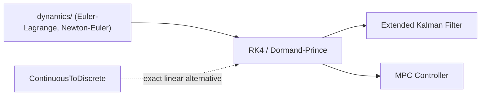

# Runge-Kutta ODE Integrators (RK4 + Dormand-Prince)

## Overview & Motivation

Ordinary differential equations of the form $\dot{x} = f(x, u, t)$ arise throughout embedded control and dynamics — propagating plant models for prediction, running model-based observers, or performing hardware-in-the-loop simulation on the device itself.

**RK4** (the classical fourth-order Runge-Kutta method) solves this problem with a fixed step size, producing deterministic, constant-work-per-tick execution. It is the natural choice for hard-real-time control loops.

**Dormand-Prince RK45** is an *embedded* pair that computes both a 4th- and a 5th-order estimate from the same seven slope evaluations, then uses their difference as a cheap local error gauge. The step-size controller shrinks the step when the estimated error is too large and grows it when the solution is smooth — adapting accuracy to computational budget without user intervention. It is suited for offline simulation or hardware-in-the-loop testing where timing determinism is less critical than accuracy.

## Mathematical Theory

### Problem Statement

Given $\dot{x} = f(x, u, t)$ with $x(t_0) = x_0$, advance the state by one step from $t$ to $t + h$.

### RK4 — Classic Four-Stage Formula

$$
k_1 = f(x_n, u, t_n)
$$
$$
k_2 = f\!\left(x_n + \tfrac{h}{2}k_1,\ u,\ t_n + \tfrac{h}{2}\right)
$$
$$
k_3 = f\!\left(x_n + \tfrac{h}{2}k_2,\ u,\ t_n + \tfrac{h}{2}\right)
$$
$$
k_4 = f\!\left(x_n + h\,k_3,\ u,\ t_n + h\right)
$$
$$
x_{n+1} = x_n + \frac{h}{6}\left(k_1 + 2k_2 + 2k_3 + k_4\right)
$$

The weights $(1, 2, 2, 1)/6$ are derived by matching the Taylor series of the exact solution through fourth order. The local truncation error is $O(h^5)$; the global error is $O(h^4)$.

### Dormand-Prince RK45 — Butcher Tableau

Dormand and Prince (1980) selected a 7-stage Butcher tableau whose 5th-order propagator $y_5$ and 4th-order embedded propagator $y_4$ share stages $k_1, \ldots, k_6$, with $k_7 = f(y_5, u, t+h)$ added only for the 4th-order correction and for FSAL reuse.

The **5th-order** solution used to advance the state:

$$
y_5 = x_n + h\left(\frac{35}{384}k_1 + \frac{500}{1113}k_3 - \frac{125}{192}k_4 + \frac{2187}{6784}k_5 + \frac{11}{84}k_6\right)
$$

The **4th-order** embedded solution used only for error estimation:

$$
y_4 = x_n + h\left(\frac{5179}{57600}k_1 + \frac{7571}{16695}k_3 - \frac{393}{640}k_4 + \frac{92097}{339200}k_5 + \frac{187}{2100}k_6 + \frac{1}{40}k_7\right)
$$

### Error Norm and Step-Size Control

The mixed absolute/relative weighted RMS norm over all $n_s$ state components:

$$
\text{err} = \sqrt{\frac{1}{n_s} \sum_{i=1}^{n_s} \left(\frac{(y_5 - y_4)_i}{\text{atol} + \text{rtol}\,|x_i|}\right)^2}
$$

A step is *accepted* when $\text{err} \le 1$. The next step size is:

$$
h_{\text{new}} = h \cdot \text{clamp}\!\left(0.9 \cdot \text{err}^{-1/5},\ 0.2,\ 5\right)
$$

clamped further to $[h_{\min}, h_{\max}]$.

### FSAL Property

The 7th stage $k_7 = f(y_5, u, t+h)$ equals the first stage of the next accepted step. Caching it reduces each accepted step from 7 to 6 function evaluations.

## Complexity Analysis

| Integrator     | RHS evaluations per accepted step | State memory   |
|----------------|----------------------------------|----------------|
| RK4 (fixed)    | 4 (always)                       | $O(n_s)$       |
| Dormand-Prince | 6 (with FSAL), 7 on first step   | $O(n_s)$       |

All intermediate stage vectors are stack-allocated. No heap is used. The cost of one step is $O(s \cdot n_s)$ where $s$ is the stage count plus the cost of evaluating $f$.

## Step-by-Step Walkthrough

**Scalar decay** $\dot{x} = -x$, $x(0) = 1$, exact solution $x(t) = e^{-t}$, $h = 0.1$:

| Stage | Formula                                           | Value       |
|-------|---------------------------------------------------|-------------|
| $k_1$ | $f(1, 0) = -1$                                    | $-1$        |
| $k_2$ | $f(1 - 0.05, 0.05) = -0.95$                       | $-0.95$     |
| $k_3$ | $f(1 - 0.0475, 0.05) = -0.9525$                   | $-0.9525$   |
| $k_4$ | $f(1 - 0.09525, 0.1) = -0.90475$                  | $-0.90475$  |
| $x_1$ | $1 + (0.1/6)(-1 - 1.9 - 1.905 - 0.90475)$        | $\approx 0.90484$ |

Exact: $e^{-0.1} \approx 0.90484$. Agreement to six significant figures — consistent with $O(h^5)$ local error.

## Pitfalls & Edge Cases

- **Stiff systems.** Explicit RK methods are unstable for stiff problems when $h|\lambda| \gtrsim 2.8$ (RK4 stability boundary for a scalar complex eigenvalue). A stiff plant requires either an implicit integrator or a very small step size.
- **Step-size floor.** When DP45 shrinks the step below $h_{\min}$, the step is clamped and forced accepted regardless of error — useful to avoid infinite rejection loops on a discontinuity, but the solution at that point is degraded.
- **Zero or negative step.** Guard $h > 0$ before calling `Step`; a zero step produces an unchanged state but wastes evaluations.
- **FSAL invalidation.** After a rejected step, the cached $k_7$ is discarded, and the next attempt recomputes $k_1$ from scratch (7 evaluations instead of 6).
- **Float precision.** The Dormand-Prince Butcher coefficients have denominators up to 339200; in single precision the accumulated rounding can erode one to two digits of accuracy compared with double. Use tighter tolerances or shorter integration windows.

## Variants & Generalizations

| Variant                      | Key Difference                                                                        |
|------------------------------|---------------------------------------------------------------------------------------|
| **Euler (1st order)**        | One stage; $O(h)$ global error; useful only for rough prototyping                    |
| **RK4 (this)**               | Four stages; $O(h^4)$ global error; standard fixed-step workhorse                    |
| **Dormand-Prince (this)**    | Seven stages; $O(h^5)$ propagator with built-in $O(h^4)$ error estimate              |
| **Bogacki-Shampine RK23**    | Three-stage embedded pair; lower overhead for mildly stiff or smooth problems        |
| **Adams-Bashforth**          | Multi-step; reuses past evaluations; efficient but requires startup phase             |
| **Implicit RK / SDIRK**      | Solves a nonlinear system at each stage; suitable for stiff problems at the cost of a linear solve per step |

## Applications

- **Dynamics propagation** — advance plant models (`dynamics/`) forward in time for prediction horizons in MPC or trajectory planning.
- **Model-based state estimation** — propagate the process model in an extended Kalman filter between measurement updates.
- **Hardware-in-the-loop simulation** — embed a physics model on the device for closed-loop testing without external simulation hardware.
- **Trajectory generation** — integrate a kinematic model to produce smooth, time-parameterized reference trajectories.

## Connections to Other Algorithms

| Algorithm                  | Relationship                                                                                  |
|----------------------------|-----------------------------------------------------------------------------------------------|
| `dynamics/` models         | Provide the right-hand side $f(x, u, t)$ that RK integrates                                  |
| Extended Kalman Filter     | Uses RK to propagate the state prediction step between measurements                           |
| MPC Controller             | Uses RK to simulate the plant over a prediction horizon                                       |
| ContinuousToDiscrete       | Exact matrix-exponential discretization — an alternative for linear, time-invariant systems   |

## References & Further Reading

- Dormand, J.R. and Prince, P.J., "A family of embedded Runge-Kutta formulae," *Journal of Computational and Applied Mathematics*, 6(1):19–26, 1980.
- Hairer, E., Nørsett, S.P., and Wanner, G., *Solving Ordinary Differential Equations I: Nonstiff Problems*, 2nd ed., Springer, 1993 — Chapters II.4–II.6.
- Press, W.H. et al., *Numerical Recipes in C++*, 3rd ed., Cambridge University Press, 2007 — Section 17.2.
