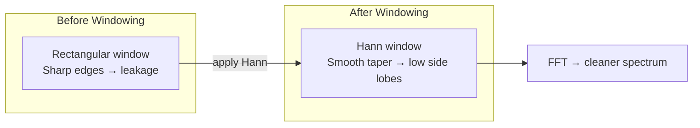
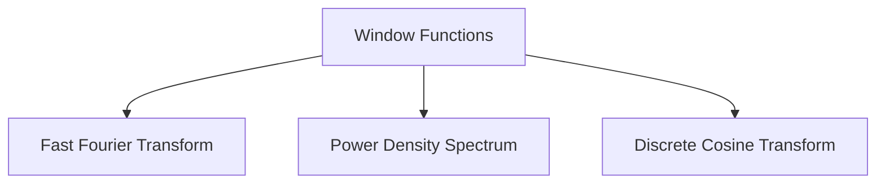

# Window Functions

## Overview & Motivation

A window function is a mathematical taper applied to a finite-length signal before spectral analysis. When we extract a segment of $N$ samples from a continuous signal, we implicitly multiply by a **rectangular window** — a hard cut that introduces sharp discontinuities at the segment boundaries. In the frequency domain these discontinuities spread energy across all bins, an artefact called **spectral leakage**.

Window functions taper the segment smoothly toward zero at both ends, trading a small amount of frequency resolution (wider main lobe) for dramatically reduced leakage (lower side lobes). Choosing the right window is a fundamental step in every FFT-based pipeline.

## Mathematical Theory

### General Form

A symmetric window of length $N$ is a sequence $w[n],\; n = 0, 1, \ldots, N-1$, designed so that $w[0] \approx w[N-1] \approx 0$ (except for the rectangular case).

### Common Windows

| Window | Definition | Main-Lobe Width | Peak Side Lobe |
|--------|-----------|-----------------|----------------|
| **Rectangular** | $w[n] = 1$ | $2/N$ | $-13$ dB |
| **Hamming** | $w[n] = 0.54 - 0.46\cos\!\left(\frac{2\pi n}{N-1}\right)$ | $4/N$ | $-43$ dB |
| **Hann** | $w[n] = 0.5\left(1 - \cos\!\left(\frac{2\pi n}{N-1}\right)\right)$ | $4/N$ | $-32$ dB |
| **Blackman** | $w[n] = 0.42 - 0.5\cos\!\left(\frac{2\pi n}{N-1}\right) + 0.08\cos\!\left(\frac{4\pi n}{N-1}\right)$ | $6/N$ | $-58$ dB |

### Frequency-Domain Perspective

In the frequency domain, windowing is **convolution** with the window's Fourier transform $W(f)$. Each spectral line of the signal is smeared by $W(f)$. A narrower main lobe preserves resolution; lower side lobes suppress leakage.

### Coherent Gain

The **coherent gain** $CG$ of a window normalizes the amplitude after windowing:

$$CG = \frac{1}{N}\sum_{n=0}^{N-1} w[n]$$

For amplitude-accurate measurements, divide the windowed FFT output by $CG$.

### Processing Gain

The **processing gain** $PG$ compares the noise bandwidth of the window to the rectangular window:

$$PG = \frac{\left(\sum w[n]\right)^2}{N \sum w[n]^2}$$

| Window | Processing Gain |
|--------|----------------|
| Rectangular | 1.00 |
| Hamming | 0.73 |
| Hann | 0.67 |
| Blackman | 0.57 |

## Complexity Analysis

| Operation | Time | Space |
|-----------|------|-------|
| Generate $N$ window coefficients | $O(N)$ | $O(N)$ |
| Apply window (element-wise multiply) | $O(N)$ | $O(1)$ extra |
| Pre-computed lookup | $O(1)$ per sample | $O(N)$ |

Window generation is dominated by trigonometric evaluations ($\cos$). For repeated use at a fixed $N$, pre-compute and store the coefficients in a lookup table.

## Step-by-Step Walkthrough

**Scenario:** Apply a Hann window to $N = 8$ samples of a pure tone at bin 2.5 (non-integer frequency → leakage expected).

**Step 1 — Generate the Hann window**

| $n$ | $w[n] = 0.5(1 - \cos(2\pi n / 7))$ |
|-----|--------------------------------------|
| 0 | 0.000 |
| 1 | 0.188 |
| 2 | 0.611 |
| 3 | 0.950 |
| 4 | 0.950 |
| 5 | 0.611 |
| 6 | 0.188 |
| 7 | 0.000 |

**Step 2 — Element-wise multiply**

$$x_w[n] = x[n] \cdot w[n]$$

The signal tapers to zero at both ends, removing the hard edges.

**Step 3 — FFT of windowed signal**

Compared to the un-windowed (rectangular) FFT:
- The peak at bin 2.5 is slightly broader (main lobe widens from 2 to 4 bins).
- The leakage floor drops from $-13$ dB to $-32$ dB.

## Pitfalls & Edge Cases

- **Rectangular is not "no window."** Truncation *is* a rectangular window — acknowledge that you are already windowing.
- **Zero-padding after windowing.** Always window *before* zero-padding, not after, to avoid creating new discontinuities.
- **Amplitude bias.** Windowing attenuates the signal. Correct with the coherent gain $CG$ for amplitude measurements, or with the equivalent noise bandwidth for power measurements.
- **Overlap in Welch/STFT.** When segments overlap, the combined window must be flat (constant overlap-add). Hann with 50 % overlap satisfies this; Hamming does not perfectly.
- **Fixed-point overflow.** All windows in this library include a $0.9999$ scaling factor to keep values strictly below 1.0 in Q15/Q31 representation.
- **Length-1 window.** A single-sample window should return 1.0 (or $0.9999$ for fixed-point). Ensure no division by zero in $N-1$ terms.

## Variants & Generalizations

| Variant | Key Difference |
|---------|---------------|
| **Kaiser window** | Parameterized by $\beta$; allows continuous trade-off between main-lobe width and side-lobe level |
| **Flat-top window** | Near-zero amplitude error at the cost of very wide main lobe; used for calibration |
| **Gaussian window** | Smooth, no side-lobe discontinuities; parameterized by $\sigma$ |
| **Dolph–Chebyshev** | Equiripple side lobes at a prescribed level; optimal for a given main-lobe width |
| **DPSS (Slepian)** | Maximum energy concentration in a given bandwidth; used in multi-taper spectral estimation |

## Applications

- **Spectrum analysis** — Applied before the [FFT](../analysis/FastFourierTransform.md) to reduce leakage.
- **Power spectral density** — The [PSD (Welch)](../analysis/PowerDensitySpectrum.md) method applies a window to every overlapping segment.
- **FIR filter design** — Truncated ideal impulse responses are multiplied by a window to control passband ripple and stopband attenuation.
- **Short-Time Fourier Transform (STFT)** — Sliding windowed FFT for time-frequency analysis.
- **Audio processing** — Speech and music analysis use overlapping Hann windows.

## Connections to Other Algorithms

| Algorithm | Relationship |
|-----------|-------------|
| [FFT](../analysis/FastFourierTransform.md) | Window is applied *before* the FFT to reduce spectral leakage |
| [Power Density Spectrum](../analysis/PowerDensitySpectrum.md) | Built-in windowing per segment in Welch's method |
| [DCT](../analysis/DiscreteCosineTransform.md) | DCT's implicit symmetry provides partial leakage suppression, but windowing still helps |

## References & Further Reading

- Harris, F.J., "On the use of windows for harmonic analysis with the discrete Fourier transform", *Proceedings of the IEEE*, 66(1), 1978 — the definitive window survey.
- Oppenheim, A.V. and Schafer, R.W., *Discrete-Time Signal Processing*, 3rd ed., Pearson, 2010 — Chapter 10.
- Nuttall, A., "Some windows with very good sidelobe behavior", *IEEE Trans. ASSP*, 29(1), 1981.
